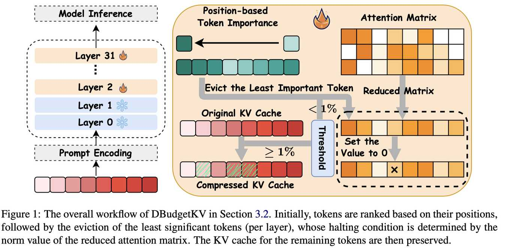

# DBudgetKV: Dynamic Budget in KV Cache Compression for Ensuring Optimal Performance

> **本文由 AI Agent 自动生成，基于论文原文内容撰写，仅供参考。生成时间：2025年6月。**

## 一句话总结

DBudgetKV 提出了一种无需预设缓存预算的动态 KV Cache 压缩方法，通过位置排序和注意力矩阵范数指标自适应地决定每层的剪枝停止点，在保持接近甚至超越全量缓存性能的同时，实现平均超过 25% 的无损压缩。

## 摘要翻译

为了减轻大语言模型（LLM）推理过程中的内存负担，大量研究聚焦于通过探索注意力稀疏性等方面来压缩 KV Cache。然而，这些技术通常需要预定义的缓存预算；由于最优预算因不同的输入长度和任务类型而异，这限制了它们在开放域指令中的实际部署。为解决这一局限性，我们提出了一种新的 KV Cache 压缩目标：在不考虑具体输入的前提下，始终确保与全量缓存相同的性能，同时尽可能最大化 KV Cache 的剪枝比例。为实现这一目标，我们引入了一种名为 DBudgetKV 的新型 KV Cache 压缩方法，其特点是采用基于注意力的指标来指示剩余 KV Cache 是否无法匹配全量缓存的性能，从而停止剪枝过程。在不同上下文长度、任务类型和模型规模上的实证评估表明，我们的方法有效且稳健地实现了无损 KV 剪枝，平均压缩率超过 25%。此外，该方法易于集成到 LLM 推理中，不仅优化了内存空间，还显示出相比现有方法更短的推理时间。

## 研究动机

大语言模型（LLM）在推理过程中依赖 KV Cache 来存储中间状态，随着模型规模和输入长度的增加，KV Cache 所需的内存成比例增长。例如，Llama3 8B 模型在 2K token 输入时需要 1GB 的 KV Cache 内存，而其 70B 版本在 20K token 时需要高达 50GB 的内存。

现有的 KV Cache 压缩方法（如 H2O、ScissorHands、StreamingLLM、SnapKV 等）虽然成功证明了可以丢弃相当比例的 KV Cache，但存在一个共同的局限：它们都要求预定义一个固定的 KV Cache 预算，而最优预算因任务和输入的不同而显著变化。例如，在 Llama3-8B-Instruct 上，当预算设为 50% 时，H2O 在 NarrativeQA 上能达到全量缓存 98% 的性能，但在 GSM8K 上性能急剧下降至不足 42%。

因此，DBudgetKV 提出了一种新的压缩目标：自动最大化剪枝比例，同时确保性能始终接近全量缓存水平，无需手动调整不同任务的预算阈值。

## 方法（技术细节）

DBudgetKV 是一种在预填充（prefill）阶段之后应用的基于排序的剪枝方法，由两个步骤组成：

### 1. 重要性排序（Importance Ranking）

采用纯基于位置的排序策略，无需额外计算：
- 前 m 个 token 始终被认为是重要的（基于 attention sinks 现象）
- 在剩余的 n-m 个 token 中，越靠后的 token 越重要
- 排序顺序为：{x₁, x₂, ..., xₘ, xₙ, xₙ₋₁, ..., xₘ₊₁}
- 超参数 m 设为 4

这种策略的优势在于：简单、无额外计算开销，且实验表明优于基于注意力分数的排序策略（后者在保持性能稳定性方面表现不佳）。

### 2. 停止准则（Stopping Criterion）

使用基于注意力矩阵 Frobenius 范数的指标来决定何时停止剪枝：

- **理论基础**：Frobenius 范数（矩阵的 L2 范数）与模型性能存在正相关性，可通过预实验验证
- **降维优化**：利用注意力矩阵的最后 k 行（k=1 时仅使用最后一个 token 的注意力分布）构建简化的注意力向量 A'∈R¹ˣⁿ，复杂度从 O(n²) 降至 O(n)
- **具体计算**：
  - 对 A' 按重要性排序重新排列得到 A'_sort
  - 计算累积平方和 A'_cumsum[i] = √(∑ₖ₌ᵢⁿ|A'_sort[k]|²)
  - 与原始 Frobenius 范数做差，计算差异比例
  - 当差异超过阈值 t=1% 时停止剪枝

### 3. 保留底层

发现对模型的第 0 层和第 1 层应用 DBudgetKV 会导致性能严重下降，因此从第 2 层开始进行 KV Cache 压缩。这是因为底层的注意力分数分布较为均匀，过早丢弃 token 会导致后续层的推理崩溃。

### 4. 实现细节

- 整个过程通过 PyTorch 内置算子实现，所有层的停止位置可并行识别，无需循环操作
- 支持多注意力头的并行计算
- 基于 SnapKV 代码库实现

## 实验结果

### 主要实验（13 个数据集，3 个模型）

在 Llama3-8B-Instruct、Mistral-7B-Instruct-V0.3 和 Qwen2.5-7B-Instruct 上，覆盖数学与科学推理、阅读理解、单文档/多文档问答、摘要、few-shot learning 和代码等任务。

**关键结果**：
- **Llama3-8B**：DBudgetKV 平均使用 63.68% 的 KV Cache，性能反而比全量缓存**高出 0.12%**
- **Qwen2.5-7B**：平均使用 76.02% 的 KV Cache，性能比全量缓存**高出 2.63%**
- **Mistral-7B**：使用 86.75% 的 KV Cache，性能仅降低 1.5%
- 动态预算分配自然反映任务难度：数学/科学任务使用较高预算（>90%），而 QA/摘要任务使用较低预算（低至 15%）
- 在 39 个比较中，DBudgetKV 在 20 个上取得最高分
- 与 50% 固定预算的基线相比，DBudgetKV 在所有数据集上都显著优于它们

### 大模型泛化（70B/32B/72B）

- 在 Llama3-70B、Qwen2.5-32B 和 Qwen2.5-72B 上使用相同设置，DBudgetKV 保持一致的近全量缓存性能
- 长上下文数据集上压缩率接近 50%

### 消融实验

- **k 值选择**：k=1（仅最后一个 token）效果最佳，提供最高压缩率且性能几乎无损，复杂度为 O(1)
- **排序策略**：基于位置的排序优于基于注意力分数的排序（后者压缩率高但性能不稳定）
- **阈值选择**：1% 是合理的通用阈值，0.1% 仅略微提升性能但大幅增加预算，10% 则导致性能严重下降

### 效率分析

- 在 8 个数据集上，DBudgetKV 在 12 个比较中有 8 个取得最佳整体推理时间
- 虽然剪枝过程本身略长于其他方法，但总生成速度具有明显优势

## 优势

1. **无需预设预算**：自动根据输入和任务动态调整压缩比例，避免手动调参
2. **无损压缩**：在多种任务和模型上保持接近甚至超越全量缓存的性能
3. **简单高效**：仅需两个步骤，使用 PyTorch 内置算子实现，计算开销低
4. **广泛兼容**：不依赖特定模型架构，可与其他 KV Cache 优化技术共存
5. **自然的任务适应性**：复杂任务分配更多缓存资源，简单任务实现更高压缩率
6. **推理加速**：不仅节省内存，还减少了推理时间
7. **跨模型泛化**：相同设置在不同规模的模型（7B~72B）上均有效

## 局限

1. **压缩预算与真正最优预算的差距**：某些场景下（如 QMSum + Mistral-7B），DBudgetKV 使用 84.3% 预算，而 50% 预算也可行，说明仍有改进空间
2. **缺乏硬保证**：虽基于经验实验验证，但没有理论上的全性能约束硬保证
3. **Mistral 上的性能下降**：在 Mistral-7B 上仍有 1.5% 的性能退化，说明方法在不同模型架构上的稳健性还需加强
4. **底层处理**：需要冻结前两层，这是基于经验观察而非理论推导
5. **未开源代码**：论文未提供公开代码，影响可复现性

## 与 EfficientPaper 相关的研究方向

- **KV Cache 稀疏化（kv_cache_sparse）**：DBudgetKV 属于 KV Cache 压缩中的动态预算方法，与 H2O、StreamingLLM、SnapKV 等方法形成对比
- **KV Cache 合并方法**：如 KVMerger、D2O 等非硬剪枝方法，可与 DBudgetKV 互补
- **注意力机制优化**：DBudgetKV 利用注意力矩阵的 Frobenius 范数作为停止准则，与 DeepSeek-V2 的 MLA（Multi-head Latent Attention）等方法有关联
- **长上下文推理优化**：DBudgetKV 在 LongBench 等长上下文基准上表现优异，与 Minference 等方法具有互补性
- **高效推理（Efficient LLM Inference）**：DBudgetKV 同时优化内存和推理速度，是 LLM 高效推理领域的重要贡献
- **动态 KV Cache 管理**：与 PyramidKV 等方法类似，属于动态自适应 KV Cache 压缩的前沿方向
