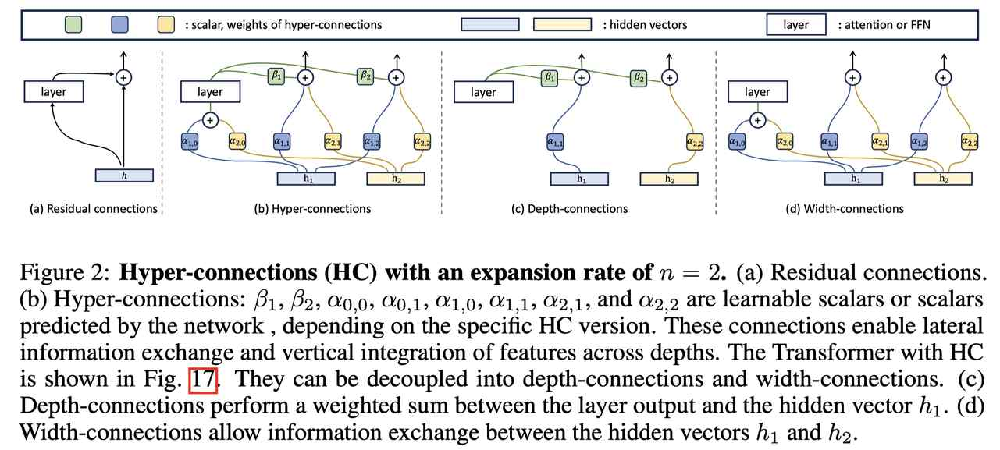

# Hyper-Connections

> Defa Zhu, Hongzhi Huang, Zihao Huang, Yutao Zeng, Yunyao Mao, Banggu Wu, Qiyang Min, Xun Zhou

---

> **⚠️ 生成声明**：本 note 由 AI Agent (Hermes) 自动生成，基于 arXiv 论文全文阅读整理，仅供学习参考。

---

## 一句话总结

**Hyper-Connections (HC) 是一种替代残差连接的简单有效方法，通过可学习的深度连接（depth-connections）和宽度连接（width-connections）让网络自主调节层间连接强度，同时解决梯度消失与表征坍塌之间的跷跷板效应，在 LLM 预训练中带来显著性能提升，且计算和参数开销几乎可忽略。**

---

## 摘要翻译

我们提出 Hyper-Connections（超连接），一种简单而有效的方法，可作为残差连接的替代方案。该方法专门针对残差连接变体中常见的缺点，如梯度消失与表征坍塌之间的跷跷板效应（seesaw effect）。理论上，Hyper-Connections 允许网络调整不同深度特征之间的连接强度，并动态重新排列层。我们在大语言模型的预训练上进行了实验，包括稠密模型和稀疏模型，Hyper-Connections 相比残差连接展示了显著的性能提升。在视觉任务上的额外实验也展示了类似的改进。我们预期该方法将在广泛的 AI 问题中普遍适用和有益。

---

## 研究动机

深度学习的成功依赖于残差连接（He et al., 2016），但残差连接存在两种主要变体的局限性：

1. **Pre-Norm**（在每个残差块之前应用归一化）：有效缓解梯度消失，但会导致**表征坍塌**——深层隐藏特征变得高度相似，额外层的贡献递减。
2. **Post-Norm**（在每个残差块之后应用归一化）：可以缓解表征坍塌，但会加剧**梯度消失**。

这两种变体本质上是在梯度消失和表征坍塌之间做权衡（跷跷板效应）。**核心问题是：残差连接预定义了层内输入和输出之间的连接强度，无法自适应调节。**

因此，论文提出了一个关键问题：**神经网络能否自主学习最优的连接强度？**

---

## 方法

### 2.1 静态超连接（Static Hyper-Connections, SHC）

**核心思想**：将隐藏向量 $h_{k-1} \in \mathbb{R}^d$ 复制 $n$ 份，形成超隐藏矩阵 $H_k \in \mathbb{R}^{n \times d}$，其中 $n$ 为扩展率（expansion rate）。然后通过可学习的连接矩阵控制层间信息流动。

**连接矩阵**：
$$
HC = \begin{pmatrix} 0_{1 \times 1} & B \\ A_m & A_r \end{pmatrix} \in \mathbb{R}^{(n+1) \times (n+1)}
$$

其中：
- $B$：控制当前层输出的权重
- $A_m$：对输入 $H$ 进行加权求和，得到当前层的输入 $h_0$
- $A_r$：将 $H$ 映射到新的超隐藏矩阵 $H'$

**输出计算**：
$$
\hat{H} = B^T (T h_0)^T + A_r^T H
$$

其中 $T$ 是 Transformer 层（self-attention + FFN）。

**深度连接（Depth-connections）**：可解耦为 $DC = (B, \text{diag}(A_r))$，其中 $B$ 表示层输出的权重，$\text{diag}(A_r)$ 表示输入的权重。这是残差连接的泛化。

**宽度连接（Width-connections）**：$WC = (A_m, A_r)$，允许同一层内的隐藏向量之间进行信息交换。

**关键发现**：$n=1$ 时跷跷板效应依然存在，性能无提升；$n>1$ 时超连接可以调整残差强度，还能重新排列层（顺序或并行）。

### 2.2 动态超连接（Dynamic Hyper-Connections, DHC）

DHC 使连接权重根据输入动态变化：

$$
HC(H) = \begin{pmatrix} 0_{1 \times 1} & B(H) \\ A_m(H) & A_r(H) \end{pmatrix}
$$

动态参数通过线性变换计算，结合归一化和 tanh 激活函数：

- $H = \text{norm}(H)$
- $B(H) = s_\beta \circ \tanh(HW_\beta)^T + B$
- $A_m(H) = s_\alpha \circ \tanh(HW_m) + A_m$
- $A_r(H) = s_\alpha \circ \tanh(HW_r) + A_r$

其中 $s_\beta, s_\alpha$ 是小的可学习初始因子，用于稳定训练。

### 2.3 初始化策略

为使初始化等价于 Pre-Norm 残差连接：
- 动态参数 $W_\beta, W_m, W_r$ 初始化为 0
- 静态矩阵初始化为特定形式（类似 Pre-Norm 的连接模式）

### 2.4 顺序-并行对偶性（Sequential-Parallel Duality）

超连接可以学习将层排列为：
- **顺序排列**：等价于传统残差连接
- **并行排列**：类似并行 Transformer 块（PTB）
- **混合排列**：结合两种方式的软混合，甚至可以动态调整

### 2.5 计算和参数开销

**静态超连接**：每个层额外参数 $= n(n+2) \times 2$（一个 Attention + 一个 FFN）

**动态超连接**：每个层额外参数 $= [d_{\text{model}}(n+2) + n(n+2) + 2] \times 2$

**实验数据（OLMo-1B-DHC×4）**：
- 额外参数：394,048（约 0.033%）
- 额外 FLOPs：+0.200%
- 内存增加：+26.1%（可通过重新计算隐藏状态优化）

---

## 实验结果

### 语言模型预训练

**实验设置**：基于 OLMo 框架，使用 dolma-v1.5-sample 数据集，所有实验训练 500B tokens。

#### 1B 模型消融实验

| 方法 | V2 Eval Loss ↓ | V2 PPL ↓ | V3 Eval Loss ↓ | V3 PPL ↓ | Downstream Acc. ↑ |
|------|---------------|----------|---------------|----------|-------------------|
| OLMo-1B | 2.811 | 18.023 | 2.544 | 14.229 | 62.5 |
| OLMo-1B-DHC×4 | 2.781 | 17.509 | 2.515 | 13.826 | 63.8 |
| OLMo-1B-DHC×4 W/O tanh | 2.779 | 17.451 | 2.516 | 13.844 | 64.4 |

**关键发现**：
- $n=1$ 时 DHC 性能不如基线
- $n>1$ 时 DHC 显著优于基线，$n=4$ 效果最佳
- $n=8$ 额外收益有限
- DHC 的训练损失下降更快且更稳定（无尖峰）

#### 静态 vs 动态超连接

| 方法 | V2 Eval Loss ↓ | V3 Eval Loss ↓ | Downstream Acc. ↑ |
|------|---------------|---------------|-------------------|
| SHC×4 | 2.791 | 2.528 | 63.6 |
| DHC×4 | 2.781 | 2.515 | 63.8 |

- $n=2$ 时 DHC 和 SHC 改进相似
- $n=4$ 时 DHC 明显优于 SHC

#### 7B 模型

| 方法 | Params (B) | FLOPs (G) | V2 Loss ↓ | V3 Loss ↓ | Downstream Acc. ↑ |
|------|-----------|----------|----------|----------|-------------------|
| OLMo-7B | 6.9 | 13.36 | 2.581 | 2.322 | 70.1 |
| OLMo-7B-DHC×4 | 6.9 | 13.38 | 2.559 | 2.304 | 71.0 |

**7B 模型表现**：
- V2 Loss 降低 0.022，PPL 降低 0.293
- 下游任务平均分提升至 0.710
- 400B tokens 后改进持续，无衰减
- 基线模型频繁出现尖峰，DHC 无尖峰

#### MoE 模型（OLMoE-1B-7B）

| 方法 | MMLU Var | HellaSwag | ARC-C | ARC-E | PIQA | WinoGrande | BoolQ |
|------|---------|----------|-------|-------|------|-----------|-------|
| OLMoE-1B-7B | 38.5 | 69.5 | 41.8 | 72.8 | 77.6 | 64.4 | 65.4 |
| OLMoE-1B-7B-DHC×4 | 39.7 | 70.2 | 47.8 | 76.7 | 78.2 | 64.6 | 68.5 |

**MoE 模型关键结果**：
- 收敛速度提升 **1.8 倍**
- ARC-Challenge 提升 **6 个点**
- MMLU Var 提升 1.2 个点
- 多数指标下，仅需一半 tokens 即可达到基线同等性能

### 可视化分析

- **超连接的连接模式呈 Λ 形**：底层（如 layer 0,2）被后续大多数层频繁使用，同时存在长期衰减模式（Post-Norm 风格）和频繁访问模式（Pre-Norm 风格）的混合。
- **Pre-Norm 基线**呈下三角矩阵，相邻层特征高度相似（表征坍塌）。
- **超连接模型**相邻层特征相似度显著降低，且范围更广，说明每层的影响更大。
- 自动学习到并行 Transformer 块（PTB）模式，说明方法的灵活性。

### 视觉任务（附录 E）

在图像生成（DiT）和图像分类（ViT）任务上也展示了类似的改进。

### 与相关方法对比

| 方法 | V2 Loss ↓ | V3 Loss ↓ | Downstream Acc. ↑ |
|------|----------|----------|-------------------|
| OLMo-1B | 2.811 | 2.544 | 62.5 |
| ResiDual | 2.825 | 2.551 | 62.0 |
| Altup×2 | 2.827 | 2.558 | 62.4 |
| DHC×2 | 2.802 | 2.534 | 63.0 |

- Altup 和 ResiDual 在训练初期有改进，但后期被基线超越
- DHC 持续保持优势

---

## 优势

1. **简单有效**：作为残差连接的直接替代，实现简单，性能提升显著
2. **计算开销几乎可忽略**：额外参数不到 0.04%，FLOPs 增加约 0.2%
3. **解决跷跷板效应**：同时缓解梯度消失和表征坍塌，通过可学习连接强度动态平衡
4. **顺序-并行对偶性**：允许网络自主学习层的排列方式（顺序、并行或混合），无需手动设计
5. **训练稳定性**：DHC 训练过程中无尖峰，收敛更快更稳定
6. **通用性强**：在稠密模型、MoE 模型、视觉任务上均有效
7. **动态版本更强**：DHC 在较大扩展率（$n \geq 4$）时显著优于静态版本
8. **规模无关**：在 1B 和 7B 模型上均展示了改进

---

## 局限

1. **内存增加**：DHC×4 导致内存增加约 26%（可通过重新计算优化）
2. **$n=1$ 无效**：当扩展率 $n=1$ 时，DHC 性能不如基线（跷跷板效应依然存在）
3. **额外超参数**：需要选择扩展率 $n$（虽然 $n=4$ 通常效果最佳）
4. **缺乏理论保证**：虽然展示了序并行对偶性，但缺乏严格的理论分析
5. **未验证更大规模**：实验主要集中在 1B 和 7B 模型，未验证在更大模型（如 70B+）上的效果
6. **未涉及推理优化**：论文主要关注预训练，未深入讨论推理阶段的优化
7. **tanh 函数的选择**：虽然 tanh 被用作默认方法，但 W/O tanh 的版本在某些指标上表现更好

---

## 与 EfficientPaper 相关的研究方向

1. **结构设计（structure_design）**：Hyper-Connections 是 Transformer 结构设计的重要改进，可与其他结构优化方法结合
2. **训练效率**：DHC 在 500B tokens 训练中展现更快的收敛速度，对降低预训练成本有潜在价值
3. **MoE 模型优化**：在 OLMoE 模型上展示了更大的改进（1.8x 收敛加速），与 MoE 效率研究高度相关
4. **残差连接变体**：与其他残差连接改进方法（如 ResiDual、Altup）形成对比，提供了更优的解决方案
5. **顺序-并行混合架构**：论文揭示了超连接可自动学习层的顺序/并行排列，与 recent works on parallel transformer blocks 有关
6. **表征坍塌与梯度消失**：解决了深度网络训练中的根本问题，与模型可训练性和稳定性研究相关
7. **大规模预训练**：方法在 LLM 预训练中的应用，与 EfficientPaper 关注的高效 AI 研究方向一致
