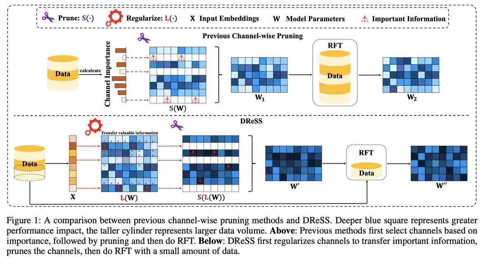

# DReSS: Data-driven Regularized Structured Streamlining for Large Language Models

> Mingkuan Feng, Jinyang Wu, Shuai Zhang, Pengpeng Shao, Ruihan Jin, Zhengqi Wen, Jianhua Tao, Feihu Che

> ⚠️ **本 note 由 AI Agent 自动生成**，基于 arXiv 论文 (2501.17905v3) 全文阅读和分析。生成时间：2025 年 6 月。

---

## 一句话总结

DReSS 提出了一种"先正则化、再剪枝、再微调"的新型结构化剪枝范式，通过在剪枝前对即将被移除的通道施加正则化，将重要信息转移到模型剩余部分，从而显著降低信息损失，在 LLaMA2-7B 上以 25% 剪枝率将困惑度比次优方法 LLM Surgeon 降低约 20%。

---

## 摘要翻译

大语言模型（LLMs）在各领域取得了显著进展，但其规模不断增长导致了高昂的计算和内存成本。近期研究表明，LLMs 具有稀疏性，可通过剪枝技术来减小模型规模。然而，现有的剪枝方法通常遵循"先剪枝、再微调"的范式。由于被剪枝的部分仍包含有价值的信息，直接移除往往导致不可逆的性能下降，使得微调恢复性能的计算负担巨大。本文提出了一种新范式：先施加正则化，再剪枝，最后微调。基于此范式，我们提出了 DReSS，一种简单有效的数据驱动正则化结构化精简方法。通过利用少量数据对即将被剪枝的组件施加正则化，DReSS 将重要信息预先转移到模型的其余部分。与直接剪枝相比，这减少了参数移除造成的信息损失，从而增强了语言建模能力。实验结果表明，即使在极端剪枝率下，DReSS 也显著优于现有剪枝方法，大幅降低了延迟并提高了吞吐量。

---

## 研究动机

### 问题背景

大语言模型（LLMs）的参数规模不断扩大，带来了高昂的计算和内存开销，严重阻碍了实际部署。模型压缩技术（剪枝、量化、知识蒸馏、低秩分解）中，结构化剪枝因其无需专用硬件即可加速推理而备受关注。

### 现有方法的局限

现有结构化剪枝方法（如 LLM Surgeon、SliceGPT、SLEB）均遵循"先根据指标选择通道/层进行剪枝，再进行恢复微调（RFT）"的范式。这种方法存在两个关键问题：

1. **信息损失不可逆**：被剪枝的部分虽然重要性较低，但仍包含有价值的信息。直接移除导致不可逆的性能下降，需要大量数据进行 RFT 才能恢复。
2. **高剪枝率下性能崩溃**：在高剪枝率（如 60%）下，现有方法（如 SLEB）会出现性能崩溃，限制了加速效果。

### 核心洞察

论文的核心洞察是：**正则化可以改变权重的分布模式**。通过在剪枝前对将被移除的通道施加正则化（ℓ1 或 ℓ2 范数），可以将重要信息"转移"到模型的剩余部分，从而减少直接参数移除造成的信息损失。

---

## 方法（技术细节）

### 整体流程

DReSS 包含四个主要步骤：

1. **数据选择（Data Selection）**：从 WikiText-2 训练集中随机选取约 1,000 个样本，用于预剪枝正则化和后剪枝 RFT（比例 3:1）。
2. **正则化（Regularization）**：对选定通道施加 ℓ1 或 ℓ2 范数正则化，将重要信息转移到未被剪枝的部分。
3. **剪枝（Pruning）**：移除正则化后的通道。
4. **可选 RFT（Optional RFT）**：使用 LoRA 对剪枝后的模型进行微调。

### 正则化机制

#### 通道选择矩阵 R

使用对角矩阵 R ∈ R^{d×d} 选择要正则化/剪枝的通道。R 中包含 (1-p%)×d 个零和 p%×d 个一（p 为剪枝率），对应被选中的索引。R 在所有层中是相同的。

#### 依赖关系（Proposition 1）

论文证明了 Attention 和 FFN 模块之间的依赖关系：如果对第 (i-1) 层 FFN 块的 W_down 的某些列施加正则化，则应对第 i 层 Attention 块的 W_Q、W_K、W_V 的对应行施加正则化。类似地，W_o 与 W_up 也存在依赖关系。

#### 正则化范围

正则化应用于 Transformer 层的以下组件：
- **Attention 块**：W_Q、W_K、W_V 的行，W_o 的列
- **FFN 块**：W_up 的行，W_down 的列
- **其余部分**：W_emb、W_pos 的列，LayerNorm 的 α 和 β，以及最终的语言建模矩阵 W_lm

#### 损失函数

总损失函数包含语言建模损失和三部分正则化损失：

$$L_{sum} = L(W, X) + \sum_{i=1}^{l} \tilde{L}_{att}^{i} + \sum_{i=1}^{l} \tilde{L}_{FFN}^{i} + \tilde{L}_{remain}$$

其中：
- $\tilde{L}_{att}^{i} = \lambda(\|RW_Q^i\| + \|RW_K^i\| + \|RW_V^i\| + \|W_o^iR\|)$
- $\tilde{L}_{FFN}^{i} = \lambda\|RW_{up}^i\| + \lambda\|W_{down}^iR\|$
- $\tilde{L}_{remain} = \lambda(\|W_{emb}R\| + \|W_{pos}R\| + \sum_{i=1}^{l}\|R\alpha_i\| + \sum_{i=1}^{l}\|R\beta_i\| + \|RW_{lm}\|)$

λ 为正则化系数（最优值为 10^{-3}）。

#### ℓ1 范数的处理（Proposition 2）

ℓ1 范数优化问题可通过引入辅助变量 y 转化为等价的约束优化问题，使其可以通过反向传播算法求解。具体地：$\min \|x\|_1 \Leftrightarrow \min_{x,y} 1^T y \text{ s.t. } -y \leq x \leq y, y \geq 0$。

### 剪枝过程

使用伪索引选择矩阵 S = I - R 进行通道裁剪：
- Attention：$W_Q' = SW_Q$，$W_K' = SW_K$，$W_V' = SW_V$，$W_o' = W_oS$
- FFN：$W_{up}' = SW_{up}$，$W_{down}' = W_{down}S$
- 其余：$W_{emb}' = W_{emb}S$，$W_{pos}' = W_{pos}S$，$\alpha' = S\alpha$，$\beta' = S\beta$，$W_{lm}' = SW_{lm}$

### 可选 RFT

使用 LoRA（rank=32, α=10）进行微调，batch size=64，学习率=2e-5，序列长度=2048。

---

## 实验结果

### 实验设置

- **模型**：Phi-2、OPT-13B、LLaMA2-7B、LLaMA2-13B、LLaMA3-8B
- **评估数据集**：WikiText-2（困惑度）、PIQA、WinoGrande、HellaSwag、ARC-e、ARC-c（零样本准确率）
- **基线方法**：LLM Surgeon、SliceGPT、SLEB
- **硬件**：单张 80GB NVIDIA A100 GPU

### 核心实验结果（Table 1，25% 剪枝率，含 RFT）

| 模型 | 方法 | PPL (↓) | Avg Acc (%) |
|------|------|---------|-------------|
| **LLaMA2-7B** | Dense | 5.47 | 69.00 |
| | LLM Surgeon | 7.38 | 59.42 |
| | SliceGPT | 7.49 | 55.73 |
| | SLEB | 10.24 | 53.49 |
| | **DReSS-ℓ2** | **5.86** | **61.54** |
| **LLaMA3-8B** | Dense | 5.76 | 75.62 |
| | LLM Surgeon | 7.62 | 67.37 |
| | SliceGPT | 8.14 | 65.42 |
| | SLEB | 11.37 | 61.78 |
| | **DReSS-ℓ2** | **6.09** | **69.80** |
| **OPT-13B** | Dense | 10.12 | 61.79 |
| | LLM Surgeon | 11.02 | 59.96 |
| | SliceGPT | 10.90 | 59.32 |
| | SLEB | 12.02 | 58.50 |
| | **DReSS-ℓ2** | **10.38** | **60.47** |

**关键发现**：
- 在 LLaMA2-7B 上，DReSS 的困惑度比次优方法 LLM Surgeon 低约 20%
- 在 OPT-13B 上，25% 剪枝率下 DReSS 平均准确率仅比 Dense 模型下降约 1%
- ℓ1 和 ℓ2 范数性能差异很小，后续以 ℓ2 为准

### 加速效果（Table 2）

| 模型 | 剪枝率 | PPL | 吞吐量提升 | 延迟降低 |
|------|--------|-----|-----------|---------|
| OPT-13B | 25% | 10.38 | 1.16× | 1.21× |
| OPT-13B | 50% | 13.85 | 1.35× | 1.41× |
| LLaMA2-13B | 25% | 5.12 | 1.14× | 1.20× |
| LLaMA2-13B | 50% | 7.59 | 1.32× | 1.39× |

### 鲁棒性（不同剪枝率）

- 在 20%~60% 剪枝率范围内，DReSS 均显著优于其他方法
- 在 60% 极端剪枝率下，SLEB 完全崩溃，而 DReSS 仍维持相对较低的困惑度
- 大模型（如 LLaMA2-13B）在高剪枝率下表现更为稳健

### 数据效率

- 仅需 1,000 个样本即可达到竞争性能，而其他方法需要 4,000 个样本
- 正则化前的数据量对性能至关重要，RFT 步骤可选

### 消融实验（Table 4/5）

- **无正则化（w/o R）**：PPL 急剧上升至 22.38（LLaMA2-7B），说明正则化的关键作用
- **全参数正则化（w FPR）**：性能也显著下降，说明精确选择剪枝通道的重要性
- **无 RFT（w/o RFT）**：PPL 仅上升至 5.97，说明 RFT 可选
- **正则化前剪枝（R&P&N）** 优于 **剪枝后正则化（N&P&R）**，验证了"先正则化、后剪枝"的范式优越性
- **最佳数据比例**：正则化与 RFT 数据比例为 3:1 时效果最佳

### 通道选择的不敏感性（Table 3）

- 三种不同的通道选择方式（移除最后 25%、移除前 25%、均匀分散移除）性能差异极小
- 说明 DReSS 对通道选择策略不敏感，具有很强的鲁棒性

---

## 优势

1. **全新范式**：首次提出"先正则化、再剪枝、再微调"的结构化剪枝范式，与传统"先剪枝、后微调"形成鲜明对比
2. **显著性能提升**：在多个模型和剪枝率下，DReSS 在困惑度和准确率上均优于 LLM Surgeon、SliceGPT、SLEB 等基线方法
3. **极低开销**：仅需 1,000 个样本进行正则化和 RFT，计算开销极小
4. **RFT 可选**：即使不进行 RFT，DReSS 仍能取得竞争性能
5. **鲁棒性强**：
   - 对剪枝通道选择不敏感
   - 在 60% 极端剪枝率下仍保持稳定性能
   - 对数据集的依赖性较低（跨 Alpaca、WikiText-2、PTB、C4 数据集均表现稳定）
6. **可与其他压缩技术结合**：结构化剪枝后模型可进一步进行量化等操作

---

## 局限

1. **仅探索通道级剪枝**：论文仅在参数矩阵的行/列层面进行结构化剪枝，未探索 Transformer 层级别的剪枝
2. **正则化可能影响模型基础能力**：正则化改变了权重分布（按人工设定的 mask 进行），虽然能转移信息，但可能对模型的基础能力产生潜在影响，论文中未详细讨论此问题
3. **RFT 步骤效果有限**：虽然 RFT 可选，但论文中未深入分析 RFT 对不同类型任务（如推理、代码生成等）的影响
4. **未涉及非结构化剪枝对比**：虽然提到了 Wanda、SparseGPT 等非结构化方法，但实验主要与结构化剪枝方法对比，缺乏与非结构化剪枝方法的系统比较
5. **计算开销评估不足**：论文未提供详细的正则化和 RFT 过程的计算时间对比（相比传统方法）
6. **代码未公开**：prototxt 中代码 URL 为空，缺乏可复现性

---

## 与 EfficientPaper 相关的研究方向

### 关键词

- **sparse_pruning**：稀疏剪枝，DReSS 通过正则化实现结构化稀疏
- **structured_sparsity**：结构化稀疏性，DReSS 专注于通道级结构化剪枝

### 相关研究方向

1. **结构化剪枝范式**：DReSS 提出的"先正则化、后剪枝、再微调"范式可扩展到更多场景，包括层剪枝、注意力头剪枝等
2. **数据高效压缩**：仅需 1,000 个样本即可达到竞争性能，与数据高效的模型压缩方法密切相关
3. **正则化与剪枝的结合**：DReSS 展示了正则化在剪枝前的关键作用，可启发更多结合正则化与剪枝的研究
4. **模型加速**：DReSS 在吞吐量和延迟方面的改进与高效推理、边缘部署等研究方向相关
5. **多模态模型压缩**：DReSS 的范式可能扩展到视觉-语言模型等多模态场景
6. **渐进式剪枝**：DReSS 的"先转移信息、再移除参数"的思想与渐进式剪枝、课程学习等方法有相似之处

---

*本 note 基于 arXiv 论文 2501.17905v3 全文阅读和分析，由 AI Agent 自动生成。*
