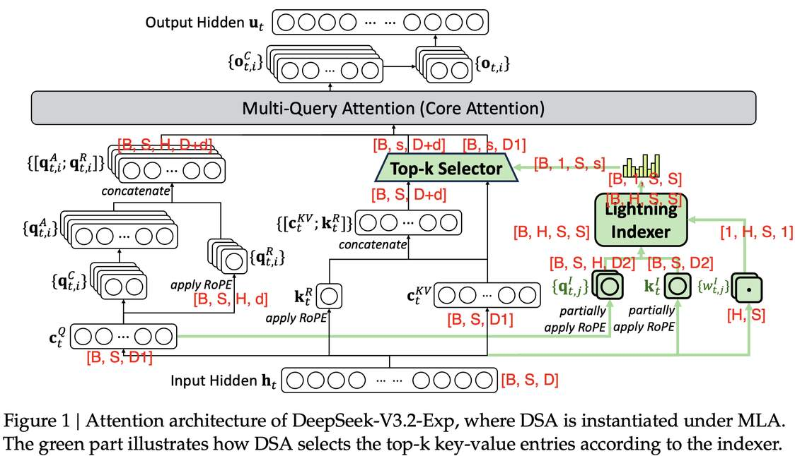

# DSA

> ⚠️ **本文由 AI Agent 自动生成**，基于论文原文提取与分析，仅供参考。

## 一句话总结

DeepSeek Sparse Attention (DSA) 是一种细粒度稀疏注意力机制，通过轻量级索引器（Lightning Indexer）选择性地计算 token 间的注意力，在保持模型性能几乎不变的前提下，将长上下文场景的推理计算复杂度从 O(L²) 降低到 O(Lk)，显著提升了长序列推理效率。

---

## 摘要翻译

我们介绍了 DeepSeek-V3.2-Exp，一个实验性的稀疏注意力模型，它通过持续训练为 DeepSeek-V3.1-Terminus 赋予了 DeepSeek Sparse Attention (DSA) 能力。DSA 是一种由轻量级索引器驱动的细粒度稀疏注意力机制，使 DeepSeek-V3.2-Exp 在训练和推理中都实现了显著的效率提升，尤其在长上下文场景中表现突出。模型检查点已发布在 https://huggingface.co/deepseek-ai/DeepSeek-V3.2-Exp。

---

## 研究动机

1. **长上下文效率瓶颈**：标准 Transformer 的全注意力机制具有 O(L²) 的计算复杂度，随着序列长度增加，计算和内存开销急剧增长，严重制约了长上下文模型的部署。
2. **已有稀疏注意力的局限**：此前的稀疏注意力方法（如 NSA 等）在粒度、可训练性或硬件对齐方面存在不足，难以在实际大规模模型中实现高效部署。
3. **MLA 框架下的适配需求**：DeepSeek-V3.1-Terminus 采用了 MLA（Multi-head Latent Attention）架构，需要在 MLA 框架下设计一种与之兼容的稀疏注意力机制，同时支持从已有模型的持续训练。
4. **推理成本优化**：在实际部署场景（如 H800 GPU 集群）中，长序列推理的 token 成本需要大幅降低，以实现更经济的服务部署。

---

## 方法（技术细节）

### 1. 整体架构

DSA 基于 MLA 架构，通过持续训练引入到 DeepSeek-V3.1-Terminus 中，形成 DeepSeek-V3.2-Exp。主要包含两个核心组件：

- **Lightning Indexer（轻量级索引器）**：计算 query token 与每个历史 token 之间的索引分数，决定哪些 token 被选中参与注意力计算。
- **Fine-grained Token Selection（细粒度 token 选择机制）**：根据索引分数选择 top-k 的 key-value 条目进行注意力计算。

### 2. Lightning Indexer 详细设计

索引分数的计算公式为：

$$I_{t,s} = \sum_{j=1}^{H_I} w_{t,j}^I \cdot \text{ReLU}(q_{t,j}^I \cdot k_s^I)$$

其中：
- $H_I$：索引器的头数（较少）
- $q_{t,j}^I \in \mathbb{R}^{d_I}$ 和 $w_{t,j}^I \in \mathbb{R}$：由 query token $h_t$ 派生
- $k_s^I \in \mathbb{R}^{d_I}$：由历史 token $h_s$ 派生
- 使用 ReLU 作为激活函数（出于吞吐量考虑）
- 索引器头数少，可使用 FP8 实现，计算效率极高

### 3. 细粒度 Token 选择

给定索引分数 $\{I_{t,s}\}$，选择 top-k 索引分数对应的 key-value 条目 $\{c_s\}$，注意力输出为：

$$u_t = \text{Attn}(h_t, \{c_s \mid I_{t,s} \in \text{Top-k}(I_{t,:})\})$$

### 4. MLA 下的 DSA 实现

- **MQA 模式**：为保证计算效率，每个 latent vector（MLA 的 key-value 条目）在所有 query head 之间共享，实现类似 MQA 的效果。
- **与 NSA 的区别**：DSA 的 token 选择粒度为 token-wise，不同 token 的 query 可以选择不同的 top-k KV，而 NSA 采用不同的选择策略。
- **加速实现**：涉及从 global memory gather 到 shared memory 的 gather 运算。

### 5. 训练策略

#### 阶段一：Dense Warm-up（密集预热）

- 保持密集注意力，冻结所有模型参数，仅训练 Lightning Indexer
- 目标：使索引器输出与主注意力分布对齐
- 损失函数：KL 散度 $L_I = \sum_t D_{KL}(p_{t,:} \| \text{Softmax}(I_{t,:}))$
- 学习率：$10^{-3}$
- 训练 1000 步，每步 16 条 128K 序列，共 2.1B tokens

#### 阶段二：Sparse Training（稀疏训练）

- 引入细粒度 token 选择机制，优化所有模型参数
- 索引器仅考虑被选中的 token 集合 $S_t = \{s \mid I_{t,s} \in \text{Top-k}(I_{t,:})\}$
- 索引器输入从计算图中 detach，独立优化
- 索引器训练信号仅来自 $L_I$，主模型仅来自语言建模损失
- 每个 query token 选择 2048 个 key-value token
- 学习率：$7.3 \times 10^{-6}$
- 训练 15000 步，每步 480 条 128K 序列，共 943.7B tokens

#### 后训练（Post-Training）

- 继续使用稀疏注意力
- 保持与 DeepSeek-V3.1-Terminus 相同的后训练 pipeline、算法和数据
- 包含 Specialist Distillation（专家蒸馏）和 Mixed RL Training（混合强化学习训练）
- 使用 GRPO 作为 RL 算法
- 将推理、agent 和人类对齐训练合并为一个 RL 阶段

---

## 实验结果

### 1. 模型能力评估

与 DeepSeek-V3.1-Terminus 对比：

| 基准测试 | V3.1-Terminus | V3.2-Exp (DSA) | 备注 |
|---------|--------------|----------------|------|
| MMLU-Pro (EM) | 85.0 | 85.0 | 持平 |
| GPQA-Diamond (Pass@1) | 80.7 | 79.9 | 略低 |
| HLE (Pass@1) | 21.7 | 19.8 | 略低 |
| BrowseComp (Acc.) | 38.5 | 40.1 | 提升 |
| BrowseComp_zh (Acc.) | 45.0 | 47.9 | 提升 |
| SimpleQA (Acc.) | 96.8 | 97.1 | 提升 |
| LiveCodeBench (Pass@1) | 74.9 | 74.1 | 略低 |
| Codeforces-Div1 (Rating) | 2046 | 2121 | 提升 |
| Aider-Polyglot (Acc.) | 76.1 | 74.5 | 略低 |
| SWE Verified (Agent) | 68.4 | 67.8 | 略低 |
| SWE-bench Multilingual | 57.8 | 57.9 | 持平 |
| Terminal-bench | 36.7 | 37.7 | 提升 |
| AIME 2025 (Pass@1) | 88.4 | 89.3 | 提升 |
| HMMT 2025 (Pass@1) | 86.1 | 83.6 | 略低 |

**核心结论**：DeepSeek-V3.2-Exp 在引入 DSA 后，未出现显著性能退化。部分基准（GPQA、HLE、HMMT）略低是因为生成的推理 token 更少，使用同等 token 数量的中间检查点时差距可关闭。

### 2. 训练稳定性

- 在 BrowseComp 和 SWE Verified 上，两个模型的 RL 训练曲线高度对齐
- DSA 引入后训练过程保持稳定，未出现灾难性遗忘

### 3. 推理成本

- DSA 将主注意力复杂度从 O(L²) 降低到 O(Lk)
- Lightning Indexer 仍有 O(L²) 复杂度，但远小于 MLA 的计算量
- 在 H800 GPU 集群上（租金 2 美元/GPU/小时）：
  - **Prefilling**：长序列下成本显著降低
  - **Decoding**：长序列下成本显著降低
- 短序列 prefilling 特殊实现 masked MHA 模式模拟 DSA，以提高短上下文效率

---

## 优势

1. **显著的效率提升**：将长上下文推理计算复杂度从 O(L²) 降至 O(Lk)，推理成本大幅降低
2. **性能几乎无损**：与 Dense 模型（V3.1-Terminus）相比，多项基准测试性能持平或提升，少数基准略低但可解释
3. **与 MLA 框架兼容**：DSA 可在 MLA 架构下实现，通过 MQA 模式保证计算效率
4. **训练稳定性**：稀疏注意力的引入未造成训练不稳定，RL 训练曲线高度对齐
5. **细粒度选择**：token-wise 的粒度选择机制，不同 token 的 query 可选择不同的 KV 子集
6. **Lightning Indexer 高效**：索引器头数少，支持 FP8 计算，计算开销极低
7. **可从已有模型持续训练**：从 V3.1-Terminus 检查点出发，通过两阶段训练（Dense Warm-up + Sparse Training）引入 DSA
8. **开源实现**：提供了 PyTorch 实现代码，便于复现和研究

---

## 局限

1. **长上下文实际验证不足**：论文提到正在积极进行大规模真实场景测试，当前结果主要基于内部评估，可能存在未发现的局限
2. **索引器仍具 O(L²) 复杂度**：虽然计算量远小于主注意力，但理论上 Lightning Indexer 仍需 O(L²) 复杂度，对于极长序列可能成为瓶颈
3. **性能略低的基准**：在 GPQA-Diamond、HLE、HMMT 2025 等基准上性能略低于 V3.1-Terminus，说明稀疏注意力可能对部分推理任务产生轻微影响
4. **token 选择依赖 Top-k**：top-k 选择策略可能遗漏重要 token，影响注意力质量
5. **训练开销较大**：Sparse Training 阶段需要 943.7B tokens，训练成本高昂
6. **短序列效率优化有限**：短序列 prefilling 需要特殊实现 masked MHA 模式，增加了实现复杂度
7. **与 NSA 的对比不足**：论文未直接与 NSA（Native Sparse Attention）进行详细对比，无法明确 DSA 的相对优势

---

## 与 EfficientPaper 相关的研究方向

1. **稀疏注意力机制**：DSA 与 NSA、Dynamic Sparse Attention 等方法同属稀疏注意力研究方向，可对比分析其效率与性能权衡
2. **KV Cache 压缩**：DSA 的 token 选择机制本质上是对 KV Cache 的稀疏化，与 KV Cache 压缩、蒸馏等方法相关
3. **长上下文推理优化**：DSA 为长上下文推理提供了高效解决方案，可与其他长上下文技术（如 Ring Attention、Flash Attention）结合
4. **结构化剪枝**：DSA 的 token 选择机制可视为一种结构化剪枝，可与模型剪枝、知识蒸馏等方法结合
5. **Attention Sparsity**：DSA 与 Sliding Window Attention、Dilated Attention 等稀疏注意力方法形成互补，可进行系统对比
6. **硬件对齐优化**：DSA 的 gather 运算和 FP8 索引器设计体现了硬件对齐的思想，可与 FlashAttention、Triton 等硬件优化方法结合
7. **MQA/MHA 混合架构**：DSA 在 MLA 框架下使用 MQA 模式，可与 GQA（Grouped Query Attention）等架构变体进行对比研究
8. **持续训练策略**：DSA 的两阶段训练（Dense Warm-up + Sparse Training）为稀疏注意力的引入提供了范例，可推广到其他稀疏注意力方法

---

## 元数据

- **论文标题**: DeepSeek-V3.2-Exp: Boosting Long-Context Efficiency with DeepSeek Sparse Attention
- **作者/机构**: DeepSeek-AI
- **发表渠道**: GitHub
- **年份**: 2025
- **代码**: https://github.com/deepseek-ai/DeepSeek-V3.2-Exp (PyTorch)
- **关键词**: sparse_pruning, attention_sparsity, kv_cache_sparse, structure_design
- **更新时间**: 2025-06-04

---

*本文由 AI Agent 自动生成，基于论文 PDF 原文提取与分析，仅供参考。*
