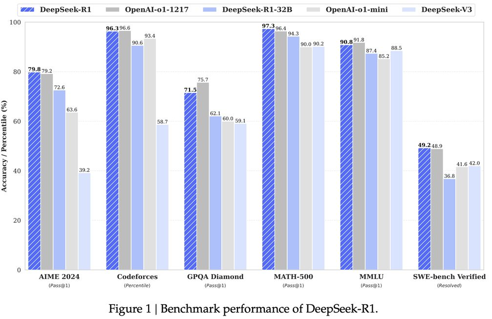

# DeepSeek-R1: Incentivizing Reasoning Capability in LLMs via Reinforcement Learning

> **⚠️ 生成声明：本 note 由 AI Agent 自动生成，基于 arXiv 论文全文（2501.12948v1）的中文总结与分析。生成时间：2026年6月。**

## 一句话总结

DeepSeek-R1 通过纯强化学习（RL）从基础模型直接激发推理能力，并引入冷启动数据和多阶段训练流程，使开源推理模型达到与 OpenAI o1 相当的性能水平，同时将推理能力蒸馏至 1.5B–70B 参数的小模型。

## 摘要翻译

我们介绍了第一代推理模型 DeepSeek-R1-Zero 和 DeepSeek-R1。DeepSeek-R1-Zero 是一个通过大规模强化学习（RL）训练的模型，无需将监督微调（SFT）作为预备步骤，展现了卓越的推理能力。通过 RL，DeepSeek-R1-Zero 自然涌现了多种强大且有趣的推理行为。然而，它面临可读性差和语言混合等挑战。为解决这些问题并进一步提升推理性能，我们引入了 DeepSeek-R1，它在 RL 之前加入了多阶段训练和冷启动数据。DeepSeek-R1 在推理任务上达到了与 OpenAI-o1-1217 相当的性能。为了支持研究社区，我们开源了 DeepSeek-R1-Zero、DeepSeek-R1 以及六个基于 Qwen 和 Llama 的蒸馏稠密模型（1.5B、7B、8B、14B、32B、70B）。

## 研究动机

1. **推理能力是 LLM 迈向 AGI 的关键**：OpenAI o1 系列模型首次通过推理时扩展（inference-time scaling）在数学、代码和科学推理任务上取得显著提升，但有效的测试时扩展方法仍是开放问题。
2. **现有方法依赖大量监督数据**：之前的强化学习工作（如过程奖励模型、MCTS 搜索等）大量依赖监督数据，数据收集耗时且难以扩展。
3. **纯 RL 的潜力未被充分探索**：论文首次尝试在无需 SFT 的情况下，仅通过纯 RL 从基础模型直接激发推理能力，验证了 LLM 推理能力可以通过 RL 自发涌现。
4. **小模型推理能力的提升路径**：通过蒸馏技术将大模型的推理模式传递给小模型，是提高效率和降低部署成本的重要途径。

## 方法（技术细节）

### DeepSeek-R1-Zero：纯 RL 训练

**基础模型**：DeepSeek-V3-Base（671B 总参数，37B 激活参数的 MoE 架构）

**RL 算法 — GRPO（Group Relative Policy Optimization）**：
- 与 PPO 不同，GRPO 不使用与策略模型同等大小的 critic 模型，而是从组内分数估计 baseline
- 对每个问题 q，从旧策略 π_old 采样一组输出 {o_1, o_2, ..., o_G}
- 通过最大化带 clipped 的优势加权目标函数来优化策略
- 优势计算：A_i = (r_i - mean(r)) / std(r)，即组内归一化的优势

**奖励建模**：采用基于规则的奖励系统，不使用神经网络奖励模型（避免 reward hacking）
- **准确性奖励**：验证最终答案是否正确（数学题要求指定格式，代码题用编译器检验）
- **格式奖励**：强制模型在 `<think>` 和 `</think>` 标签之间生成推理过程

**训练模板**：简单模板，仅要求模型先产生推理过程再给出答案，不添加内容偏好

**关键发现**：
- **自我进化**：模型在 RL 过程中自动学会延长推理时间，从数百到数千 token
- **Aha Moment**：模型自发学会反思（reflection）和探索替代方法，这是 RL 环境中的涌现行为
- **性能跃升**：AIME 2024 pass@1 从 15.6% 提升到 71.0%（多数投票达 86.7%）

### DeepSeek-R1：多阶段训练流程

为解决 R1-Zero 的可读性差和语言混合问题，DeepSeek-R1 采用四阶段流程：

**阶段一：冷启动（Cold Start）**
- 收集数千条长 CoT 数据微调 DeepSeek-V3-Base
- 数据来源：少样本提示、直接提示生成详细答案、R1-Zero 输出的可读格式、人工标注
- 输出格式：`|special_token|<reasoning_process>|special_token|
`
- 优势：提升可读性和性能

**阶段二：推理导向 RL（Reasoning-oriented RL）**
- 对冷启动后的模型应用与 R1-Zero 相同的大规模 RL
- 聚焦推理密集任务：编码、数学、科学、逻辑推理
- 引入**语言一致性奖励**：计算 CoT 中目标语言单词的比例，缓解语言混合
- 最终奖励 = 推理准确率 + 语言一致性奖励

**阶段三：拒绝采样和 SFT（Rejection Sampling & SFT）**
- 在 RL 收敛后，使用 checkpoint 生成新的 SFT 数据
- **推理数据**：约 600k 样本，通过拒绝采样从 RL checkpoint 收集，使用生成式奖励模型（DeepSeek-V3）判断
- **非推理数据**：约 200k 样本，包括写作、事实问答、自我认知等
- 总计约 800k 样本，微调 DeepSeek-V3-Base 两个 epoch

**阶段四：全场景 RL（RL for all Scenarios）**
- 二阶段 RL，进一步对齐人类偏好
- 推理数据：使用规则奖励（数学、代码、逻辑推理）
- 一般数据：使用奖励模型捕获人类偏好
- 帮助性评估：仅评估最终摘要
- 无害性评估：评估整个响应（推理过程 + 摘要）

### 蒸馏（Distillation）

- 使用 DeepSeek-R1 作为教师模型生成的 800k 样本
- 基础模型：Qwen2.5-Math-1.5B、Qwen2.5-Math-7B、Qwen2.5-14B、Qwen2.5-32B、Llama-3.1-8B、Llama-3.3-70B-Instruct
- 仅使用 SFT，未加入 RL 阶段
- 结果：蒸馏效果优于小模型直接 RL 训练

## 实验结果

### DeepSeek-R1 主要结果（与 OpenAI o1-1217 对比）

| 基准 | DeepSeek-R1 | OpenAI o1-1217 | 优势 |
|------|------------|----------------|------|
| AIME 2024 (Pass@1) | 79.8% | 79.2% | 略胜 |
| MATH-500 (Pass@1) | 97.3% | 96.4% | 略胜 |
| GPQA Diamond (Pass@1) | 71.5% | 75.7% | 略逊 |
| MMLU (Pass@1) | 90.8% | 91.8% | 略逊 |
| Codeforces (Percentile) | 96.3% | 96.6% | 持平 |
| SWE-bench Verified | 49.2% | 48.9% | 持平 |
| AlpacaEval 2.0 (LC-winrate) | 87.6% | - | 出色 |
| ArenaHard | 92.3% | - | 出色 |

### 蒸馏模型结果

| 模型 | AIME 2024 | MATH-500 | GPQA Diamond | LiveCodeBench |
|------|----------|----------|-------------|--------------|
| DeepSeek-R1-Distill-Qwen-1.5B | 28.9% | 83.9% | 33.8% | 16.9% |
| DeepSeek-R1-Distill-Qwen-7B | 55.5% | 92.8% | 49.1% | 37.6% |
| DeepSeek-R1-Distill-Qwen-14B | 69.7% | 93.9% | 59.1% | 53.1% |
| DeepSeek-R1-Distill-Qwen-32B | 72.6% | 94.3% | 62.1% | 57.2% |
| DeepSeek-R1-Distill-Llama-70B | 70.0% | 94.5% | 65.2% | 57.5% |

**关键发现**：
- 蒸馏 14B 模型大幅超越 QwQ-32B-Preview
- 蒸馏 32B 和 70B 模型在推理基准上创造稠密模型新纪录
- 蒸馏效果优于小模型直接 RL 训练（32B 模型对比：蒸馏 72.6% vs RL 47.0% AIME）

## 优势

1. **首次验证纯 RL 激发推理能力**：DeepSeek-R1-Zero 证明不需要 SFT 数据，纯 RL 即可让模型发展出强大的推理能力，包括自我验证、反思和长链推理
2. **与 OpenAI o1 性能相当**：DeepSeek-R1 在多个推理基准上达到甚至超越 OpenAI o1-1217 的水平
3. **开源且高效**：完全开源模型和 API，包括蒸馏的 1.5B–70B 模型，降低推理成本
4. **蒸馏策略经济有效**：简单蒸馏即可大幅提升小模型推理能力，无需额外 RL 训练
5. **多阶段训练的鲁棒性**：冷启动 + 多阶段 RL + SFT 的流程既保证了推理能力，又兼顾了可读性和通用能力
6. **涌现的推理行为**：模型在训练过程中自发学会反思、自我验证、延长推理时间等高级行为，展示了 RL 的强大潜力

## 局限

1. **可读性和语言混合**：R1-Zero 的推理过程可读性差，可能存在语言混合问题
2. **通用能力不足**：在函数调用、多轮对话、复杂角色扮演、JSON 输出等任务上不如 DeepSeek-V3
3. **对 prompt 敏感**：Few-shot 提示会降低性能，推荐使用 zero-shot 设置
4. **软件工程任务有限**：由于评估时间长，大规模 RL 未在软件工程任务上充分应用
5. **语言混合**：目前仅针对中文和英文优化，处理其他语言查询时可能出现语言混合
6. **蒸馏后未加 RL**：蒸馏模型仅使用 SFT，未加入 RL 阶段，理论上有进一步提升空间
7. **中文 SimpleQA 性能下降**：由于安全 RL，对部分中文查询倾向于拒绝回答
8. **训练成本**：大模型的 RL 训练需要大量计算资源

## 与 EfficientPaper 相关的研究方向

1. **推理时计算扩展（Test-time Compute Scaling）**：DeepSeek-R1 展示了通过延长推理时间（更多 token）来提升推理能力的有效性，是 EfficientPaper 中计算效率研究的重要案例
2. **强化学习训练效率**：GRPO 算法避免了 critic 模型，降低了 RL 训练的计算成本，对 EfficientPaper 的训练效率研究有启发
3. **模型蒸馏与知识迁移**：蒸馏策略将大模型推理能力传递给小模型，是 EfficientPaper 中模型压缩和效率优化的重要方向
4. **MoE 架构的推理能力**：DeepSeek-R1 基于 671B MoE 架构（37B 激活），展示了 MoE 架构在推理任务上的潜力
5. **冷启动策略**：少量高质量冷启动数据显著提升 RL 训练效果，为 EfficientPaper 中的数据效率研究提供参考
6. **开源小模型推理能力**：1.5B–70B 蒸馏模型在推理基准上表现出色，为 EfficientPaper 中的高效推理模型研究提供基线
7. **奖励设计与避免 Reward Hacking**：论文讨论了 PRM 和 MCTS 的失败案例，为 EfficientPaper 中的奖励工程研究提供警示
8. **多阶段训练流程**：四阶段训练（冷启动 → 推理 RL → 拒绝采样 SFT → 全场景 RL）展示了高效训练流程的设计思路

---

**论文链接**: [arXiv:2501.12948](http://arxiv.org/abs/2501.12948v1)
**代码**: [GitHub - deepseek-ai/DeepSeek-R1](https://github.com/deepseek-ai/DeepSeek-R1)
**关键词**: structure_design, reinforcement_learning, reasoning, distillation, RL
