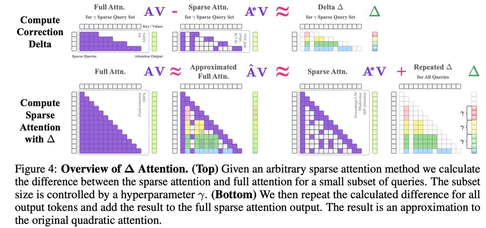

# Delta Attention: Fast and Accurate Sparse Attention Inference by Delta Correction

> ⚠️ 本 note 由 AI Agent 自动生成，基于论文原文内容整理，仅供参考。生成时间：2026年6月。

## 一句话总结

Delta Attention 通过在稀疏注意力输出上添加一个轻量级的 Delta 校正项，修正稀疏预填充引起的注意力输出分布偏移，从而在仅增加极小开销的情况下，将稀疏注意力方法的准确率恢复到接近全二次注意力的水平，同时保持高达 98.5% 的稀疏率和 32 倍的推理加速。

## 摘要翻译

Transformer 的注意力机制具有二次复杂度，导致长序列推理成本和延迟很高。然而，注意力矩阵大部分是稀疏的，这意味着可以省略许多条目的计算以实现高效推理。稀疏注意力推理方法旨在减少这种计算负担，但它们也会带来严重的性能下降。我们发现，这种性能下降的一个原因是稀疏计算导致注意力输出的分布偏移（distributional shift）。这种分布偏移使得解码时的查询（query）无法与预填充阶段的正确键（key）对齐，从而导致性能下降。我们提出了一种简单、新颖且有效的程序来修正这种分布偏移，使稀疏注意力输出的分布更接近二次注意力的分布。我们的方法可以应用于任何稀疏注意力方法之上，在滑动窗口注意力与 sink token 的基础上应用时，在 131K RULER 基准测试上平均提高了 36%pt 的性能，恢复了二次注意力 88% 的准确率，同时仅增加少量开销。我们的方法可以保持约 98.5% 的稀疏率（相对于全二次注意力），使模型在处理 1M token 预填充时比 Flash Attention 2 快 32 倍。

## 研究动机

1. **稀疏注意力的性能下降问题**：现有的推理时稀疏注意力方法（如 Streaming LLM、HiP、MInference）虽然大幅降低了计算成本，但在长上下文任务中会出现显著的准确率下降。例如，Streaming LLM 在 RULER 131K 的 MultiKey-3 子任务上仅获得 0% 准确率，而二次注意力可达 62%。

2. **分布偏移是根因**：作者发现稀疏预填充会导致每层注意力输出的分布发生偏移（distributional shift）。这种偏移使得解码阶段的查询-键点积无法正确对齐，导致模型无法正确召回上下文中的信息。具体表现为注意力输出的余弦相似度和排名相关性（rank correlation）与二次注意力相比显著降低。

3. **诱导头（Induction Heads）受损**：网络低层的诱导头（负责从早期 token 复制相关信息到后续 token）对查询-键对齐非常敏感。稀疏预填充的分布偏移会干扰这些诱导头，从而严重影响上下文学习（ICL）能力。

## 方法（技术细节）

### 核心思想

Delta Attention 的核心观察是：稀疏注意力输出与二次注意力输出之间的差值（Delta）近似等于稀疏注意力中被忽略部分的贡献。即：

$$A_\Delta V \approx AV - A^*V$$

其中 $AV$ 是完整二次注意力输出，$A^*V$ 是稀疏注意力输出，$A_\Delta V$ 是被忽略的注意力贡献（形状类似 delta/三角形）。

### 算法流程

1. **稀疏注意力计算**：对所有查询 Q 计算稀疏注意力输出 $A^*V$（使用任意稀疏方法如 Streaming LLM、HiP 或 MInference）。

2. **密集查询选择**：每隔 γ 个查询（γ 为超参数，默认 γ=64），选择一个查询计算密集注意力输出 $\tilde{A}V$（对所有键进行密集计算）。选择策略为：
   $$\tilde{Q}_{\lfloor i/\gamma \rfloor} = Q_i \quad \text{if} \quad i \mod \gamma = 0$$

3. **Delta 校正项计算**：计算被选中的查询位置上密集注意力与稀疏注意力的差值：
   $$\Delta = \tilde{A}V - (A^*V)_{i \in \delta}$$
   其中 $\delta = \{i \mid i \mod \gamma = 0\}$。

4. **校正应用**：将 Delta 校正项重复扩展到所有输出 token，并加到稀疏注意力输出上：
   $$\hat{A}V = A^*V + \text{repeat}(\Delta, \gamma)$$

### 关键假设与理论基础

- **局部性假设**：相邻查询行的注意力输出差异很小，即 $(A_\Delta V)_i \approx (A_\Delta V)_{i+\nu}$，其中 $\nu \in \{1, \ldots, \gamma\}$。这意味着被忽略的注意力贡献可以在 γ 窗口内复用。

- **Lemma 1 误差界**：对于 top-k 稀疏注意力，Delta 近似误差满足：
  $$|\Delta - \sum_{i=1}^{N-k} a_i v_i| \leq \frac{H}{H+T} \max_{i > N-k} |v_i|$$
  其中 $H$ 是被忽略的注意力得分之和，$T$ 是保留的注意力得分之和。当稀疏注意力足够精确（$T \gg H$）时，误差界很紧。

### 与现有方法的关系

- **可组合性**：Delta Attention 工作在注意力输出空间，因此可以无缝集成到任何现有的稀疏注意力核和推理管道中，无需大幅修改。
- **混合稀疏策略**：从两个维度理解稀疏性——稀疏注意力通常是 query-dense、key-sparse，而 Delta Attention 引入了 query-sparse、key-dense 的补充，两者混合后逼近全注意力。
- **与 Recompute 的对比**：简单的"重新计算"（Recompute）仅对选定行进行密集计算但不对其他行做差值校正，性能提升不如 Delta 校正（在 131K 上差 11%pt）。

## 实验结果

### 主要基准测试

#### RULER 131K（Llama 3.1 8B Instruct）
| 方法 | 平均准确率 | 131K 准确率 |
|------|-----------|------------|
| Flash Attention | 87.54 | 73.16 |
| Streaming LLM | 44.25 | 27.45 |
| Streaming LLM + ∆ | 83.06 | 64.40 |
| HiP | 86.56 | 68.09 |
| HiP + ∆ | 88.62 | 72.56 |
| MInference | 86.60 | 65.73 |
| MInference + ∆ | 87.44 | 73.31 |

- Streaming LLM + ∆：在 131K 上提升 37%pt（27.45→64.40），即使调整计算预算后仍优于 Streaming LLM 的 4K 窗口设置
- HiP + ∆：在 131K 上提升 4.47%pt，平均提升 2.06%pt
- MInference + ∆：在 131K 上提升 7.58%pt，平均提升 0.84%pt

#### RULER 131K（Mistral NeMo 12B）
| 方法 | 平均准确率 | 131K 准确率 |
|------|-----------|------------|
| Flash Attention | 64.60 | 18.09 |
| Streaming LLM | 27.83 | 2.25 |
| Streaming LLM + ∆ | 51.05 | 1.44 |
| HiP | 60.25 | 10.10 |
| HiP + ∆ | 62.03 | 10.93 |

- HiP + ∆：平均提升 1.78%pt

#### Perplexity（PG19 Long QA）
| 方法 | Long PPL ↓ | PPL ↓ |
|------|-----------|------|
| Flash Attention 2 | 5.11 | 3.33 |
| Streaming LLM | 7.02 | 3.54 |
| Streaming LLM + ∆ | 5.96 | 3.41 |
| HiP Attention | 6.29 | 3.48 |
| HiP Attention + ∆ | 5.45 | 3.37 |

- Delta 校正将 PPL 和 LongPPL 与二次注意力的差距缩小了 50-75%

#### Infinite-Bench（Llama 3.1 8B + Llama 4 Scout 109B）
- Llama 3.1 + Str. LLM + ∆：平均提升 29%pt，从 20% 恢复到 67% 的二次注意力准确率
- Llama 4 + Str. LLM + ∆：平均提升 40%pt，从 41% 恢复到 82% 的二次注意力准确率
- HiP + ∆：Llama 3.1 提升 10%pt，Llama 4 提升 0.5%pt

### 延迟与开销

- 1M token 下 Streaming LLM + ∆ 比 Flash Attention 2 快 **32.16 倍**
- 1M token 下 HiP + ∆ 比 Flash Attention 2 快 **8.44 倍**
- Delta Attention 相比纯稀疏方法增加约 1.5% 的额外计算量
- 稀疏率保持约 98.5%
- γ=64 时，等效窗口大小约 3072（Streaming LLM 原始 2048 + 额外 1024）

### 消融实验

- **Recompute vs. ∆**：Recompute（Equation 5）仅重算选定行，不进行差值校正；∆（Equation 6）将差值扩展到所有行。在 131K 上 ∆ 比 Recompute 高约 11%pt。
- **γ 参数影响**：增大 γ 会降低延迟但略微增加 PPL。γ=64 为标准设置，在精度和速度之间取得较好平衡。

## 优势

1. **即插即用**：Delta Attention 工作在注意力输出空间，可与任何稀疏注意力方法（Streaming LLM、HiP、MInference 等）无缝组合，无需修改底层稀疏核。

2. **显著的准确率提升**：平均提升 36%pt，在最困难的 131K 长上下文任务上效果尤为显著，恢复了二次注意力 88% 的准确率。

3. **极低开销**：仅增加约 1.5% 的额外计算，同时保持 98.5% 的稀疏率，推理速度比 Flash Attention 2 快 32 倍。

4. **理论支撑**：提供了 Lemma 1 作为近似误差的理论界，保证了 Delta 近似的有效性。

5. **广泛的适用性**：在 Llama 3.1、Llama 4、Mistral 等多个模型上均有效，覆盖了困惑度、长上下文理解、合成检索任务等多种评估维度。

6. **解决根本问题**：从分布偏移的角度解释了稀疏注意力的性能下降，提供了一个系统性的解决方案而非经验性修补。

## 局限

1. **局部性假设的局限**：方法依赖于相邻查询行的注意力输出差异很小这一假设（即 $(A_\Delta V)_i \approx (A_\Delta V)_{i+\nu}$）。虽然在实验中被验证为有效，但在某些任务（如 variable tracking）中 Recompute 反而优于 ∆，说明该假设并非总是成立。

2. **固定 γ 超参数**：γ 作为固定超参数控制查询间隔，缺乏自适应选择机制。未来可以研究更智能的查询选择策略。

3. **稀疏注意力本身的局限**：Delta Attention 只是在稀疏注意力的基础上进行校正，并不能完全消除稀疏化带来的信息损失。在某些子任务（如 CWE）中，所有方法（包括二次注意力）均得分为 0%。

4. **MInference 实现效率问题**：论文指出 MInference 的公开实现未能充分利用硬件并行化（逐 head 循环），导致延迟异常高，因此未在延迟对比中包含 MInference。

5. **分布偏移的层数差异**：Delta Attention 在低层（诱导头密集层）效果显著，但在中间层（约第 10 层）差异消失，直到最后几层才再次出现差异，说明其校正效果在不同层之间并不均匀。

6. **缺乏训练时优化**：Delta Attention 是一种推理时的后处理方法，未涉及训练时的优化策略。

## 与 EfficientPaper 相关的研究方向

1. **注意力稀疏化（attention_sparsity）**：本文核心关键词。Delta Attention 提供了一种在不牺牲准确率的情况下保持高稀疏率的方法，是 attention_sparsity 领域的重要进展。

2. **推理时高效注意力**：与 Streaming LLM、MInference、HiP Attention 等推理时稀疏注意力方法紧密相关，可作为这些方法的增强插件。

3. **长上下文推理优化**：在 131K-1M token 的超长上下文场景下，Delta Attention 展示了显著的加速和准确率提升，与长上下文推理优化方向高度相关。

4. **注意力机制的理论分析**：论文从分布偏移角度分析了稀疏注意力的性能下降机制，并提供了误差界的理论分析，为后续研究提供了理论框架。

5. **与 Flash Attention 的关系**：Delta Attention 的校正项可以使用修改版的 Flash Attention 核计算，与 Flash Attention 生态兼容。

6. **后续研究方向**：
   - 自适应 γ 选择策略
   - 更智能的查询选择机制（而非固定间隔）
   - 将 Delta 校正与训练时优化结合
   - 与其他稀疏注意力方法（如 BigBird、Star Attention）的组合
   - 从 query-sparse 和 key-sparse 两个维度探索混合稀疏策略
