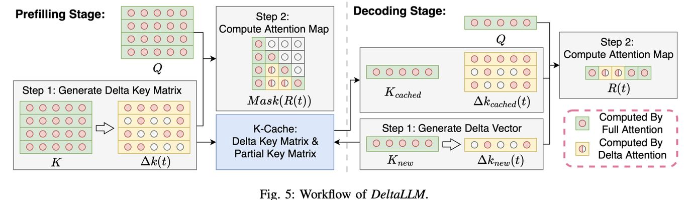

# DeltaLLM: A Training-Free Framework Exploiting Temporal Sparsity for Efficient Edge LLM Inference

> Jiawen Qi, Chang Gao, Zhaochun Ren, Qinyu Chen

> **注意：本文档由 AI Agent 自动生成，生成时间：2025年6月。内容基于论文原文的完整阅读和中文总结，仅供参考。**

## 一句话总结

DeltaLLM 提出了一种免训练框架，利用注意力模式中的时间稀疏性（temporal sparsity）在边缘设备上实现高效的大语言模型推理，同时覆盖预填充（prefilling）和解码（decoding）两个阶段，无需微调即可实现约 60% 的注意力稀疏度且几乎不损失精度。

## 摘要翻译

在边缘设备上部署大语言模型（LLM）仍然面临挑战，因为其计算量随序列长度呈二次方增长。现有的动态注意力剪枝方法主要针对具有大规模并行计算能力的硬件（如 GPU 或 TPU），并面向长上下文长度（如 64K），因此不适合边缘场景。本文提出了 DeltaLLM，一个免训练框架，利用注意力模式中的时间稀疏性在资源受限的边缘设备上实现高效的 LLM 推理，涵盖预填充和解码两个阶段。

DeltaLLM 引入了一个准确性和内存感知的增量矩阵构建策略（accuracy- and memory-aware delta matrix construction strategy），以引入时间稀疏性；同时引入一个上下文感知的混合注意力机制（context-aware hybrid attention mechanism），将局部上下文窗口内的全注意力与窗口外的增量近似注意力相结合，以提高精度。我们在面向边缘设备的 BitNet-b1.58-2B-4T 模型和 Llama3.2-1B-Instruct 模型上进行了评估。

结果表明，在 BitNet 上，该框架在预填充阶段将注意力稀疏度从 0% 提高到 60%，且在 WG 任务上精度略有提升；在预填充和解码两个阶段都应用时，稀疏度可达 57%，且在 SQuAD-v2 任务上 F1 分数从 29.63 提高到 30.97。在 Llama 模型上，预填充阶段同样可实现 60% 的稀疏度，两个阶段约 57%，精度损失可忽略。这些结果表明 DeltaLLM 是一种有前景的高效边缘部署方案，无需微调，可无缝集成到现有推理流水线中。

## 研究动机

1. **边缘部署的挑战**：将 LLM 部署到边缘设备面临计算资源有限、内存带宽受限和功耗预算紧张等问题，尤其是注意力机制的二次复杂度在长序列场景下成为瓶颈。

2. **现有方法的局限**：
   - **StreamingLLM**：采用固定的 Λ 形剪枝模式，因丢弃过多重要 token 导致精度损失较大。
   - **Minference、FlexPrefill、SnapKV**：仅适用于预填充或解码中的某一阶段，不能同时优化两个阶段。
   - **InfLLM、SpargeAttn**：需要额外的矩阵乘法和池化操作来确定重要 token，在边缘场景下计算开销较大。

3. **Delta Network 的启发**：Delta Network 是一种受生物启发的算法，通过计算向量间的时间差（delta）来引入稀疏性，在 GRU、LSTM、CNN 等模型上取得了成功，相关定制硬件加速器报告可获得高达 10 倍的能效提升。但该方法尚未在 LLM 上进行研究。

4. **研究空白**：需要一种既能覆盖预填充和解码两个阶段，又无需微调、计算开销小、可无缝集成的注意力稀疏化方法，适用于边缘设备。

## 方法（技术细节）

### 3.1 整体框架

DeltaLLM 是一个**免训练（training-free）**的推理优化框架，通过利用注意力模式中的时间稀疏性来加速 LLM 在边缘设备上的推理。框架由两个核心组件组成：

- **准确性和内存感知的增量矩阵构建策略**（Accuracy-Aware and Memory-Aware Delta Matrix Construction）
- **上下文感知的混合注意力机制**（Context-Aware Hybrid Attention Mechanism）

### 3.2 准确性和内存感知的增量矩阵构建策略

**核心思想**：将标准的密集矩阵乘法转换为时间稀疏的矩阵乘法。Delta Network 通过计算序列中相邻向量的差值，将大于阈值 θ 的变化保留，小于阈值的归零，从而引入稀疏性。

**增量矩阵构建公式**：
- 对于矩阵 A 的行 a(0), a(1), ..., a(t)，计算增量向量 Δa(t)：
  - 当 |a(t) − â(t−1)| > θ 时，Δa(t) = a(t) − â(t−1)
  - 当 |a(t) − â(t−1)| ≤ θ 时，Δa(t) = 0
- 参考向量 â(t) 同步更新
- 输出通过递归计算 R(t) = Δa(t)B + R(t−1) 得到

**预填充阶段的策略选择**（通过实验对比三种策略）：
- **策略 (1) 自上而下查询增量（Top-down query deltas）**：从查询矩阵顶部开始生成增量，由于注意力掩码的存在，仅左上角注意力分数准确，性能差。
- **策略 (2) 自下而上查询增量（Bottom-up query deltas）**：从查询矩阵底部开始生成增量，经掩码后准确分数保留较好，但不如策略 (3)。
- **策略 (3) 自上而下键增量（Top-down key deltas）**：从键矩阵顶部开始生成增量。该策略通过保留整个注意力沉降区（attention sink）的第一列注意力分数，实现最优精度。**DeltaLLM 采用此策略**。

**解码阶段的考虑**：
- 解码阶段无注意力掩码，理论上查询和键矩阵效果类似。
- 但选择键矩阵可以复用 KV-cache，避免额外内存开销。
- 因此，在两个阶段都使用键矩阵作为增量源，并在 KV-cache 中存储增量向量 Δk(t−1) 而非原始键 k(t−1)。

### 3.3 上下文感知的混合注意力机制

**核心思想**：在局部上下文窗口内使用全注意力（full attention）以保证精度，在窗口外使用增量近似注意力（delta approximate attention）以保持稀疏性。

**预填充阶段**：
- 输入序列长度 n 已知，定义动态上下文窗口大小：
  W_{p,max} = min(⌊γ · n⌋, W_{max})
  其中 γ ∈ (0, 1) 是预定义的缩放因子，W_{max} 是上界。
- 沿注意力矩阵对角线，窗口内的注意力分数使用全注意力计算；窗口外使用增量近似。
- 由于掩码的存在，呈现"拼图"（jigsaw）模式。
- 动态窗口大小可在不同输入长度下保持稀疏性。

**解码阶段**：
- 最终序列长度未知，采用固定窗口 W_d。
- 最近的 W_d 个 token 使用全注意力，历史 token 使用增量近似。

**有效计算稀疏度**：
- 预填充：S_c = S_m · (1 − W_{p,max}/n)
- 解码：S_c = S_m · (1 − W_d/n)
- 其中 S_m 是增量矩阵的稀疏度。

### 3.4 完整工作流程

1. **预填充阶段**：构建增量键矩阵 ΔK，使用混合注意力计算注意力映射（对角窗口内全注意力，窗口外增量近似），缓存完整 ΔK 和最后 W_d 个原始键向量。
2. **解码阶段**：对于每个新 token，计算键向量 k_new 和增量 Δk_new。窗口内的最近 token 使用原始键（全注意力），历史 token 使用缓存的增量（近似注意力）。K-cache 通过 Δk_new 和 k_new 增量更新。

## 实验结果

### 实验设置

- **模型**：LLaMA3.2-1B-Instruct 和 BitNet-b1.58-2B-4T（三值量化模型，权重为 -1, 0, 1，专为低功耗场景优化）
- **评估框架**：lm-evaluation-harness，使用单块 NVIDIA A100 GPU (40GB)
- **无微调**：纯推理时优化

### 场景 (1)：仅预填充阶段优化

**实验变量**：阈值 θ（控制增量矩阵稀疏度）和缩放因子 γ（控制全注意力区域大小）

**Table I（θ 变化，γ 固定为 0.05）**：

| 模型 | θ | 平均稀疏度 | 平均精度变化 |
|------|---|-----------|-------------|
| LLaMA | 0.6 | ~37-43% | 轻微下降 |
| LLaMA | 1.0 | ~53-61% | 明显下降 |
| BitNet | 1.0 | ~47-59% | 稳定/提升 |
| BitNet | 1.2 | ~53-66% | 稳定/提升 |
| BitNet | 1.4 | ~58-71% | 稳定 |

关键发现：
- BitNet 对 θ 的敏感度较低，在 θ=1.2 时 PQ 任务稀疏度达 54.5%，精度还提升 0.1%。
- LLaMA 对 θ 更敏感，θ 增大时精度明显下降。
- 在最佳配置下，预填充阶段可实现约 60% 的稀疏度。

**Table II（γ 变化，θ 固定）**：
- γ 对精度的影响小于 θ。
- 在中间 γ 值（如 γ=0.1）可观察到轻微精度提升，例如 LLaMA 在 ARCc 和 OQ 上。

### 场景 (2)：端到端优化（预填充 + 解码）

**Table III（SQuAD-v2 评估）**：

| 模型 | 配置 | F1 分数 | 稀疏度 |
|------|------|---------|--------|
| LLaMA (baseline) | - | 53.65 | 0% |
| LLaMA | θ=0.6, γ=0.1, W_d=4 | 52.31 | 56.85% |
| BitNet (baseline) | - | 29.63 | 0% |
| BitNet | θ=1.0, γ=0.1, W_d=4 | **30.97** | 57.24% |

关键发现：
- BitNet 在两个阶段都应用 DeltaLLM 后，F1 从 29.63 提高到 30.97（提升了 1.34）。
- LLaMA 的 F1 从 53.65 下降到 52.31（下降了 1.34），仍在可接受范围内。
- 两个阶段都可实现约 57% 的稀疏度。

## 优势

1. **免训练（Training-Free）**：无需微调，作为纯推理时优化，可无缝集成到现有推理流水线。
2. **全面覆盖**：同时覆盖预填充和解码两个推理阶段，而现有方法（如 Minference、SnapKV）通常只覆盖其中之一。
3. **高稀疏度**：在预填充阶段可达约 60% 的注意力稀疏度，两个阶段约 57%。
4. **精度可保持甚至提升**：在某些配置下，精度不仅不下降，反而提升（如 BitNet 在 SQuAD-v2 上）。
5. **边缘友好**：针对资源受限的边缘设备设计，计算开销小。
6. **灵活的超参数空间**：通过 θ、γ、W_d 等超参数可灵活调控精度与稀疏度的权衡。
7. **与量化技术兼容**：可与量化等其他压缩技术结合使用（如 BitNet 本身已是三值量化模型）。
8. **内存高效**：在解码阶段复用 KV-cache，不引入额外内存开销。

## 局限

1. **对超参数敏感**：LLaMA 模型对阈值 θ 较为敏感，θ 增大时精度明显下降，需要仔细调优。
2. **仅在小模型上验证**：实验仅在 BitNet-b1.58-2B-4T 和 LLaMA3.2-1B-Instruct 两个小型模型上进行，未在更大的 LLM（如 7B、13B、70B）上验证。
3. **稀疏度上限**：最高稀疏度约为 60%（预填充）和 57%（两阶段），尚未达到更高的稀疏度。
4. **未提供推理速度提升的具体数据**：论文主要报告稀疏度和精度，缺乏实际推理加速的定量评估（如 latency、throughput）。
5. **未开源代码**：代码 URL 为空，无法直接复现。
6. **仅在标准基准上评估**：缺乏在实际边缘设备（如手机、嵌入式系统）上的部署评估。
7. **对 Attention Sink 的依赖**：策略 (3) 的优势依赖于注意力沉降区的存在，在不同架构的模型中可能表现不同。
8. **增量矩阵构建的额外计算**：虽然声称计算开销小，但增量矩阵的构建和维护仍有一定开销，在极端低功耗场景下可能成为瓶颈。

## 与 EfficientPaper 相关的研究方向

1. **注意力稀疏化（Attention Sparsity）**：DeltaLLM 是注意力稀疏化的重要工作，属于 EfficientPaper 关键词 `attention_sparsity`，与 StreamingLLM、Minference、SnapKV、InfLLM、SpargeAttn 等方法形成互补。
2. **边缘推理加速（Edge Inference Acceleration）**：该工作直接面向边缘设备部署，与 AWQ 等量化方法、Medusa 等推测解码方法可形成组合方案。
3. **Delta Network 系列**：DeltaLLM 将 Delta Network 算法从传统 RNN 扩展到 LLM，开启了 Delta Network 在大模型上的应用，与 DeltaRNN、Spartus、DeltaCNN 等工作形成系列。
4. **免训练优化（Training-Free Optimization）**：作为一种免训练的推理时优化方法，与 Wanda、TEAL 等模型剪枝方法属于同一类别，但针对的是注意力层而非线性层。
5. **混合注意力机制（Hybrid Attention）**：上下文感知的混合注意力策略结合了全注意力和近似注意力，与 FlashAttention、Sliding Window Attention 等工作有关联。
6. **低比特量化模型（Low-Bit Quantized Models）**：在 BitNet-b1.58-2B-4T 上的实验表明 DeltaLLM 可与量化模型良好配合，为高效部署提供了新思路。

---

*本文档由 AI Agent 自动生成，仅供参考。如需深入了解论文细节，请阅读原文。*
