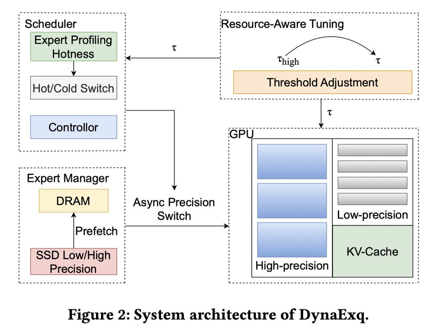

# Dynamic Expert Quantization for Scalable Mixture-of-Experts Inference

> Kexin Chu, Dawei Xiang, Zixu Shen, Yiwei Yang, Zecheng Liu, Wei Zhang

> ⚠️ **生成声明**：本 note 由 AI Agent 自动生成，基于 arXiv 论文全文提取与分析，仅供学习参考。生成日期：2025-06-05。

---

## 一句话总结

DynaExq 提出了一种运行时动态专家量化框架，将 MoE 模型的专家精度作为运行时可管理资源，通过热点感知的精度控制器、异步精度切换流水线和无碎片内存池，在单 GPU 上实现大规模 MoE 模型的高效推理，在精度上比静态低比特量化基线提升最高 4.03 个点。

---

## 摘要翻译

Mixture-of-Experts（MoE）模型能够高效扩展 LLM 的容量，但在消费级 GPU 上部署受到非活跃专家的大量内存占用的限制。静态训练后量化（PTQ）虽然能降低存储成本，但无法适应不断变化的激活模式，导致在激进压缩下出现精度损失。因此，本文提出了 DynaExq，一个将专家精度视为一等动态管理资源的运行时系统。DynaExq 结合了：（1）热点感知的精度控制器，持续将专家比特宽度与长期激活统计对齐；（2）完全异步的精度切换流水线，将精度提升/降低与 MoE 计算重叠；（3）无碎片内存池机制，支持混合精度专家的确定性分配。这些组件共同实现了在严格 HBM 预算下稳定、非阻塞的精度切换。在 Qwen3-30B 和 Qwen3-80B MoE 模型以及六个代表性基准测试上，DynaExq 在单张 RTX 5090 和 A6000 GPU 上部署大 LLM，并比静态低精度基线提升最高 4.03 个精度点。结果表明，自适应、工作负载感知的量化是内存受限 MoE 服务的有效策略。

---

## 研究动机

MoE 架构通过每次 token 仅激活少量专家子网络来高效扩展模型容量，但所有专家必须驻留在 GPU 显存中以支持动态路由，导致大量非活跃专家占据宝贵的 HBM 容量。例如，Qwen3-30B-A3B 需要约 57GB 的权重常驻显存，而每 token 仅使用约 3B（6.1GB）参数，MoE 层占模型大小的 98% 以上。

现有静态训练后量化（PTQ）方法（如 AWQ、GPTQ、MoQE、MxMoE、EaQuant、QMoE 等）虽然能将精度降至 2-4 位甚至亚 1 位，但存在以下根本性缺陷：

- **静态精度分配**：所有专家的比特宽度在离线校准时固定，无法适应推理时高度动态的激活模式
- **热点专家退化**：频繁激活的热点专家在激进量化下遭受不必要的精度损失
- **冷点专家浪费**：很少使用的冷点专家仍保留高精度表示，浪费 HBM 容量
- **调度与精度脱节**：现有 MoE 服务系统（如 DeepSpeed-MoE、Tutel、Megablocks 等）将专家放置/调度与精度选择解耦，无法利用激活稀疏性

因此，需要一个能够将精度作为运行时资源管理的机制，在保持热点专家准确性的同时尊重严格的内存预算。

---

## 方法（技术细节）

DynaExq 由四个协调组件构成：

### 1. 运行时专家精度控制器（Runtime Expert Precision Controller）

- 通过在推理过程中采样路由器输出来维护专家行为的轻量级分析
- 每次前向传播后，记录被选择的专家并累积门控概率，提供工作负载驱动的专家重要性视图
- 使用指数移动平均（EMA）计算每个专家的热点分数：

$$S_i^{(t)} = \alpha S_i^{(t-1)} + (1 - \alpha) g_i(x_t)$$

其中 $g_i(x_t)$ 是步骤 $t$ 的路由器概率

- 高精度阈值 $\tau_h$ 以上的专家被提升，其余作为低精度候选池
- 操作在 CPU 上执行，不阻塞 GPU 内核，因此对推理无延迟开销
- 以粗粒度运行并应用平滑，避免在门控行为不稳定时的抖动（thrashing）

### 2. 异步专家交换流水线（Asynchronous Expert Swapping Pipeline）

- 多阶段异步流水线，将精度提升、降低和预取与 MoE 计算重叠
- 高精度和低精度权重存储在 SSD 上，缓存在 DRAM 中，所有传输到 HBM 使用专用 CUDA 流
- **升级序列**（冷→热专家）：SSD 获取高精度权重 → DRAM 缓冲 → 流式传输到 HBM → 轻量级注册绑定新权重 → 立即回收低精度版本
- **降级序列**：反向执行相同过程
- **推理时策略**：始终使用每个专家的最后稳定版本，若升级正在进行中，前一版本保持活跃，确保流水线延迟不影响前向传递
- **主动预取**：利用跨层激活相关性，预测即将变热的专家并提前预取

### 3. 内存池管理（Memory Pool Manager）

- 将 HBM 分为两个专用池：高精度专家池和低精度专家池
- 每个池细分为固定大小的块，与对应数据格式（如 FP16 或 INT4）对齐，实现常数时间、无碎片分配
- 精度转换时，新权重成功注册后立即回收旧表示，确保没有专家持有双副本的时间超过必要
- 小型临时缓冲区吸收传输突发，允许多个进行中的提升操作不超过内存预算
- 紧凑的 CPU 端索引记录专家位置、精度层级和池占用率，避免运行时 cudaMalloc 调用，消除分配器引起的抖动

### 4. 资源感知阈值初始化（Resource-Aware Threshold Initialization）

- 推理开始前，计算每个 MoE 层的安全精度预算
- 给定可用 HBM 内存（$M_{HBM}$，已预留 KV 缓存、激活和共享权重的空间）和专家数量 $N$
- 计算满足约束的可行值 $n_{hot}$ 和 $n_{cold}$：

$$n_{hot} \cdot S_{hot} + n_{cold} \cdot S_{cold} \leq M_{HBM}$$
$$n_{hot} + n_{cold} = N$$

- 通过短暂的预热阶段收集初始热点分数，top-$n_{hot}$ 专家初始化为高精度集
- 阈值 $\tau_h$ 保持固定，专家身份可在运行时基于观察到的活动变化

---

## 实验结果

### 实验设置

- **实现**：PyTorch + HuggingFace Transformers，AutoRound 提供低比特专家量化
- **硬件**：RTX-5090（32GB HBM）和 A6000（48GB HBM）
- **模型**：Qwen3-30B-A3B（48 层，128 专家/层，8 激活）和 Qwen3-80B-A3B（512 专家/层，10 激活）
- **基准测试**：WikiText-2、MMLU-Pro、GPQA、AIME25、GSM8K、HumanEval、MMLU-ProX
- **对比基线**：FP16、INT4、INT2（均匀量化）

### 精度结果（Table 1）

**Qwen3-MoE-30B：**
| 方法 | MMLU-Pro | GPQA | AIME25 | GSM8K | HumanEval | MMLU-ProX | 平均 |
|------|----------|------|--------|-------|-----------|-----------|------|
| FP16 | 73.37 | 54.55 | 23.33 | 90.45 | 84.76 | 69.29 | 65.96 |
| INT4 | 72.84 | 53.54 | 20.00 | 89.39 | 84.15 | 68.39 | 64.72 |
| DynaExq(A6000) | 73.09 | 54.14 | 20.00 | 89.91 | 84.76 | 68.96 | **65.15** |
| DynaExq(5090) | 72.58 | 54.54 | 20.00 | 89.54 | 84.48 | 68.39 | 64.37 |

**Qwen3-MoE-80B：**
| 方法 | MMLU-Pro | GPQA | AIME25 | GSM8K | HumanEval | MMLU-ProX | 平均 |
|------|----------|------|--------|-------|-----------|-----------|------|
| INT4 | 75.92 | 72.22 | 70.00 | 87.04 | 85.37 | 75.88 | 77.74 |
| INT2 | 72.75 | 66.67 | 63.33 | 80.97 | 81.71 | 70.49 | 72.65 |
| DynaExq(A6000) | 75.48 | 71.21 | 66.67 | 86.73 | 84.76 | 75.22 | **76.68** |
| DynaExq(5090) | 72.89 | 68.18 | 63.33 | 83.47 | 82.68 | 72.73 | 73.88 |

### 关键发现

- **30B 模型**：DynaExq 接近 FP16 精度（65.15% vs 65.96%），比 INT4 基线（64.72%）更好
- **80B 模型**：DynaExq 在 A6000 上达到 76.68%，显著优于 INT2（72.65%），接近 INT4（77.74%）
- **最高提升**：比静态低精度基线提升最高 4.03 个精度点
- **困惑度**：困惑度随低精度专家比例增加平滑上升，而非突变；动态量化策略的曲线显著更平缓
- **吞吐量**：保持 INT2 吞吐量的 85% 以上，且在两个 GPU 和两种模型规模上表现稳定
- **TTFT 和 TPOP**：在 INT2 和 INT4 基线之间，延迟开销适中

---

## 优势

1. **运行时动态量化**：首次将 MoE 专家精度作为运行时可管理资源，根据实际激活模式在线调整，而非依赖离线校准
2. **热点感知精度分配**：基于 EMA 平滑的热点分数，确保热点专家保持高精度，冷点专家被激进压缩，避免不必要的精度退化
3. **异步非阻塞切换**：多阶段流水线将数据移动与推理计算完全重叠，精度切换不中断前向传递，无延迟尖峰
4. **确定性内存管理**：双池内存布局消除碎片化，避免运行时 cudaMalloc 调用，确保可预测的内存行为和稳定吞吐量
5. **资源感知初始化**：基于 HBM 预算的精确初始化，确保动态切换始终在内存安全范围内
6. **单 GPU 可部署**：在消费级 GPU（RTX 5090、A6000）上运行大规模 MoE 模型（如 80B），无需多 GPU 或复杂分布式部署
7. **无代码修改**：基于 PyTorch 和 HuggingFace Transformers 实现，兼容 AutoRound 量化框架

---

## 局限

1. **仅支持 MoE 架构**：方法专为 MoE 设计，不适用于稠密模型
2. **依赖路由器统计**：精度调度依赖路由器的激活统计，对路由器行为异常或分布偏移可能不够鲁棒
3. **单 GPU 限制**：实验仅在单 GPU 上验证，未扩展到多 GPU 或分布式场景
4. **缺少开销分析**：未详细报告 CPU 端控制器的开销（如 EMA 计算、调度决策等）
5. **预热阶段**：需要初始预热来收集热点分数，可能在冷启动时引入额外延迟
6. **固定阈值**：高精度阈值 $\tau_h$ 在运行时保持固定，可能无法适应长期分布漂移
7. **缺少多模型验证**：仅在 Qwen3-30B 和 Qwen3-80B 上验证，未测试其他 MoE 架构（如 DeepSeek-MoE、Mixtral 等）
8. **量化方法局限**：依赖 AutoRound 提供低比特量化，未探索与 GPTQ、AWQ 等方法的结合

---

## 与 EfficientPaper 相关的研究方向

1. **MoE 模型压缩**：DynaExq 专注于 MoE 专家的动态量化，与 EfficientPaper 收集的模型压缩方向高度相关，特别是训练后量化（PTQ）、混合精度量化等领域
2. **推理加速与内存优化**：系统性地解决了 MoE 模型在消费级 GPU 上的内存瓶颈，可与 MoE-Infinity、ProMoE、ExpertFlow 等专家卸载和缓存方法互补
3. **动态量化与自适应推理**：与 HAQ、AdaQuant、FlexRound 等动态量化方法同属"运行时自适应"研究范式，但专为 MoE 架构设计，填补了专家级动态精度调度的空白
4. **MoE 服务系统**：DynaExq 可作为 MoE 服务框架（如 DeepSpeed-MoE、Tutel、Megablocks）的扩展组件，将精度管理引入服务运行时
5. **稀疏激活与内存效率**：MoE 架构的稀疏激活特性为动态资源管理提供了天然的优化空间，DynaExq 的方法可推广到其他具有稀疏激活模式的架构
6. **未来方向**：作者提到未来将探索预测性精度调度、跨层相关激活模式、以及集成到分布式 MoE 服务框架中进行专家放置和精度协同优化
