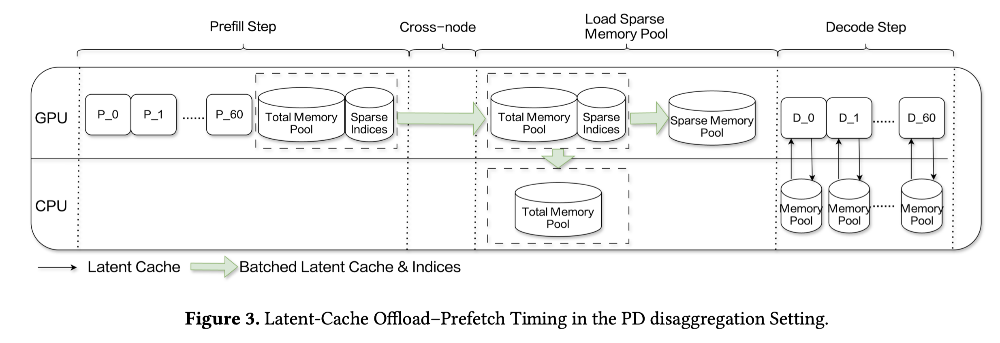

# ESS: An Offload-Centric Latent-Cache Management Architecture for DeepSeek-V3.2-Exp

> Xinhang Chen, Chao Zhang, Jiahuan He, Wei Liu, Jianming Zhang, Wenlong Zhou, Xiao Li, Pai Zeng, Shiyong Li, Yuanpan Qian, Dong Li, Zhaogeng Li

## Abstract

DeepSeek-V3.2-Exp introduces a sparse attention mechanism that significantly reduces inference latency in long-context scenarios. Although the overall throughput has improved greatly, the Decode-stage of PD disaggregation remains to be a major bottleneck. This bottleneck primarily stems from the conflict between linear growth of Latent-Cache with sequence length and the limited GPU memory capacity, which constrains the feasible batch-size and thereby suppresses Decode-stage throughput.
  To address this challenge, we propose ESS (Extended Sparse Server), an offload-centric system design tailored for DeepSeek-V3.2-Exp. ESS selectively offloads Latent-Cache to CPU memory while preserving latency-critical components on GPU. By freeing up GPU memory, ESS effectively decoupling batch-size scaling from GPU memory constraints. This design significantly improves Decode-stage throughput, thereby reducing deployment costs in real-world settings.
  Our high-fidelity simulations show that ESS delivers 69.4\% throughput improvement at 32K context length and up to 123\% throughput improvement at 128K, demonstrating its effectiveness for large-context inference workloads. These results highlight ESS as a practical and scalable solution for long-context LLM serving.
