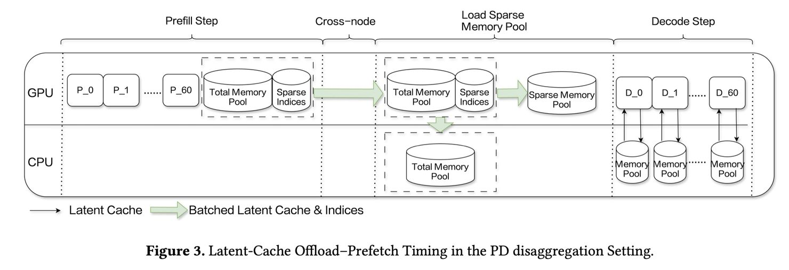

# ESS: An Offload-Centric Latent-Cache Management Architecture for DeepSeek-V3.2-Exp

> Xinhang Chen, Chao Zhang, Jiahuan He, Wei Liu, Jianming Zhang, Wenlong Zhou, Xiao Li, Pai Zeng, Shiyong Li, Yuanpan Qian, Dong Li, Zhaogeng Li

> **⚠️ 本笔记由 AI Agent 自动生成，仅供参考，可能存在理解偏差，请结合原文阅读。生成时间：2026-06-05。**

## 一句话总结

ESS 提出了一种面向 DeepSeek-V3.2-Exp 的以 Offload 为核心的 Latent-Cache 管理架构，通过将 Latent-Cache 选择性地卸载到 CPU 内存，结合 LRU 缓存替换策略、FlashTrans 碎片化数据传输加速以及计算-通信流水线重叠技术，在不损失模型精度的前提下显著提升 Decode 阶段吞吐量，在 32K 上下文长度下提升 69.4%，128K 下提升 123%。

## 摘要翻译

DeepSeek-V3.2-Exp 引入了稀疏注意力机制，在长上下文场景中显著降低了推理延迟。虽然整体吞吐量已大幅提高，但 PD 分离架构中的 Decode 阶段仍然是主要瓶颈。该瓶颈主要源于 Latent-Cache 与序列长度的线性增长之间的冲突，以及 GPU 内存容量的限制，从而约束了可行的 batch-size 并抑制了 Decode 阶段的吞吐量。

为应对这一挑战，我们提出了 ESS（Extended Sparse Server），一种专为 DeepSeek-V3.2-Exp 设计的以 Offload 为中心的系统架构。ESS 选择性地将 Latent-Cache 卸载到 CPU 内存，同时在 GPU 上保留延迟敏感的组件。通过释放 GPU 内存，ESS 有效地将 batch-size 扩展与 GPU 内存约束解耦。该设计显著提高了 Decode 阶段的吞吐量，从而降低了实际部署成本。

我们的高保真仿真表明，ESS 在 32K 上下文长度下实现了 69.4% 的吞吐量提升，在 128K 下最高可达 123% 的吞吐量提升，证明了其在大规模上下文推理工作负载中的有效性。这些结果突显了 ESS 作为长上下文 LLM 服务的实用且可扩展的解决方案。

**关键词：** LLM 推理，KV Cache，Batch Size 扩展，DeepSeek-V3.2-Exp，系统优化

## 研究动机

DeepSeek-V3.2-Exp 采用稀疏注意力机制，大幅降低了长上下文推理的延迟，但在 PD 分离架构（Prefill-Decode 分离）中，Decode 阶段成为主要瓶颈。核心问题在于：

1. **GPU 内存限制吞吐量**：在 Decode 阶段，Latent-Cache 的大小随序列长度线性增长，而 GPU 内存容量固定，导致 batch-size 无法随上下文长度扩展。实测在 32K 上下文下，batch-size 最大只能达到 52，吞吐量仅 9,647 tokens/s，远低于硬件理论上界。

2. **Latent-Cache 访问具有强时间局部性**：论文通过 Intra-Layer Similarity 指标验证了 DeepSeek-V3.2-Exp 的 Latent-Cache 访问具有强局部性，这为 CPU 卸载策略提供了可行性基础。

3. **Offload-Prefetch 的三大挑战**：
   - **小粒度数据传输效率低**：每个 Cache block 仅 656 字节，2,048 个 Cache block 散布在 Memory Pool 中，导致 PCIe 带宽利用率极低（实测 cudaMemcpyAsync 的有效带宽仅 0.79 GB/s H2D、0.23 GB/s D2H）。
   - **缓存缺失难以控制**：为增大 batch-size 需尽量减少 GPU 侧 Cache，但这增加了 Cache Miss 的概率，导致大量 Host-to-Device 数据传输。
   - **数据传输延迟无法隐藏**：Decode 阶段的计算量不足以完全隐藏数据传输延迟。

## 方法（技术细节）

ESS 的核心设计思路是将 Latent-Cache（而非 Indexer-Cache）选择性地卸载到 CPU 内存，利用 DeepSeek-V3.2-Exp 的 Latent-Cache 访问局部性，通过三个关键技术解决 Offload-Prefetch 的三大挑战。

### 3.1 FlashTrans：加速碎片化数据传输

- **问题**：DeepSeek-V3.2-Exp 每个 Cache block 仅 656 字节，2,048 个 block 散布在 Memory Pool 中，传统的 cudaMemcpyAsync 无法高效处理这种高度碎片化的小粒度访问。
- **解决方案**：利用 **Unified Virtual Addressing (UVA)** 技术，让 GPU 直接访问 CPU 端的 pinned memory，消除频繁 cudaMemcpyAsync 调度的开销。
- **FlashTrans 算子**：设计了基于地址的按需传输算子，支持非连续的 Latent-Cache 访问模式。
- **效果**：H2D 传输带宽从 0.79 GB/s 提升到 **37 GB/s**，D2H 从 0.23 GB/s 提升到 **43 GB/s**，效果显著。

### 3.2 LRU 缓存引擎与 Warmup 策略

- **LRU-Based Cache Eviction and Admission**：基于 Intra-Layer 访问模式，利用 DeepSeek-V3.2-Exp 的 Latent-Cache 强时间局部性，采用 LRU 策略动态更新 GPU 侧的 Sparse Memory Pool，确保高频复用的 entry 优先保留在 GPU 上。
- **LRU-Warmup**：在 Decode 初始阶段，Cache Miss 很多（如 Figure 4 所示）。为减少这一阶段的额外开销，ESS 从 Prefill 阶段最后 32 个 window 中提取 Top-2K Latent-Cache ID，顺序插入 LRU Cache，构建与早期 Decode 访问需求匹配的缓存状态，大幅减少了 Decode 起始阶段的 Cache Miss。
- **Sparse Memory Ratio 调优**：通过 Figure 5 展示了不同 Sparse Memory Ratio（GPU 侧 Cache 占总 Cache 的比例）下的 Cache Miss 情况，帮助选择合适的 ratio。

### 3.3 计算-通信重叠策略

论文提出两个层次的 Overlap 策略，最大化计算与数据传输的并行度：

- **DA Overlap（Dual-Attention Overlap）**：
  - 将 Attention 分解为 forward_prepare 和 forward_core 两个阶段。
  - forward_prepare 进一步分解为 PreAttn 和 Indexer。
  - 将 SparseMLA 拆分为 Attn0（使用已在 GPU 上的 Latent-Cache 计算）和 Attn1（等待 H2D Prefetch 完成后继续计算）。
  - Attn0 与 H2D 传输并发执行，有效隐藏了数据传输延迟。

- **DBA Overlap（DualBatch-Attention Overlap）**：
  - 当上下文长度超过 2K 时，Attention 计算量基本恒定，DA Overlap 的重叠收益有限。
  - DBA 在 DA 基础上，沿 batch 维度拆分 Indexer，使约一半的 Indexer 计算参与重叠。
  - 将 paged_mqa_logits 计算和 Top-K 选择纳入重叠区域（其计算强度不随 batch-size 减小而显著降低）。

- **Layer-Wise Overlap 策略**：
  - 不同层的 Cache Miss 行为差异很大（如 Figure 5 所示，Sparse Memory Ratio = 0.2 时，Cache Miss 数从 16.66 到 605 不等）。
  - ESS 采用分层 Overlap 策略：Cache Miss 少的层使用 DA Overlap，Cache Miss 多的层使用 DBA Overlap。
  - 通过离线 profiling 识别关键层，并根据上下文长度和 Cache Miss 水平确定切换阈值。

### 3.4 可扩展性

- 在同一 Sparse Memory Ratio 下，随着上下文长度增加，平均 Cache Miss Count 降低，说明 ESS 在长上下文场景下效果更好。
- 推荐 GPU buffer 不小于 6.4K。
- 在不同上下文长度（32K/64K/96K/128K）下，Cache Miss 沿 Layer ID 维度的趋势高度一致，便于离线 profiling。

### 仿真验证

论文使用内部开发的高保真仿真器，基于真实机器执行收集的元数据，缺失数据点通过线性插值填充，完整重建执行管线并集成 MTP 和 Two-Batch Overlap 等系统级优化。

## 实验结果

### 32K 上下文设置

| 设置 | Batch Size | Throughput (tokens/s) | OTPS | 吞吐量提升 |
|------|-----------|----------------------|------|-----------|
| MTP=2, Accept Ratio=1.7 | 52 → 160 | 9,647 → 16,347 | 23.19 → 12.77 | **69.4%** |
| MTP=4, Accept Ratio=2.8 | 52 → 160 | 12,168 → 17,601 | 29.25 → 13.75 | 44.7% |
| MTP=4, Accept Ratio=3.4 | 52 → 160 | 14,775 → 21,372 | 35.52 → 16.70 | **45.8%** |

### 128K 上下文设置

| 设置 | Batch Size | Throughput (tokens/s) | OTPS | 吞吐量提升 |
|------|-----------|----------------------|------|-----------|
| MTP=2, Accept Ratio=1.7 | 13 → 54 | 3,669 → 8,169 | 23.19 → 18.91 | **123%** |

注：OTPS 随 batch-size 增大而降低，但总吞吐量大幅提升，说明通过 ESS 增大 batch-size 的策略有效提升了端到端推理性能。

### 关键观察

- **长上下文效果更显著**：在 128K 下通过更低的 Sparse Memory Ratio（0.1）实现 123% 吞吐量提升，而 32K 下需要 0.21 的 ratio 才能实现 69.4%。
- **MTP 配合**：MTP=4 的配置比 MTP=2 提供更高的基准吞吐量，但 ESS 的相对提升率在两者之间保持一致。
- **Cache Miss 稳定性**：当 Sparse Memory Ratio > 0.2 时，平均 Cache Miss Count 在不同上下文长度下保持相对稳定。

## 优势

1. **无损优化**：ESS 不改变模型精度，是纯系统层面的优化，通过 Offload-Prefetch 策略提升吞吐量。
2. **显著的性能提升**：在 32K 下提升 69.4%，128K 下提升 123%，效果显著且可扩展。
3. **工程实用性**：与现有推理优化（如 MTP、Two-Batch Overlap）无缝集成，适合大规模工业部署。
4. **FlashTrans 高效**：通过 UVA 实现高效的碎片化数据传输，带宽提升约 47 倍（H2D）和 187 倍（D2H）。
5. **LRU-Warmup 有效**：显著减少了 Decode 初始阶段的 Cache Miss，提升了早期生成效率。
6. **分层 Overlap 策略**：根据各层 Cache Miss 差异动态选择 Overlap 策略，最大化整体吞吐量。
7. **高保真仿真**：通过精确建模避免了昂贵的实际实验，加速了系统设计迭代。

## 局限

1. **仅限仿真验证**：论文使用高保真仿真器进行性能评估，尚未在真实部署环境中验证。虽然仿真器基于真实元数据，但实际硬件和软件的交互可能引入额外的开销。
2. **与 DeepSeek-V3.2-Exp 强耦合**：ESS 的设计高度针对 DeepSeek-V3.2-Exp 的稀疏注意力机制（Top-2K Latent-Cache），可能难以直接迁移到其他模型。
3. **开销评估不够充分**：论文未详细讨论 UVA 的 CPU 内存占用开销、LRU 管理的额外计算开销，以及 Layer-Wise Overlap 策略的实现复杂度。
4. **无代码开源**：论文未提供开源代码，难以复现和进一步验证。
5. **缺少与其他 Offload 方法的直接对比**：虽然在 Related Work 中提到了 FlexGen、SparseServe 等方法，但缺乏直接的实验对比。
6. **未探讨与有损压缩方法的结合**：论文提到未来计划与 SnapKV 等有损压缩方法结合，但当前未探索这一方向。

## 与 EfficientPaper 相关的研究方向

1. **KV Cache 压缩与管理**：ESS 的 Latent-Cache Offload 策略属于 KV Cache 管理范畴，与 SnapKV、H2O、PyramidKV 等静态压缩方法以及 Quest、ShadowKV、FreeKV 等动态压缩方法密切相关。未来可探索 ESS 与这些方法的结合。

2. **稀疏注意力与推理效率**：DeepSeek-V3.2-Exp 的稀疏注意力机制是 ESS 的基础，论文的分析揭示了稀疏注意力在系统层面的瓶颈，对后续稀疏注意力模型的系统优化具有参考价值。

3. **PD 分离架构优化**：ESS 专注于 PD 分离架构的 Decode 阶段优化，为 Prefill-Decode 分离的 LLM 服务架构提供了新的系统设计方案。

4. **GPU-CPU 协同计算**：FlashTrans 利用 UVA 实现高效的碎片化数据传输，这一技术路线与 FlexGen、SparseServe 等 GPU-CPU 协同推理方案一脉相承。

5. **推理吞吐量与成本优化**：ESS 通过增大 batch-size 提升吞吐量，降低部署成本，与 EfficientPaper 关注的推理效率主题高度吻合，为大规模 LLM 服务的成本优化提供了实用方案。
