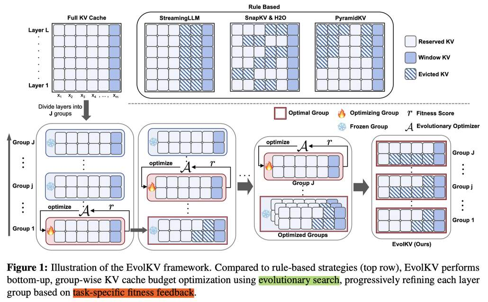

# EvolKV: Evolutionary KV Cache Compression for LLM Inference

> Bohan Yu, Yekun Chai

> **注意：本 note 由 AI Agent（Hermes Agent）自动生成，基于论文全文阅读与分析。生成时间：2025 年 6 月。**

---

## 一句话总结

EvolKV 是首个将 KV Cache 预算分配建模为黑箱优化问题的框架，利用进化算法（CMA-ES）按层动态搜索最优分配方案，以任务下游性能为优化目标，在多个长上下文和推理任务上显著优于基于规则的启发式基线方法。

---

## 摘要翻译

现有 KV Cache 压缩方法通常依赖启发式策略，例如在各层之间均匀分配缓存预算或采用静态淘汰策略，但忽略了层间特征模式与任务性能之间的关键相互作用，这会导致泛化性能下降。本文提出 EvolKV，一种自适应的逐层、任务驱动的 KV Cache 压缩框架，联合优化内存效率和任务性能。通过将缓存分配重新表述为多目标优化问题，EvolKV 利用进化搜索动态配置各层预算，同时直接最大化下游任务性能。在 11 个任务上的大量实验表明，该方法在广泛的 KV Cache 预算下均优于所有基线方法，在 GSM8K 上最多超越启发式基线 7 个百分点。值得注意的是，EvolKV 仅使用原始预算的 1.5% 即在代码补全任务上超越了完整 KV Cache 的性能，揭示了学习型压缩策略在 KV Cache 预算分配中的巨大潜力。

---

## 研究动机

1. **KV Cache 内存瓶颈**：KV Cache 的内存占用随序列长度线性增长，自注意力的二次复杂度使长序列推理极为缓慢。
2. **现有方法的局限**：当前 KV Cache 压缩方法主要分为三类：
   - **固定位置保留**（如 StreamingLLM）：所有层保留相同位置的 KV Cache。
   - **均匀预算分配 + 注意力加权淘汰**（如 SnapKV、H2O）：各层分配相同预算但位置不同。
   - **金字塔策略**（如 PyramidKV）：预算从底层到高层逐层递减。
3. **核心问题**：这些启发式方法忽略了 Transformer 各层在信息处理中的不同功能角色，也忽略了缓存预算与任务性能之间的动态关系，导致次优的信息保留。
4. **关键洞察**：不同层对不同任务的贡献不同，简单的固定规则无法捕捉各层实际的缓存需求，因此需要一种任务感知的、逐层自适应的分配策略。

---

## 方法（技术细节）

### 框架概览

EvolKV 将 KV Cache 预算分配视为黑箱优化问题，利用进化算法（CMA-ES）逐层搜索最优配置。其核心思路是：**以任务下游性能为优化目标，直接搜索每层的最优 KV Cache 预算**。

### 优化目标

给定一个有 $L$ 层的模型，第 $i$ 层的 KV Cache 预算为 $k_i \in \mathbb{N}$，目标函数为：

$$S^* = \arg\max_{S \in \mathcal{S}} f(S) \cdot (1 + \lambda \cdot \text{CACHESCORE}(S, c))$$

其中：
- $f(S)$ 是压缩方案 $S$ 在下游任务上的性能
- $\lambda > 0$ 是平衡原始性能与缓存效率的超参数（论文设置 $\lambda = 0.3$）
- $\text{CACHESCORE}(S, c)$ 是缓存效率项，范围 $[0, 1]$，当平均预算超过目标 $c$ 时给予惩罚
- 约束条件：$\frac{1}{L}\sum_{i=1}^{L} k_i \leq c$

### 层分组策略

为提高优化效率，将 $L$ 层分为 $J = \lceil L/n_g \rceil$ 组（论文设置 $n_g = 8$），每组包含连续的层。这大幅减小了搜索空间并使进化搜索更加稳定。

### 进化搜索过程（Algorithm 1）

1. **初始化**：将所有层预算设为目标平均预算 $c$
2. **逐组优化**：从底层到顶层逐组进行进化优化
   - 对每个组 $j$，使用 CMA-ES 进化优化器生成候选方案
   - 评估每个候选方案的适应度（任务性能 × 缓存效率）
   - 更新最优组配置
3. **预算补全**：优化后若总预算偏离目标，按比例重新分配各层预算

### 关键超参数

- 进化优化器：CMA-ES（协方差矩阵自适应进化策略）
- 缓存效率权重 $\lambda = 0.3$
- 平滑因子 $\gamma = 0.2$
- CMA-ES 学习率 $\sigma = 0.3$
- 组大小 $n_g = 8$
- 种群大小：$4 + \lfloor 3 \cdot \ln(n_g) \rfloor$
- 优化仅需 30 个随机采样的下游任务样本
- 使用 SnapKV 作为基础方法，结合 EvolKV 优化的预算进行推理

### 核心特点

- **无需微调**：在冻结的 LLM 上操作，不修改模型参数
- **支持任意评估指标**：如准确率、F1 分数、ROUGE 等
- **无需架构修改**：即插即用
- **发现非直觉的分配模式**：中间层获得较高预算（计算瓶颈层），非单调递减

---

## 实验结果

### 实验设置

- **模型**：Mistral-7B-Instruct（32K 上下文）、Llama-3-8B-Instruct（8K 上下文）
- **基线方法**：StreamingLLM、SnapKV、PyramidKV
- **评估基准**：LongBench（16 个子任务，6 大类）、GSM8K、NIAH、RULER（11 个子任务）
- **KV Cache 预算**：128、256、512、1024、2048

### 主要实验结果

#### LongBench（Mistral-7B-Instruct）

在所有 KV Cache 预算下，EvolKV 平均性能最高（表 1）：
- KV=128：EvolKV 36.64 vs 最佳基线 PyramidKV 36.11
- KV=256：EvolKV 39.10 vs SnapKV 38.95
- KV=512：EvolKV 41.32 vs SnapKV 40.61
- KV=1024：EvolKV 41.84 vs SnapKV 41.72
- KV=2048：EvolKV 42.33 vs SnapKV 42.20

部分子任务（TriviaQA、PassageRetrieval-en 等）甚至超过完整 KV Cache。

#### LongBench（Llama-3-8B-Instruct）

同样在所有预算下领先（表 2）：
- KV=128：EvolKV 36.78 vs 最佳 PyramidKV 36.02
- 在 TREC 子任务上，KV=128 时比最强基线高 7.69 个百分点

#### GSM8K

- Llama-3-8B-Instruct，KV=128：EvolKV 47.99 vs PyramidKV 40.71（+7.28%）
- Llama-3-8B-Instruct，KV=512：EvolKV 64.90 vs PyramidKV 57.32（+7.58%）
- **EvolKV 在 KV=512 时保留了全模型 95.7% 的性能**，而最强基线仅保留 84.5%

#### NIAH（Needle-in-a-Haystack）

- Mistral-7B-Instruct：EvolKV 超出最强基线 13% 以上
- Llama-3-8B-Instruct：超出最强基线 4% 以上

#### RULER

- Mistral-7B-Instruct：EvolKV 在 KV=128 和 KV=1024 下均获得最高平均分
- Llama-3-8B-Instruct：KV=128 下比最强基线高 3.6 分

#### 跨模型验证（Qwen 系列）

- Qwen2.5-1.5B-Instruct 和 Qwen2.5-3B-Instruct 上均优于所有基线

### 分析实验

- **优化过程中的性能提升**：随迭代次数增加，模型性能稳步上升
- **分配模式分析**：中间层获得较高预算（非单调递减金字塔），低预算时集中于少数层，高预算时更分散
- **组大小影响**：$n_g = 8$ 为最佳，太小易过拟合，太大分配困难
- **鲁棒性**：三轮优化结果方差仅 0.078，稳定性好
- **泛化性**：在 c=128 优化的预算可直接扩展到更大预算，且在跨数据集迁移时仍优于基线
- **推理效率**：推理时间和峰值内存与其他压缩方法相当，远低于完整缓存

---

## 优势

1. **首个将 KV Cache 分配建模为黑箱优化问题的框架**，突破了启发式方法的局限。
2. **任务驱动**：直接以任务性能为优化目标，分配方案自然适配不同任务。
3. **即插即用**：无需微调或修改模型架构，在冻结模型上操作。
4. **少量数据即可优化**：仅需 30 个样本即可完成分配搜索。
5. **广泛适用**：支持任意评估指标（准确率、F1、ROUGE 等）。
6. **出色的泛化能力**：在低预算下优化的分配方案可平滑扩展到高预算，并跨数据集迁移。
7. **发现非直觉的分配模式**：揭示了中间层作为计算瓶颈的重要性。
8. **极端压缩下仍表现优异**：在仅使用 1.5% 预算时即可超越完整 KV Cache 的某些任务性能。

---

## 局限

1. **仅逐层分配**：尚未探索逐注意力头级别的预算分配，未来可进一步细粒度优化。
2. **依赖下游任务性能反馈**：需要标注数据来评估适应度，可能受限于标注成本。
3. **搜索开销**：进化搜索需要多次前向推理，可能增加优化阶段的计算成本。
4. **模型规模限制**：实验仅在 7-8B 模型上验证，更大规模模型（如 70B+）的适用性需进一步验证。
5. **预训练模型固定**：在推理时使用冻结模型，无法适应动态变化的输入分布。
6. **任务特定性**：优化的分配方案可能因任务而异，需要针对不同任务重新优化。

---

## 与 EfficientPaper 相关的研究方向

1. **KV Cache 压缩与稀疏化**：EvolKV 属于 `kv_cache_sparse` 关键词范畴，与 EfficientPaper 中的 StreamingLLM、SnapKV、PyramidKV 等方法形成对比，代表了一种新的"学习型分配"范式。
2. **自适应推理优化**：将进化搜索应用于 LLM 推理加速，可与其他推理优化技术（如 FlashAttention、量化、蒸馏）结合。
3. **注意力机制可解释性**：EvolKV 揭示了各层对不同任务的不同贡献度，有助于理解 Transformer 的内部工作机制。
4. **多目标优化**：EvolKV 的框架可扩展到同时优化内存、延迟、吞吐量等多目标。
5. **无微调的黑箱优化**：EvolKV 的方法论可推广到其他需要层间资源分配的场景（如注意力头选择、混合专家路由等）。
6. **推理时动态适应**：可探索在推理过程中动态调整 KV Cache 分配，以适应不同输入的特性。
