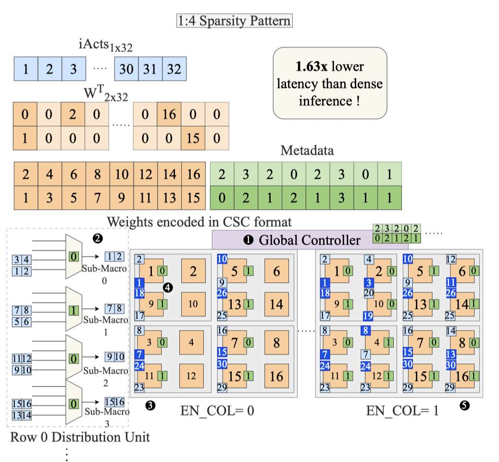

# Accelerating LLM Inference with Flexible N:M Sparsity via A Fully Digital Compute-in-Memory Accelerator

> Akshat Ramachandran, Souvik Kundu, Arnab Raha, Shamik Kundu, Deepak K. Mathaikutty, Tushar Krishna

## Abstract

Large language model (LLM) pruning with fixed N:M structured sparsity significantly limits the expressivity of the sparse model, yielding sub-optimal performance. In contrast, supporting multiple N:M patterns to provide sparse representational freedom introduces costly overhead in hardware. To address these challenges for LLMs, we first present a flexible layer-wise outlier-density-aware N:M sparsity (FLOW) selection method. FLOW enables the identification of optimal layer-wise N and M values (from a given range) by simultaneously accounting for the presence and distribution of outliers, allowing a higher degree of representational freedom. To deploy sparse models with such N:M flexibility, we then introduce a flexible, low-overhead digital compute-in-memory architecture (FlexCiM). FlexCiM supports diverse sparsity patterns by partitioning a digital CiM (DCiM) macro into smaller sub-macros, which are adaptively aggregated and disaggregated through distribution and merging mechanisms for different N and M values. Extensive experiments on both transformer-based and recurrence-based state space foundation models (SSMs) demonstrate that FLOW outperforms existing alternatives with an accuracy improvement of up to 36%, while FlexCiM achieves up to 1.75x lower inference latency and 1.5x lower energy consumption compared to existing sparse accelerators. Code is available at: https://github.com/FLOW-open-project/FLOW

---

*以下总结由 MiMo 生成：*

这篇论文旨在解决大语言模型（LLM）推理中固定N:M稀疏模式限制模型表达能力、导致性能次优的问题。为此，论文提出了FLOW方法，一种基于层外点密度感知的灵活N:M稀疏选择技术，能够为不同层自动选择最优的N:M模式以提升表示自由度。同时，设计了FlexCiM架构，通过数字存内计算宏的自适应分区与聚合机制，高效支持多样化的稀疏模式。实验表明，FLOW相比现有方法最高可提升36%的准确率，而FlexCiM在推理延迟和能耗上分别实现了1.75倍和1.5倍的降低。
# Accelerating LLM Inference with Flexible N:M Sparsity via A Fully Digital Compute-in-Memory Accelerator

> 来源: https://arxiv.org/abs/2504.14365
> 由 GPT 自动生成，请人工核验。

### 1. 研究背景与动机

固定 N:M structured sparsity 能被硬件高效支持，但对不同 LLM 层使用同一种 N:M pattern 会限制稀疏模型表达能力，尤其当不同层的 outlier 密度和分布差异很大时，统一稀疏配置会带来明显精度损失。相反，如果允许每层选择不同 N:M pattern，模型精度更好，但传统稀疏加速器往往为固定 pattern 设计，难以低开销支持灵活 N:M。因此，这篇论文同时解决两个问题：如何为每层选择更合适的 N:M 稀疏模式，以及如何设计硬件高效执行这种灵活稀疏。

### 2. FLOW / FlexCiM 核心思想

FLOW 是一种 layer-wise outlier-density-aware N:M sparsity selection 方法：根据每层 outlier 的存在与分布，在给定候选范围内选择不同的 N 和 M，从而在稀疏率与精度之间获得更好的折中。FlexCiM 则是配套的 fully digital compute-in-memory accelerator：通过将 DCiM macro 划分为更小 sub-macro，并用 distribution / merging 机制按不同 N:M pattern 自适应聚合或拆分，低开销支持多种稀疏模式。

### 3. 关键技术

| 技术 | 说明 |
|------|------|
| Layer-wise flexible N:M selection | 不对所有层使用固定 N:M，而是按层选择不同 pattern，提高 sparse model 的表示自由度。 |
| Outlier-density-aware criterion | 选择 N:M 时考虑每层 outlier 的密度与分布，避免关键权重被固定稀疏模式过度破坏。 |
| FLOW pruning method | 在给定 N、M 候选范围内搜索层级稀疏配置，目标是在硬件可支持的结构化稀疏约束下保持模型精度。 |
| FlexCiM DCiM macro partitioning | 将 digital CiM macro 切分为 sub-macro，面向不同 N:M pattern 进行灵活组合。 |
| Distribution and merging mechanism | 通过分发和合并机制支持不同稀疏 pattern 的映射与计算，减少为灵活 N:M 额外引入的硬件开销。 |
| Algorithm-hardware co-design | 算法侧 FLOW 提供可硬件执行的灵活稀疏 pattern，硬件侧 FlexCiM 针对这些 pattern 做低延迟、低能耗执行。 |

### 4. 实验结果

| 指标 | 结果 |
|------|------|
| 模型范围 | 覆盖 transformer-based foundation models 和 recurrence-based state space models。 |
| 精度提升 | 相比已有替代方法，FLOW 最高带来约 36% accuracy improvement。 |
| 推理延迟 | FlexCiM 相比已有 sparse accelerators 最高约 1.75× lower inference latency。 |
| 能耗 | FlexCiM 最高约 1.5× lower energy consumption。 |
| 代码 | 官方代码仓库：https://github.com/FLOW-open-project/FLOW |

### 5. 核心贡献

- 提出 FLOW：面向 LLM/SSM 的 layer-wise、outlier-density-aware flexible N:M sparsity selection 方法。
- 证明固定 N:M structured sparsity 会限制不同层的稀疏表达能力，灵活 N:M 能在相近硬件友好约束下提升精度。
- 提出 FlexCiM：fully digital compute-in-memory accelerator，通过 sub-macro partitioning、distribution 和 merging 低开销支持多种 N:M pattern。
- 将 structured sparsity pruning 与 digital CiM accelerator 做 algorithm-hardware co-design，连接模型稀疏策略和硬件执行效率。
- 对当前 sparse/pruning 主线有参考价值：它不是 training-free serving runtime 优化，而是更偏硬件友好的结构化稀疏与专用加速器协同设计。
