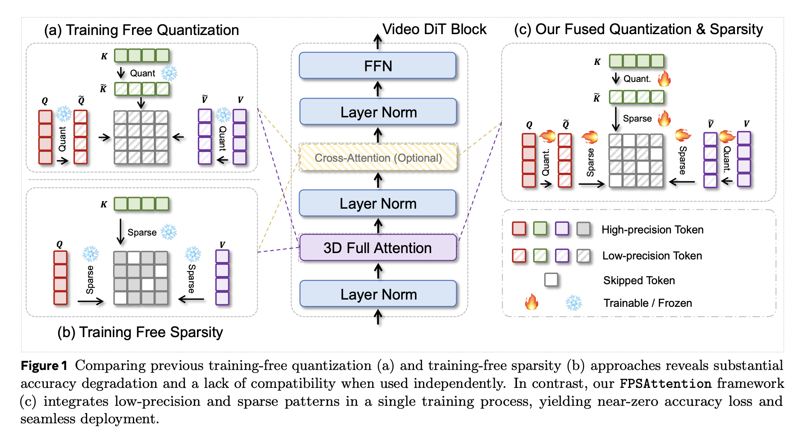

# FPSAttention: Training-Aware FP8 and Sparsity Co-Design for Fast Video Diffusion

> Akide Liu, Zeyu Zhang, Zhexin Li, Xuehai Bai, Yizeng Han, Jiasheng Tang, Yuanjie Xing, Jichao Wu, Mingyang Yang, Weihua Chen, Jiahao He, Yuanyu He, Fan Wang, Gholamreza Haffari, Bohan Zhuang

## Abstract

Diffusion generative models have become the standard for producing high-quality, coherent video content, yet their slow inference speeds and high computational demands hinder practical deployment. Although both quantization and sparsity can independently accelerate inference while maintaining generation quality, naively combining these techniques in existing training-free approaches leads to significant performance degradation due to the lack of joint optimization. We introduce FPSAttention, a novel training-aware co-design of FP8 quantization and sparsity for video generation, with a focus on the 3D bi-directional attention mechanism. Our approach features three key innovations: 1) A unified 3D tile-wise granularity that simultaneously supports both quantization and sparsity; 2) A denoising step-aware strategy that adapts to the noise schedule, addressing the strong correlation between quantization/sparsity errors and denoising steps; 3) A native, hardware-friendly kernel that leverages FlashAttention and is implemented with optimized Hopper architecture features for highly efficient execution. Trained on Wan2.1's 1.3B and 14B models and evaluated on the VBench benchmark, FPSAttention achieves a 7.09x kernel speedup for attention operations and a 4.96x end-to-end speedup for video generation compared to the BF16 baseline at 720p resolution-without sacrificing generation quality.
