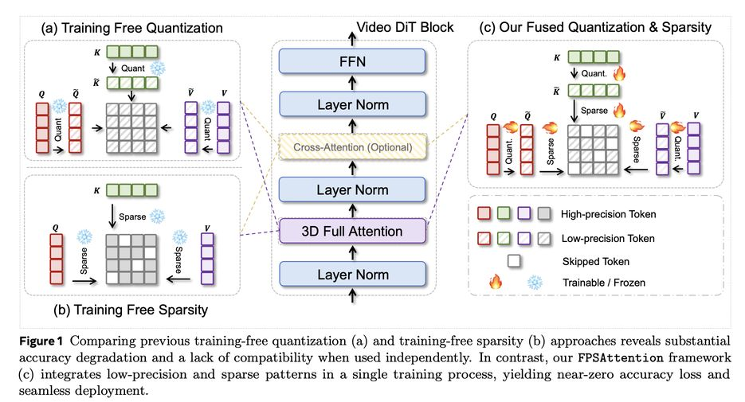

# FPSAttention: Training-Aware FP8 and Sparsity Co-Design for Fast Video Diffusion

> Akide Liu, Zeyu Zhang, Zhexin Li, Xuehai Bai, Yizeng Han, Jiasheng Tang, Yuanjie Xing, Jichao Wu, Mingyang Yang, Weihua Chen, Jiahao He, Yuanyu He, Fan Wang, Gholamreza Haffari, Bohan Zhuang

> **生成声明**：本笔记由 AI Agent（Hermes）自动生成，基于论文原文全文阅读与分析。生成时间：2026-06-05。

---

## 一句话总结

FPSAttention 是一种面向视频扩散模型的训练感知（training-aware）FP8 量化与结构化稀疏联合优化框架，通过统一的 3D tile-wise 粒度、去噪步自适应策略和硬件友好的融合内核，在不牺牲生成质量的前提下实现了 7.09× 内核加速和 4.96× 端到端加速（Wan2.1-14B, 720p, H20 GPU）。

---

## 摘要翻译

扩散生成模型已成为生成高质量、连贯视频内容的标准方法，但其缓慢的推理速度和高计算需求阻碍了实际部署。尽管量化和稀疏技术各自可以加速推理并保持生成质量，但在现有的免训练（training-free）方法中，简单地组合这些技术会导致显著的性能退化，因为它们缺乏联合优化。

我们提出了 FPSAttention，一种新颖的训练感知 FP8 量化与稀疏联合设计框架，专注于 3D 双向注意力机制。我们的方法具有三个关键创新：

1. **统一的 3D tile-wise 粒度**：同时支持量化和稀疏；
2. **去噪步感知策略**：适应噪声调度，解决量化/稀疏误差与去噪步之间的强相关性；
3. **原生硬件友好内核**：利用 FlashAttention 并采用优化的 Hopper 架构特性，实现高效执行。

在 Wan2.1 的 1.3B 和 14B 模型上训练，并在 VBench 基准上评估，FPSAttention 在 720p 分辨率下相比 BF16 基线实现了 7.09× 的注意力内核加速和 4.96× 的视频生成端到端加速，且不牺牲生成质量。

---

## 研究动机

### 视频扩散模型的计算瓶颈

视频扩散模型（Video DiTs）面临两大计算瓶颈：
- **迭代去噪过程**：需要数百步迭代采样；
- **二次复杂度的时空注意力**（O(N²)，N 为 token 数）：注意力计算占据推理时间的 >70%。例如，Wan2.1-14B 在 NVIDIA H20 GPU 上生成一段 5 秒视频需要约 2.5 小时。

### 现有方法的局限

- **量化方法**（如 SageAttention）：PTQ 方式将注意力模块量化为 INT8，提供适度加速但生成质量下降；FP8 虽有更宽动态范围，但免训练 FP8 量化引入显著误差。
- **稀疏方法**（如 SparseVideoGen、STA）：通过选择性跳过计算加速，但仅在推理时有效，缺乏与训练过程的集成。
- **朴素组合**：将量化和稀疏简单组合会导致显著性能退化，因为量化误差会在稀疏机制中被放大——稀疏优先保留高注意力分数的 token，而量化恰好在这些高值上引入更大误差。

### 训练-推理差距

现有方法忽略了量化与稀疏的训练感知联合优化，造成训练-推理间隙。作者的经验分析表明，扩散模型能够容忍并纠正硬件友好的 tile-wise 误差，特别是在模型通过量化感知训练（QAT）了解近似时，这一纠错能力尤为明显。

---

## 方法（技术细节）

### 3.1 背景技术

**FP8 量化**：将激活张量的每个值近似为 8 位浮点表示（E4M3 或 E5M2 格式），保留浮点特性而非映射到整数网格。采用 per-tile 缩放因子，理论上将内存带宽需求减半（16 位→8 位）。

**滑动块注意力（STA）**：将 3D token 空间划分为 M 个非重叠块（tile），每个查询块仅关注局部邻域内的键块，将全注意力替换为 tile-wise 掩码注意力，从而将计算复杂度从 O(N²d) 降低到 O(M × |W(u)| × d)。STA 在视频生成任务中可加速注意力 2.8–17×（相比 FlashAttention-2）。

### 3.2 联合 Tile-wise FP8 稀疏注意力

这是 FPSAttention 的核心机制，同时优化量化和稀疏：

**统一的 3D tile-wise 粒度**：

- 将 Q、K 沿序列维度 L 划分为非重叠的 3D 块 {Tu}，维度为 (Tt, Th, Tw)
- 每个块 Tu 独立计算缩放因子 sQ_u 和 sK_u，将值最优映射到 FP8 可表示范围
- 这种 per-tile 缩放策略最小化每个块的量化误差，同时保持与 GPU 内存层次的精确对齐

**不同矩阵的量化策略**：

| 矩阵 | 量化粒度 | 说明 |
|------|---------|------|
| Q, K | Per-tile FP8 | 每个 3D 块独立缩放，保留注意力动态 |
| V | Per-channel FP8 | 每通道独立缩放，保持精细通道信息 |
| P（注意力权重）| Tensor-wise FP8 | 固定标量 1/448 量化，参考 SageAttention2 |

**注意力计算流程**：
1. 将 Q、K 组织为连续 3D 块，对齐 GPU 缓存布局
2. 对每个块进行 FP8 量化（独立缩放因子）
3. 执行 tile-granularity 稀疏注意力（利用空间局部性和低比特算术）
4. 将聚合的注意力输出反量化为高精度（BF16/FP16）

这种设计产生了 M × |W(u)| 个密集、结构化的注意力块，避免了非结构化稀疏的低效性。

### 3.3 去噪步感知量化与稀疏策略

**关键发现**：视频 DiTs 在不同去噪步表现出对数值精度和稀疏水平的差异敏感性：
- **早期/晚期去噪步**：对更粗糙的量化和更高稀疏度有更大容忍度
- **中间去噪步**：需要更精细的数值精度和更低稀疏度

这意味着扩散模型能够内禀地纠正注意力的近似误差。

**分段调度**：对于 D 个去噪步，使用阈值 t1 = α1·D 和 t2 = α2·D 将过程分为三个阶段：

| 阶段 | 量化粒度 g(t) | 稀疏窗口 W(t) |
|------|-------------|--------------|
| 早期去噪步 (t ≤ t1) | gcoarse（粗糙） | Wsparse（稀疏） |
| 中间去噪步 (t1 < t ≤ t2) | gfine（精细） | Wdense（密集） |
| 晚期去噪步 (t > t2) | gintermediate（中间） | Wmedium_density（中等密度） |

其中 gcoarse > gintermediate > gfine，Wdense > Wmedium_density > Wsparse。

这些超参数在推理时选择以匹配模型在不同去噪阶段的可变容忍度，然后转移到训练中以避免高昂的计算开销。训练中，这种配置允许模型自适应补偿联合量化-稀疏误差。

### 3.4 硬件优化内核设计

内核实现的关键方面：
- **内存访问合并**：通过结构化操作实现高效 GPU 内存加载/存储，支持分块
- **最大化并行度**：tile-wise 操作并发处理独立块
- **专用加速单元**：利用 NVIDIA Hopper/Ada 架构的 Tensor Core 进行混合精度和 FP8 计算
- **操作融合**：将多个逻辑步骤（注意力、稀疏、反量化）合并为单个 Triton 内核，显著减少开销和内存流量

实现基于 FlexAttention 的 score mod 和 mask mod 函数，并使用 Triton 编译融合内核。

---

## 实验结果

### 实验设置

- **模型**：Wan2.1（1.3B 和 14B 变体）
- **训练**：14B 模型在 64 节点（8× H20 GPU/节点）上训练 7 天
- **数据**：480p×16fps×5s 高质量视频
- **评估**：VBench 基准，16 维度评估
- **指标**：PSNR、SSIM、LPIPS

### 主要结果（Table 2）

**Wan2.1-14B, 720p**：

| 方法 | PSNR↑ | SSIM↑ | LPIPS↓ | 速度提升 | 端到端加速 |
|------|-------|-------|--------|---------|-----------|
| BF16 基线 | - | - | - | 1.00× | 1.00× |
| SageAttention | 24.34 | 0.823 | 0.156 | 2.01× | 1.94× |
| SpargeAtten | 21.38 | 0.815 | 0.217 | 1.77× | 2.12× |
| SparseVideoGen | 23.53 | 0.801 | 0.170 | 2.12× | 3.13× |
| STA | 22.66 | 0.820 | 0.193 | 2.37× | 3.60× |
| **FPSAttention** | **25.74** | **0.832** | **0.076** | **3.07×** | **4.96×** |

**关键发现**：
- FPSAttention 在所有质量指标上均优于所有基线方法
- 平均 PSNR 25.74，显著超越所有基线
- 在 VBench 评估中保持高 Video Quality（0.7103）和强时空一致性（0.9435）
- 联合训练后，VBench 分数略有提升（潜在的局部性归纳偏置效应）

**Wan2.1-1.3B, 480p**：
- 实现 2.45× 端到端加速，同时保持优异质量指标

### 消融实验

**块大小效应**（Table 3）：
- 最大块配置 (24,32,32) 性能最优（PSNR 20.99712）
- (6,8,8) 配置吞吐量最佳，因为它对齐 FlashAttention 块大小设计并针对 Hopper 架构优化
- 不平衡块大小（如 (3,4,4））导致显著性能退化

**稀疏窗口效应**（Table 4）：
- 配置 (6,6,1)（时间窗口 6、高度窗口 6、宽度窗口 1）提供最优平衡
- 实现 5.16× 内核加速，同时保持高质量视觉

**训练稳定性**（Figure 7）：
- 联合 FP8 量化和结构化稀疏初始训练损失比全精度基线高 15%
- 通过自适应学习率调度和梯度累积缓解
- 2000 步后，损失收敛轨迹几乎相同（<2% 差异）

**朴素组合的挑战**（Table 5）：
- 免训练朴素组合仅达到 0.6325 总分（基线 0.8019），性能下降 21.1%
- 多个指标出现近零性能（Human Action 0.02、Multiple Objects 0.0、Spatial Relationship 0.0008）
- FPSAttention 联合优化不仅避免退化，反而提升至 0.8160（+1.8%）

---

## 优势

1. **显著加速**：实现 7.09× 内核加速和 4.96× 端到端加速，远超单独量化或稀疏方法
2. **质量保持甚至提升**：在不牺牲生成质量的前提下加速，VBench 总分甚至略有提升（+1.8%）
3. **统一框架**：首次实现 FP8 量化与结构化稀疏的训练感知联合优化
4. **硬件友好设计**：3D tile-wise 粒度与 GPU 计算模式对齐，利用 Tensor Core 和 FlashAttention
5. **自适应调度**：去噪步感知策略根据模型在不同阶段的敏感度动态调整压缩参数
6. **可扩展性**：在 1.3B 和 14B 两个规模的模型上均有效

---

## 局限

1. **硬件依赖**：最佳效果需要支持 FP8 的现代 GPU（如 NVIDIA Hopper 架构），旧硬件上 FP8 加速效果有限
2. **训练资源需求**：需要量化感知训练（QAT），比 PTQ 增加训练时间；14B 模型需要 64 节点 × 7 天
3. **超参数管理**：去噪步感知调度包含多个超参数（过渡点 α1/α2、量化粒度、窗口大小），需针对不同模型架构和数据集优化
4. **架构局限**：目前仅在 Wan2.1 架构上验证，虽然作者计划扩展到 HunyuanVideo（基于 MMDiT）和 CogVideoX
5. **与蒸馏方法的正交性**：FPSAttention 与步蒸馏技术正交，可通过结合步蒸馏实现额外加速，但未在本文中验证

---

## 与 EfficientPaper 相关的研究方向

1. **训练感知量化与稀疏联合优化**：FPSAttention 展示了训练感知联合优化的重要性，避免了免训练方法的性能退化，是量化-稀疏协同设计的典范
2. **3D Tile-wise 粒度设计**：统一的 3D tile-wise 量化和稀疏粒度与 GPU 计算模式对齐，为其他视频/时空模型的高效推理提供了参考
3. **去噪步自适应压缩策略**：根据扩散过程不同阶段的误差敏感度动态调整压缩参数，这一思路可推广到其他生成模型
4. **硬件感知内核设计**：利用 FlashAttention、Triton 和 Hopper 架构特性实现高效内核，将理论加速转化为实际壁钟加速
5. **FP8 量化在生成模型中的应用**：FP8 比 INT8 具有更宽动态范围，更适合视频扩散模型的激活统计特性
6. **稀疏注意力的结构化设计**：通过将稀疏模式与硬件计算块对齐，避免非结构化稀疏的低效性
7. **扩散模型对压缩的鲁棒性**：研究发现扩散模型可以内禀地纠正近似误差，这一发现对理解生成模型的鲁棒性有重要意义
8. **与现有方法的关系**：
   - **SageAttention**（2024）：FPSAttention 的 PTQ 量化基线，FPSAttention 通过 QAT 实现更好质量
   - **SparseVideoGen**（2025）：稀疏方法基线，FPSAttention 通过联合优化实现更高速度和更好质量
   - **STA**（2025）：滑动块注意力基线，FPSAttention 在其基础上增加量化

---

## 项目链接

- **论文**：http://arxiv.org/abs/2506.04648v2
- **项目主页**：https://fps.ziplab.co
- **代码**：PyTorch（暂无公开仓库）
- **发表**：NeurIPS 2025
- **机构**：Monash University, DAMO Academy (Alibaba), Zhejiang University
