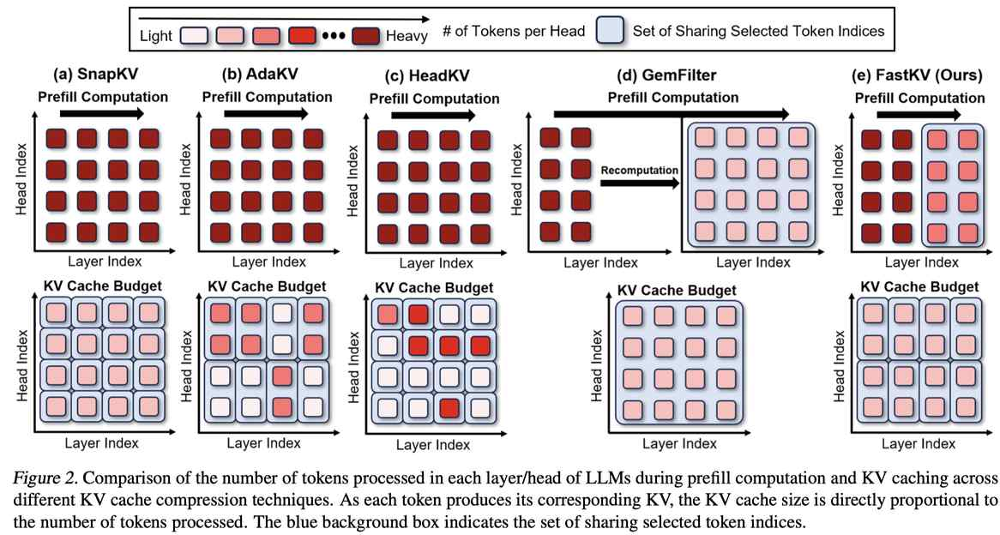

# FastKV: KV Cache Compression for Fast Long-Context Processing with Token-Selective Propagation



> ⚠️ 本 note 由 AI Agent 自动生成，基于论文原文提取与分析，仅供参考。生成时间：2025年。

## 一句话总结

FastKV 通过在 LLM 前半层保留完整上下文、后半层选择性传播关键 token 的双阶段策略（TSP），结合 GQA 感知的 KV 缓存压缩，在长上下文推理中实现 **2.00× TTFT 加速** 和 **1.40× 吞吐提升**（对比 HeadKV），同时保持与基线相当的精度。

## 摘要（中文翻译）

大型语言模型（LLM）在处理长上下文序列方面表现优异，但需要大量的 KV 缓存来存储上下文信息，这严重增加了计算效率和内存使用负担。以往压缩 KV 缓存的方法主要关注减少内存需求，但在降低延迟方面存在局限。为解决此问题，本文提出 FastKV，一种旨在提升长上下文序列延迟性能的 KV 缓存压缩方法。为在保持精度的同时提升处理速度，FastKV 采用了全新的 **Token 选择性传播（TSP）** 方法：在 LLM 的初始层保留完整的上下文信息，而在深层仅选择性地传播部分信息（即使在 prefill 阶段）。此外，FastKV 集成了 **GQA 感知的 KV 缓存压缩**，以利用分组查询注意力（GQA）在内存和计算效率方面的优势。实验结果显示，与当前最先进的 KV 缓存压缩方法 HeadKV 相比，FastKV 在首 token 时间（TTFT）和吞吐量方面分别实现了 **2.00×** 和 **1.40×** 的提升，同时在长上下文基准测试中成功保持了与基线相当的精度。

## 研究动机

### 背景问题
1. **长上下文推理的瓶颈**：LLM 支持处理 128k 甚至更长的上下文序列，但 KV 缓存的大小随序列长度线性增长，成为推理服务的关键瓶颈。以 LLaMA-3.1-8B 为例，处理 128k token 需要 17.12GB KV 缓存，超过模型本身大小（16.06GB）。
2. **现有方法的不足**：
   - **SnapKV / AdaKV / HeadKV**：通过注意力头级别的 token 裁剪保留精度，但需在整个 prefill 阶段处理完整上下文，**无法加速 prefill**（TTFT 甚至比 Full KV 更慢）。
   - **GemFilter**：通过在中间层过滤 token 并重算 prefill 来加速，但丢弃的 token 信息完全丢失，**精度下降严重**（KV budget=512 时精度下降高达 13%）。
3. **核心矛盾**：现有方法无法同时实现 **精度保持** 和 **prefill 阶段加速**。

### 研究洞察
作者通过分析 LLM 注意力模式发现：
- **浅层**：注意力分布广泛，涉及大量 token，模式多样
- **深层**：注意力集中在少量关键 token 上，且这些关键 token 在层间具有一致性
- 仅 **2k 个重要 token（占总数 1.56%）** 在深层可接收超过 50%（甚至 80%）的注意力分数

## 方法（技术细节）

### 1. Token-Selective Propagation (TSP)

**核心思想**：在 LLM 中间层（TSP 层）作为分界点，前半层保留完整上下文传播，后半层仅传播选定的关键 token。

**三个关键设计参数**：
- **TSP 层位置**：设在 LLM 的中间层（LLaMA-3.1-8B: 第15层，Mistral-Nemo-12B: 第19层）
- **TSP 长度**（TSPlength）：选定传播的 token 数量，设为 2048
- **KV 预算**（KV budget）：最终存储的 KV 缓存大小，独立于 TSP 长度

**算法流程**（Algorithm 1）：
```
输入: 输入序列 {I}, 层数 {L}, TSP层, TSP长度, KV预算
1. X ← Embedding(I)
2. 对于 l = 0 到 L-1:
   如果 l ≤ TSP层:
     X, Att, KX, VX ← layer_l(X)    # 完整上下文前向传播
     K, V ← KV_Compress(KX, VX, Att, KV_budget)  # GQA感知压缩
     如果 l == TSP层:
       x ← HiddenCompress(X, Att, TSP_length)  # 选择关键 token
   否则:
     x, Att, Kx, Vx = layer_l(x)    # 仅传播选定 token
     K, V ← KV_Compress(Kx, Vx, Att, KV_budget)
   C ← update(K, V)
3. O ← LMHead(x)
返回 O, C
```

**关键设计特点**：
- TSP 层之前：完整上下文传播（但 KV 缓存压缩），确保关键信息不丢失
- TSP 层之后：仅传播 TSP_length 个关键 token，显著减少计算量
- TSP 长度与 KV 预算独立：例如 TSP_length=2048，KV budget=512 时，传播 2048 个 token，但只存储 512 个到 KV 缓存
- 直接向后传播（不同于 GemFilter 的回退重算），更好适应 token 重要性的层间变化

### 2. 重要 token 识别

**关键发现**（Section 3.3-3.4）：
- **注意力集中性**：仅 2k 个 token（1.56%）在深层接收超过 50% 的注意力分数
- **层间一致性**：中间层及之后，重要 token 的最小匹配率超过 25%（即至少 512 个 token 在层间保持一致）
- **t-SNE 分析**：从深层丢弃 token 对输出 logit 影响极小，而从浅层丢弃则导致显著偏差

**Token 重要性评估公式**：
- 基于 SnapKV 的公式（Equation 1），但增加了 TSP 层的跨注意力头聚合（Equation 2）：
  - 对所有注意力头的得分求平均：$S_i^{TSP} = \frac{1}{H} \sum_{h=0}^{H-1} S_i^{TSP,h}$

### 3. GQA 感知 KV 缓存压缩

- 在早期层，采用 GQA 兼容的 KV 缓存压缩（源自 AdaKV）
- 在每个注意力组内聚合注意力分数，选择 top-K 重要 token 的 KV 缓存
- 公式（Equation 3）：$S_i^{l,g} = \frac{1}{H_G} \sum_{h=h_g}^{h_g+H_G} S_i^{j,h}$

## 实验结果

### 实验设置
- **模型**：LLaMA-3.1-8B-Instruct（32层）、Mistral-Nemo-12B-Instruct（40层）
- **基准测试**：LongBench（14个子任务）、Needle-in-a-Haystack
- **基线方法**：SnapKV、AdaKV、HeadKV、GemFilter
- **硬件**：NVIDIA A100 GPU
- **超参数**：TSP 层=15/19，TSP 长度=2048，观察窗口=8，池化核=7

### 精度评估（LongBench）

| KV Budget | 方法 | LLaMA-3.1-8B 平均精度 | Mistral-Nemo-12B 平均精度 |
|-----------|------|----------------------|-------------------------|
| Full | Full KV | 48.63% | 48.33% |
| 512 | SnapKV | 46.60% | 46.07% |
| 512 | AdaKV | 46.20% | 46.52% |
| 512 | HeadKV | 47.76% | 46.93% |
| 512 | GemFilter | 35.64% | 42.32% |
| **512** | **FastKV** | **46.90%** | **46.63%** |
| 2048 | SnapKV | 48.00% | 47.85% |
| 2048 | AdaKV | 48.37% | 47.88% |
| 2048 | HeadKV | 48.23% | 47.92% |
| 2048 | GemFilter | 43.90% | 46.59% |
| **2048** | **FastKV** | **48.10%** | **48.11%** |

**关键发现**：
- FastKV 在 KV budget=512 时保持与 SnapKV/AdaKV/HeadKV 相当的精度，远超 GemFilter
- FastKV 在 KV budget=2048 时精度甚至略优于部分基线
- 准确性下降不到 1%，与 HeadKV 相当

### 延迟与吞吐量评估

**TTFT（128k 输入，KV budget=512）**：
| 方法 | TTFT (秒) |
|------|----------|
| Full KV | ~28.3 |
| SnapKV | ~28.3 |
| AdaKV | ~28.4 |
| HeadKV | ~28.3 |
| GemFilter | 12.51 |
| **FastKV** | **14.14** |

- FastKV 相比 Full KV 加速 **~2.00×**
- FastKV 相比 HeadKV 加速 **~2.00×**
- GemFilter 略快，但精度远低于 FastKV

**吞吐量（128k 输入，KV budget=512）**：
| 方法 | 吞吐量 (tokens/sec) |
|------|-------------------|
| Full KV | ~12.7 |
| SnapKV | 48.71 |
| AdaKV | 50.57 |
| HeadKV | 45.64 |
| GemFilter | 63.40 |
| **FastKV** | **63.84** |

- FastKV 吞吐量是 Full KV 的 **5.07×**，HeadKV 的 **1.40×**
- 与 GemFilter 相当，但精度显著更高

### Needle-in-a-Haystack 结果
- FastKV 在 512 KV budget 下实现最佳性能
- 相比 HeadKV 有轻微改进
- GemFilter 表现最差

## 优势

1. **首个同时提升 TTFT 和吞吐的 KV 缓存压缩方法**：在 prefill 阶段显著加速（2.00× TTFT），同时保持精度
2. **双阶段策略设计精巧**：早期层保留完整上下文，深层选择性传播，有效平衡精度和效率
3. **TSP 长度与 KV 预算解耦**：允许传播更多 token 以捕获上下文信息，同时 KV 缓存大小受限
4. **GQA 感知压缩**：利用 GQA 架构的优势，进一步提升内存和计算效率
5. **实际可部署**：在 512 和 2048 KV budget 下均保持高精度，适用于实际应用
6. **实现简洁**：基于 HuggingFace Transformers 的自注意力实现 + FlashAttention-2，易于集成

## 局限

1. **TSP 层位置固定**：采用中间层作为 TSP 层，可能不是所有模型和任务的最优选择
2. **TSP 长度需要调参**：不同模型和任务可能需要不同的 TSP 长度（如 512 可能信息损失过大）
3. **仅在 prefill 阶段加速**：虽然论文主要关注 TTFT，但生成阶段的加速效果未详细评估
4. **依赖注意力模式的层间一致性**：如果模型的注意力模式在层间变化剧烈（如某些特定架构），TSP 效果可能受限
5. **未与其他非 KV 缓存压缩方法对比**：如量化、蒸馏等方法，可能有互补效果
6. **模型规模限制**：实验仅在 8B 和 12B 模型上验证，更大模型（如 70B）的效果未确认
7. **GQA 感知压缩的适用性**：主要针对 GQA 架构设计，对非 GQA 架构的适用性需进一步研究

## 与 EfficientPaper 相关的研究方向

1. **KV 缓存压缩**：FastKV 是 KV 缓存压缩领域的重要进展，可与 AdaKV、HeadKV、SnapKV 等方法进行对比研究
2. **注意力机制优化**：TSP 方法基于注意力模式的层间一致性，可启发新的注意力机制设计
3. **长上下文推理**：在 128k 甚至更长上下文场景下的高效推理，是当前 LLM 应用的关键需求
4. **推理加速**：TTFT 和吞吐量的提升对于实时应用（如对话系统、代码生成）至关重要
5. **硬件-算法协同**：GQA 感知压缩与硬件架构（如 GPU 内存层次）的协同优化
6. **模型部署**：在资源受限场景（如边缘设备）下的 LLM 推理优化
7. **动态 KV 预算分配**：FastKV 的 TSP 长度和 KV 预算解耦设计，可启发自适应 KV 预算分配策略

## 论文信息

- **标题**: FastKV: KV Cache Compression for Fast Long-Context Processing with Token-Selective Propagation
- **作者**: Dongwon Jo*, Jiwon Song*, Yulhwa Kim, Jae-Joon Kim
- **机构**: Seoul National University
- **年份**: 2025
- **来源**: arXiv
- **链接**: http://arxiv.org/abs/2502.01068v1
- **代码**: https://github.com/dongwonjo/FastKV
- **关键词**: kv_cache_sparse

## 关键图表

- **Figure 2**（主图）：不同 KV 缓存压缩方法的对比（FastKV 双阶段策略示意）
- **Figure 3**：Top 2k 重要 token 的注意力分数占比（深层超过 50%，甚至 80%）
- **Figure 4**：重要 token 在层间的最小匹配率（中间层超过 25%）
- **Figure 5**：t-SNE 可视化，深层丢弃 token 对输出 logit 影响极小
- **Figure 7**：不同 TSP 长度和 KV budget 下的精度与 TTFT
- **Table 1**：LongBench 完整对比结果
