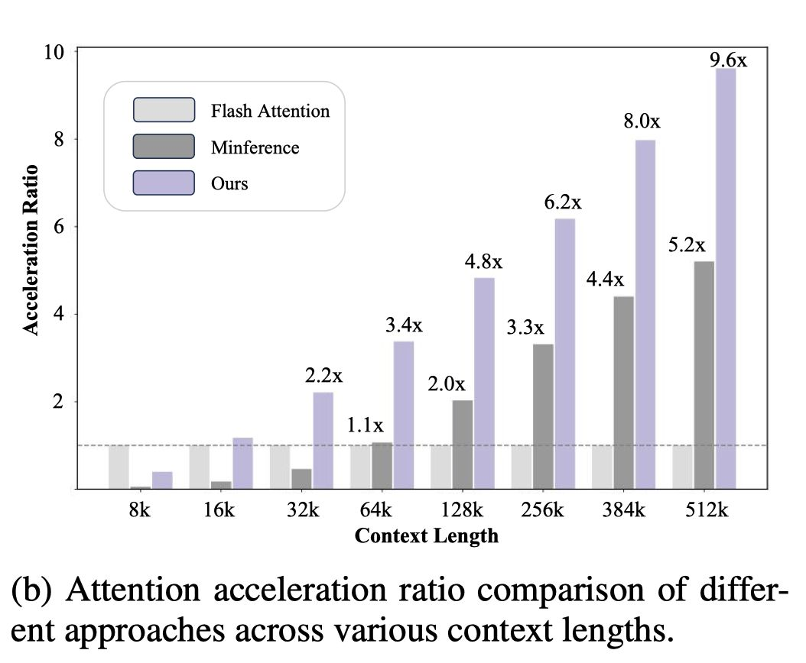

# FlexPrefill: A Context-Aware Sparse Attention Mechanism for Efficient Long-Sequence Inference



> **注意：本 note 由 AI Agent 自动生成，仅供参考。生成时间：2025年。**

## 一句话总结

FlexPrefill 提出了一种自适应的稀疏注意力机制，通过动态调整稀疏模式和计算预算（Query-Aware 模式判断 + 累积注意力索引选择），在长序列推理中实现比 MInference 和 StreamingLLM 更优的速度-精度平衡。

## 摘要翻译

大语言模型（LLM）在长序列推理时面临计算挑战，特别是在注意力预填充（pre-filling）阶段，计算复杂度随提示长度呈二次方增长。此前方法依赖固定稀疏注意力模式或基于有限案例识别稀疏模式，但缺乏灵活适应不同输入需求的能力。本文提出 FlexPrefill，一种灵活的稀疏预填充机制，能够实时动态调整稀疏注意力模式和计算预算，以满足每个输入和注意力头的特定需求。该方法的灵活性体现在两个关键创新：1）**查询感知的稀疏模式确定**：通过测量 Jensen-Shannon 散度，自适应地在查询特定的多样化注意力模式和预定义注意力模式之间切换；2）**基于累积注意力的索引选择**：基于不同注意力模式动态选择计算的查询-键索引，确保注意力分数总和满足预定义阈值。实验结果表明，在速度和精度上均有显著提升，为 LLM 推理提供了更灵活高效的解决方案。

## 研究动机

1. **长序列推理瓶颈**：随着 LLM 支持的上下文长度增加（从 128k 到 512k+），注意力预填充阶段成为推理瓶颈。全注意力机制的计算复杂度为 O(n²d)，随序列长度 n 二次方增长。
2. **现有方法的局限**：
   - **固定稀疏模式**（如 BigBird、Sliding Window）：灵活性差，往往需要额外训练或微调。
   - **StreamingLLM**：结合初始 token 与滑动窗口，但长序列性能严重退化（128k 上下文下 LLaMA 平均分仅 61.62 vs 全注意力 88.70）。
   - **MInference**：使用离线搜索的固定稀疏模式和比率，无法适应不同输入的动态变化。
3. **核心观察**：
   - 注意力模式在不同注意力头间变化显著：有的头呈 **多样化模式（Diverse pattern）**，有的呈 **结构化模式（Vertical-Slash pattern）**。
   - 不同样本需要不同的稀疏比率：具有长距离依赖的样本需要较低的稀疏比率，而局部依赖的样本可以使用较高比率。
   - 固定稀疏比率对所有输入统一应用，无法根据输入复杂度动态调整。

## 方法（技术细节）

FlexPrefill 包含两个核心组件，整体流程为：**模式判断 → 索引选择 → 稀疏注意力计算**。

### 1. 查询感知的稀疏模式确定（Query-Aware Sparse Pattern Determination）

将注意力头分为两类：
- **Query-Aware 头**：需要根据查询位置动态估计稀疏模式
- **Vertical-Slash 头**：处理 LLM 中常见的结构化稀疏注意力模式

**决策流程**：
1. 选择最后 `block_size` 个查询向量作为代表性子集 $\hat{Q}$
2. 计算两种块级注意力分布：
   - $\bar{a}$ = softmax(avgpool($\hat{Q}$)·avgpool(K)ᵀ/√d)（估计分布）
   - $\hat{a}$ = sumpool(softmax($\hat{Q}$·Kᵀ/√d))（真实分布）
3. 使用 **Jensen-Shannon 散度（JSD）** 量化两个分布的差异：
   - D_JS($\bar{a}$, $\hat{a}$) = √JSD($\bar{a}$ || $\hat{a}$)
4. **自适应决策**：
   - 若 D_JS < τ（阈值，设为 0.1）：使用 Query-Aware 模式
   - 否则：回退到 Vertical-Slash 模式

### 2. 基于累积注意力的索引选择（Cumulative-Attention Based Index Selection）

**目标**：为每个查询位置 i 选择最小的子集 $S_i$，使得所选位置的归一化注意力分数总和满足预定义阈值 γ（如 0.9 或 0.95）。

**对于 Query-Aware 头**：
- 用池化后的查询和键计算块级注意力分数
- 按降序排列，依次选择块直到累积分数超过阈值 γ
- 形成稀疏索引集 S

**对于 Vertical-Slash 头**：
- 选择代表性查询子集 $\hat{Q}$，计算注意力分数
- 计算垂直线和斜线方向的平均分数
- 按降序排列，选择垂直线和斜线直到累积分数超过阈值
- 扩展到整个注意力矩阵

### 算法伪代码概要

```
Algorithm 1 (主流程):
输入: Q, K, V, τ, γ
1. pattern ← Sparse Pattern Search(Q, K, τ)
2. 若 pattern == query_specific:
     S ← Query Aware Index(Q, K, γ)
   否则:
     S ← Vertical Slash Index(Q, K, γ)
3. y ← A(Q, K, V, S)
4. 返回 y
```

### 关键超参数
- **block_size = 128**：Triton 块大小
- **τ = 0.1**：JSD 阈值（决定 Query-Aware 还是 Vertical-Slash）
- **γ = 0.9~0.95**：累积注意力阈值（控制计算预算）
- **最小计算预算 = 1024 tokens**：防止注意力头因过高稀疏率而失效

### 计算复杂度分析
- 代表注意力分数计算：O(bnd)
- 模式搜索：O(bn)
- 稀疏索引构建：O(n log n)
- 稀疏注意力计算：O(αn²d)，其中 α 为稀疏因子
- 总开销远小于 O(n²d) 的全注意力

## 实验结果

### 评估模型
- Meta-Llama-3.1-8B-Instruct-128k
- GLM-4-9B-Chat-1024k
- Yi-9B-200K
- Qwen2-7B-Instruct-128k

### 评估基准
- **RULER**：可定制序列长度和任务复杂度的合成基准
- **InfiniteBench**：平均 214k token 的长上下文理解基准

### RULER 结果（主要发现）

| 模型 | 方法 | 4k | 8k | 16k | 32k | 64k | 128k | 平均 |
|------|------|----|----|-----|-----|-----|------|------|
| LLaMA | Full-attn | 95.67 | 93.75 | 93.03 | 87.26 | 84.37 | 78.13 | 88.70 |
| LLaMA | MInference | 95.67 | 93.99 | 93.27 | 86.54 | 84.86 | 58.17 | 85.42 |
| LLaMA | **FlexPrefill** | 95.43 | 93.51 | **94.71** | **89.42** | 82.93 | **79.09** | **89.18** |
| GLM | Full-attn | 93.75 | 93.03 | 89.66 | 90.63 | 85.34 | 81.97 | 89.06 |
| GLM | **FlexPrefill** | 93.51 | 91.83 | 89.90 | **91.35** | **86.06** | **83.41** | **89.34** |
| Qwen | Full-attn | 89.90 | 88.70 | 80.77 | 79.33 | 56.49 | 17.79 | 68.83 |
| Qwen | **FlexPrefill** | **90.39** | **89.91** | **83.17** | **81.25** | **59.14** | **20.67** | **70.75** |

**关键发现**：
- FlexPrefill 在所有 4 个模型上均达到或超越全注意力性能（LLaMA 89.18 vs 88.70，GLM 89.34 vs 89.06，Qwen 70.75 vs 68.83）
- StreamingLLM 在 128k 上下文下性能严重退化
- MInference 在某些模型和长度上表现不佳（如 LLaMA 128k: 58.17 vs FlexPrefill 79.09）

### 加速比
- 在 128k 上下文下，FlexPrefill 可实现 **2.43x~3.49x** 加速（相对全注意力）
- 在 64k 上下文下，加速比为 **4.8x~6.2x**
- 在 512k 上下文下，加速比可达 **8.0x~9.6x**

### InfiniteBench 结果
- 在检索任务（Retr.PassKey、Retr.Number）中，FlexPrefill 接近全注意力（98.64~100.00 vs 99.15~100.00）
- 在数学和代码任务中保持有效性能

### 延迟分析
- 在 128k 上下文下（LLaMA）：Full-attn 658.83ms vs FlexPrefill (γ=0.95) 271.07ms vs MInference 215.53ms
- FlexPrefill (γ=0.9) 的 128k 延迟仅 185.75ms，远低于 MInference
- 在所有上下文长度下，FlexPrefill 均实现更低延迟和更高性能的平衡

### 消融实验

1. **固定预算 vs 动态预算**：动态预算显著优于固定预算
2. **Query-Aware 头阈值 τ**：适当的 τ（0.1）能提升性能，τ 过大则可能导致不准确的注意力估计被误判为 Query-Aware
3. **最小计算预算限制**：设置最小预算（1024 tokens）可防止注意力头因过高稀疏率而失效
4. **块大小**：block_size（64 vs 128）对性能影响不显著
5. **代表性查询子集位置**：使用最后 block_size 查询向量效果最佳（用于 Vertical-Slash 索引选择）

## 优势

1. **真正的自适应性**：不同于固定稀疏模式方法，FlexPrefill 根据输入动态调整每个注意力头的稀疏模式和比率
2. **速度-精度平衡灵活可调**：通过 γ 参数可在推理速度和模型质量之间灵活切换
3. **无需训练**：与 FlashAttention 兼容，基于 PyTorch + Triton 实现，无需额外训练
4. **跨模型泛化**：在 LLaMA、GLM、Yi、Qwen 等多种模型上表现一致
5. **显著加速**：在 128k 上下文下实现 2.43x~3.49x 加速，同时保持甚至提升性能
6. **理论基础扎实**：通过拉格朗日对偶性推导，建立了稀疏注意力优化的理论基础

## 局限

1. **仅限预填充阶段**：FlexPrefill 仅优化 pre-filling 阶段，未涉及解码（decoding）阶段
2. **额外开销**：引入了模式搜索（JSD 计算）和索引构建的额外开销，在短序列（< 8k）上开销占比显著
3. **参数选择依赖经验**：γ 和 τ 的最优值因模型而异，需要经验调优
4. **依赖固定块大小**：block_size 参数需要针对不同硬件优化
5. **对极端长序列的验证有限**：主要在 128k 以下评估，更长序列的泛化性待验证
6. **模型架构依赖**：主要针对 Transformer 架构，未涉及 State Space Model 等替代架构
7. **硬件依赖**：基于 NVIDIA A100 GPU 和 Triton 优化，在其他硬件上性能可能不同

## 与 EfficientPaper 相关的研究方向

1. **稀疏注意力与 KV Cache 压缩**：FlexPrefill 的动态稀疏模式思想可与 KV Cache 压缩技术（如 SnapKV、H2O、PQCache）结合，在预填充和解码阶段同时优化
2. **注意力模式自适应**：FlexPrefill 的 JSD 模式判断方法可扩展到自适应注意力头选择，可能与 MoE（Mixture of Experts）架构结合
3. **长上下文推理加速**：与 MInference、StreamingLLM、InfLLM 等方法的对比研究，以及与 FlashAttention-3、RingAttention 等硬件优化方法的协同
4. **动态稀疏比率的端到端训练**：当前方法为训练免费，但可以探索将动态稀疏比率纳入模型训练，进一步优化性能
5. **跨模态长序列推理**：将 FlexPrefill 扩展到多模态模型（如视觉-语言模型）的长序列推理
6. **稀疏注意力与混合架构**：结合 State Space Model（如 Mamba）与 Transformer 的混合架构，利用 FlexPrefill 的自适应稀疏机制优化混合架构的推理效率

## 参考信息

- **论文**：FlexPrefill: A Context-Aware Sparse Attention Mechanism for Efficient Long-Sequence Inference
- **发表**：ICLR 2025
- **作者**：Xunhao Lai (PKU), Jianqiao Lu (HKU), Yao Luo (ByteDance), Yiyuan Ma (ByteDance), Xun Zhou (ByteDance)
- **代码**：https://github.com/bytedance/FlexPrefill
- **arXiv**：http://arxiv.org/abs/2502.20766v1
- **关键词**：sparse_pruning, attention_sparsity
- **Baseline**：MInference (2024), StreamingLLM (2024)
