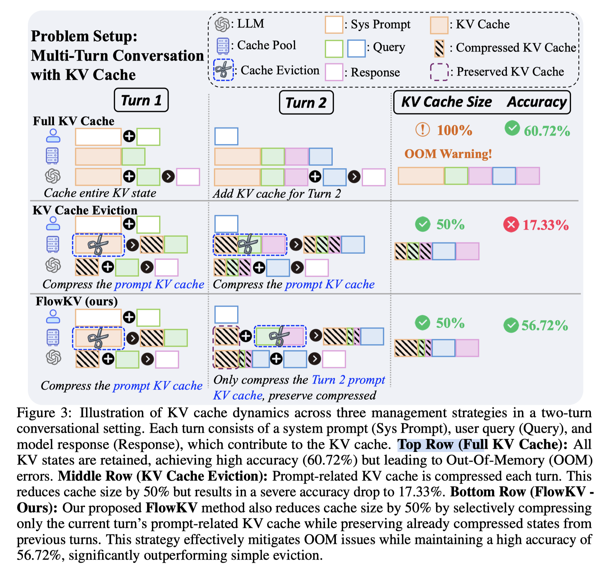

# FlowKV: Enhancing Multi-Turn Conversational Coherence in LLMs via Isolated Key-Value Cache Management

> Xiang Liu, Hong Chen, Xuming Hu, Xiaowen Chu

## Abstract

Large Language Models (LLMs) are increasingly deployed in multi-turn conversational applications, where the management of the Key-Value (KV) Cache presents a significant bottleneck. The linear growth of the KV Cache with dialogue history imposes substantial computational costs, and existing eviction strategies often degrade performance by repeatedly compressing early conversational context, leading to information loss and context forgetting. This paper introduces FlowKV, a novel \textbf{multi-turn isolation mechanism} for KV Cache management, which can be applied to any KV Cache compression method without training. FlowKV's core innovation is a multi-turn isolation mechanism that preserves the accumulated compressed KV cache from past turns. Compression is then strategically applied only to the newly generated KV pairs of the latest completed turn, effectively preventing the re-compression of older context and thereby mitigating catastrophic forgetting. Our results demonstrate that FlowKV consistently and significantly outperforms baseline strategies in maintaining instruction-following accuracy and user preference retention from 10.90\% to 75.40\%, particularly in later conversational turns.

多论对话kv cache压缩，第一轮会压缩kv 50%，第二轮把所有的历史kv 再压缩50%，那么会导致第一轮的压缩比例超过50%，导致信息丢失严重；flowkv 则对每轮对话都按照50%压缩，对于历史的已压缩号的kv，保持不变，从而能够提高多轮对话的生成质量。