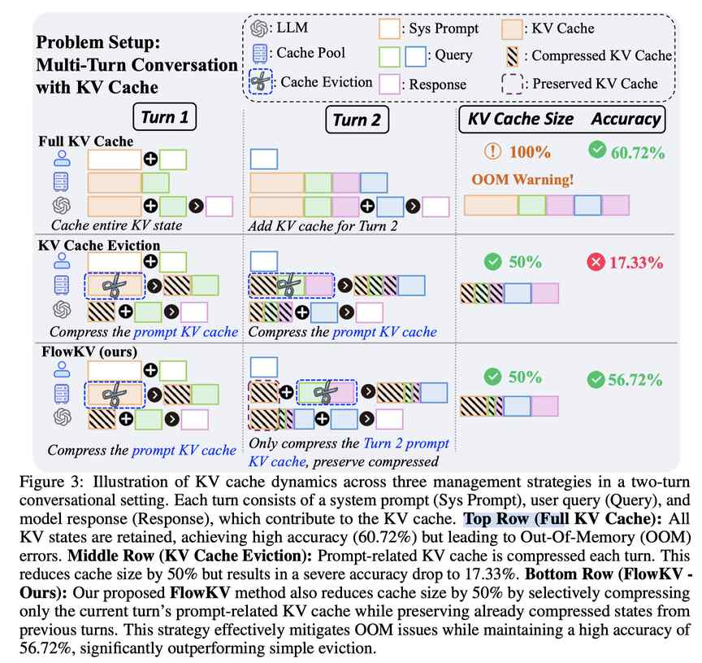

# FlowKV: Enhancing Multi-Turn Conversational Coherence in LLMs via Isolated Key-Value Cache Management

> Xiang Liu, Hong Chen, Xuming Hu, Xiaowen Chu

> **生成声明**：本 note 由 AI Agent（Hermes Agent）自动生成，基于 arXiv 论文全文（2505.15347v1）内容，仅供参考。

## 一句话总结

FlowKV 是一种无需训练的多轮对话 KV Cache 隔离机制，通过避免对历史轮次的重复压缩来缓解信息退化和灾难性遗忘，在多轮指令遵循和用户偏好保持任务上显著优于现有 KV Cache 压缩方法（性能提升 10.90%–75.40%）。

## 摘要翻译

大语言模型（LLMs）越来越多地部署在多轮对话应用中，其中键值（KV）缓存的管理是一个重要的瓶颈。KV 缓存随对话历史的线性增长带来了显著的计算成本，而现有的驱逐策略通常通过反复压缩早期对话上下文来降低性能，导致信息丢失和上下文遗忘。本文提出了 FlowKV，一种新型的多轮隔离机制用于 KV 缓存管理，可应用于任何 KV 缓存压缩方法且无需训练。FlowKV 的核心创新在于多轮隔离机制，能够保留过去轮次已累积压缩的 KV 缓存。压缩仅策略性地应用于最新完成轮次新生成的 KV 对，有效防止对旧上下文的重复压缩，从而缓解灾难性遗忘。结果表明，FlowKV 在保持指令遵循准确性和用户偏好保持方面持续显著优于基线策略，提升幅度为 10.90% 至 75.40%，尤其在后期对话轮次中效果显著。

## 研究动机

### 问题背景

在多轮对话场景中，LLM 的 KV Cache 随对话历史线性增长，导致计算和存储开销巨大。现有 KV Cache 驱逐/压缩策略在多轮场景下存在严重问题：

1. **重复压缩问题**：传统方法在每轮对话前对整个历史 KV Cache 进行压缩。例如，50% 压缩率下，第 1 轮对系统提示（Psys）压缩一次，第 2 轮将整个历史（包括已被压缩的 Psys）再次压缩，导致 Psys 被压缩两次，信息严重退化。
2. **灾难性遗忘**：经过 T 轮对话后，初始系统提示会被嵌套压缩 T 次，Q1/R1 会被压缩 T-1 次，信息损失随对话长度急剧增加。
3. **注意力模式的跨轮依赖**：论文通过注意力热图分析发现，多轮对话中存在显著的跨轮依赖关系——后续回复不仅关注当前查询，还关注先前的查询和系统提示，这使得历史信息的保留至关重要。

### 现有方法的不足

- **SnapKV**：通过选择关键注意力头特征来压缩 KV Cache，但在多轮场景下仍存在反复压缩问题。
- **StreamingLLM**：丢弃中间部分的 KV Cache，在多轮对话中导致中间信息丢失。
- **ExpectedAttention**：基于预期注意力分数进行驱逐，但同样受重复压缩影响。
- **ChunkKV**：通过语义分组压缩，但在多轮场景下性能下降严重。

## 方法（技术细节）

### FlowKV 核心机制

FlowKV 是一种**多轮隔离机制**（Multi-Turn Isolation Mechanism），核心思想是：

**保留已压缩的历史 KV Cache，仅对最新轮次的未压缩部分进行压缩。**

#### 形式化描述

设 $C_t$ 为第 $t$ 轮的 KV Cache 池，$F(\cdot)$ 为有损 KV Cache 压缩函数。

**第 1 轮**（与传统方法相同）：
$$C_1 = F(KV(P_{sys})) \oplus KV(Q_1)$$

生成响应 $R_1$ 后：
$$C'_1 = F(KV(P_{sys})) \oplus KV(Q_1 \oplus R_1)$$

**第 2 轮**（FlowKV 关键创新）：
$$C_2 = F(C'_1) \oplus KV(Q_2)$$

其中 $F(C'_1)$ 使用 FlowKV 隔离机制——$F(KV(P_{sys}))$ 被**保留**（不重复压缩），只有 $KV(Q_1 \oplus R_1)$ 被压缩。

**对比传统方法**：
- 传统方法：Psys 被压缩 2 次，Q1/R1 各被压缩 1 次
- FlowKV：Psys 被压缩 1 次，Q1/R1 各被压缩 1 次

#### 关键特性

1. **训练无关**（Training-Free）：无需额外训练，可直接应用于任何现有 KV Cache 压缩方法。
2. **通用兼容性**：与 SnapKV、StreamingLLM、ExpectedAttention、ChunkKV 等方法均兼容。
3. **零额外开销**：实验显示 FlowKV 不会显著增加预填充时间或总生成时间（TTFT 和 TPOT 与无 FlowKV 时相当）。
4. **逐步隔离**：每轮对话只压缩当前轮次新产生的 KV 对，历史累积的已压缩 KV Cache 保持不变。

#### 与传统方法的对比（以两轮对话为例）

| 方法 | 第1轮KV Cache | 第2轮KV Cache | 准确率 | KV Cache大小 |
|------|---------------|---------------|--------|-------------|
| Full KV Cache | 完整保留 | 完整保留 | 60.72% | OOM风险 |
| KV Cache Eviction | 压缩50% | 再压缩50% | 17.33% | 50% |
| FlowKV (Ours) | 压缩50% | 仅压缩新轮次50% | 56.72% | 50% |

## 实验结果

### 实验设置

- **模型**：LLaMA-3.1-8B-Instruct、Qwen-2.5-7B-Instruct
- **数据集**：Multi-IF（多轮指令遵循）、PrefEval（用户偏好保持）
- **KV Cache 压缩方法**：SnapKV、StreamingLLM、ExpectedAttention、ChunkKV
- **评估指标**：IFR（指令遵循率）、User Preference Following Rate（用户偏好遵循率）
- **评估环境**：NVIDIA A40 GPU，使用 kvpress 库
- **压缩比率**：0.1 到 0.9（0.5 为默认值）
- **实验次数**：3 次取平均

### Multi-IF 数据集结果（压缩比率 0.5）

**LLaMA-3.1-8B-Instruct：**

| KV方法 | 策略 | Turn 1 | Turn 2 | Turn 3 |
|--------|------|--------|--------|--------|
| SnapKV | Baseline | 76.15% | 37.08% | 29.39% |
| SnapKV | FlowKV | 76.15% | **61.93%** (+24.85) | **54.95%** (+25.56) |
| StreamingLLM | Baseline | 72.78% | 33.94% | 28.94% |
| StreamingLLM | FlowKV | 72.78% | **39.06%** (+5.12) | **41.58%** (+12.64) |
| ExpectedAttention | Baseline | 76.05% | 36.28% | 30.48% |
| ExpectedAttention | FlowKV | 76.05% | **64.89%** (+28.61) | **55.36%** (+24.88) |
| ChunkKV | Baseline | 70.47% | 12.56% | 16.49% |
| ChunkKV | FlowKV | 70.47% | **52.83%** (+40.27) | **50.15%** (+33.66) |

**Qwen-2.5-7B-Instruct：**

| KV方法 | 策略 | Turn 1 | Turn 2 | Turn 3 |
|--------|------|--------|--------|--------|
| SnapKV | Baseline | 76.49% | 17.33% | 21.96% |
| SnapKV | FlowKV | 76.49% | **56.72%** (+39.39) | **49.67%** (+27.71) |
| StreamingLLM | Baseline | 76.47% | 17.31% | 21.08% |
| StreamingLLM | FlowKV | 76.47% | **36.82%** (+19.51) | **35.29%** (+14.21) |
| ExpectedAttention | Baseline | 75.52% | 17.62% | 22.00% |
| ExpectedAttention | FlowKV | 75.52% | **50.62%** (+33.00) | **39.25%** (+17.25) |
| ChunkKV | Baseline | 73.19% | 18.47% | 21.51% |
| ChunkKV | FlowKV | 73.19% | **47.27%** (+28.80) | **43.55%** (+22.04) |

**关键发现**：
- FlowKV 在第 2 轮和第 3 轮持续显著优于基线方法。
- 平均 IFR 提升超过 20%。
- 与 Full KV Cache 的性能差距在使用 FlowKV 后大幅缩小。
- StreamingLLM 效果提升较小，因为该方法丢弃中间部分 KV Cache，本质导致中间信息丢失。

### PrefEval 数据集结果（压缩比率 0.5）

**LLaMA-3.1-8B-Instruct（Full KV: 77.00%）：**

| KV方法 | Baseline | FlowKV |
|--------|----------|--------|
| SnapKV | 10.60% | **58.70%** |
| StreamingLLM | 9.80% | **24.40%** |
| ExpectedAttention | 10.90% | **75.40%** |
| ChunkKV | 6.70% | **38.80%** |

**Qwen-2.5-7B-Instruct（Full KV: 55.90%）：**

| KV方法 | Baseline | FlowKV |
|--------|----------|--------|
| SnapKV | 11.80% | **33.80%** |
| StreamingLLM | 11.60% | **16.80%** |
| ExpectedAttention | 10.60% | **29.80%** |
| ChunkKV | 10.30% | **26.40%** |

**关键发现**：
- 基线方法在 PrefEval 上表现极低（6.70%–11.80%），说明传统 KV Cache 压缩在多轮对话中严重损害用户偏好保持能力。
- FlowKV 将 ExpectedAttention 方法从 10.90% 提升到 75.40%（提升 64.5 个百分点），几乎接近 Full KV Cache 的 77.00%。
- FlowKV 在不同压缩比率下（0.1–0.9）均显著优于基线。

### 效率分析

| 配置 | 压缩比率 | 预填充时间(s) | 缓存大小(GB) | TTFT(s) | TPOT(ms) | 总生成时间(s) |
|------|---------|-------------|-------------|---------|----------|------------|
| FullKV | - | 1.5621 | 1.0000 | 1.6013 | 45.94 | 184.29 |
| ChunkKV | 0.9 | 1.3653 | 0.1000 | 1.3914 | 39.87 | 164.66 |
| ChunkKV+FlowKV | 0.9 | 1.3632 | 0.1000 | 1.4002 | 39.88 | 165.21 |

FlowKV 几乎不引入额外计算开销，TTFT 和 TPOT 与无 FlowKV 时相当。

### 案例分析

论文提供了 Multi-IF 和 PrefEval 数据集的案例分析：

- **Multi-IF 案例**：Full KV Cache 成功遵循所有轮次的指令（格式控制、风格限制、指定文本等）。Baseline（SnapKV 50%）在第 2 轮出现内容重复，第 3 轮未能执行 "p.p.s" 和双引号指令，暴露严重的上下文遗忘。FlowKV 虽然未完全维持第 1 轮的全小写格式要求，但成功执行了第 2、3 轮新增的指令。

- **PrefEval 案例**：用户偏好（喜欢小组学习）隐藏在历史对话中。Full KV 和 FlowKV 能够推断并提供基于小组的学习资源。Baseline 完全未能推断隐藏的用户偏好，倾向于回答对话历史中的第一个问题。

## 优势

1. **训练无关且通用**：无需额外训练，可与任何现有 KV Cache 压缩方法（SnapKV、StreamingLLM、ExpectedAttention、ChunkKV 等）结合使用。
2. **显著性能提升**：在多轮对话场景下，指令遵循率平均提升超过 20%，用户偏好保持率从 10.90% 提升至 75.40%。
3. **零额外开销**：不增加预填充时间或总生成时间，TTFT 和 TPOT 与无 FlowKV 时几乎相同。
4. **抗高压缩率**：在压缩比率 0.1–0.9 范围内均显著优于基线，尤其在低压缩率（0.1–0.4）下效果更佳，可恢复至接近 Full KV Cache 的性能水平。
5. **解决根本问题**：直接针对传统方法的重复压缩问题，通过逐轮隔离机制避免灾难性遗忘。
6. **易集成**：可无缝集成到现有 KV Cache 压缩框架中，实现简单。

## 局限

1. **依赖基础压缩算法**：FlowKV 的性能受限于基础 KV Cache 压缩算法对当前轮次数据的处理效果。如果基础算法本身质量差，FlowKV 的提升空间有限。
2. **评估任务有限**：目前仅在指令遵循（Multi-IF）和用户偏好保持（PrefEval）数据集上进行评估，尚未在多轮编码、数学、推理等更复杂的任务上进行验证。
3. **测试轮次较少**：实验主要在 2–3 轮对话上进行，更长轮次（如 10 轮以上）的性能衰减情况未充分评估。
4. **模型规模有限**：仅在 7B–8B 规模的模型上进行实验，更大模型（如 70B、405B）上的效果未验证。
5. **StreamingLLM 兼容性有限**：由于 StreamingLLM 丢弃中间 KV Cache 的机制与 FlowKV 的保留策略存在冲突，FlowKV 在 StreamingLLM 上的提升相对有限。
6. **PrefEval 上的性能差距**：虽然 FlowKV 显著优于基线，但在 Qwen-2.5-7B-Instruct 上与 Full KV Cache 仍存在较大差距（如 SnapKV+FlowKV 仅 33.80% vs Full KV 55.90%）。

## 与 EfficientPaper 相关的研究方向

1. **KV Cache 压缩与稀疏化**：FlowKV 属于 KV Cache 稀疏化（kv_cache_sparse）方向，可与 EfficientPaper 中其他 KV Cache 优化方法（如 SnapKV、StreamingLLM、ChunkKV、H2O 等）形成互补或组合使用。
2. **多轮对话效率优化**：FlowKV 直接解决多轮对话场景下的 KV Cache 管理问题，是 LLM 效率优化的重要分支，与 EfficientPaper 关注的推理效率提升高度相关。
3. **长上下文处理**：FlowKV 的逐轮隔离机制为长上下文处理提供了新思路，可与其他长上下文方法（如 FlashAttention、RingAttention 等）结合。
4. **无训练方法**：FlowKV 作为训练无关的方法，具有很强的工程实践价值，易于部署到生产环境。
5. **方法兼容性**：FlowKV 可与多种 KV Cache 压缩方法组合，为 EfficientPaper 中的方法组合研究提供了新的可能。
6. **多轮对话 benchmark**：FlowKV 使用 Multi-IF 和 PrefEval 作为评估基准，为多轮对话效率评估提供了参考框架。
7. **未来研究方向**：
   - 将 FlowKV 扩展到更多任务类型（编码、数学、推理）
   - 探索 FlowKV 与量化、低秩近似等其他 KV Cache 优化方法的组合
   - 在更大模型和更长对话上验证 FlowKV 的效果
   - 研究自适应压缩比率策略（根据对话轮次动态调整压缩率）
