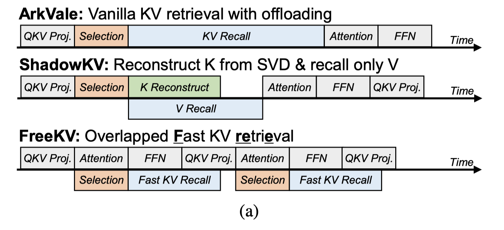

# FreeKV: Boosting KV Cache Retrieval for Efficient LLM Inference

> Guangda Liu, Chengwei Li, Zhenyu Ning, Jing Lin, Yiwu Yao, Danning Ke, Minyi Guo, Jieru Zhao

## Abstract

Large language models (LLMs) have been widely deployed with rapidly expanding context windows to support increasingly demanding applications. However, long contexts pose significant deployment challenges, primarily due to the KV cache whose size grows proportionally with context length. While KV cache compression methods are proposed to address this issue, KV dropping methods incur considerable accuracy loss, and KV retrieval methods suffer from significant efficiency bottlenecks. We propose FreeKV, an algorithm-system co-optimization framework to enhance KV retrieval efficiency while preserving accuracy. On the algorithm side, FreeKV introduces speculative retrieval to shift the KV selection and recall processes out of the critical path, combined with fine-grained correction to ensure accuracy. On the system side, FreeKV employs hybrid KV layouts across CPU and GPU memory to eliminate fragmented data transfers, and leverages double-buffered streamed recall to further improve efficiency. Experiments demonstrate that FreeKV achieves near-lossless accuracy across various scenarios and models, delivering up to 13$\times$ speedup compared to SOTA KV retrieval methods.

- 算法：（）
- 系统：CPU-GPU 异步的KV cache的拷贝