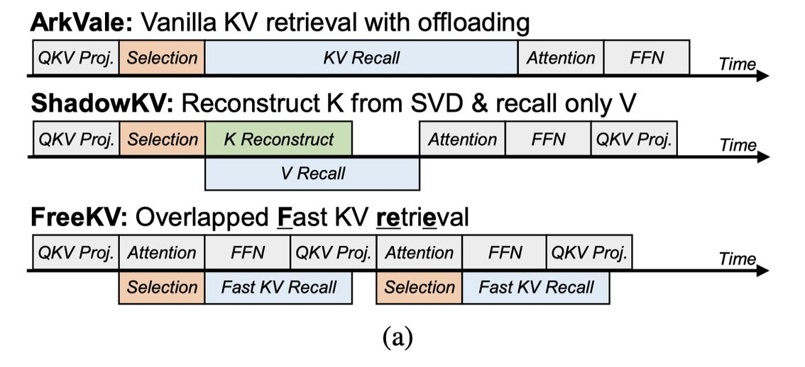

# FreeKV: Boosting KV Cache Retrieval for Efficient LLM Inference

> Guangda Liu, Chengwei Li, Zhenyu Ning, Jing Lin, Yiwu Yao, Danning Ke, Minyi Guo, Jieru Zhao
>
> Shanghai Jiao Tong University & Huawei

> **生成声明**：本 note 由 AI Agent 自动生成，基于 arXiv 论文 (2505.13109) 全文阅读与分析。生成时间：2025 年。

---

## 一句话总结

FreeKV 是一种免训练的算法-系统协同优化框架，通过推测性检索（speculative retrieval）将 KV 选择与召回移出推理关键路径，结合混合内存布局和双缓冲流式召回，实现近无损精度的同时，比 SOTA KV 检索方法最高加速 13 倍。

---

## 摘要翻译

大型语言模型（LLM）已被广泛部署，上下文窗口快速扩展以支持日益复杂的应用。然而，长上下文带来了显著的部署挑战，主要原因是 KV 缓存大小与上下文长度成正比增长。虽然已提出 KV 缓存压缩方法来解决这一问题，但 KV 丢弃方法会造成显著精度损失，KV 检索方法则面临严重的效率瓶颈。我们提出 FreeKV，一个免训练的算法-系统协同优化框架，旨在提升 KV 检索效率同时保持精度。在算法层面，FreeKV 引入推测性检索，将 KV 选择和召回过程移出关键路径，并结合细粒度校正机制确保精度。在系统层面，FreeKV 采用跨 CPU 和 GPU 内存的混合 KV 布局以消除碎片化数据传输，并利用双缓冲流式召回进一步提升效率，实现与计算的有效重叠、完全延迟隐藏以及推测召回带来的实际加速。实验表明，FreeKV 在多种场景和模型上实现了近无损精度，相比 SOTA KV 检索方法最高可获得 13 倍加速。

---

## 研究动机

### 问题背景

1. **KV 缓存膨胀**：LLM 推理时 KV 缓存大小与上下文长度成正比。例如 Llama-3-70B 在 128K 上下文下单请求 KV 缓存可达 40GB，远超 GPU 内存容量。
2. **解码瓶颈**：LLM 解码是内存密集型操作，访问大量 KV 缓存会显著降低解码速度。

### 现有方法的不足

- **KV 丢弃方法**（如 RazorAttention、RaaS）：
  - 静态丢弃：按固定模式丢弃 KV，但忽视推理中的动态模式，导致精度显著下降。
  - 动态丢弃：基于在线注意力分数动态丢弃，但对长生成任务（尤其是推理模型 32K+ tokens）效果不佳。
  - 在摘要和推理任务上精度损失严重（图 1 左侧）。

- **KV 检索方法**（如 Quest、ArkVale、ShadowKV、InfiniGen）：
  - 保留完整 KV 缓存，动态选择子集用于推理，精度优于丢弃方法。
  - **效率瓶颈严重**：
    - 从 CPU 召回 KV 到 GPU 的延迟很高（CPU-GPU 带宽低）。
    - KV 选择开销大（对整个上下文进行页面级选择）。
    - ArkVale 的 recall + selection 占总延迟约 94%；ShadowKV 约 73%；InfiniGen 约 53%。
  - 无法有效隐藏召回延迟，导致总延迟远高于全 KV 缓存推理。

### 核心观察

相邻解码步骤的查询向量（query vector）具有高度相似性：
- Llama-3.1-8B-Instruct 和 DeepSeek-R1-Qwen-14B 的平均余弦相似度均 > 0.84，大多数 attention head > 0.9。
- 这种高相似性跨层、跨模型、跨任务一致存在（在 Table 8 中验证了跨任务、模型规模、架构、训练阶段的泛化性）。
- 但存在一些 outlier 步骤（某些步骤相似度显著降低），且不同 attention head 的 outlier 步骤不同。

这为推测性检索提供了理论基础。

---

## 方法（技术细节）

FreeKV 是一个**免训练**的算法-系统协同优化框架，分为算法侧和系统侧两部分。

### 算法侧

#### 1. 推测性检索（Speculative Retrieval）

**核心思想**：利用相邻解码步骤间 query 向量的高相似性（Sel(qi, K) ≈ Sel(qi-1, K)），在步骤 i 直接复用步骤 i-1 召回的 KV 元组，将选择和召回移出关键路径。

**具体流程**：
- 步骤 i 的注意力计算直接使用步骤 i-1 召回的 KV 元组，无需等待当前步骤的选择和召回。
- 选择和召回操作与步骤 i 的注意力计算和 FFN 计算，以及步骤 i+1 的 QKV 投影重叠执行。
- 迭代进行：步骤 i 召回的 KV 元组将在步骤 i+1 复用。

**优势**（与 InfiniGen 对比）：
- 无需额外的重投影操作（InfiniGen 需要将隐层状态通过下一层的 skewed query 权重重投影）。
- 完全隐藏选择和召回延迟，无额外开销。

**Group-Consistent 选择**：
- 采用页面级选择（page-wise selection），使用 min-max 池化的 key 作为页面摘要。
- 为实现 group 一致性，对组内所有 attention head 的 softmax(page attention weights) 进行均值池化（MeanS 策略效果最佳，见 Table 5）。
- 选择一个页面后，组内所有 attention head 共享相同的 KV 页面索引。

#### 2. 细粒度校正（Fine-grained Correction）

虽然纯 KV 复用能最大化效率，但可能导致显著精度下降（尤其在 outlier 步骤）。FreeKV 引入校正机制来缓解这一问题。

**Query-based 识别**：
- 计算当前步骤与前一步骤 query 向量的余弦相似度 Ci。
- 当 Ci < τ（阈值）时，触发校正。
- 为实现 group 一致性，对组内所有 head 的 Ci 进行均值池化，与 τ 比较。

**Head-wise 校正**：
- 对需要校正的 KV head，在当前步骤注意力计算前启动选择和召回。
- 对无需校正的 KV head，将选择和召回推迟并与其他操作重叠（用于下一复用）。
- 为避免额外开销，当需要校正时，对所有 KV head 执行选择操作（非校正 head 直接复用选择结果进行召回）。

**阈值选择**：
- τ = 0.8 用于长输入场景（LongBench v2、MATH500）。
- τ = 0.9 用于长生成/推理场景（LongGenBench、AIME24、GPQA），因为推理中误差累积更严重。

### 系统侧

#### 1. 混合 KV 布局（Hybrid Layouts）

**问题**：
- NHD 布局（(L, nkv, d)）是自然布局，但同一 KV head 在页面内内存不连续，导致碎片化数据传输（最大传输单元仅 256 字节，d=128, Float16）。
- HND 布局（(nkv, L, d)）可确保连续传输（传输单元 p×d=8KB, p=32），但需要额外的转置操作。

**解决方案**：
- CPU 端使用 HND 布局（(npage, nkv, 2, p, d)），确保连续高效的数据传输。
- GPU 端使用 NHD 布局，避免解码时的逐层转置。
- NHD-HND 转置仅在卸载页面时执行一次（可与计算重叠）。

#### 2. 双缓冲流式召回（Double-Buffered Streamed Recall）

**问题**：HND→NHD 布局转换可能阻塞数据传输和后续注意力计算。

**解决方案**：
- 采用双缓冲机制实现流式召回。
- 选中的 KV 页面传输到缓冲区 2 后，立即开始布局转换，同时启动下一个页面到缓冲区 1 的传输。
- 两个缓冲区和转换过程均在 GPU 内存中，利用 GPU 高带宽。

#### 系统架构

- **数据平面**：GPU 保留 query 向量、页面摘要和选中 KV 页面缓存；CPU 维护完整的 KV 缓存池用于卸载。
- **控制平面**：CPU 上的控制器管理校正、注意力、选择和召回的调度与同步，遵循推测性检索的时间线。

---

## 实验结果

### 实验设置

- **模型**：Llama-3.1-8B-Instruct、Qwen-2.5-7B/14B-Instruct（通用任务）；DeepSeek-R1-Llama-8B、DeepSeek-R1-Qwen-7B/14B（推理任务）。
- **数据集**：LongBench v2（长输入）、LongGenBench（长生成）、MATH500、AIME24、GPQA（推理任务）。
- **基线方法**：RazorAttention（静态丢弃）、RaaS（动态丢弃）、Quest、ArkVale、ShadowKV、InfiniGen（KV 检索）。
- **硬件**：Nvidia A100 40GB GPU，AMD 7302 CPU，PCIe Gen4。
- **超参数**：B = 2048，S = W = 512（长生成/推理）或 128（长输入），τ = 0.8（长输入）或 0.9（长生成/推理）。

### 精度评估

#### LongBench v2（长输入）

| 模型 | Full | FreeKV | 差异 |
|------|------|--------|------|
| Llama-3.1-8B-Instruct | 29.22 | 29.22 | 0 |
| Qwen-2.5-7B-Instruct | 27.44 | 26.84 | -0.6 |
| Qwen-2.5-14B-Instruct | 33.40 | 34.19 | +0.79 |

- FreeKV 整体精度偏差不超过 0.6，在大多数指标上达到最佳或次佳。
- KV 丢弃方法（RazorAttention、RaaS）在此基准上持续逊于 KV 检索方法。

#### LongGenBench（长生成）

- FreeKV 在所有模型上保持与全 KV 缓存相当甚至更高的精度。
- CR（完成率）和整体精度达到最佳或次佳。
- RazorAttention 在长生成任务上精度损失严重；ShadowKV 在 Qwen 模型上出现重复输出和精度下降（重建 key 误差）。

#### 推理任务（MATH500、AIME24、GPQA）

- FreeKV 在大多数数据集上提供与全 KV 缓存相当的精度。
- KV 丢弃方法（RazorAttention、RaaS）在 AIME24 等复杂问题上精度显著下降。
- FreeKV 在大多数情况下优于其他 KV 检索方法，验证了页面摘要、softmax 基 group 一致选择和细粒度校正的有效性。

### 效率评估

#### 端到端延迟

- FreeKV 比 ArkVale 最高加速 **13.7 倍**（Llama-3.1-8B, 长生成, batch size 4）。
- 比 ShadowKV 最高加速 **8.4 倍**（Llama-3.1-8B, 长生成, batch size 4）。
- 比 InfiniGen 在长输入和长生成场景下分别加速 3.2-5.4 倍（Qwen-2.5-7B）和 5.1-8.5 倍（Llama-3.1-8B）。
- FreeKV 的效率接近不涉及卸载或召回的丢弃方法（RaaS、RazorAttention）。
- 改进在大 batch size 和长生成场景下更显著，且 Llama-3.1-8B（更多 KV head、更大 KV 缓存）的改进幅度大于 Qwen-2.5-7B。

#### 不同输入/输出长度

- 长输入场景：FreeKV 一致性地比 ArkVale 快 2.7-5.3 倍。
- 长生成场景：FreeKV 保持稳定的 5.3 倍加速，受益于固定大小 KV 预算和高效召回重叠。

### 消融实验

#### 效率优化消融

- **混合布局 (HL)**：贡献最大，最高加速 10.5 倍（消除碎片化数据传输）。
- **双缓冲流式召回 (DB)**：在 batch size 4 时额外加速 1.2 倍。
- **推测性检索 (SR)**：额外加速 1.9 倍。

**关键发现**：HL 单独提供最大收益，但 SR 和系统级优化在算法-系统协同优化框架中同等关键。SR 使预选择和预获取成为可能，但系统优化将召回延迟降至与其他操作同量级，才能实现有效的重叠和完全延迟隐藏。

#### 准确性消融

- **last layer vs. last step**（Table 4）：使用上一解码步骤的 query 向量（推测性检索）优于使用上一层的 query 向量（InfiniGen 方式），尤其在 AIME24 和 GPQA 等复杂推理任务上。
- **Group 一致选择**（Table 5）：均值池化 softmax 后的权重（MeanS）效果最佳。
- **校正阈值**（Table 7）：τ=0.8 适合简单任务，τ=0.9 适合复杂推理任务。

#### Ascend NPU 上的评估

- 在 Ascend 910B NPU 上实现，FreeKV 对比 ArkVale 最高加速 4.1 倍（32K 长输入）。
- 加速幅度小于 A100，主要因为操作大多用 Torch 而非优化的 Ascend 内核实现，以及较低的 PCIe 带宽和 Ascend API 使用率有限。

---

## 优势

1. **免训练**：无需额外训练，可直接应用于现有模型。
2. **近无损精度**：在多种任务和模型上与全 KV 缓存精度相当或略有超出。
3. **显著加速**：最高 13 倍加速，且效率接近不涉及卸载的丢弃方法。
4. **算法-系统协同**：同时优化算法（推测性检索、细粒度校正）和系统（混合布局、双缓冲召回），三者协同发挥最大效果。
5. **广泛的适用性**：
   - 支持长输入和长生成场景。
   - 支持推理模型（DeepSeek-R1 等 32K+ tokens 生成）。
   - 跨模型规模（1.5B-14B）、架构（Qwen、Llama、Qwen-3）、训练阶段（Base、SFT、RLHF、Long-CoT RL）泛化。
6. **固定 GPU 内存开销**：O(B)，B=2048，不随上下文长度增长。
7. **Group-consistent 选择**：通过均值池化 softmax 权重实现，确保组内所有 head 选择一致，避免 G 倍内存访问开销。
8. **可扩展性**：在 Ascend NPU 上也有实现，显示跨平台潜力。

---

## 局限

1. **页面级选择精度有限**：页面级选择在小预算下不如 token 级选择有效（论文提及），但可通过自适应预算或动态 top-p 稀疏度正交优化。
2. **依赖查询向量相似性**：推测性检索依赖于相邻步骤 query 向量的高相似性。虽然论文验证了这种相似性跨任务/模型/架构的泛化性，但在极端情况下（如某些 outlier 步骤），可能触发校正，增加开销。
3. **推理任务精度依赖校正阈值**：复杂推理任务（如 AIME24、GPQA）需要更高的 τ（0.9），表明推测性检索在复杂推理场景中可能不够稳健。
4. **ASCEND NPU 加速有限**：在 Ascend NPU 上加速幅度（4.1x）远低于 A100（13.7x），受限于未优化的内核实现和较低的 PCIe 带宽。
5. **KV 缓存内存开销**：保留完整 KV 缓存用于召回，虽然固定 GPU 内存 O(B)，但 CPU 端仍需存储完整 KV 缓存池。
6. **未处理前缀缓存（prefix caching）**：论文未讨论与前缀缓存的集成。
7. **单次 SVD 更新**（针对 ShadowKV）：虽然这不是 FreeKV 的问题，但论文提到 ShadowKV 的 SVD 仅在 prefill 时执行一次，导致不支持长生成。FreeKV 避免了这一问题，但其推测性检索本身仍可能需要频繁的校正操作。

---

## 与 EfficientPaper 相关的研究方向

### KV 缓存管理（KV Cache Management）

FreeKV 是 KV 缓存管理领域的重要进展，结合了 KV 检索（retrieval）和系统优化：
- **KV 丢弃 vs. KV 检索**：FreeKV 进一步证明了 KV 检索在精度上的优势（尤其在长生成和推理任务上），同时通过算法-系统协同优化解决了其效率瓶颈。
- **关键基线方法**：与 Quest（2024/ICML）、ShadowKV（2025/arXiv）、ArkVale（2024/NeurIPS）、InfiniGen（2024/OSDI）、RaaS（2025/arXiv）等形成直接对比。
- **算法-系统协同优化**：FreeKV 展示了算法（推测性检索、细粒度校正）和系统（混合布局、双缓冲召回）协同优化的重要性，为后续研究提供了参考框架。

### 部署优化（Deployment）

- **CPU-GPU 混合内存**：FreeKV 的混合布局（CPU HND + GPU NHD）和双缓冲机制为高效 KV 缓存卸载提供了实践方案。
- **跨平台支持**：在 A100 GPU 和 Ascend NPU 上均有实现，显示了方法的可扩展性。
- **推理模型支持**：支持 DeepSeek-R1 等推理模型的长生成场景（32K+ tokens），这对实际部署至关重要。

### 潜在研究方向

1. **自适应预算**：结合 Ada-KV、Twilight 等方法的自适应预算分配，进一步优化精度-效率权衡。
2. **学习型页面稀疏度**：与 SeerAttention、MOBA 等可学习的块级稀疏度方法结合，实现原生和最优的页面级 KV 缓存压缩和检索。
3. **预训练/后训练稀疏度**：与 Native Sparse Attention（NSA）等原生稀疏注意力方法对比，探索预训练或后训练阶段的稀疏度优化。
4. **动态预算与 top-p 稀疏度**：结合 MagicPig、Twilight 等方法的动态预算和 top-p 稀疏度，实现更精细的 KV 缓存管理。
5. **与其他 KV 压缩方法的集成**：FreeKV 的推测性检索机制可与 KV 丢弃方法结合，进一步提升效率。
6. **多模态和长上下文应用**：将 FreeKV 扩展到多模态 LLM（如视觉语言模型）的长上下文推理中。
7. **系统优化深化**：在 Ascend NPU 等硬件上进行更深度的内核优化，缩小与 A100 的性能差距。
