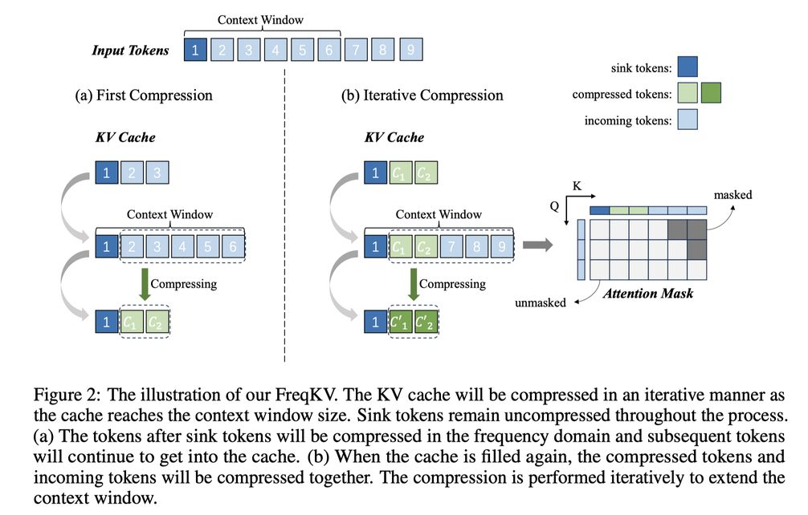

# FreqKV: Frequency Domain Key-Value Compression for Efficient Context Window Extension

> **本文由 AI Agent 自动生成，基于论文原文内容整理。生成时间：2025年6月。**

## 一句话总结

FreqKV 提出了一种基于频域的 KV Cache 压缩方法，利用离散余弦变换（DCT）将 KV 状态转换到频域，通过保留低频成分、去除高频成分来实现 KV Cache 的高效压缩，从而在不引入额外参数的情况下实现 LLM 的上下文窗口扩展。

## 摘要翻译

频域压缩已被证明能有效减少空间信号的冗余。本文提出了 FreqKV，一种新颖的频域键值（KV）压缩技术，能够为仅解码器的大语言模型（LLM）实现高效的上下文窗口扩展。该方法的核心观察是：在频域中，KV Cache 的能量分布主要集中在低频成分。通过丢弃高频成分，可以以最小的信息损失实现 KV Cache 的高效压缩。FreqKV 以迭代方式将不断增长的 KV Cache 压缩到固定大小，使模型能够高效处理长上下文。FreqKV 不引入任何额外参数或架构修改，适用于微调和推理。通过少量微调，LLM 可以学会利用频域中压缩的有限缓存来扩展上下文窗口。在一系列长上下文语言建模和理解任务上的实验验证了该方法的效率和有效性。

## 研究动机

1. **LLM 上下文窗口限制**：LLM 通常具有有限的上下文窗口大小，在预训练过程中预定义，当处理超过预设上下文长度的序列时性能会下降。
2. **注意力计算成本**：自注意力机制的计算成本随上下文长度二次增长，上下文窗口翻倍导致注意力计算成本增加四倍。
3. **现有方法的局限性**：
   - **训练方法**：LongLoRA 使用移位稀疏注意力进行微调，但推理时仍需全注意力；LoCoCo 和 Activation Beacon 引入额外模块，增加了参数和内存需求。
   - **推理方法**：KV Cache 驱逐（如 StreamingLLM、SnapKV）或合并（如 CaM、D2O）方法，虽然保持了 KV Cache 大小限制，但被驱逐的 token 信息会永久丢失，无法完全防止解码性能下降。
4. **频域学习的启发**：计算机视觉领域已证明低频通道对 CNN 更重要，Fourier Transformer 通过频域处理去除上下文冗余。这些工作启发了在 decoder-only LLM 中利用频域进行 KV 压缩的探索。

## 方法（技术细节）

### 4.1 核心观察：频域能量集中

对 LLaMA-2-7b 的 KV 状态进行功率谱分析（使用 DCT 将时域信号转换到频域），发现：
- KV 状态的能量在频域中越来越集中在低频成分。
- 随着解码层的深入，能量分布逐渐向低频集中。
- 这表明高频成分可以被丢弃，而不会造成显著信息损失。

### 4.2 频域 KV 压缩

**DCT 变换**：沿序列维度对 KV Cache 进行离散余弦变换（DCT-II），将 KV 状态从时域转换到频域：

$$Y^K_{0:N-1} = \text{DCT}(K_{0:N-1}), \quad Y^V_{0:N-1} = \text{DCT}(V_{0:N-1})$$

**频率滤波**：给定保留比例 $\gamma$，保留大小为 $L = \gamma \cdot N$，保留低频成分，过滤 $N-L$ 个高频成分：

$$\tilde{Y}^K_{0:L-1} = Y^K_{0:N-1}[0:L-1], \quad \tilde{Y}^V_{0:L-1} = Y^V_{0:N-1}[0:L-1]$$

**IDCT 与重缩放**：对保留的频率成分进行逆 DCT 变换回时域，并通过缩放因子 $\sqrt{L/N}$ 恢复原始幅度：

$$\tilde{K}^{0:N-1}_{0:L-1} = \sqrt{\frac{L}{N}} \cdot \text{IDCT}(\tilde{Y}^K_{0:L-1}), \quad \tilde{V}^{0:N-1}_{0:L-1} = \sqrt{\frac{L}{N}} \cdot \text{IDCT}(\tilde{Y}^V_{0:L-1})$$

### 4.3 迭代压缩实现上下文扩展

**核心机制**：
- 当 KV Cache 达到预设上下文窗口大小时触发压缩。
- 每次压缩将 KV 状态转换到频域，保留低频成分后转换回时域。
- 压缩后的 KV Cache 与新进入的 token 拼接，直到再次填满。
- 早期 token 经历更多次压缩（压缩率更高），近期 token 压缩较少（信息保留更好），这对自回归模型预测下一个 token 有利。
- **Sink Token 保留**：初始 token（Sink Token，数量 $S=4$）始终保持不压缩，因为 LLM 倾向于对初始 token 分配高注意力分数。

**注意力计算**：
$$\tilde{A}(S, N, L, M) = \text{Softmax}\left(\frac{q_M [K_{0:S-1} \oplus \tilde{K}^{0:N-1}_{0:L-1} \oplus K_{N:M}]^T}{\sqrt{d}}\right) \cdot [V_{0:S-1} \oplus \tilde{V}^{0:N-1}_{0:L-1} \oplus V_{N:M}]$$

**RoPE 处理**：Key 状态在压缩和缓存后才应用 RoPE，使用缓存内的位置索引而非原始序列位置，从而避免位置外推或插值问题。

### 4.4 实现细节

- **模型**：LLaMA-2-7b 和 LLaMA-3-8b
- **Sink Token 数量**：$S = 4$
- **保留比例**：$\gamma = 0.5$
- **训练**：使用 LoRA 微调，rank=8
- **数据集**：RedPajama（语言建模）、LongAlpaca（理解任务）
- **训练设置**：总 batch size 64，学习率从 1e-6 线性增加到 2e-5，20 步 warm-up
- **FlashAttention-2**：用于加速和内存节省
- **硬件**：ADA6000 和 H100 GPU

## 实验结果

### 6.1 长上下文语言建模

在 PG-19 和 Proof-pile 数据集上评估，训练长度从 8K 到 32K：

- **FreqKV 优势**：
  - 在 PG-19 上，FreqKV 甚至超过了 Full FT 和 LongLoRA，例如训练长度 32K 时，FreqKV 在 2K 到 32K 评估长度上 PPL 持续较低（约 6.98-7.47）。
  - 即使仅使用 8K 训练长度，FreqKV 也能在 32K 评估长度上保持良好性能（PPL=7.02），与 LongLoRA 在 32K 训练长度下的 7.22 相当甚至更优。
  - 优于 LoCoCo 方法，无论是在扩展上下文长度还是较短长度上。
- **局限性**：在 Proof-pile（数学文本）上，FreqKV 在长上下文长度上略逊于 LongLoRA，但性能不会随上下文长度增加而退化。
- **扩展能力**：使用 8K 训练长度，可将上下文窗口有效扩展到 64K（原始大小的 16 倍）。

### 6.2 长上下文理解

- **LongBench**：
  - 在大多数任务上达到 SOTA，平均得分最高（LLaMA-2-chat: 37.85，LLaMA-3-instruct: 43.48）。
  - 超过 LM-Infinite、LongHeads、FastKV、SnapKV、PyramidKV 等方法。
- **Needle-in-a-Haystack**：
  - LLaMA-2-chat-7b（4K→8K）：平均准确率 84.2%，远超 PyramidKV（46.7%）和 Dropping（75.5%）。
  - LLaMA-3-instruct-8b（8K→16K）：平均准确率 90.7%。
  - PyramidKV 在原始窗口边界外性能崩溃，而 FreqKV 能稳定工作。
  - Dropping（直接丢弃最早 token）因永久丢失早期 token 信息而表现不佳。

### 6.3 解码延迟

- **线性增长**：解码时间随序列长度线性增长（而非二次增长）。
- **压缩开销极小**：FreqKV 与 Dropping 的解码时间差异仅约 0.64%（32K token 时约 6.5 秒额外延迟）。
- **FLOPs 分析**：压缩开销不到 0.5%（32K 长度时仅 0.038%）。

### 6.4 训练效率

- FreqKV 显著降低训练时间和内存需求：
  - 8K 训练：时间 17.07h（Full FT 28.88h），内存 24.58GB（Full FT 44.04GB）
  - 16K 训练：时间 38.57h，内存 34.00GB
  - 32K 训练：时间 89.35h，内存 45.37GB

### 6.5 保留比例分析

保留比例越大，性能越好。即使评估长度达到 64K（远超 8K 训练长度），FreqKV 仍能保持低困惑度。

## 优势

1. **无需额外参数**：不引入额外的压缩模块或架构修改，保持模型原有结构。
2. **频域压缩效率高**：利用 DCT 将 KV Cache 转换到频域，低频成分保留，高频成分丢弃，以最小信息损失实现高效压缩。
3. **迭代压缩机制**：早期 token 压缩更多，近期 token 保留更多，符合自回归模型的预测需求。
4. **训练效率高**：显著减少训练时间和内存需求，LoRA 微调只需少量数据。
5. **上下文扩展能力强**：8K 训练可扩展到 64K（16倍），32K 训练可覆盖更大上下文。
6. **兼容性好**：适用于 LLaMA-2 和 LLaMA-3 等主流模型，支持 MHA 和 GQA。
7. **推理开销小**：解码延迟增长近似线性，压缩开销可忽略（<0.5%）。
8. **无需位置外推**：通过在压缩后应用 RoPE，避免位置外推问题。
9. **Sink Token 保留**：保持初始 token 不压缩，避免注意力 sink 问题。
10. **与现有 KV 压缩方法相比性能更优**：在 LongBench 和 Needle-in-a-Haystack 上超越多种方法。

## 局限

1. **需要训练**：FreqKV 不是纯推理方法，需要通过微调（如 LoRA）来适应频域压缩，需要训练数据和计算资源。
2. **压缩有损**：高频成分的丢弃不可避免地导致信息损失，可能影响需要精确细节的任务（如数学推理，Proof-pile 上表现略逊于 LongLoRA）。
3. **保留比例需要调优**：保留比例 $\gamma$ 的选择影响性能，需要根据任务和上下文长度进行调优。
4. **计算开销**：虽然压缩开销极小，但仍需要进行 DCT/IDCT 操作，特别是在长上下文场景下。
5. **仅适用于 Decoder-only LLM**：该方法主要针对 decoder-only 架构，对于 encoder-decoder 架构可能不适用。
6. **Sink Token 数量固定**：Sink Token 数量 $S$ 固定为 4，可能不是所有场景的最优选择。
7. **迭代压缩的累积误差**：随着上下文长度增加，早期 token 经历更多次压缩，累积误差可能导致信息退化。
8. **缺乏多任务/多语言验证**：实验主要在英文任务上进行，多语言和多任务场景下的表现有待验证。
9. **未开源代码**：目前未提供开源代码，难以复现。
10. **论文尚未被顶级会议/期刊接收**：arXiv 预印本，ICLR 2025 投稿被拒（根据现有 note）。

## 与 EfficientPaper 相关的研究方向

1. **KV Cache 压缩与稀疏化**：FreqKV 是 KV Cache 压缩领域的代表性方法之一，与 SnapKV、PyramidKV、FastKV、StreamingLLM 等方法属于同一研究方向。该方向关注如何在保持模型性能的同时减少 KV Cache 的内存和计算成本。
2. **频域学习**：FreqKV 借鉴了计算机视觉领域的频域学习思想（如 FNet、Fourier Transformer），探索频域信号处理在 NLP 中的应用。这一方向可能在模型压缩、加速等方面有更广泛的应用。
3. **上下文窗口扩展**：FreqKV 属于上下文窗口扩展方法，与 LongLoRA、LoCoCo、Activation Beacon、Landmark Attention 等方法竞争。该方向关注如何在不重新预训练的情况下将模型扩展到更长的上下文。
4. **注意力机制优化**：FreqKV 的迭代压缩机制与滑动窗口注意力、稀疏注意力等方法相关，为注意力机制的高效计算提供了新思路。
5. **高效推理**：FreqKV 的线性解码时间增长特性使其适合长上下文推理场景，与 FlashAttention、PagedAttention 等技术互补。
6. **参数高效微调**：FreqKV 使用 LoRA 进行微调，与参数高效微调（PEFT）方向紧密相关，为长上下文微调提供了高效方案。
7. **模型部署与推理优化**：FreqKV 的内存和计算效率使其适合资源受限的部署场景，与模型量化、蒸馏等技术结合可能产生更好的效果。
8. **注意力 Sink 现象**：FreqKV 对 Sink Token 的处理反映了对注意力 Sink 现象的理解，这一现象在长上下文建模中具有重要影响。
9. **位置编码与上下文扩展**：FreqKV 通过在压缩后应用 RoPE 避免位置外推问题，为位置编码在长上下文场景下的应用提供了参考。
10. **迭代压缩与信息保留**：FreqKV 的迭代压缩机制体现了在长上下文场景下对信息保留与压缩效率之间权衡的思考，这一思路可扩展到其他序列压缩任务。
