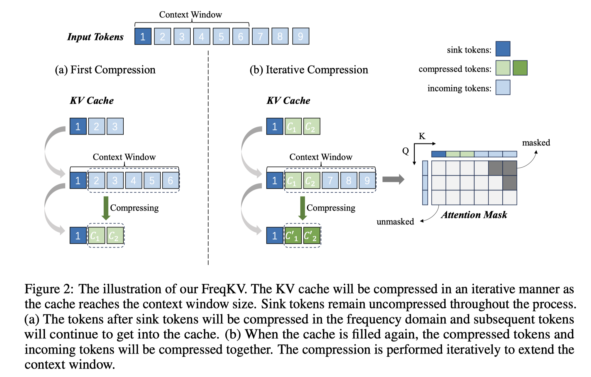

# FreqKV: Frequency Domain Key-Value Compression for Efficient Context Window Extension

## Abstract

Frequency-domain compression has proven effective in reducing redundancies
for spatial signals. In this work, we propose FreqKV, a novel frequency domain
key-value (KV) compression technique that enables efficient context window
extension for decoder-only large language models (LLMs). Our approach is
motivated by a key observation that, in the frequency domain, the energy
distribution of the KV cache is predominantly concentrated in low-frequency
components. By discarding high-frequency components, we achieve efficient
compression of the KV cache with minimal information loss. FreqKV iteratively
compresses the increasing KV cache to a fixed size in the frequency domain,
allowing models to process lengthy contexts efficiently. Introducing no
additional parameters or architectural modifications, FreqKV is applicable to
both fine-tuning and inference. With minimal fine-tuning, LLMs can learn to
leverage the limited cache that is compressed in the frequency domain and
extend the context window. Experiments on a range of long context language
modeling and understanding tasks demonstrate the efficiency and effectiveness
of the proposed method.

在context 扩展训练中使用这个方法，需要训练，并且需要runtime对KV 进行压缩，提升有限，ICLR 2025投稿被拒。