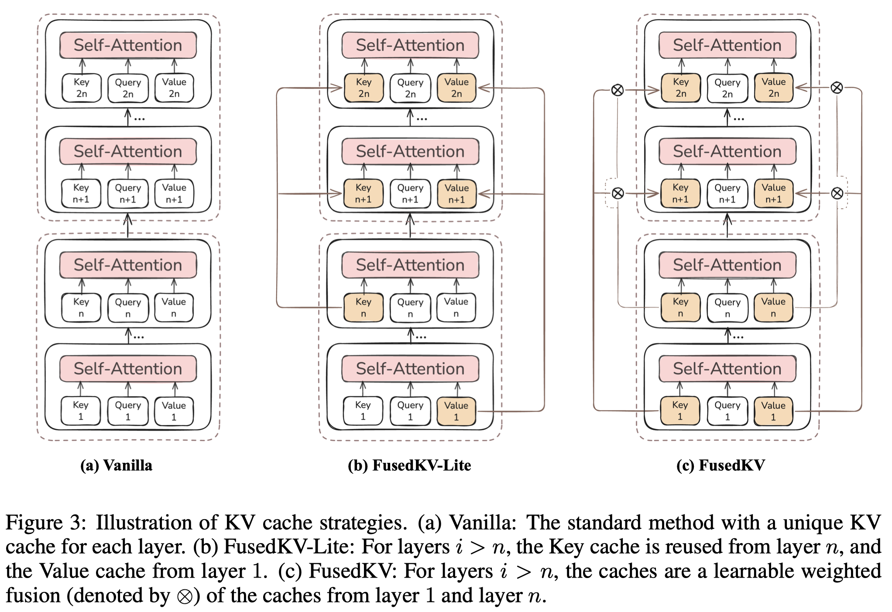

# Reconstructing KV Caches with Cross-layer Fusion For Enhanced Transformers

> Hongzhan Lin, Zhiqi Bai, Xinmiao Zhang, Sen Yang, Xiang Li, Siran Yang, Yunlong Xu, Jiaheng Liu, Yongchi Zhao, Jiamang Wang, Yuchi Xu, Wenbo Su, Bo Zheng

## Abstract

Transformer decoders have achieved strong results across tasks, but the memory required for the KV cache becomes prohibitive at long sequence lengths. Although Cross-layer KV Cache sharing (e.g., YOCO, CLA) offers a path to mitigate KV Cache bottleneck, it typically underperforms within-layer methods like GQA. To understand the root cause, we investigate the information flow of keys and values of the top-layers. Our preliminary reveals a clear distribution: values are predominantly derived from the bottom layer, while keys draw more information from both bottom and middle layers. Building upon this, we propose FusedKV, whose top-layer KV caches are a learnable fusion of the most informative ones from the bottom and middle layers. This fusion operates directly on post-RoPE keys, preserving relative positional information without the computational cost of re-applying rotary embeddings. To further improve efficiency, we propose FusedKV-Lite, an cross-layer sharing approach, where top-layer KV caches are directly derived from the bottom-layer values and the middle-layer keys. Compared to FusedKV, FusedKV-Lite reduces I/O overhead at the cost of a slight increase in perplexity. In experiments on LLMs ranging from 332M to 4B parameters, our proposed method reduce 50\% cache memory while achieving lower validation perplexity than the standard Transformer decoder, establishing it as a memory-efficient, high-performance architectural alternative.

通过kv share节省 cache，修改架构+训练