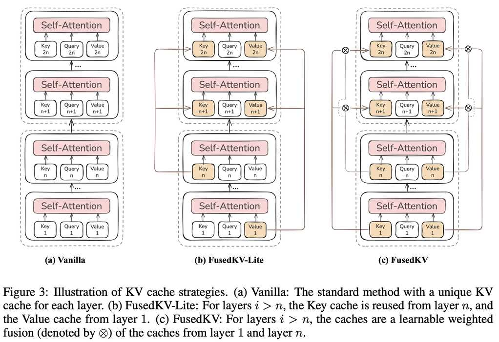

# Reconstructing KV Caches with Cross-layer Fusion For Enhanced Transformers

> Hongzhan Lin, Zhiqi Bai, Xinmiao Zhang, Sen Yang, Xiang Li, Siran Yang, Yunlong Xu, Jiaheng Liu, Yongchi Zhao, Jiamang Wang, Yuchi Xu, Wenbo Su, Bo Zheng



## 一句话总结

FusedKV 通过发现键（Key）和值（Value）在跨层缓存重建中的不对称性，提出了一种基于底层和中间层 KV 缓存的可学习加权融合方法，在将 KV 缓存内存减少 50% 的同时，实现了比标准 Transformer 解码器更低的困惑度。

## 摘要翻译

Transformer 解码器在各类任务上取得了强劲的效果，但在长序列长度下，KV 缓存所需的内存变得不可承受。虽然跨层 KV 缓存共享（如 YOCO、CLA）提供了一种缓解 KV 缓存瓶颈的途径，但通常表现不如层内方法（如 GQA）。为了理解根本原因，我们研究了顶层键和值的信息流。我们的初步分析揭示了一个清晰的分布：值主要来源于底层，而键则更多地从底层和中间层获取信息。基于此，我们提出了 FusedKV，其顶层 KV 缓存是底层和中间层中最具信息量的缓存的可学习融合。该融合直接在 RoPE 之后的键上进行，保留了相对位置信息，无需重新应用旋转嵌入的计算开销。为了进一步提高效率，我们提出了 FusedKV-Lite，一种跨层共享方法，其中顶层 KV 缓存直接来自底层值和中间层键。与 FusedKV 相比，FusedKV-Lite 以轻微的困惑度增加为代价，减少了 I/O 开销。在 332M 到 4B 参数的 LLM 实验中，我们的方法减少了 50% 的缓存内存，同时实现了比标准 Transformer 解码器更低的验证困惑度，确立了其作为一种内存高效、高性能的架构替代方案。

## 研究动机

- **KV 缓存内存瓶颈**：基于 Transformer 解码器的 LLM 在推理时，KV 缓存的内存开销随序列长度线性增长，成为实际部署的主要瓶颈。
- **跨层共享方法的不足**：现有跨层 KV 缓存共享方法（如 YOCO、CLA）虽然能减少内存占用，但性能始终不如层内方法（如 GQA），原因未被充分理解。
- **关键洞察**：作者通过分析发现，顶层的键和值在信息来源上存在明显的不对称性——值主要依赖底层信息，键则同时依赖底层和中间层信息。这一发现为设计更有效的跨层共享策略提供了理论依据。
- **研究目标**：提出一种基于键值不对称性的高效跨层缓存重建方法，在减少内存占用的同时提升或保持模型性能。

## 方法（技术细节）

### 1. 整体框架

将 L 个解码器层划分为两个互不重叠的子集：
- **存储层（Storage Layers, L_S）**：显式存储 KV 缓存的层
- **重建层（Reconstruction Layers, L_R）**：不存储 KV 缓存，而是通过重建函数从存储层的缓存中按需重新计算的层

对于任意重建层 i ∈ L_R，其键 K_i 和值 V_i 由参数化重建函数 F_i 生成：

```
(K_i, V_i) = F_i({(K_j, V_j) | j ∈ Φ(i)}; θ_i)
```

其中 Φ(i) 是源层映射函数，θ_i 是可训练参数。

### 2. 重建函数设计

论文探索了两类重建函数：

**直接缓存复用（Direct Cache Reuse）**：最简单的方式，直接复用源层的 KV 缓存，不进行任何变换。YOCO 和 CLA 采用此方法。

**缓存加权融合（Weighted Fusion of Caches）**：更有效的方式，将缓存计算为多个源层缓存的加权线性组合：

```
K_i = Σ_{j∈Φ(i)} a_{ij} ⊙ K_j
V_i = Σ_{j∈Φ(i)} b_{ij} ⊙ V_j
```

其中 a_{ij} 和 b_{ij} 是可学习权重（标量、向量或矩阵），通过 Hadamard 积进行特征级门控。

### 3. FusedKV 方法

基于键值不对称性的发现，FusedKV 从两个高度信息化的源层（底层 layer 1 和中间层 layer n）重建顶层缓存：

```
K_i = a_{i,1} ⊙ K_1 + a_{i,n} ⊙ K_n    (i > n)
V_i = b_{i,1} ⊙ V_1 + b_{i,n} ⊙ V_n    (i > n)
```

这种设计使每个重建层能够从底层的基础特征和中间层的抽象上下文表示中合成缓存，在表示能力和缓存融合的内存流量成本之间取得有效平衡。

### 4. FusedKV-Lite 方法

更高效的变体，直接复用单源 KV 缓存：

```
K_i = K_n    (i > n)
V_i = V_1    (i > n)
```

即键从中间层复用，值从底层复用。避免了融合带来的额外 I/O 开销，保持与 vanilla 模型相当的效率。

### 5. RoPE 兼容性

论文证明了当权重向量在每个 2D 子空间内对称时（即 w_{2j} = w_{2j+1}），加权融合能保持 RoPE 的相对位置编码性质。这使得存储层可以保留其原始的 RoPE 后 KV 缓存，避免在推理时重新计算 RoPE。

### 6. 复杂度分析

- FusedKV-Lite 与 YOCO 具有相同的缓存内存和 I/O 开销
- FusedKV 由于融合计算，缓存 I/O 略高（3LSH_{kv}D vs 2LSH_{kv}D）
- 两者均将预填充 FLOPs 和缓存内存减少约 50%

### 7. 实现

- 提供了基于 Triton 的注意力内核实现
- 支持注意力吞吐量、端到端预填充性能（TTFT）和解码吞吐量（TPOT）三个维度的基准测试

## 实验结果

### 实验设置

- 模型规模：332M、650M、1.5B、4B 参数
- 架构：Qwen3 架构（decoder-only Transformer）
- 训练数据：FineWeb-Edu 数据集
- 优化器：AdamW（β₁=0.9, β₂=0.95）
- 学习率：余弦调度，峰值 3×10⁻⁴，最小 3×10⁻⁵
- 上下文长度：8192
- 训练 token 数：332M/650M 训练 200B tokens，1.5B 训练 400B tokens，4B 训练 800B tokens

### 主要结果

**1.5B 参数模型（主要亮点）**：
- FusedKV：验证损失 2.221（最低），WikiText 困惑度 13.33（最低）
- FusedKV-Lite：验证损失 2.225，WikiText 困惑度 13.45
- 平均下游准确率：FusedKV 55.82，FusedKV-Lite 55.30（均高于 vanilla 54.55）
- 在 ARC-E、MMLU、HellaSwag 等任务上表现优异

**332M 和 650M 模型**：
- FusedKV-Lite 和 FusedKV 分别在平均下游准确率上领先所有方法
- 与具有同等 50% 缓存节省的 YOCO 和 GQA 相比，性能更优

**4B 参数模型**：
- FusedKV 在验证损失（1.978 vs 2.002）和 WikiText 困惑度（8.94 vs 9.18）上均优于 vanilla
- 平均下游准确率 60.01 vs 59.07

### 缩放律实验

- FusedKV 在从 332M 到 4B 的模型规模扩展中表现出更好的缩放效率
- 其损失随模型容量增长下降更为显著
- 训练速度方面，FusedKV 收敛速度约为 vanilla 的 1.26 倍

### 推理性能

- **预填充延迟（TTFT）**：在 8k 及以上序列长度下，FusedKV 和 FusedKV-Lite 将 TTFT 降低约 50%
- **解码吞吐量（TPOT）**：
  - 在内存受限场景下，FusedKV 的 TPOT 约增加 1.5 倍（因额外缓存 I/O）
  - 在计算受限场景下（使用 GQA），FusedKV 的 TPOT 与 baseline 相当
  - FusedKV-Lite 在两种场景下均与 vanilla 相当
- **注意力吞吐量**：FusedKV 比 MHA 低约 28.4%（因额外缓存 I/O），FusedKV-Lite 与 MHA 一致

### 消融实验

- **KV 不对称方向性**：反转分配（Ki=K₁, Vi=V₈）的性能显著低于原始 FusedKV-Lite（Ki=K₈, Vi=V₁），验证了键和值应从不同源层重建
- **可学习权重**：可学习向量进行通道级重加权（FusedKV-Lite-Learnable）比固定权重的 FusedKV-Lite 性能更好

### 兼容性

FusedKV 与以下架构兼容：
- Multi-Head Latent Attention (MLA)
- Grouped-Query Attention (GQA)
- Mixture-of-Experts (MoE)
- Sliding Window Attention (SWA)

这些跨层融合机制与上述架构优化基本正交，常能产生协同效益。

## 优势

1. **内存效率**：将 KV 缓存内存减少 50%，与 GQA、YOCO 等方法相当
2. **性能提升**：在多个模型规模和任务上实现比标准 Transformer 更低的困惑度和更高的下游准确率
3. **RoPE 兼容**：直接在 post-RoPE 键上进行融合，无需重新计算旋转嵌入
4. **缩放优势**：在模型规模扩大时，FusedKV 表现出更好的缩放效率
5. **收敛加速**：训练收敛速度约为 vanilla 的 1.26 倍
6. **架构兼容性**：与 MLA、GQA、MoE、SWA 等多种架构优化正交且可组合
7. **可提供轻量版本**：FusedKV-Lite 以轻微性能损失换取与 vanilla 相当的 I/O 效率
8. **梯度改善**：FusedKV 在浅层维持更强的梯度流，加速早期层的学习

## 局限

1. **I/O 开销**：FusedKV 的缓存 I/O 比 vanilla 高约 50%，在内存受限场景下解码速度较慢
2. **计算复杂度**：FusedKV 在注意力计算中增加了额外的融合计算（额外 3S H_{kv}/H_q 的解码 FLOPs）
3. **适用规模**：实验主要在 332M 到 4B 参数模型上验证，大规模模型（如 70B+）的效果需进一步验证
4. **训练依赖**：需要从头训练或修改预训练模型，不能直接应用于已有的预训练模型
5. **注意力内核实现**：Triton 实现可能不如高度优化的 FlashAttention 高效
6. **不确定性**：论文中的基线方法（CLA、YOCO）在本文实现中可能未达到最优配置

## 与 EfficientPaper 相关的研究方向

1. **跨层 KV 缓存共享**：与 CLA（2024/CLA）、YOCO 等方法形成对比，属于结构设计（structure_design）关键词类别
2. **KV 缓存压缩**：与 GQA、MQA、MLA、MiniCache 等方法互补，可结合使用
3. **长上下文推理**：通过减少 KV 缓存内存，支持更长的上下文窗口
4. **训练效率**：通过更好的梯度流和收敛速度，提升预训练效率
5. **推理优化**：与 FlashAttention、VLLM 等推理框架结合，实现更高效的部署
6. **模型架构设计**：启发更多基于键值不对称性的架构创新
7. **缩放律**：展示了 KV 缓存共享方法在不同模型规模下的缩放行为

---

> ⚠️ **声明**：本笔记由 AI Agent 自动生成，基于论文原文内容进行总结和分析。生成时间：2025年6月。
