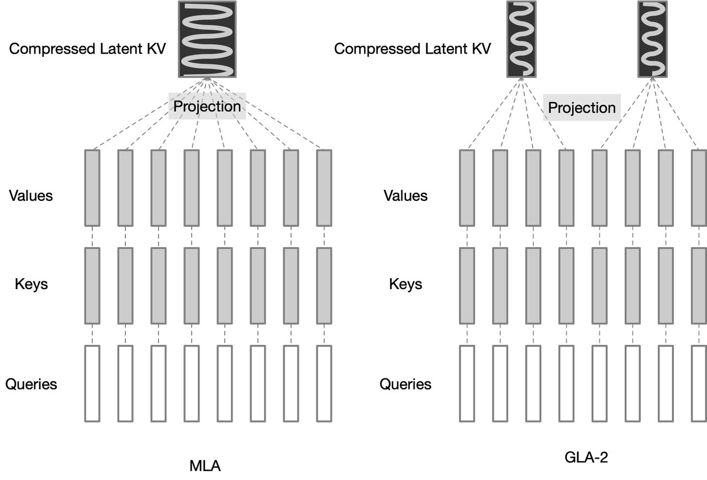

# Hardware-Efficient Attention for Fast Decoding



> **声明：本 note 由 AI Agent（Hermes Agent）自动生成，基于论文全文阅读与分析。生成时间：2025年6月。**

---

## 一句话总结

本文从硬件算术强度（arithmetic intensity）视角重新设计注意力机制，提出 **Grouped-Tied Attention (GTA)** 和 **Grouped Latent Attention (GLA)**，在保持模型质量的同时将 KV 缓存减半、解码速度提升至 FlashMLA 的 2 倍，并实现了更高效的跨设备并行。

---

## 摘要翻译

LLM 解码在大批量和长上下文场景下受限于从高带宽内存（HBM）加载键值（KV）缓存，导致每 token 延迟增加，而解码的顺序性限制了并行化。本文分析了算术强度、并行化与模型质量之间的相互作用，质疑当前架构是否充分利用了现代硬件。本文重新设计注意力机制，使每加载一字节内存时执行更多计算，从而最大化硬件效率且不牺牲并行可扩展性。首先提出 **Grouped-Tied Attention (GTA)**，一种简单变体，将键和值状态组合并重用，在不影响模型质量的前提下减少内存传输。随后引入 **Grouped Latent Attention (GLA)**，一种并行友好的潜在注意力机制，配合底层优化实现快速解码并保持高质量模型。实验表明，GTA 以约一半的 KV 缓存匹配 GQA 的质量；GLA 匹配 MLA 的质量且更易于分片。优化后的 GLA 内核在投机解码设置中（query 长度大于 1 时）比 FlashMLA 快至 2 倍。此外，通过每设备获取更小的 KV 缓存，GLA 在在线服务基准测试中降低了端到端延迟并提升了吞吐量，最高达 2 倍。

---

## 研究动机

1. **推理成为 AI 进步的核心驱动力**：随着 test-time compute（OpenAI, 2024）的发展，推理效率决定了 AI 的进步，需要更多推理感知的架构设计。
2. **解码阶段的内存瓶颈**：标准 MHA 在解码时将 KV 缓存从 HBM 加载到 SRAM，由于算术强度仅约 1（远低于 H100 的理论峰值 295 FLOPs/byte），GPU 利用率极低（可低至 7%）。内存带宽增长（每两年约 1.6×）远落后于计算能力增长（每两年约 3×），导致 memory-bound 问题日益严重。
3. **现有方法的不足**：
   - **MQA** 通过共享单个 KV 头提高算术强度，但牺牲质量和并行性。
   - **GQA** 通过分组共享 KV 头改善质量，但需要较多设备才能显著减少每设备 KV 缓存。
   - **MLA**（DeepSeek）通过低秩联合压缩实现高算术强度，但需要将单一潜在向量复制到所有设备，限制了并行效率。
4. **核心问题**：如何设计注意力机制，使其在保持高质量的同时最大化算术强度，并高效地跨设备并行化？

---

## 方法

### 3.1 算术强度视角

本文以**算术强度（arithmetic intensity，FLOPs per byte）**为核心设计原则。定义组大小 $g_q$ 为每个不同 KV 头对应的查询头数量，它很大程度上决定了算术强度。提高 $g_q$ 可提升算术强度并按比例缩小 KV 缓存，但过大的 $g_q$ 会牺牲并行性（需要复制参数和 KV 缓存到各设备）。

论文给出了各变体的算术强度公式（Table 1），关键结论：
- GLA-2 的算术强度约 $2g_q$（与 GQA 同组数但翻倍）
- KV 缓存大小：$m_{kv} \cdot B \cdot L \cdot \frac{h_q}{g_q} \cdot d_h \times \text{sizeof(dtype)}$
- 零冗余并行约束：$g_q \leq h_q / N$（$N$ 为 TP 分片数）

### 3.2 Grouped-Tied Attention (GTA)

**核心思想**：将键和值合并为一个共享状态（tied KV state），同时只对部分键维度应用 RoPE。

**动机**：
- 奇异值分析表明 key 缓存高度冗余，几乎全部方差由少数主方向捕获。
- 部分维度需要 RoPE 进行位置编码，其余维度处于低秩子空间，可以共享。

**具体设计**：
- 与 GQA 类似，每组查询头共享一个 KV 头，但将键和值投影参数绑定为单一状态（tied KV）。
- 值路径使用 tied KV 的全部维度。
- 键路径使用 tied KV 的前半部分（无位置编码）加上单独的单头投影（应用 RoPE），广播到所有组。
- 结果：KV 缓存大小约为 GQA 的一半，算术强度翻倍，质量保持不变。

形式化表示：
```
KV, K, V ∈ R^{B×L×h_kv×d_h}
K^{RoPE} ∈ R^{B×L×1×d_h/2}
K^{NoPE} ∈ R^{B×L×h_kv×d_h/2}
K^{NoPE} = KV[:, :, :, :d_h/2]
V = KV[:, :, :, :]
K = concat(K^{NoPE}, broadcast(K^{RoPE}, h_kv))
```

### 3.3 Grouped Latent Attention (GLA)

**核心思想**：将潜在表示（latent）分成多个头，实现高效的跨设备分片并行，同时保持与 MLA 相当的质量。

**动机**：
- MLA 缓存单一潜在头（维度 $d_c = 4d_h$），所有设备必须保留完整潜在向量以重建键值，导致 KV 缓存在每个 TP 分片上被复制。
- 当 TP=4 时，MLA 和 GQA-8 每设备占用大致相同的 KV 缓存，但 MLA 无法有效分片。

**具体设计**：
- 将潜在表示压缩为 $h_c$ 个潜在头，每个维度 $d_c = 2d_h$（MLA 的一半）。
- 每个潜在头和其上投影矩阵为组内的查询头重建不同的键值特征。
- 上投影矩阵的列维度为 $g_q d_h$（而非 MLA 的 $h_q d_h$）。
- 在解码阶段通过权重吸收（weight absorption）技巧，每个潜在头仅与其组内的查询头计算注意力。
- 将潜在头分片到 TP 分片上，实现头级并行，无重复 KV 缓存。

**GLA-2 示例**（最常用配置）：
- 两个潜在头 $c^{KV}_0, c^{KV}_1 \in R^{B×L×2d_h}$
- 查询分为两组 $Q_0, Q_1$
- 每个 TP 分片计算本地注意力：$O_i = \text{softmax}(Q_i (c^{KV}_i)^\top) \cdot c^{KV}_i$
- 然后通过 AllReduce 聚合结果
- KV 缓存大小与 MLA 相同（$d_c = 4d_h$），但每设备减半（TP≥2 时）

**算术强度**：
- GLA-2 的算术强度约 $2g_q$（与 GQA 同组数但翻倍），接近 MQA 的最激进共享设计，但质量更好。
- 当 query 长度为 1 时，GLA-128 的算术强度约 128，位于 I/O roof 上；当 query 长度为 2 时（投机解码），GLA 位于拐点，可比 MLA 快约 2×。

### 3.4 系统优化：异步与分布式偏移计算

#### 软件流水线与 warp 专化
- **软件流水线**：在计算当前 KV 块时加载下一个 KV 块，避免 Tensor Core 等待内存。
- **Warp 专化**：分离内存加载（producer warps）和矩阵乘累加（consumer warps），通过 TMA 或异步拷贝指令（cp.async）实现内存加载与计算的重叠。

#### 分布式偏移计算（Distributed Offset Calculation for Paged KV）
- 分页 KV（Paged KV）是标准的 KV 缓存存储方式，但使得 TMA 难以使用。
- 使用异步拷贝指令（cp.async），每个线程独立发出加载指令，但地址计算开销高（64位整数索引，多次乘法）。
- **合作地址计算**：同一 warp 中的多个线程合作计算地址。例如，对 head 维度 128，加载 128×128 块时：
  - 128 线程分为 8 组，每组 16 线程。
  - 每组负责加载其对应的行。
  - 通过 warp shuffle 在组内共享地址。
- 每个线程只需存储 1 行的地址偏移（而非 16 行），极大降低寄存器压力。
- 支持任意页大小（如页大小 1），无性能损失，解锁前缀缓存（prefix caching）和 RadixAttention。

---

## 实验结果

### 实验设置
- 训练模型规模：small (183M), medium (433M), large (876M), XL (1.471B)
- 数据集：FineWeb-Edu-100B，遵循 GPT-3 配置和 Llama 3 架构
- Small 模型训练 25B tokens，其余 50B tokens
- 评测：验证集困惑度（FineWeb-Edu、Wikipedia、C4、Cosmopedia、Pile），零样本下游任务（SciQ、OpenBookQA、ARC-Easy、HellaSwag、PIQA、WinoGrande、MMLU）

### 模型质量

**验证困惑度（Table 2, 3, 4, 5）**：
- **GLA-2 在中等和大规模模型上优于 MLA**：在 large (876M) 模型上，GLA-2 平均困惑度 24.49，MLA 为 24.93；在 XL (1.471B) 模型上，GLA-2 为 10.22（FineWeb-Edu），MLA 为 10.26。
- **GTA-4 在 medium 和 large 模型上优于 GQA-4**：GTA-4 的 XL 模型 FineWeb-Edu 困惑度 10.12 vs GQA-4 的 10.20。
- **GLA-2 与 GLAq-2 在大规模模型上表现相当**，平均困惑度均在 24.49-24.51 范围。

**下游任务（零样本）**：
- **medium (433M)**：GLA-2 平均准确率 55.4%，超过 MLA 的 54.9%。
- **large (876M)**：GLA-2 平均准确率 57.5%，接近 GTA-4 的 57.6%，匹配 GQA-4 的 56.9%。
- **XL (1.471B)**：GLA-2 平均准确率 60.0%，超过 MLA 的 59.1%，接近 GTA-4 和 GQA-4 的 60.2%。

**KV 缓存大小（Table 5）**：
- XL 模型（1.471B）每设备 KV 缓存（TP=2）：GLA-2 为 640 bytes/token，MLA 为 1152 bytes/token，GQA-4 为 1024 bytes/token，GTA-4 为 640 bytes/token。

### 并行化（Section 5.2）

- 在 DeepSeek Coder V2 Base (236B) 上使用 SGLang 框架和 FlashAttention 3 内核进行在线服务基准测试。
- **GLA-8 (h_c=8, d_c=256) 在 8 个 H100 GPU 上**，64 个并发请求下，吞吐量比 MLA（d_c=512）高约 2×。
- GLA-8 纯 TP=8 的性能优于 MLA（TP=2, DP=4）的混合并行。
- 在混合序列长度负载下（一个长序列 + 三个短序列），GLA-8 的吞吐量约 MLA（TP=2, DP=4）的 2.5×。

### 速度（Section 5.3）

- 在 H100 80GB SXM5 上，使用分页 KV（页大小 64）：
  - 标准解码（query 长度 1）：GLA 内核比 FlashMLA 快约 20%。
  - 投机解码（query 长度 2）：GLA 内核比 FlashMLA 快 2× 以上。
- GLA 内核达到 H100 最大内存带宽的 93% 和最大 TFLOPS 的 70%。
- 分页 KV 与 GLA 结合：1.2-1.5× 加速（支持任意页大小）。

---

## 优势

1. **高算术强度**：GLA 在解码时算术强度约 $2g_q$，接近 H100 的 roofline 上限，最大化 GPU 利用率。
2. **并行友好**：潜在头可跨设备分片，无需复制 KV 缓存，实现零冗余并行（zero-redundancy parallelism）。
3. **解码速度快**：GLA 内核在投机解码设置中比 FlashMLA 快 2×，标准解码快 20%。
4. **模型质量优异**：在所有模型规模和基准测试中，GLA 保持或超过 MLA 的质量（困惑度和下游任务准确率）。
5. **KV 缓存更小**：每设备 KV 缓存相比 MLA 减半（TP≥2 时），相比 GQA-4 减少约 37-44%。
6. **低级优化完善**：异步软件流水线、warp 专化、分布式地址计算，支持分页 KV 且任意页大小无性能损失。
7. **灵活性高**：GLA-2 配置（h_c=2, d_c=2d_h）在质量和效率之间取得平衡；可扩展到更多潜在头。
8. **开源**：优化的内核在宽松许可下发布。

---

## 局限

1. **模型规模限制**：当前实验仅在中等规模模型（最大 1.471B）上验证，尚未在数百亿参数模型上进行端到端评估。
2. **小模型表现**：在 small (183M) 模型上，GLA-2 与 MLA 的质量相当或略差，优势不明显。
3. **RoPE 维度的影响**：论文提到 $d_R=32$ 和 $d_R=48$ 的不同设置对结果有影响，但最优配置尚未完全确定。
4. **额外的 KV 缓存开销**：解耦 RoPE 带来的额外 $d_h/2$ 每 token 的 KV 缓存可以部分缓解（如仅在部分层应用 RoPE），但仍有开销。
5. **更大规模模型的泛化性**：论文提出了在 Llama 4 等大规模模型上评估 GLA-8 的方向，但尚未完成。
6. **低秩投影消融**：论文提到对查询和输出投影进行低秩版本的消融实验效果略差，该方向未深入研究。
7. **与 Mamba、Linear Attention 等非注意力架构的比较**：论文未直接比较，仅作为未来方向提及。

---

## 与 EfficientPaper 相关的研究方向

1. **注意力机制设计**：GLA 提供了从硬件算术强度视角设计注意力机制的新范式，可与 GQA、MLA 等方法对比分析。
2. **KV 缓存优化**：GLA 通过分组潜在表示实现 KV 缓存压缩，与 KV 量化（KVQuant）、跨层注意力（Cross-Layer Attention）等方法互补。
3. **推理效率**：GLA 的低级优化（异步流水线、warp 专化、分布式地址计算）为高效推理内核设计提供了系统级参考。
4. **分布式推理**：GLA 的并行友好设计（零冗余并行）为大规模模型的分布式推理提供了新思路，可与张量并行、数据并行、流水线并行等方法结合。
5. **结构化注意力**：GLA 的分组设计思想（从 MHA 到 GQA 再到 GLA）体现了注意力机制的结构化演进，与 Mamba、Linear Attention 等非注意力架构的对比值得关注。
6. **投机解码**：GLA 在投机解码场景中表现出 2× 优势，可与投机解码方法（如 Speculative Decoding、Medusa 等）结合研究。
7. **硬件感知架构设计**：本文的核心设计理念（算术强度、内存带宽、GPU 利用率）为硬件感知架构设计提供了系统性框架，可推广到其他注意力变体或计算模块。
