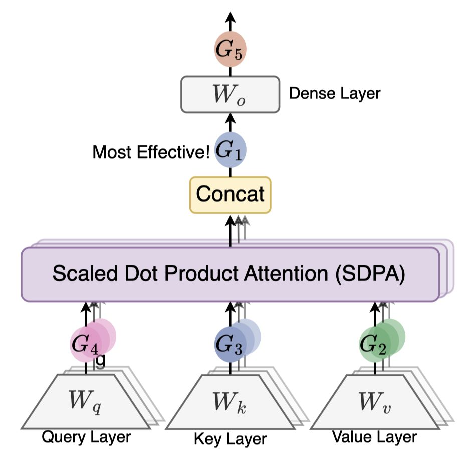

# Gated Attention for Large Language Models: Non-linearity, Sparsity, and Attention-Sink-Free

> Zihan Qiu, Zekun Wang, Bo Zheng, Zeyu Huang, Kaiyue Wen, Songlin Yang, Rui Men, Le Yu, Fei Huang, Suozhi Huang, Dayiheng Liu, Jingren Zhou, Junyang Lin
>
> **发表**: NeurIPS 2025 | **机构**: Qwen Team, Alibaba Group, University of Edinburgh, Stanford University, MIT, Tsinghua University
>
> **代码**: https://github.com/qiuzh20/gated_attention
>
> **论文链接**: http://arxiv.org/abs/2505.06708v1

> ⚠️ **注意**：本 note 由 AI Agent 自动生成（基于论文全文阅读），仅供参考。生成时间：2025年6月。

---

## 一句话总结

在标准 Softmax Attention 的 Scaled Dot-Product Attention (SDPA) 输出后添加逐头、逐元素的 sigmoid 门控（G1），可显著提升模型性能、训练稳定性和长上下文外推能力，其效果源于引入非线性、引入输入依赖稀疏性并消除 attention sink 现象。

---

## 摘要翻译

门控机制已被广泛应用于从 LSTM 和 Highway Networks 等早期模型到最近的状态空间模型、线性注意力以及 Softmax 注意力中。然而，现有文献很少具体考察门控的特定效果。本文通过全面实验系统地研究了门控增强的 Softmax 注意力变体。具体而言，我们在 3.5 万亿 token 数据集上对 15B 参数的混合专家（MoE）模型和 1.7B 参数的密集模型进行了 30 种变体的全面比较。我们的核心发现是：一个简单的修改——在 Scaled Dot-Product Attention (SDPA) 之后应用逐头 sigmoid 门控——能够一致地提升性能。该修改还增强了训练稳定性，容忍更大的学习率，并改善了缩放特性。通过比较不同的门控位置和计算变体，我们将这种有效性归因于两个关键因素：(1) 在 softmax 注意力的低秩映射上引入非线性；(2) 应用查询依赖的稀疏门控分数来调制 SDPA 输出。值得注意的是，我们发现这种稀疏门控机制缓解了"注意力汇聚（attention sink）"问题，并增强了长上下文外推性能，我们还发布了相关代码和模型以促进未来研究。

---

## 研究动机

门控机制在神经网络中已被广泛采用（从 LSTM、GRU 到 Mamba、线性注意力等），但在标准 Softmax Attention 中门控的具体作用仍缺乏深入研究。已有工作（如 Switch Heads、Native Sparse Attention）引入了门控，但未能将门控本身的效果与其他架构因素（如稀疏路由、注意力头选择）解耦。本文的核心动机包括：

1. **理解门控在注意力中的作用**：现有工作将门控与路由机制混合，难以判断门控本身的价值。例如 Switch Heads 引入了 sigmoid 门控选择 top-K 注意力头专家，但作者发现即使退化到单个专家（仅对值输出进行调制），性能增益依然显著，说明门控本身就有独立价值。

2. **解决 Attention Sink 问题**：Xiao et al. (2023) 发现 LLM 中存在"注意力汇聚"现象，即初始 token 获得过高的注意力分数。现有工作虽提出了多种缓解方案，但缺乏系统性分析。

3. **改善训练稳定性**：增加网络深度、使用大学习率和大 batch size 可提升性能，但常导致训练不稳定（loss spike）。本文希望探索门控是否能缓解这一问题。

---

## 方法（技术细节）

### 核心方法：SDPA 输出逐头 sigmoid 门控

本文提出的最有效方案为 **G1 门控**：在 Multi-Head Attention 的 SDPA 输出（Concat 之后、Wo 之前）应用逐头、逐元素的 sigmoid 门控：

$$Y' = Y \odot \sigma(X W_\theta)$$

其中 $Y$ 为 SDPA 输出，$X$ 为预归一化后的隐藏状态，$\sigma$ 为 sigmoid 激活函数，$W_\theta$ 为可学习参数，$Y'$ 为门控后的输出。

### 系统性探索的五个维度

本文系统性地探索了门控机制的五个关键维度：

1. **位置（Positions）**：
   - G1: SDPA 输出后（最有效）
   - G2: Value 投影后（次有效）
   - G3: Key 投影后
   - G4: Query 投影后
   - G5: 最终密集输出层后（无效）

2. **粒度（Granularity）**：
   - Headwise（逐头标量门控）
   - Elementwise（逐元素向量门控）

3. **头部特异性（Head Specific/Shared）**：
   - Head-Specific（每个注意力头独立的门控分数）
   - Head-Shared（跨头共享门控分数）

4. **乘法/加法（Multiplicative/Additive）**：
   - 乘法门控：$Y' = Y \cdot \sigma(XW_\theta)$（更优）
   - 加法门控：$Y' = Y + \sigma(XW_\theta)$

5. **激活函数（Activation Function）**：
   - sigmoid（更优）
   - SiLU

### 两个关键机制

#### 机制一：非线性增强低秩映射的表达能力

标准注意力中，Value 投影 $W_V$ 和输出投影 $W_O$ 是两个连续的线性变换，可合并为一个低秩线性映射（$W_V^k W_O^k$）。在 GQA 中，多个头共享 $W_V$，进一步降低了表达能力。

通过在 G1 或 G2 位置引入门控（或 RMSNorm），可以在两个线性变换之间插入非线性，从而增强低秩映射的表达能力：

- G2 门控对应于在 $W_V$ 之前添加非线性：$o_i^k = (\sum_j S_{ij}^k \cdot \text{NL}(X_j W_V^k)) W_O^k$
- G1 门控对应于在 $W_O$ 之前添加非线性：$o_i^k = \text{NL}(\sum_j S_{ij}^k \cdot X_j W_V^k) W_O^k$

这也解释了为什么在 G5（$W_O$ 之后）添加门控无效——它没有解决 $W_V$ 和 $W_O$ 之间缺乏非线性的问题。

#### 机制二：输入依赖稀疏性消除 Attention Sink

SDPA 输出门控（G1）产生的门控分数具有显著的稀疏性（平均值仅 0.116），分布高度集中于 0 附近。这种稀疏性带来两个效果：

1. **过滤与查询无关的上下文信息**：门控分数基于当前查询的隐藏状态计算（查询依赖），而非基于历史 key/value，因此能动态过滤无关信息。

2. **消除 Attention Sink**：基准模型中，第一 token 平均获得 46.7% 的注意力分数；添加门控后降至 4.8%。这与 massive activation 的减少有关——门控引入的稀疏性降低了模型中的巨大激活值，从而减少了 BF16 训练中的数值误差，提升训练稳定性。

### 模型配置

- **MoE 模型**：15B 总参数（2.54B 激活），128 个专家，top-8 softmax 门控，GQA，3.5T token 训练
- **Dense 模型**：1.7B 参数，28/48 层，400B-3.5T token 训练
- 门控额外参数极少（MoE 模型不到 2M），wall-time 延迟增加不到 2%
- 使用 AdamW 优化器，cosine 学习率衰减

---

## 实验结果

### MoE 模型（15B MoE, 400B tokens）

| 变体 | PPL | Hellaswag | MMLU | GSM8k | C-eval |
|------|------|-----------|------|-------|--------|
| Baseline | 6.026 | 73.07 | 58.79 | 52.92 | 60.26 |
| **G1 SDPA Elementwise** | **5.761** | **74.64** | **60.82** | **55.27** | **62.20** |
| G2 v Elementwise | 5.820 | 74.38 | 59.17 | 53.97 | 61.00 |

- G1 门控 PPL 降低超过 0.2，各 benchmark 均有提升
- G1 优于 G2（值投影门控），G3/G4/G5 效果不明显
- Headwise vs Elementwise 差异不大，关键是 Head-Specific
- Sigmoid 优于 SiLU，乘法门控优于加法门控

### Dense 模型（1.7B, 多种配置）

- 在 400B token、1.7B、28 层配置中，G1 门控 PPL 降低约 0.1（7.499→7.404）
- 在 3.5T token、3.5T 配置中，G1 门控 PPL 降低约 0.05（6.180→6.130）
- **训练稳定性**：添加门控后几乎消除了 loss spike，允许使用更大学习率
- **48 层模型**：学习率从 4e-3 增加到 8e-3 时，baseline 收敛失败（PPL 9.195），而 SDPA 门控模型仍能正常训练（PPL 7.325）
- 在 1T token、8e-3 学习率设置下，baseline 发散，但 SDPA 门控模型正常训练（PPL 7.078）

### 长上下文外推（RULER Benchmark）

| 方法 | 4k | 8k | 16k | 32k | 64k | 128k |
|------|------|------|------|------|------|------|
| Baseline | 88.89 | 85.88 | 83.15 | 79.50 | - | - |
| SDPA-Gate | 90.56 | 87.11 | 84.61 | 79.77 | - | - |
| YaRN Baseline | 82.90 | 71.52 | 61.23 | 37.94 | 37.51 | 31.65 |
| **YaRN SDPA-Gate** | **88.13** | **80.01** | **76.74** | **72.88** | **66.60** | **58.82** |

- 在 128k 上下文长度下，门控模型（58.82）远超 baseline（31.65），提升超过 27 个点
- 门控模型在 YaRN 扩展后性能下降更少（4k: -2.4 vs -6.0，32k: -6.89 vs -41.56）

### Attention Sink 消除效果

- Baseline 模型：第一 token 平均获得 46.7% 的注意力分数
- SDPA 门控模型：第一 token 仅获得 4.8% 的注意力分数
- Layer 21 的 baseline 模型 83% 的注意力指向第一 token，门控后降至 4%

---

## 优势

1. **极简高效**：仅需在 SDPA 输出后添加一个 sigmoid 门控，额外参数不到 2M（MoE 模型），wall-time 延迟增加不到 2%。

2. **性能全面提升**：在 PPL、MMLU、Hellaswag、GSM8k、C-eval 等多个 benchmark 上均有一致提升（PPL 降低超过 0.2）。

3. **训练稳定性显著增强**：几乎消除 loss spike，容忍更大的学习率（如从 4e-3 到 8e-3），使 48 层 1.7B 模型在 baseline 发散的情况下仍能稳定训练。

4. **消除 Attention Sink**：将第一 token 的注意力分数从 46.7% 降至 4.8%，是首个在密集模型和 MoE 模型上（3.5T token 训练）均实现无 attention sink 的方法。

5. **长上下文外推能力显著增强**：在 RULER benchmark 上，使用 YaRN 扩展到 128k 时，门控模型比 baseline 提升超过 27 个点。

6. **理论分析清晰**：从非线性和稀疏性两个角度解释了门控的有效性，具有较好的可解释性。

7. **通用性强**：在 MoE 和 Dense 模型上均有效，适用于不同模型架构和训练设置。

---

## 局限

1. **理论分析不充分**：虽然非线性分析有一定深度，但对注意力动力学和整体训练过程的更广泛影响仍待探索。论文自身承认，对于 Attention Sink 如何影响模型的长序列泛化能力，缺乏严格的理论解释。

2. **长上下文分析有限**：虽观察到门控消除 attention sink 后长上下文性能提升，但未提供 Attention Sink 与长序列泛化能力之间因果关系的理论证明。

3. **训练稳定性根因未完全揭示**：虽然门控减少了 massive activation，但论文指出 clipping 操作并不能完全解决训练不稳定问题，说明不稳定性可能还有其他来源（如任意层产生大输出）。

4. **仅验证了 sigmoid 门控**：系统性实验主要围绕 sigmoid 门控，对其他类型的门控（如 softmax 门控、tanh 门控）的探索有限。

5. **模型规模限制**：主要在 1.7B 和 15B 模型上验证，更大规模（如 70B、100B+）的验证缺失。

---

## 与 EfficientPaper 相关的研究方向

本文与 EfficientPaper 中的 **structure_design** 关键词高度相关，涉及以下研究方向：

1. **注意力机制优化**：本工作提出了一种极简的注意力增强方案，可与其他注意力优化技术（如线性注意力、稀疏注意力、分组查询注意力 GQA）结合使用，为构建更高效的注意力架构提供了新思路。

2. **门控机制在 Transformer 中的应用**：本文系统性地探索了门控在 Softmax Attention 中的位置、粒度、激活函数等维度，为后续门控机制的设计提供了全面的参考。

3. **Attention Sink 缓解方案**：本文提出了通过 SDPA 输出门控消除 attention sink 的方法，可与已有的 attention sink 缓解方案（如 StreamingLLM、SoftPick 等）进行对比和集成。

4. **长上下文建模**：门控机制使模型在长上下文外推中表现显著优于 baseline，对 RULER benchmark 的提升尤为显著，为长上下文 LLM 的训练和推理提供了重要参考。

5. **训练稳定性与 Scaling**：门控机制显著提升了训练稳定性，使更大更复杂的模型（如 48 层 1.7B 模型）能够使用更大的学习率稳定训练，这对 LLM 的 scaling law 研究具有重要意义。

6. **MoE 模型优化**：在 MoE 模型中，门控机制（仅增加不到 2M 参数）即可带来显著性能提升，为 MoE 架构的进一步优化提供了新思路。

7. **与 Attention Sink-Free 相关的后续研究**：本文发布了首个 attention sink-free 的模型，可作为后续研究的基准，推动 Attention Sink 缓解、长上下文建模、训练稳定性等方向的发展。
