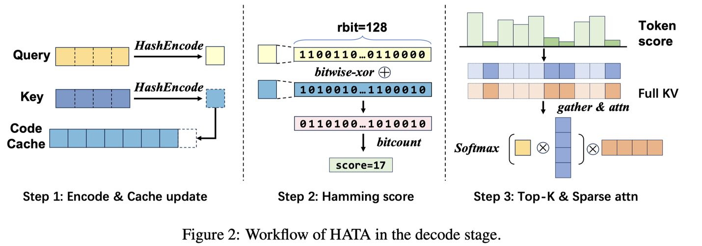

# HATA: Trainable and Hardware-Efficient Hash-Aware Top-k Attention for Scalable Large Model Inference

> Ping Gong, Jiawei Yi, Shengnan Wang, Juncheng Zhang, Zewen Jin, Ouxiang Zhou, Ruibo Liu, Guanbin Xu, Youhui Bai, Bowen Ye, Kun Yuan, Tong Yang, Gong Zhang, Renhai Chen, Feng Wu, Cheng Li

---

> **⚠️ AI 生成声明**：本 note 由 AI Agent（Hermes Agent）于 2025 年自动撰写生成，基于论文全文内容进行整理和分析。生成时间与 `update_time` 字段对应。内容可能不完全覆盖论文的所有细节，仅供参考。

---

## 一句话总结

HATA 通过将 Query 和 Key 映射为二进制哈希码，利用可学习的哈希函数实现硬件高效的 Top-k 注意力机制，在保持模型精度的同时实现最高 7.2 倍的推理加速，显著优于 Loki、Quest 等现有 Top-k 注意力方法。

---

## 摘要翻译

大语言模型（LLM）已成为关键研究领域，但注意力模块仍是 LLM 推理的关键瓶颈，即使有 KVCache 等技术来减少冗余计算。虽然各种 Top-k 注意力机制已被提出以利用注意力的内在稀疏性加速 LLM 推理，但它们往往难以在效率和精度之间取得平衡。本文介绍了 HATA（Hash-Aware Top-k Attention），一种系统地将低开销的学习哈希技术融入 Top-k 注意力过程的新方法。与现有致力于精确估计 QK 分数（通常开销巨大）的 Top-k 注意力方法不同，HATA 将 Query 和 Key 映射为二进制哈希码，以极低的成本获取 QK 分数的相对顺序，这对于实现 Top-k 注意力已经足够。大量实验表明，HATA 在保持模型精度的同时，相比原始全注意力实现了最高 7.2 倍的加速。此外，HATA 在多个主流 LLM 模型和多样任务上，在精度和效率方面均优于现有最优 Top-k 注意力方法。HATA 已在 https://github.com/gpzlx1/HATA 开源。

---

## 研究动机

### 背景问题

- **KVCache 是 LLM 推理的主流范式**，通过缓存 K/V 向量避免重复计算。然而，在长上下文序列和大 batch size 场景下，KVCache 的内存加载成为瓶颈——例如，处理 32K token 序列时注意力模块可占总推理时间的 70% 以上。
- **注意力瓶颈不仅来自计算复杂度**，还来自内存带宽限制：每个解码步骤都需要加载整个 KVCache，产生大量数据搬运开销。

### Top-k 注意力的现有局限

1. **低秩方法**（如 Loki、InfiniGen）：通过在投影维度子集上计算点积降低开销，但需要保留足够维度以保证估计精度，性能提升有限。
2. **块级方法**（如 Quest、InfLLM）：将 Key 分组为连续块并估计块级 QK 分数上界，但粗粒度估计可能导致关键 Token 被排除，且选择整个块会加载不相关的 Key，浪费内存带宽。

### 核心洞察

> **关键假设**：现有的 Top-k 注意力方法都假设精确的 QK 分数数值估计对于复制全注意力的效果至关重要。

**HATA 挑战了这一假设**，证明只需要**相对 QK 分数排序**（而非绝对数值大小）即可识别最相关的 Key。这将问题重新定义为**轻量级序数比较任务**（判断 $s_{qk_i} > s_{qk_j}$），而非数值回归任务，从而消除了昂贵的高保真分数近似需求。

### 学习哈希的启示

学习哈希（Learning-to-Hash）广泛用于相似性检索任务（如图像搜索），可将高维连续向量映射为紧凑的二进制哈希码，同时保持相对相似性关系（相似向量具有较小的汉明距离）。这为 HATA 提供了理论基础。

### 挑战

- **建模挑战**：如何设计有效的哈希模型来学习 Query 和 Key 的哈希码？
- **实现挑战**：需要高性能的 GPU 实现才能在实际推理中获得实际加速。

---

## 方法（技术细节）

### 3.1 学习哈希建模（Learning-to-Hash for Top-k Attention）

#### 哈希模型设计

给定 Query $q$ 和多个 Key $K := \{k_i\}_{i=1}^{n}$，学习哈希码的目标函数为：

$$\min \sum_i sim(q, k_i) \|h(q) - h(k_i)\|_2$$

约束条件：
- $h(q), h(k_i) \in \{-1, 1\}^r$（二进制哈希码）
- $\sum_i h(k_i) = 0$（比特平衡约束）
- $\frac{1}{n} \sum_i h(k_i)h(k_i)^T = I_r$（比特不相关约束）

#### 哈希函数定义

$$h(x) = \text{sign}(x W_H)$$

其中 $W_H$ 是可训练的哈希权重。

由于 sign 函数不可微分，进行松弛：

$$h(x) = 2 \cdot \text{Sigmoid}(\sigma \cdot x W_H) - 1$$

其中 $\sigma \in (0, 1)$ 是防止梯度消失的超参数。

#### 最终优化目标（多 Query 扩展）

$$\min_{\epsilon} \sum_j \sum_i s_{j,i} \|h(q_j) - h(k_{j,i})\|_2 + \eta \sum_j \|\sum_i h(k_{j,i})\|^2 + \lambda \|W_H^T W_H - I_r\|$$

其中 $s_{j,i} = sim(q_j, k_i)$。

- 每个注意力头训练独立的哈希权重 $W_H$。

#### 训练数据构造

1. 在 prefill 阶段，收集每个注意力头的 Q 和 K 向量
2. 对每个 head，采样 Query $q_j$ 并计算与所有 Key 的 QK 分数
3. **正样本**：Top 10% 的 $(q_j, k_i)$ 对，标签为线性衰减的 $s_{j,i} \in [1, 20]$
4. **负样本**：剩余 90%，标签固定为 $s_{j,i} = -1$
5. 训练数据组织为三元组 $(q_j, k_i, s_{j,i})$
6. 数据来源：Qasper（短序列）、LSHT 和 RepoBench-P（中等长度）、LongBench-v2（超长序列）
7. 每个模型的训练集包含 150K–300K 个 QK 对

#### 训练超参数

- $\sigma = 0.1$, $\epsilon = 0.01$, $\lambda = 1.0$, $\eta = 2.0$
- SGD 优化器：学习率 0.1，权重衰减 $10^{-6}$，动量 0.9
- 15 个 epoch，每个 epoch 20 次迭代
- 哈希位数默认 $r_{bit} = 128$

### 3.2 HATA Top-k 注意力算法

#### Prefill 阶段

1. 计算并缓存 Key 的哈希码：$K_H \leftarrow \text{HashEncode}(K)$
2. 填充哈希码缓存和 KVCache
3. 计算注意力输出

#### Decode 阶段（核心创新）

1. **Encode & Cache 更新**：对新生成的 Query 和 Key 执行 HashEncode，生成 Query 哈希码 $Q_H$ 和 Key 哈希码 $K_H$，并更新 Key 哈希码缓存
2. **汉明距离计算**：使用硬件高效操作 `bitwise_xor` + `bitcount` 计算 $Q_H$ 与所有缓存 Key 哈希码之间的汉明距离
3. **Top-k 选择与稀疏注意力**：根据哈希分数选择最相关的 Key-Value 对，执行稀疏注意力计算

> 对于 GQA（Grouped-Query Attention），多个 Query 共享同一 KVCache，需对共享 KVCache 的分数进行聚合。

#### 关键区别

与现有方法的**绝对分数估计**不同，HATA 仅需要**相对排序**即可，通过二进制哈希码的汉明距离以极低成本完成。

### 4. 硬件高效优化

HATA 的实现包含 1,470 行 C++/CUDA 代码（自定义 GPU kernel）和 940 行 Python 代码，基于 PyTorch 和 FlashInfer。

#### 优化 1：Kernel Fusion for Hash Encoding

- 将线性投影、Sign 函数、BitPack 和缓存更新操作融合为单个 CUDA kernel
- 减少 CPU-GPU 同步开销，降低端到端推理延迟

#### 优化 2：高性能汉明分数算子

- 自定义 GPU 算子：将 Query 和 Key 加载为多个整数 → XOR 操作 → popc/popcll 指令计数 → 归约操作
- 使用 coalesced memory access 优化内存带宽
- **该优化使注意力模块延迟降低 53.2%**

#### 优化 3：融合 Gather 与 FlashAttention

- 将 Gather 操作与 FlashAttention kernel 集成
- 减少 HBM 到 SRAM 的冗余数据传输
- **该优化使延迟降低 23.8%**

#### 优化效果

完整优化后的 HATA 相比简单 PyTorch 实现实现 **6.53 倍加速**：
- Score 算子贡献 53.2%
- FusedAttn 贡献 23.8%
- Encode 融合贡献 7.6%

---

## 实验结果

### 实验设置

- **平台**：48GB HBM GPU（149.7 TFLOPS FP16），Ubuntu 24.04，CUDA 12.1，PyTorch 2.4，FlashInfer
- **模型**：Llama-2-7B-32K-Instruct（MHA），Llama-3.1-8B-Instruct（GQA），Qwen2.5-14B-Instruct-1M，Qwen2.5-32B-Instruct
- **基准方法**：Loki（低秩）、Quest（块级）、MagicPIG（LSH）、StreamingLLM、H2O、SnapKV、Dense（全注意力）
- **配置**：HATA 默认 $r_{bit}=128$，前两层使用 vanilla attention，token budget 通常为序列长度的 1.56%–3.13%

### 准确性评估

#### LongBench-e（多任务基准）

- **Llama2**：HATA 平均精度 34.60（Dense 34.47），优于 Loki（32.78）、Quest（32.64）
- **Llama3.1**：HATA 平均精度 53.94（Dense 54.10），优于 Loki（53.23）、Quest（52.19）
- **结论**：HATA 在大多数任务上达到与全注意力可比的精度，且优于所有基准方法

#### RULER（长上下文检索任务）

- **Llama2（32K，token budget=1024/3.13%）**：HATA 平均 63.91（Dense 65.04），远超 Loki（7.16）、Quest（56.37）
- **Llama3.1（128K，token budget=2048/1.56%）**：HATA 平均 80.57（Dense 82.68），远超 Loki（77.80）、Quest（72.55）
- **结论**：在长上下文场景下，HATA 显著优于其他方法，精度损失极小

#### InfiniteBench（平均 214K 长度）

- HATA 与 Dense 精度几乎无差异（44.77 vs 45.17）

#### LongBench-v2

- HATA 在多数场景下与精确 Top-k attention 可比，甚至在某些场景更优

#### Needle-in-a-Haystack

- HATA 在 Llama2（1K-32K）和 Llama3.1（32K-128K）上均达到与 Dense attention 相似的检索精度

#### Qwen2.5-14B 和 Qwen2.5-32B 扩展

- 在 LongBench-e 上保持近无损精度
- RULER-256K 上 Qwen2.5-14B 的 HATA 精度（88.05）与精确 Top-k（87.12）和 Dense（87.95）可比

### 效率评估

#### 端到端推理效率

- HATA、Loki、Quest 均比 vanilla attention 有显著加速
- **HATA 解码效率最高**
- 三者的预填充时间与 vanilla attention 相似，因此均能提升端到端效率

#### 解码效率（不同 batch size 和序列长度）

- **Batch size=8，序列长度=32K**：HATA 相比 Dense 实现 **7.20 倍加速**，相比 Loki **1.99 倍加速**
- **Batch size=1，序列长度=256K**：HATA 相比 Dense 实现 **6.51 倍加速**，相比 Loki **2.21 倍加速**，相比 Quest **1.19 倍加速**
- **结论**：序列越长、batch 越大，HATA 加速比越高

#### KVCache Offloading 性能（HATA-off）

- **Llama2**：相比 MagicPIG 实现 6.04 倍 prefill 加速、2.54 倍 decode 加速
- **Llama3.1**：相比 MagicPIG 实现 1.32 倍 prefill 加速、2.63 倍 decode 加速
- 优势来源：(1) 消除 MagicPIG 的高开销 LSH 哈希（1500 位哈希码用于 128 维向量）；(2) GPU 优化的注意力与轻量哈希

### 消融实验

#### Token Budget 消融

- HATA 在各种 budget 下持续优于 Quest 和 Loki
- 在 0.4% token ratio 下仍保持可接受性能

#### Hash Bit 数消融

- rbit 从 32 增加到 128 时精度持续提升
- rbit=128 时精度接近无损水平
- 进一步增加 rbit 仅引起微小波动

---

## 优势

1. **核心理论创新**：将 Top-k 注意力重新定义为轻量级序数比较任务，挑战了"精确 QK 分数估计是必要的"这一假设
2. **极致性能**：最高 7.2 倍加速，同时保持与全注意力可比的精度
3. **硬件高效**：利用 XOR 和 bitcount 等原生位操作，通过三项 GPU 优化（Kernel Fusion、高性能汉明分数算子、融合 Gather 与 FlashAttention）实现 6.53 倍优化
4. **可扩展性**：在 7B 到 32B 模型上均有效，支持 MHA、GQA，可处理超长上下文（256K+）
5. **即插即用**：可无缝集成到现有推理框架中，仅需替换标准注意力
6. **低开销预填充**：HashEncode 的时间复杂度为 O(s × d × rbit)，远低于标准注意力的 O(s²d + s²)，预填充额外开销不足 1%
7. **正交性**：可与 KVCache 压缩、量化、offloading 等方法正交组合
8. **开源实现**：PyTorch + FlashInfer，包含 C++/CUDA kernel

---

## 局限

1. **训练数据规模有限**：当前训练数据来自有限数量的序列，扩展数据多样性和规模可进一步提升哈希权重质量
2. **适用场景有限**：HATA 主要针对长上下文或大 batch size 场景，在小 batch size 和短序列下无显著加速（注意力模块不是瓶颈）
3. **未支持 MLA**：Multi-Latent Head Attention（DeepSeek-V3）尚未测试，作为未来工作
4. **需要训练**：需要在少量数据上训练哈希权重（虽然训练成本低，但相比纯推理方法仍有额外步骤）
5. **HashBit 数选择**：rbit=128 是经验最优值，但可能需要针对不同模型和任务调整
6. **前两层使用 vanilla attention**：这是 top-k attention 方法的常见做法，但引入了额外复杂性

---

## 与 EfficientPaper 相关的研究方向

### 直接相关

- **Top-k 注意力加速**：HATA 是 top-k 注意力家族的新成员，与 SnapKV、Quest、Loki 等方法互补
- **KVCache 优化**：HATA 通过稀疏化减少 KVCache 加载开销，可与 KVCache 压缩（如量化）和 offloading 正交结合
- **学习哈希在 LLM 推理中的应用**：验证了学习哈希在 attention 计算中的有效性，与 HashAttention（并发工作）形成对比
- **Hardware-aware 推理优化**：展示了如何通过 kernel fusion、自定义算子和内存优化来弥合理论与实际性能的差距

### 相关 Baseline 方法

- **SeerAttention**（2024）：通过训练方法预测重要性，与 HATA 的学习哈希思路有相似之处
- **SnapKV**（2024）：利用历史信息预测当前重要性，属于 KVCache 压缩方法
- **Quest**（2024）：基于块级重要性估计的 Top-k 注意力
- **MagicPIG**（2024）：使用 LSH 进行 Top-k 注意力，但需要高比特哈希，效率和精度受限

### 潜在研究方向

1. **与其他注意力优化方法结合**：如线性注意力、FlashAttention 等
2. **更大规模模型和更长上下文**：HATA 已在 Qwen2.5-14B/32B 上验证，但更大模型（70B+）和更长上下文（1M+）的验证仍有空间
3. **MLA 适配**：DeepSeek-V3 的 MLA 机制与 HATA 的结合
4. **训练数据改进**：扩大训练数据的多样性和规模
5. **自适应哈希位数**：根据任务和序列长度动态调整 rbit
6. **哈希权重的共享与迁移**：探索在不同模型和任务间共享哈希权重的可能性
7. **端到端推理系统集成**：将 HATA 集成到 vLLM、SGLang 等主流推理框架中

---

## 参考信息

- **arXiv**: http://arxiv.org/abs/2506.02572v1
- **代码**: https://github.com/gpzlx1/HATA
- **类型**: Pytorch
- **关键词**: kv_cache_sparse
- **发表年份**: 2025
- **机构**: 中国科学技术大学、华为、北京大学
- **Baseline 方法**: SeerAttention, SnapKV, Quest
