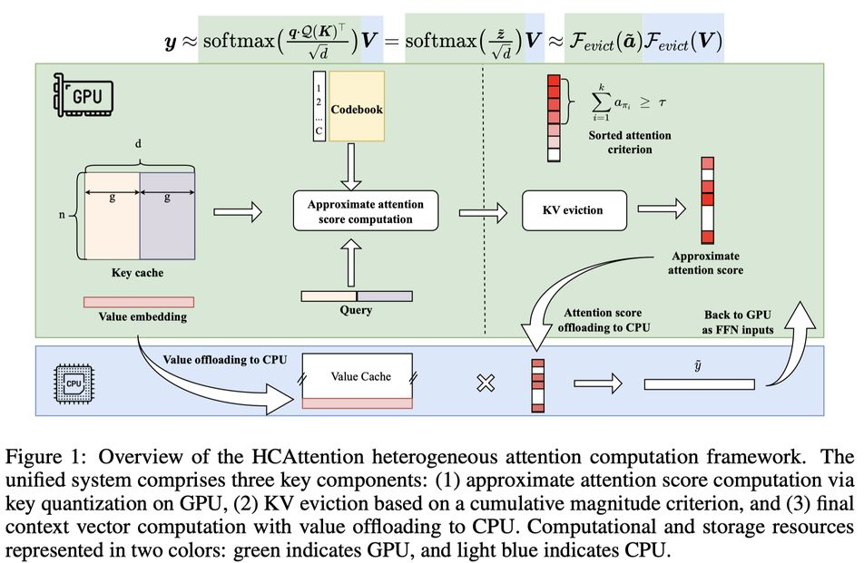

# HCAttention: Extreme KV Cache Compression via Heterogeneous Attention Computing for LLMs

> Dongquan Yang, Yifan Yang, Xiaotian Yu, Xianbiao Qi, Rong Xiao

---

## 一句话总结

HCAttention 是一个异构注意力计算框架，通过**键量化 + 值卸载到 CPU + 动态 KV 驱逐**三者协同，将 LLM 推理的 KV 缓存压缩至原始大小的 12.5%（GPU 内存仅存键索引，值存储在 CPU），在 LongBench 上几乎不损失精度，且首次将 Llama-3-8B 扩展至在单张 A100（80GB）上处理 400 万 token。

---

## 摘要翻译

处理长上下文输入时，大语言模型面临的一个重大挑战是推理过程中键值（KV）缓存对内存的巨大需求。现有的 KV 缓存压缩方法在内存压缩超过 85% 时会出现明显的性能下降。此外，利用 GPU-CPU 协作进行近似注意力计算的策略在此场景中仍未被充分探索。我们提出 HCAttention，一个异构注意力计算框架，集成了键量化、值卸载和动态 KV 驱逐，以在极端内存约束下实现高效推理。该方法兼容现有 Transformer 架构，不需要模型微调。在 LongBench 基准上的实验结果表明，我们的方法在将 KV 缓存内存占用缩小至原始大小的 25% 的同时，保持了全注意力模型的精度。值得注意的是，即使仅使用 12.5% 的缓存，它仍保持了竞争力，在 LLM KV 缓存压缩领域达到了新的 state-of-the-art。据我们所知，HCAttention 首次将 Llama-3-8B 模型扩展到在单张 80GB A100 GPU 上处理 400 万 token。

---

## 研究动机

1. **长上下文推理的内存瓶颈**：LLM 推理时 KV 缓存随序列长度线性增长。例如 OPT-175B 在 batch=128、序列长度=2048 时，KV 缓存需要约 950GB，是模型参数的三倍。
2. **现有压缩方法的局限**：已有方法（H2O、TOVA、DuoAttention、StreamingLLM 等）在压缩超过 85% 后性能显著下降，且永久驱逐策略会丢弃后期可能重要的 token。
3. **异构计算的潜力未被充分挖掘**：值向量（Value）在 KV 缓存中占据主要内存，但只在最终加权求和时使用，非常适合卸载到 CPU。然而，GPU-CPU 协作在 KV 缓存压缩中的应用仍不充分。
4. **核心问题**：如何在极端 KV 缓存压缩下（<15%），动态驱逐冗余 KV 条目并保留所有对模型性能至关重要的 token，同时不牺牲推理速度和准确性？

---

## 方法（技术细节）

HCAttention 框架包含三个核心组件，协同工作实现极端 KV 缓存压缩：

### 1. 键量化（Key Quantization）

- **目标**：压缩键向量，减少 GPU 内存占用。
- **方法**：采用**分组向量量化**（Grouped Vector Quantization），将 d 维键嵌入空间划分为 g 个不相交子空间（每组维度 d̄ = d/g）。
- **码本构建**：离线使用代表性验证集，对每组子向量执行 K-means 聚类，生成码本 C ∈ R^{g×c×d̄}（c 为聚类中心数）。
- **量化表示**：键矩阵 K 被压缩为索引矩阵 P ∈ Z^{n×g}，其中 P_{i,j} ∈ {1,...,c}，仅存储索引而非原始向量。
- **内存压缩比**：
  - g=64 时：键内存压缩至原来的 1/2（g/d = 64/128）
  - g=32 时：键内存压缩至原来的 1/4（g/d = 32/128）
- **注意事项**：码本使用 MiniBatchKMeans（Scikit-learn）生成，3 个随机样本，最多 200 次迭代，批次大小 10000。

### 2. 异构注意力计算（Heterogeneous Attention Computation）

标准注意力计算为 y = softmax(q·K^⊤/√d)V。HCAttention 通过两层近似减少内存和计算复杂度：

#### GPU 端（键量化近似）

- 将 K 按组划分，每组用码本最近邻表示。查询 q 同样分组。
- 计算查询与码本的中间哈希表 T = q̄·C ∈ R^{g×c}，计算成本为 O(dc)，**与序列长度 n 无关**。
- 近似注意力分数：z̃_j = Σ_{i=1}^{g} T_{i,P_{j,i}}，通过索引操作聚合。
- 近似注意力：ã = softmax(z̃/√d)
- **计算成本**：
  - 乘法：从 O(n²d) 降至 O(ndc)
  - 加法：从 O(n²d) 降至 O(n²g)

#### 动态 KV 驱逐（Dynamic KV Eviction）

- **驱逐标准**：基于累积注意力分数幅度（cumulative magnitude）。
- 将 ã 按降序排列，给定阈值 τ ∈ (0,1]，选择累积贡献超过 τ 的最小 token 子集 k*：
  - k* = min{k : Σ_{i=1}^{k} a_{π_i} ≥ τ}
- **逐层动态**：不同层的 token 重要性分布不同，驱逐策略在各层独立执行。
- **阈值 τ=0.9**：保留约 15.6% 的 token，在精度和效率间取得最佳平衡。
- 实验表明，早期层允许激进驱逐，中间层需要谨慎，最终层随任务变化。

#### CPU 端（值卸载 + 最终计算）

- **值矩阵完全卸载**到 CPU 内存（V ∈ R^{n×d}），释放一半 GPU 内存。
- 最终输出：y̆ ≈ ã*V* = Σ_{i∈Π_{k*}} ã*_i × V_i
- 仅将选定的注意力分数和索引传输到 CPU，通信开销极低（例如 Llama-3-8B 处理 10⁶ token 时约 102.4 MB）。

### 3. 内存压缩比总结

| 策略 | K 预算 | V 预算 | 总计 |
|------|--------|--------|------|
| Full-attention | 100% | 100% | 100% |
| Value Offloading (VO) | 100% | 0% | 50% |
| VO + 量化 (g=64) | 50% | 0% | 25% |
| VO + 量化 (g=32) | 25% | 0% | 12.5% |

### 4. 增强预填充（Block-wise Attention）

- 受 Star Attention 启发，采用块分解策略将全局注意力分解为局部计算。
- 在预填充阶段，仅在锚块和当前处理块之间计算注意力，显著提升计算效率。
- 块操作结束后，键缓存的量化可进一步增强效率。

---

## 实验结果

### 实验设置

- **模型**：Llama-2-7B-32K-Instruct、Llama-3-8B-Instruct-Gradient-1048k
- **基准**：LongBench（单文档 QA、多文档 QA、摘要、代码补全等）、Needle-in-a-Haystack (NIAH)
- **基线方法**：Full（无压缩）、H2O、TOVA、DuoAttention (Duo)、StreamingLLM (SLLM)
- **内存预算**：Full、50%（仅值卸载）、25%（VO + g=64 量化）、12.5%（VO + g=32 量化）
- **阈值 τ=0.9**
- **硬件**：2×Intel Xeon 8358P CPU, 1TB RAM, 8×NVIDIA A100 80GB GPU
- **软件**：PyTorch 2.5.1+cu121, HuggingFace Transformers 4.45.2

### LongBench 主要结果

- **25% 内存预算**（Llama-3-8B-Instruct-1048K）：平均分 43.2，与全注意力（43.2）**完全持平**。
- **12.5% 内存预算**（Llama-3-8B-Instruct-1048K）：平均分 42.5，仅下降 0.7 分，**明显优于**所有基线方法。
- **50% 内存预算**（Llama-2-7B-Instruct-32K）：平均分 41.5，高于全注意力（42.0）仅 0.5 分差距。
- 在多个任务上（如 MultiFieldQA-en、Qasper、HotpotQA 等），HCAttention 在 25% 预算下甚至超越全注意力。

### NIAH 结果

- DuoAttention 在 50% 预算下表现尚可，但低于 25% 时**性能崩塌**。
- HCAttention 在 50%、25% 下均接近全注意力，在 12.5% 下仍保持有效。
- 多种"针"文本测试均验证了方法的鲁棒性。

### 效率结果

- 结合 FlashAttention2，HCAttention 将 Llama-3-8B 扩展到在单张 A100（80GB）上处理 **400 万 token**。

### 消融实验

1. **KV 驱逐阈值**：
   - τ=0.9（保留 15.6% token）取得最佳平均分（47.2 vs 全注意力 46.9）。
   - 更低阈值（如 τ=0.3 保留 1.9%）导致性能退化。
   - 不同层的 token 选择比例有显著差异，说明逐层自适应驱逐的重要性。

2. **键量化质量**：
   - 量化注意力分数与全注意力几乎重叠，误差可忽略不计。
   - 即使在最后一层，误差也没有明显累积。

3. **量化设置**：
   - **码本中心数**：256→2048 性能显著提升，4096+ 稳定。
   - **组大小**：g=32 和 g=64 性能接近（43.5 vs 46.5），g=16 性能崩塌（12.8）。
   - **独立码本**（每组不共享）：略增内存但一致提升精度。

---

## 优势

1. **无需微调**：完全兼容现有 Transformer 架构，可直接集成到标准推理流水线。
2. **极端压缩率**：在仅 12.5% 内存下仍保持竞争力，性能下降 <1%。
3. **首次 400 万 token**：首次将 Llama-3-8B 扩展到在单张 A100 上处理 400 万 token。
4. **动态逐层驱逐**：自适应各层的 token 重要性，避免永久驱逐的系统性缺陷。
5. **GPU-CPU 协同**：巧妙利用 CPU 的充足容量存储值向量，GPU 仅存键索引，实现高效的异构计算。
6. **低通信开销**：仅传输选定的注意力分数到 CPU（约 102.4 MB for 10⁶ token），在 PCIe 带宽下可忽略。
7. **计算效率**：注意力分数计算成本从 O(n²d) 降至 O(ndc)，其中 c ≪ n。

---

## 局限

1. **离线码本构建**：键量化需要离线使用验证集构建码本，对不同任务/领域的泛化性未充分验证。
2. **近似引入的信息损失**：尽管量化损失可控，但仍有注意力分数的近似误差，可能影响精细任务。
3. **依赖 CPU 可用性**：值卸载到 CPU 依赖足够的 CPU 内存和带宽，在资源受限环境中可能受限。
4. **代码未开源**：论文未提供代码仓库链接，可复现性存疑。
5. **模型覆盖有限**：实验仅在 Llama-2-7B 和 Llama-3-8B 上验证，未在更大模型（如 70B+）或非 Llama 架构上测试。
6. **阈值选择**：τ=0.9 通过实验确定，但可能需要针对不同任务进行调优。
7. **动态 KV 驱逐的局限**：基于累积注意力分数的驱逐是近似策略，可能无法完全捕捉 token 重要性。

---

## 与 EfficientPaper 相关的研究方向

1. **KV 缓存压缩（KV Cache Compression）**：
   - 关键词：`kv_cache_quant`、`kv_cache_sparse`
   - HCAttention 是 KV 缓存压缩领域的重要工作，将量化、稀疏化、异构计算三者统一。
   - 相关工作：KIVI（键值非对称量化）、Coupled Quantization（耦合量化）、ZipCache（显著 token 识别）、AsymKV（1-bit 量化）、MILLION（2025 baseline）

2. **异构计算（Heterogeneous Computing）**：
   - 利用 GPU-CPU 协作优化 LLM 推理，是当前高效推理的重要方向。
   - 相关工作：NEO、FastDecode、FlexInfer

3. **长上下文推理（Long-Context Inference）**：
   - HCAttention 将 Llama-3-8B 扩展至 400 万 token，为长上下文应用提供解决方案。
   - 相关方向：Multi-turn dialogue、Document Understanding、AI Agent、RAG

4. **动态 Token 驱逐（Dynamic Token Eviction）**：
   - 与 H2O、StreamingLLM、TOVA、DuoAttention、SqueezeAttention、Quest 等方法处于同一研究线。
   - HCAttention 的逐层自适应驱逐是其独特贡献。

5. **未来研究方向**（论文提出）：
   - 与 DeepSeek MLA（Multi-head Latent Attention）结合：MLA 固有的内存效率 + HCAttention 的压缩可实现更大内存节省。
   - 扩展到多模态模型、AI Agent、RAG 系统。

---

> **生成声明**：本 note 由 AI Agent 自动生成，基于对 HCAttention 论文全文的阅读与分析。所有内容用中文撰写，仅供学术参考。生成时间：2025 年。
