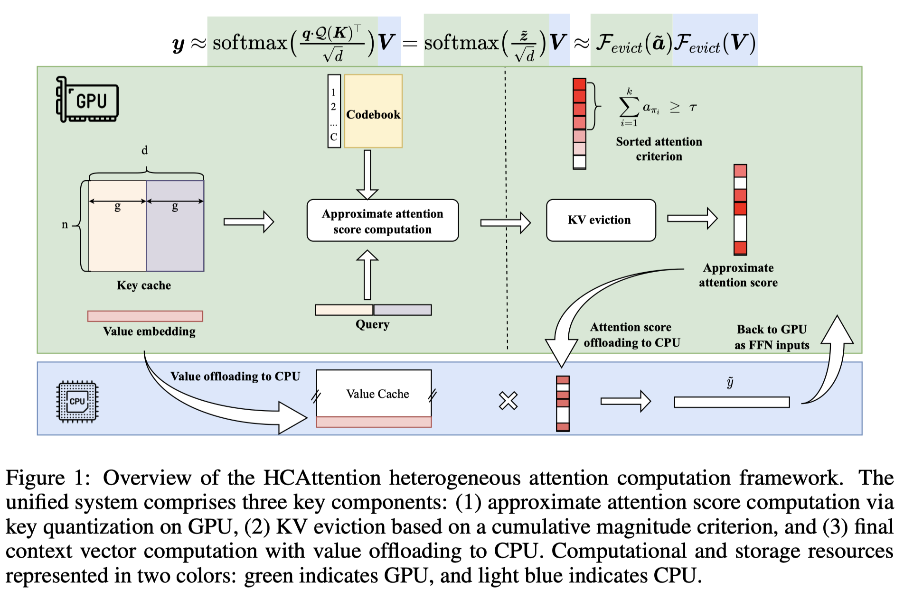

# HCAttention: Extreme KV Cache Compression via Heterogeneous Attention Computing for LLMs

> Dongquan Yang, Yifan Yang, Xiaotian Yu, Xianbiao Qi, Rong Xiao

## Abstract

Processing long-context inputs with large language models presents a
significant challenge due to the enormous memory requirements of the Key-Value
(KV) cache during inference. Existing KV cache compression methods exhibit
noticeable performance degradation when memory is reduced by more than 85%.
Additionally, strategies that leverage GPU-CPU collaboration for approximate
attention remain underexplored in this setting. We propose HCAttention, a
heterogeneous attention computation framework that integrates key quantization,
value offloading, and dynamic KV eviction to enable efficient inference under
extreme memory constraints. The method is compatible with existing transformer
architectures and does not require model fine-tuning. Experimental results on
the LongBench benchmark demonstrate that our approach preserves the accuracy of
full-attention model while shrinking the KV cache memory footprint to 25% of
its original size. Remarkably, it stays competitive with only 12.5% of the
cache, setting a new state-of-the-art in LLM KV cache compression. To the best
of our knowledge, HCAttention is the first to extend the Llama-3-8B model to
process 4 million tokens on a single A100 GPU with 80GB memory.
