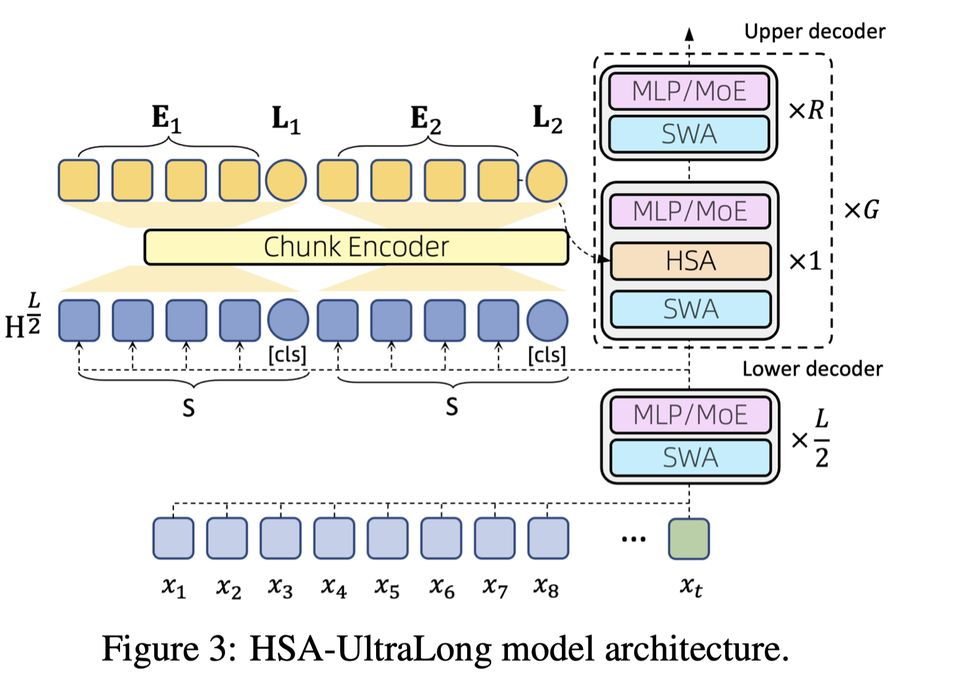

# Every Token Counts: Generalizing 16M Ultra-Long Context in Large Language Models

> Xiang Hu, Zhanchao Zhou, Ruiqi Liang, Zehuan Li, Wei Wu, Jianguo Li

> **⚠️ 本 note 由 AI Agent 自动生成，生成时间：2025年6月。内容基于论文全文解读，仅供快速参考，可能存在理解偏差，请以原文为准。**

---

## 一句话总结

提出 **Hierarchical Sparse Attention (HSA)** 机制，通过层次化稀疏注意力实现超长上下文建模，构建了 HSA-UltraLong 模型（8B MoE，1B 激活参数），在 8T token 上训练，从 32K 预训练窗口成功外推至 **16M token**，在大多数上下文检索任务上达到 90%+ 准确率。

---

## 摘要翻译

本工作探索构建"能记忆的机器"的挑战，将长期记忆问题定义为高效的超长上下文建模。作者认为这需要三个关键属性：**稀疏性**、**随机访问灵活性**和**长度泛化性**。为解决超长上下文建模，他们利用 **层次化稀疏注意力 (Hierarchical Sparse Attention, HSA)**——一种同时满足这三个属性的新型注意力机制。将 HSA 集成到 Transformer 中构建了 HSA-UltraLong，这是一个 8B 参数的 MoE 模型，在超过 8 万亿 token 上训练，并在不同任务上使用域内和域外上下文长度进行严格评估。结果表明，该模型在域内长度上与全注意力基线表现相当，同时在大多数上下文检索任务中（上下文长达 16M）达到超过 90% 的准确率。

---

## 研究动机

### 核心问题
大语言模型（LLM）的知识被固定在静态参数中，无法灵活更新或从日常交互中动态学习。作者提出一个根本性问题：**如何构建真正"记忆"的机器？** 有效的记忆对于未来 AI 智能体至关重要，使每个用户拥有能积累独特经验的个性化智能体。

### 关键洞察
人类记忆跨越从出生到现在的整个上下文，机器记忆问题与超长上下文建模密切相关。如果 Transformer 能高效处理无限长上下文，大部分世界知识可以从上下文中检索，而非压缩到模型参数中。

### 现有方法的不足
1. **循环架构**（Mamba、线性注意力）：将变长信息压缩到固定维度状态向量，引入信息瓶颈，牺牲对远距离 token 的随机访问
2. **滑动窗口注意力**（Longformer 等）：存在远距离上下文访问的根本限制
3. **稀疏注意力**（NSA、MoBA）：训练和推理效率有所提升，但存在**不准确的 chunk 选择**问题，导致域内和域外的上下文检索任务性能下降

### 三个关键属性
- **稀疏性**：人类长期记忆通过选择性激活运作，全注意力无法实现无限长上下文
- **随机访问灵活性**：稀疏性的效果依赖于准确检索相关过去信息，需要在模型内设计内在检索机制并端到端优化
- **长度泛化性**：用无限上下文进行预训练不可能，必须从短上下文泛化到长上下文

---

## 方法

### 核心思想：Hierarchical Sparse Attention (HSA)

HSA 的核心创新是 **按 chunk 进行注意力并根据检索分数融合结果**，类似于 **Mixture-of-Experts (MoE)** 的工作方式。关键区别在于：HSA 不是先选择 chunk 再拼接注意力，而是对每个选中的 chunk 分别做注意力，再加权融合。

#### 形式化定义

对输入序列 S = {x₀, x₁, ..., xₙ}，将序列按固定长度 S（默认 64）分成 chunk，共 n/S 个 chunk。

每个 token 使用两个查询向量：
- **Qslc_t**：用于检索 chunk（类似 MoE 的 Router）
- **Qattn_t**：用于在 chunk 内进行注意力

**检索分数计算**：
st,i = Qslc_t^T Kslc_i / √d

其中 Kslc_i 是 chunk i 的 **landmark 表示**（对该 chunk 内容的总结）。

**Top-K 选择**：选取检索分数最高的 K 个 chunk。

**Chunk 内注意力**（intra-chunk attention）：
Ōt,i = Attention(Qattn_t, K[i], V[i])

**跨 chunk 融合**（inter-chunk fusion）：
wt,i = exp(st,i) / Σ_{k∈I_t} exp(st,k)
Ot = Σ_{k∈I_t} wt,k Ōt,k

关键点：
- 使用 **Query-Key Normalization** 保持 HSA 在万亿 token 规模训练中的稳定性
- 每个 chunk 使用 **双向编码器** 获取摘要表示（带 [CLS] token）

#### 模型架构：HSA-UltraLong

- **双层解码器结构**：
  - **下层解码器**：L/2 标准 Transformer 层，仅使用 SWA
  - **上层解码器**：分为 G 组，每组包含一个同时使用 SWA 和 HSA 的层 + 多个仅 SWA 的层

- **位置编码策略**：
  - **SWA 使用 RoPE**（短距离）
  - **HSA 使用 NoPE**（No Positional Encoding，长距离）
  - 这是 "RoPE for short, NoPE for long" 策略

- **KV Cache 共享**：中间层输出 H_{L/2} 的 KV Cache 被所有 HSA 模块共享，作为上下文记忆，大幅压缩 KV Cache 大小

- **MoE 设计**：
  - 遵循 Ling-2.0 设计，第一层使用密集 MLP，后续层使用 MoE
  - 每个 MoE 块有一个共享专家（DeepSeek V3 风格）
  - 使用无辅助损失的平衡策略

- **两种变体**：
  - 0.5B Dense 模型（4T token）
  - 8B-A1B MoE 模型（8T token）

#### 训练流程（四阶段）

1. **Warm-up**：
   - SWA 窗口 512 token，全局 HSA top-k 足够覆盖全序列
   - 随机插入 1% 合成 ruler 任务
   - 当模型在超出 512 token 窗口的上下文上达到高 NIAH 准确率时完成
   - 上下文长度：16K

2. **Pre-training**：
   - 增大 SWA 窗口至 4K，减小 HSA top-k（从密集到稀疏）
   - 上下文长度：16K

3. **Long-context mid-training**：
   - 切换到具有更长有效上下文的语料
   - 增大 HSA top-k 覆盖全序列
   - 上下文长度：32K

4. **Annealing**：
   - 在高质量数据上退火
   - 上下文长度：32K

5. **SFT**：
   - 8K 上下文长度

#### 训练数据

- 第一阶段：10T token 多领域去重数据集
  - Web 内容 50%，Code 14.4%，Math 12.0%，Code-nlp 5.6%，Reason 5%，Multilingual 4.0%，Books 2.0%，Wikipedia 1.5%，Others 5.5%
  - MoE 模型 8T token，Dense 模型 4T token
- 第二阶段：32K 长文本序列，175B token
- 第三阶段：400B token，高比例推理数据

---

## 实验结果

### 预训练基础模型评估（Table 3）

| 模型 | 架构 | 总参数 | 激活参数 | 训练 token | AVG |
|------|------|--------|----------|------------|-----|
| Qwen2.5 Annealing | Dense | 0.5B | 0.5B | 18T | 41.08 |
| Qwen3 Annealing | Dense | 0.6B | 0.6B | 36T | 48.42 |
| HSA-UL Annealing | Dense | 0.5B | 0.5B | 4T | 37.70 |
| TRM-MoE Base | MoE | 8B | 1B | 8T | 56.58 |
| HSA-UL Base | MoE | 8B | 1B | 8T | 57.27 |
| HSA-UL Annealing | MoE | 8B | 1B | 8T | **63.09** |

关键发现：
- **MoE 变体**与 TRM-MoE 基线平均得分相当
- **Dense 变体**仅比 Qwen 2.5-0.5B 低 3.3 分，尽管训练数据少 4.5-9 倍
- **HSA-UL MoE Annealing** 平均得分 63.09，超越所有对比模型

### SFT 后评估（Table 4）

- HSA-UltraLong-MoE（HSA-UL-Inst）比 Qwen3-1.7B（Non-thinking）平均高出 **1.3 分**，且所需训练 FLOPS 更少
- Dense 变体仅比 Qwen3-0.6B 低约 4 分，训练数据量仅为后者的 1/9
- 数学和编程任务提升显著

### 长上下文评估（RULER Benchmark）

**关键发现**：

1. **训练数据的有效上下文长度对 HSA 外推至关重要**
   - 标准语料预训练的模型，检索准确率随上下文长度增加而下降
   - 使用长有效上下文（>32K）训练后，外推能力大幅提升
   - 图 4(a) vs 图 4(b)：long-context mid-training 后，所有深度和长度上的准确率都接近完美

2. **HSA 与 SWA 存在跷跷板效应**
   - 更小的 SWA 窗口（512）比更大窗口（4K）在持续预训练后带来更好的 HSA 外推
   - 4K 窗口直接训练无法发展出外推能力
   - 大 SWA 窗口处理了大部分短距离依赖，减少了 HSA 学习短距离模式的动力

3. **HSA 能力随参数规模扩展**
   - 在纯检索任务（MQ-NIAH）上，MoE-8B-A1B 和 Dense-0.5B 表现相当
   - 在变量追踪任务上，MoE-8B-A1B 一致优于 Dense-0.5B，表明更大模型更好地支持联合推理和检索

**主要结果**：
- 在预训练上下文（32K）内与全注意力基线表现相当
- 在大多数上下文检索任务中，上下文长达 16M 时准确率 >90%
- 从 32K 预训练窗口成功外推至 16M token

### 训练/推理效率

- 在短序列上 FlashAttention-3 仍然领先
- HSA 仅在较长上下文时才获得优势
- 原因：(1) HSA 稀疏性导致更多内存访问；(2) FlashAttention-3 使用 CUDA 实现，更好利用 Hopper 架构特性

---

## 优势

1. **极长上下文外推**：从 32K 预训练窗口成功外推至 16M token，在大多数检索任务上保持 >90% 准确率
2. **三属性同时满足**：稀疏性、随机访问灵活性、长度泛化性
3. **高效架构设计**：
   - HSA 类似 MoE 的 chunk 检索 + 注意力融合机制
   - KV Cache 共享大幅压缩内存
   - RoPE for short, NoPE for long 的位置编码策略
4. **训练效率**：8B MoE（1B 激活）仅用 8T token 即可达到与大规模训练模型相当的性能
5. **统一的检索-注意力融合**：检索分数通过前向传播集成，可端到端优化
6. **多阶段训练策略**：warm-up → pre-training → mid-training → annealing → SFT 的渐进式训练

---

## 局限

1. **HSA/SWA 跷跷板问题**：训练短 SFT 数据后，外推能力可能退化；过长的 SWA 会削弱 HSA 的长距离泛化能力
2. **Head 比例约束**：HSA 目前要求 query head 与 key-value head 的 16:1 比例，造成严重信息瓶颈，需要内核级优化
3. **短序列效率不足**：在短序列上，训练和推理效率无明显优势，需进一步内核优化
4. **训练数据规模**：MoE 模型仅使用 8T token，相比 Qwen 系列（18T/36T）仍较少
5. **评测覆盖**：主要依赖 RULER 和 NIAH 等检索类任务，缺乏更全面的长上下文理解评测
6. **无公开代码**：未提供开源实现

---

## 与 EfficientPaper 相关的研究方向

### 直接相关
- **稀疏注意力**（attention_sparsity）：HSA 是该方向的前沿工作，与 NSA、MoBA 等方法形成对比
- **长上下文建模**：从 32K 到 16M 的外推是长上下文领域的重要突破
- **KV Cache 压缩**：通过共享 KV Cache 减少内存开销

### 潜在扩展方向
1. **硬件优化**：HSA 在短序列上效率不足，需要针对 Hopper 架构等硬件优化的 HSA 内核实现
2. **与 MoE 的结合**：HSA 与 MoE 的类比关系，可探索更多融合设计
3. **长度泛化训练策略**：warm-up + 渐进式上下文扩展的方法论可推广
4. **信息瓶颈突破**：16:1 的 head 比例约束是未来研究的重点
5. **多模态超长上下文**：将 HSA 扩展到多模态场景

### 相关工作链
- HSA 基础理论：[18] Hardware-aligned HSA
- 长度泛化改进：[23] Understanding and improving length generalization
- 因果检索注意力：[19] Efficient length-generalizable attention via causal retrieval
- 稀疏注意力对比：NSA [47]、MoBA [28]
- MoE 架构基础：DeepSeek V3 [10]、Ling-2.0 [26]
