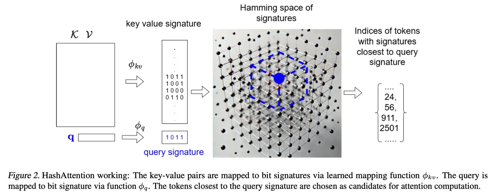

# HashAttention: Semantic Sparsity for Faster Inference

> Aditya Desai, Shuo Yang, Alejandro Cuadron, Matei Zaharia, Joseph E. Gonzalez, Ion Stoica
> UC Berkeley / ETH Zurich | ICML 2025 | [arXiv:2412.14468](https://arxiv.org/abs/2412.14468) | [OpenReview](https://openreview.net/forum?id=Em2oaXd8Dc) | [Code](https://github.com/xAlg-ai/HashAttention-1.0)

> ⚠️ 本 note 由 AI Agent 自动生成，基于 arXiv 论文全文阅读后撰写，生成时间：2026-06-04。

---

## 一句话总结

HashAttention 将注意力机制中的关键 token 识别问题转化为最大内积搜索（MIPS）问题，通过学习映射函数将 query 和 key 编码到 Hamming 空间，利用位运算高效筛选关键 token，实现最高 32× 的 KV Cache 稀疏化，同时仅需 32 位/token 的辅助内存开销。

---

## 摘要翻译

利用长上下文对高级 AI 系统至关重要，但注意力计算面临可扩展性挑战。虽然缩放点积注意力（SDPA）具有 token 稀疏性——即只有少数关键 token 对输出有显著贡献——但利用这种稀疏性仍然具有挑战性。现有方法要么存在质量下降问题，要么需要大量额外资源。本文证明了识别关键 token 是一个最大内积搜索（MIPS）问题。然而，现有的 MIPS 解决方案不适合 SDPA，因为它们对 GPU 不友好，并且由于 query 和 key 分布分离而经常表现不佳。本文提出 HashAttention，将关键 token 识别构建为推荐问题。给定一个 query，HashAttention 使用学习的映射函数将 key 和 query 编码到 Hamming 空间，捕获所需的语义相似性。HashAttention 使用位运算高效识别给定 query 的关键 token，仅使用这些 token 计算注意力，从而提高整体注意力效率。在通用数据上训练的 HashAttention 在最小质量损失下，将使用的 token 减少最多 16×，每个 token 仅需 32 位辅助内存。通过任务特定微调，稀疏度可进一步提高到 32×。在 A100 GPU 上，以 32× 稀疏度，结合 HashAttention 可将 GPT-FAST 中的注意力延迟降低最多 4.3×，FlashDecode 中降低最多 2.54×，GPT-FAST 吞吐量提高最多 3.12×。

---

## 研究动机

### 长上下文的挑战
现代 AI 应用（如长文档处理、多轮对话）需要高效的长上下文处理能力。LLM 模型需要预处理和存储大量文本为 KV Cache，用于处理各种 prompt。然而，SDPA 的计算成本随上下文长度线性增长。例如，Llama-3.1-8B 模型的 512K token KV Cache 高达 64GB（每 token 约 0.125 MB）。

### 注意力稀疏性
SDPA 存在自然的 token 稀疏性——由于 softmax 操作，只有少数关键 token 对最终注意力计算有显著贡献。高效识别这些关键 token 是实现高效注意力的关键。

### 现有方法的局限
- **固定稀疏模式**（如 StreamingLLM）：忽略上下文稀疏性的动态性，导致次优质量
- **KV Cache 丢弃策略**（如 H2O、ScissorHands）：基于历史重要性丢弃 token，但丢弃后无法恢复，在多轮对话等场景中失效
- **基于启发式的动态稀疏**（如 InfLLM、Quest）：召回率低，且需要大量辅助内存
- **基于图的近邻搜索**（如 RetrievalAttention）：对 GPU 不友好，导致额外延迟

---

## 方法（技术细节）

### 核心思想
HashAttention 将注意力中的关键 token 识别问题建模为推荐问题：给定 query（用户）和 key-value 对（物品），选择最相关的子集。这个问题可以形式化为最大内积搜索（MIPS）问题。

### 理论基础

#### Lemma 4.1（最佳稀疏解）
在孤立 token 分析下，token i 对最终输出的贡献正比于 $a_i \|v_i\|_2$，其中 $a_i$ 是注意力分数，$\|v_i\|_2$ 是 value 向量的范数。

#### Lemma 4.2（MIPS 问题等价性）
token 重要性排序等价于内积 $\langle [q, 1], [k, \log(\|v\|_2)] \rangle$ 的排序。因此，MIPS 可以转化为余弦相似度搜索（通过非对称变换）。

#### 位签名近似
余弦相似度可以通过随机签名投影的位签名近似（Locality-Sensitive Hashing，LSH）。但 HashAttention 使用学习的映射函数替代随机投影，以利用查询和键的分布模式。

### HashAttention 架构

#### 三个子程序
1. **SCORE**：给定 query 和 key-value 对，为每个 token 分配分数
2. **TOPK**：对分数进行 top-k 选择
3. **GATHER-ATT**：仅使用选中的 token 计算注意力

#### SCORE 函数
HashAttention 使用两个可学习的映射函数：
- $\phi_{kv}: \mathbb{R}^{2d} \rightarrow [0,1]^b$：将 key-value 对编码到 b 维 Hamming 空间
- $\phi_q: \mathbb{R}^d \rightarrow [0,1]^b$：将 query 编码到 b 维 Hamming 空间

映射函数形式：
$$\phi(x) = \text{relu}(\text{sign}(F(x)))$$
其中 $F$ 是前馈网络（FFN），sign 函数提取位。位被打包到整数中。

SCORE 函数定义为：
$$\text{SCORE}(k, v, q) = -H(\phi_{kv}(k, v), \phi_q(q))$$
其中 $H$ 是 Hamming 距离。

#### 推理时的位操作
在解码热路径中：
- 计算 query 签名
- 使用位运算计算 Hamming 距离：
  $$H(\phi_{kv}(k,v), \phi_q(q)) = \text{bitcount}(\text{bitwise\_xor}(\phi_{int,kv}(k,v), \phi_{int,q}(q)))$$

### 训练细节

#### 训练目标
将 HashAttention 训练为分类问题：每个嵌入预测与其关联注意力头的 top-k token。使用二元交叉熵损失的多分类设置。

#### 类别不平衡处理
随着上下文长度增加，类别不平衡加剧（如 64K 上下文时，top-64 token 仅占 0.1%）。使用类别权重：
$$\text{class1-weight} = \alpha + \beta \times \text{context-length}$$
其中 $\alpha$ 和 $\beta$ 是超参数。

#### 软分区
训练时使用 tanh 函数替代 sign 函数作为软版本。

#### 训练数据
- 在通用数据集（OpenWebText）上训练，适用于多种任务
- 可在任务特定数据上微调以获得更好结果
- 在短序列（<=64K）上训练的 HashAttention 不能自然扩展到更长序列
- 以块（chunk）方式运行 LLM 推理，每个块结束后独立训练 HashAttention 模块

### Token 级稀疏 vs 块级稀疏
与 Quest 或 InfLLM 的块级稀疏不同，HashAttention 使用 token 级稀疏。token 级稀疏在推理时不可避免，因为训练假设全注意力，重要 token 可能不在同一块中。

#### GPU 内存访问优化
HashAttention 基于 vLLM 的分页注意力框架实现，每个 token 对应一个页（页大小=1）。通过页注意力内核选择性计算注意力，利用 GPU 缓存行（128 字节）实现最优内存带宽利用。

---

## 实验结果

### 质量评估

#### Table 1：固定预算下各方法对比（LongBench）
在 512 关键 token 预算下，使用 Llama-3.1-8B-Instruct：
- **HashAttention**（32 bits PTPA）：平均 64.15 分，最佳
- **Double Sparsity**（64 bits）：62.78 分
- **Quest**（64 bits）：63.33 分
- **InfLLM**（256 bits）：48.23 分
- **H2O**：43.47 分
- **StreamingLLM**：33.28 分

#### Table 2：LongBench 全面评测（16× 稀疏度）
Llama-3.1-8B-Instruct：
- Full 模型：48.78（AVG），51.48（AVG̅_pc）
- HashAttention-16×：48.00（AVG），51.08（AVG̅_pc）
- 质量下降仅 0.78 分

#### Table 3：RULER@16K 评测
Llama-3.1-8B-Instruct：
- Full 模型：90.66
- HashAttention-16×：89.53
- 质量下降仅 1.13 分

#### Pareto 曲线分析
- HashAttention 在 32 bits PTPA 辅助内存下，比 Quest 和 DS 高效约 4×
- 在 16× 稀疏度下，HashAttention 几乎保持完整模型质量
- 通过微调（HashAttention*），LLama-3.1-8B-Instruct 可在 32× 稀疏度下保持完整模型质量
- 某些稀疏度在某些任务上反而提升质量（可能是稀疏注意力避免了干扰 token）

### 效率评估

#### 注意力延迟（GPT-FAST，32× 稀疏度）
- GPT-FAST 延迟：最高 4.3× 降低（在 8K 上下文后）
- FlashDecode 延迟：最高 2.54× 降低（在 65K 上下文后）

#### 端到端吞吐量（GPT-FAST）
- 32K 序列长度：最高 3.12× 吞吐量提升
- 吞吐量提升比率随序列长度增加而下降（TOPK 操作在更长序列上变得昂贵）

#### SCORE 计算延迟 vs 完整内积
即使使用 512 位，位运算内核的延迟仍低于完整内积计算（128 维向量，float16 精度）

### 消融实验

#### 学习位签名 vs LSH 位签名
- HashAttention 使用 32 位签名即可获得良好性能
- LSH 即使使用超过 1000 位也难以达到可比性能
- LSH 不利用数据分布，因此效率较低

#### Query 和 Key 分布对齐
HashAttention 学习的映射函数使 query 和 key 分布更接近（余弦相似度显著提高）

#### 位宽度与质量
更多位带来更好的 top-k 预测质量（cross-entropy loss 降低）

---

## 优势

1. **高效稀疏化**：最高 32× 稀疏度，仅需 32 位/token 辅助内存
2. **GPU 友好**：基于位运算，可完全在 GPU 上运行，无需 CPU 卸载
3. **高质量**：在所有基线方法中，以最小辅助内存实现最佳质量
4. **动态稀疏性**：基于 query 动态选择关键 token，优于固定稀疏模式
5. **可微调**：可在任务特定数据上进一步微调以获得更好结果
6. **Token 级稀疏**：避免块级稀疏的局限性
7. **通用性**：在通用数据集上训练，适用于多种任务
8. **理论基础扎实**：有严格的数学推导支持（MIPS 到 Hamming 空间的转化）
9. **端到端加速**：不仅优化注意力计算，还优化整体推理吞吐量

---

## 局限

1. **需要训练**：每个模型需要单独训练 HashAttention（不像 DS 等方法只需校准）
2. **上下文长度限制**：在短序列上训练的 HashAttention 不能自然扩展到更长序列
3. **GPU 内存限制**：仅评估了 KV Cache 在 GPU 上的情况，未评估 KV Cache 在 CPU RAM 的极长上下文场景
4. **当前实现**：$\phi_{kv}$ 仅作用于 key 向量，未利用 value 向量特征
5. **长序列吞吐量下降**：随序列长度增加，TOPK 操作变得昂贵，吞吐量提升比率下降
6. **中文任务质量下降**：在中文数据集上（训练时仅用英文数据）质量下降较明显（平均 2.66 分）
7. **并非完全免训练**：虽然比训练密集型方法轻量，但仍需要至少一次训练
8. **单一实验框架**：主要在 GPT-FAST 和 FlashDecode 上评估，未在其他推理框架上验证

---

## 与 EfficientPaper 相关的研究方向

### KV Cache 稀疏化方向
HashAttention 是 KV Cache 稀疏化的重要进展，与以下研究方向密切相关：
- **StreamingLLM**（固定稀疏模式）→ HashAttention（动态学习稀疏模式）
- **H2O/ScissorHands**（KV Cache 丢弃）→ HashAttention（不丢弃 token，动态选择）
- **Double Sparsity**（通道选择）→ HashAttention（学习位签名）
- **Quest/InfLLM**（块级稀疏）→ HashAttention（token 级稀疏）

### 推荐系统与注意力机制的交叉
HashAttention 将注意力机制中的关键 token 识别问题建模为推荐问题，这为推荐系统和注意力机制的交叉研究提供了新视角。未来可以探索：
- 更复杂的推荐模型（如协同过滤、图神经网络）在注意力机制中的应用
- 多模态注意力的稀疏化
- 跨语言注意力的稀疏化

### 量化与稀疏化的结合
HashAttention 使用 32 位位签名，与量化方法（如 Double Sparsity 的量化）具有互补性。未来可以探索：
- 量化与哈希的联合优化
- 更低比特量化下的哈希精度
- 端到端量化-哈希联合训练

### 极长上下文处理
HashAttention 的 token 级稀疏和 GPU 友好性使其适合极长上下文场景。未来可以探索：
- 超长上下文（>1M token）的稀疏化
- 分布式 KV Cache 管理
- 与 RingAttention 等分布式注意力方法的结合

### 实用化与工程优化
HashAttention 的实际应用需要考虑：
- 与现有推理框架（如 vLLM、TensorRT-LLM）的集成
- 自动化训练和微调流程
- 在线学习和自适应稀疏化
- 与 FlashAttention 的进一步结合

---

## 关键数据

| 指标 | 数值 |
|------|------|
| 稀疏度（通用） | 16× |
| 稀疏度（微调后） | 32× |
| 辅助内存 | 32 bits/token |
| GPT-FAST 延迟降低 | 4.3× |
| FlashDecode 延迟降低 | 2.54× |
| GPT-FAST 吞吐量提升 | 3.12× |
| LongBench 质量下降（16×） | 0.78 分 |
| RULER@16K 质量下降（16×） | 1.13 分 |
| 模型 | Llama-3.1-8B-Instruct, Mistral-7B-Instruct-v0.3 |
| 评估数据集 | LongBench, RULER@16K |
| 训练数据 | OpenWebText |
| 论文页数 | 17 页 |
