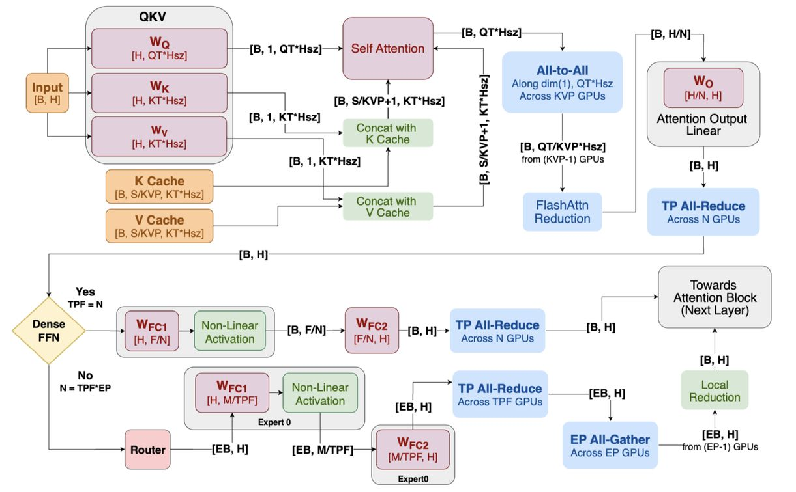

# Helix Parallelism: Rethinking Sharding Strategies for Interactive Multi-Million-Token LLM Decoding

> Nidhi Bhatia, Ankit More, Ritika Borkar, Tiyasa Mitra, Ramon Matas, Ritchie Zhao, Maximilian Golub, Dheevatsa Mudigere, Brian Pharris, Bita Darvish Rouhani

## 一句话总结

Helix Parallelism 提出了一种混合并行策略，通过在注意力阶段按序列维度切分 KV 缓存、在 FFN 阶段复用相同 GPU 执行张量并行，配合 HOP-B 批量计算-通信重叠优化，将多百万 token 长上下文 LLM 解码的 TTL 最多降低 1.5×，同时支持最高 32× 更大的批处理容量。

## 摘要翻译

随着 LLM 扩展到多百万 token 的 KV 历史，在严格的 Token-to-Token 延迟（TTL）约束下进行实时自回归解码面临越来越大的压力。两个核心瓶颈占主导地位：访问前馈网络（FFN）权重和读取长 KV 缓存。虽然张量并行（TP）有助于缓解 FFN 权重读取的成本，但它在注意力部分扩展效果不佳。当 TP 宽度超过 KV 头数时，会导致 KV 复制效率低下，限制并行度，并约束批处理大小。同时，长 KV 历史的 DRAM 读取随批处理大小线性增长，进一步限制了效率。

本文引入了 Helix Parallelism，一种混合执行策略，在注意力阶段应用 KV 并行（KVP）跨 GPU 切分 KV 缓存，然后在 FFN 计算期间复用相同的 GPU 进行稠密 LLM 的 TP 或 MoE 的 TP×专家并行（EP）。为了保持精确的注意力行为，Helix 包含一个轻量级通信步骤。为了最小化暴露的通信成本，引入了 Helix HOP-B。Helix HOP-B 通过批量级重叠有效最小化通信开销，在保持低 TTL 的同时提高 GPU 效率。与传统并行方法相比，Helix 在固定批处理大小下将 TTL 最多降低 1.5×，在相同延迟预算下支持高达 32× 更大的批处理大小（以 DeepSeek-R1 为例），在 Blackwell 上推进了吞吐量-延迟 Pareto 前沿，使超长序列的实时推理成为可能。

## 研究动机

随着 LLM 向超长上下文（百万 token 级别）扩展，实时自回归解码面临双重压力：

1. **KV 缓存读取瓶颈**：KV 缓存大小随上下文长度和批处理大小线性增长，迅速超出 DRAM 容量和带宽。系统常被迫减小批处理大小，但长历史的读取时间仍很高，推动 TTL 超过可接受限制。
2. **FFN 权重读取瓶颈**：自回归解码中每个新 token 都需要从 DRAM 加载大量 FFN 权重。小批处理大小下，此成本无法摊销，使权重读取成为整体解码时间的主导因素。

现有方法（如 Medha）虽然通过 KV 并行（KVP）跨 GPU 切分 KV 缓存，但在注意力后将结果收集到固定数量的 TP GPU 进行 FFN 计算，未能复用 KVP GPU 来加速 FFN 执行。这导致 FFN 权重读取仍是延迟瓶颈，且硬件资源利用率低下。

关键问题：**张量并行（TP）在 KV 头数有限时（如 GQA 的 K=8）存在天花板**，当 TP > K 时会导致 KV 缓存完全复制，既浪费内存又不能加速注意力。

## 方法（技术细节）

### 核心思想：解耦注意力与 FFN 的并行策略

Helix Parallelism 的核心洞察是：实现多百万 token 上下文的实时解码需要**解耦注意力和 FFN 的映射**。Helix 在每个 Transformer 层内引入**时间流水线**，允许同一组 GPU 在注意力和 FFN 计算之间复用，但对每个阶段应用不同的并行策略。

### 2.1 注意力阶段（Attention Phase）

**KV 分区（KVP）**：
- 使用 KVP 将 KV 缓存沿**序列维度**切分到 KVP 个 GPU
- 每个 GPU 只存储序列的一个切片（S/KVP），消除了全缓存复制
- TP 宽度限制为 TPA ≤ K（KV 头数），避免 KV 复制

**二维布局**：TP 分割头（heads），KVP 分割序列（sequence），总 GPU 数 N = KVP × TPA

**关键通信设计**：
- 每个 KVP GPU 独立计算完整的 QKV 投影（避免 All-Gather 查询）
- 每个 GPU 在自己的 KV 切片上运行 FlashAttention，产生部分注意力输出和 log-sum-exp 标量
- 通过**单次 All-to-All 通信**（沿查询头维度）交换这些片段
- 每个 GPU 重新缩放并求和以重建精确的 softmax 归一化注意力
- 通信量与 KV 序列长度 S 无关，仅与批处理大小 B 和隐藏维度 H 相关

### 2.2 HOP-B（Helix Overlap Pipeline – Batch-wise）

为了最小化 All-to-All 通信的暴露时间，引入 HOP-B：
- **批量级流水线**：一旦第一个查询 token 的注意力输出计算完成，立即启动其 All-to-All 通信，同时处理下一个 token 的注意力计算
- 有效隐藏通信延迟，保持高硬件利用率
- 示例：无 HOP-B 时，8 个请求串行执行，总时间为 25.6 个时间单位；启用 HOP-B 后，通过流水线化，总时间降至 17 个时间单位

### 2.3 FFN 阶段（FFN Phase）

注意力完成后，Helix **立即重新配置**相同的 N 个 GPU：

**稠密 FFN（EP=1）**：
- 保持 TPF = N，所有 GPU 协作分摊权重读取成本
- 计算 [B, H] → [B, F/N] → [B, H]，然后 TP All-Reduce

**MoE FFN（EP>1）**：
- 重新分区为 TPF × EP 网格
- 将 token 路由到适当的专家
- 在每个专家组内应用 TP
- 执行专家内 All-Reduce + 专家间 All-Gather
- 最终本地归约得到 [B, H]

**后注意力线性投影**：在注意力和 FFN 之间，所有 N 个 GPU 执行 TP 模式下的后注意力线性投影（注意力输出 → 隐藏维度）。

### 2.4 分布式 KV 拼接策略

解码过程中，新生成的 token 广播到所有 KVP GPU。Helix 采用**轮询方式**交替更新各 KVP GPU 的 KV 缓存（如每 16 个 token 切换一次），确保内存增长均匀分布，避免热点。

### 兼容性

- 完全兼容现代 LLM 架构，包括 GQA（Grouped-Query Attention）、MLA（Multi-Head Latent Attention）
- 支持稠密模型和 MoE 模型
- 为 Blackwell（GB200）硬件设计，利用其大型 NVLink 域
- 使用 FP4 精度

## 实验结果

### 实验设置
- **硬件**：NVIDIA GB200 NVL72，FP4 精度
- **模拟器**：高保真模拟器，考虑计算和通信成本
- **模型**：
  - Llama-405B：405B 参数稠密模型，128 个查询头，8 个 KV 头（GQA）
  - DeepSeek-R1：671B 参数 MoE 模型，MLA 注意力
- **上下文长度**：模拟 100 万 token 及更长的 KV 缓存序列
- **基线**：TP、PP、EP、vanilla KVP 等 100,000+ 配置的完整扫描

### 关键结果

**DeepSeek-R1（MoE + MLA）**：
- TTL 最多降低 **1.5×**（用户交互性提升）
- 吞吐量和批处理容量提升高达 **32×**（支持 32× 更多并发用户）
- 原因：Helix 能够同时切分 KV 缓存和 FFN 权重，减少 DRAM 压力并提高计算效率
- 注意：Medha 的方法不适合 MLA 注意力（TP > 1 导致 KV 缓存复制），且不支持 MoE

**Llama-405B（稠密 + GQA）**：
- 最大交互性提升 **1.13×**
- 吞吐量和批处理容量提升 **4×**
- 原因：KVP 消除了 TP 的 KV 复制天花板，FFN 并行度进一步增加
- HOP-B 在 Llama-405B 上更为重要，移除后性能下降 **12%**（DeepSeek-R1 仅 ~1%）

### HOP-B 消融实验
- 禁用 HOP-B 后，通信和计算严格串行执行，导致 GPU 空闲
- Llama-405B：TTL 降低高达 **12%**
- DeepSeek-R1：仅 ~1% 退化（All-to-All 仅占端到端解码延迟的 ~1%）

## 优势

1. **解耦注意力和 FFN 并行**：突破了传统 TP 必须在注意力和 FFN 间保持一致的限制
2. **序列维度 KV 切分**：避免 KV 缓存复制，显著减少每 GPU 内存占用和带宽需求
3. **HOP-B 通信重叠**：批量级流水线有效隐藏通信延迟，维持低 TTL
4. **高可扩展性**：通信量与 KV 序列长度无关，仅随批处理大小和隐藏维度线性增长
5. **广泛兼容性**：支持 GQA、MLA 等多种注意力机制，以及稠密和 MoE 模型
6. **硬件适配**：专为 Blackwell（GB200）设计，充分利用大型 NVLink 域
7. **全面的性能提升**：同时提升吞吐量和降低延迟，推动 Pareto 前沿

## 局限

1. **依赖高保真模拟器**：所有结果基于模拟器而非实际部署，可能存在偏差
2. **仅在 GB200 上评估**：未在其他 GPU 架构（如 A100、H100）上验证
3. **FP4 精度假设**：假设所有权重和计算使用 FP4，实际精度可能有所不同
4. **短上下文退化**：在短上下文（< 4K）时，Helix 简化为数据并行注意力 + 张量并行 FFN，与现有方法相同
5. **不支持稀疏注意力**：未来工作需扩展到 NSA 等稀疏注意力机制
6. **KV 缓存增长管理**：轮询式 KV 拼接策略在超长序列下可能导致部分 GPU 内存不均匀增长
7. **仅限于单节点**：限制在 1-64 GPU（单 GB200 节点）范围内

## 与 EfficientPaper 相关的研究方向

1. **推理优化**：Helix 的核心是优化 LLM 推理效率，与 EfficientPaper 关注的推理加速、部署优化方向高度相关
2. **并行策略**：提出了新的并行维度（注意力和 FFN 解耦），对研究 LLM 部署的并行策略设计有重要参考价值
3. **长上下文推理**：针对多百万 token 上下文的实时解码，是长上下文 LLM 应用的关键技术
4. **通信优化**：HOP-B 的批量级计算-通信重叠策略，可推广到其他分布式推理场景
5. **硬件-软件协同设计**：Helix 与 Blackwell 硬件的协同设计，体现了推理系统中硬件与算法的紧密耦合
6. **MoE 模型部署**：支持 MoE 模型（如 DeepSeek-R1）的高效推理，是当前 LLM 发展的重要方向
7. **与基线方法的关系**：与 DeepSeek-R1 的部署策略相关，Helix 在 MoE 场景下显著优于传统 TP 方案

---

> **生成声明**：本 note 由 AI Agent（Hermes Agent）自动生成，基于 arXiv 论文 2507.07120v1 的全文内容。生成时间：2025年。所有内容为中文，仅供学术参考。
