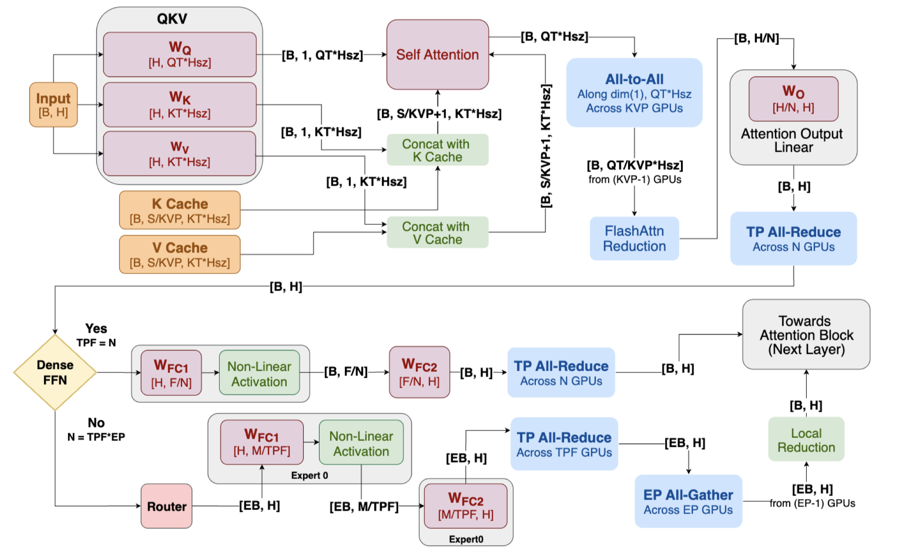

# Helix Parallelism: Rethinking Sharding Strategies for Interactive Multi-Million-Token LLM Decoding

> Nidhi Bhatia, Ankit More, Ritika Borkar, Tiyasa Mitra, Ramon Matas, Ritchie Zhao, Maximilian Golub, Dheevatsa Mudigere, Brian Pharris, Bita Darvish Rouhani

## Abstract

As LLMs scale to multi-million-token KV histories, real-time autoregressive
decoding under tight Token-to-Token Latency (TTL) constraints faces growing
pressure. Two core bottlenecks dominate: accessing Feed-Forward Network (FFN)
weights and reading long KV caches. While Tensor Parallelism (TP) helps
mitigate the cost of FFN weight reads, it does not scale well for attention.
When TP width exceeds the number of KV heads, it leads to inefficient KV
duplication, limits parallelism, and constrains batch size. Simultaneously,
DRAM reads for long KV histories scale linearly with batch size, further
capping efficiency.
  We introduce Helix Parallelism, a hybrid execution strategy that applies KV
parallelism during attention to shard KV caches across GPUs, then reuses the
same GPUs for TP in dense LLMs or TPxExpert Parallel (EP) in MoEs during FFN
computation. To preserve exact attention behavior, Helix includes a lightweight
communication step. To minimize the exposed communication cost, we introduce
Helix HOP-B. Helix HOP-B effectively minimizes communication overhead through
batchwise overlap, preserving low TTL while improving GPU efficiency. Compared
to conventional parallelism approaches, Helix reduces TTL by up to 1.5x at
fixed batch sizes and supports up to 32x larger batches under the same latency
budget for DeepSeek-R1, pushing forward the throughput-latency Pareto on
Blackwell and making real-time inference with ultra-long-sequence practical.

- 长序列推理时，KVP对KV进行切分，与之前工作不同之处在于沿着senquence 维度切分
- 导致qK运算后结果需要All-to-All通信进行全局的softmax
- 如何缓解上面问题？采用batch-wise computation-communication overlap
- MLP部分按照TP切分