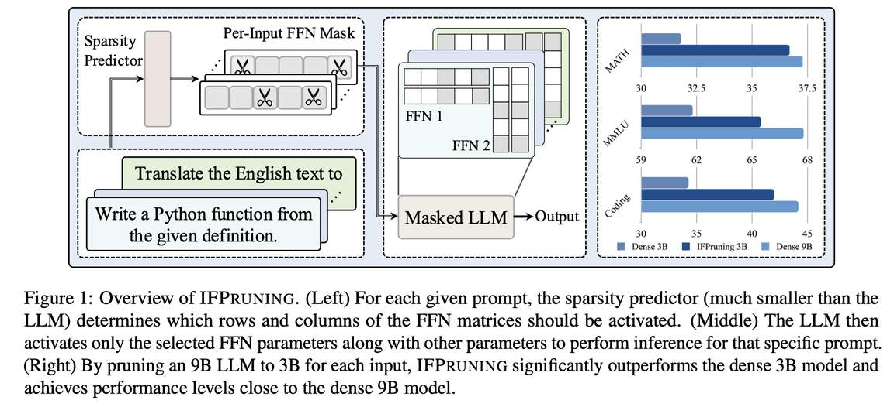

# Instruction-Following Pruning for Large Language Models

> **一句话总结**：IFPruning 提出了一种基于指令的动态结构化剪枝方法，通过稀疏掩码预测器（Sparsity Predictor）根据用户指令动态选择 LLM 的 FFN 子网络，将 9B 模型剪枝到 3B 激活参数后，在数学、编程等任务上超越同规模 dense 3B 模型 5–8 个百分点，性能接近 dense 9B 模型。

> **本文由 AI Agent 自动生成，生成时间：2025 年 6 月。**

---

## 摘要翻译

随着大语言模型（LLMs）规模的快速增长，结构化剪枝已成为从大模型中学习高效小模型的广泛使用技术，相比从头训练同等规模模型能获得更优性能。本文超越了传统静态剪枝方法（为模型确定一个固定剪枝掩码）的范式，提出了一种动态结构化剪枝方法。在我们的方法中，剪枝掩码是依赖于输入的，并根据用户指令中描述的信息动态调整。我们的方法称为"指令跟随剪枝"（Instruction-Following Pruning），引入了一个稀疏掩码预测器，以用户指令为输入，动态为给定任务选择最相关的模型参数。为了识别和激活有效参数，我们联合优化稀疏掩码预测器和 LLM，同时利用指令跟随数据和预训练语料。实验结果在广泛的评估基准上证明了方法的有效性。例如，我们的 3B 激活模型在数学和编程等领域比 3B dense 模型高出 5–8 个百分点，性能可与 9B 模型媲美。

---

## 研究动机

- **静态剪枝的局限**：传统结构化剪枝（如 Sheared LLaMA、MiniTron）学习固定掩码后剪枝，得到的模型对所有输入使用相同的子网络。然而在实际推理场景中，任务差异很大（如编程、数学、领域特定需求），静态剪枝模型难以在效率和性能之间取得最优平衡。
- **上下文稀疏性的启示**：已有工作（如 DejaVu、ShadowLLM）发现 LLM 中存在输入依赖的子网络，但这些方法依赖 ReLU 激活的稀疏性，且需要在每个解码步骤重新加载不同参数，带来显著的权重加载开销。
- **MoE 的不足**：混合专家（MoE）模型在每个 token 动态路由到不同专家，但路由机制带来额外计算开销，且粒度较粗（以专家为单位）。
- **核心问题**：能否让 LLM 学会根据任务描述选择最合适的参数？IFPruning 正是对此的探索。

---

## 方法（技术细节）

### 整体架构

IFPruning 由两个核心组件构成：
1. **稀疏掩码预测器（Sparsity Predictor）**：一个远小于 LLM 的模型，以用户指令为输入生成 FFN 层的掩码。
2. **被动态剪枝的稠密 LLM**：接收掩码后，仅激活被选中的 FFN 参数进行推理。

### 结构化剪枝原理

对于 FFN 层 $F_{ffn}(X) = \sigma(XW_1)W_2$，IFPruning 通过掩码向量 $m \in \{0,1\}^{d_{ffn}}$ 应用于第一层线性变换的输出：

$$F_{ffn}(X, m) = FF_2(FF_1(X) \odot m)$$

其中 $m_i = 0$ 表示 $W_1$ 的第 $i$ 列和 $W_2$ 的第 $i$ 行被剪枝。掩码满足稀疏约束 $\sum_i m_i = t_{ffn}$，即激活的目标 FFN 维度。

### 稀疏掩码预测器

- **骨干网络**：使用一个 302M 参数的小型 LLM 骨干（预训练于网页数据）提取用户 prompt 的特征。
- **掩码预测头**：两层 MLP，输出掩码分数 $z \in \mathbb{R}^{L \times d_{ffn}}$，其中 $L$ 为 LLM 层数。
- **SoftTopK 算子**：将掩码分数转化为可微分掩码 $m$。给定分数 $z^{(i)}$，先通过归一化函数 $g(\cdot)$ 得到 $\lambda^{(i)}$，再用 Top-k 指示函数选择前 $t_{ffn}$ 个最大值：
  - $\lambda^{(i)} = g(z^{(i)})$
  - $m^{(i)} = \lambda^{(i)} \odot \text{Top}(\lambda^{(i)}, t_{ffn})$
  - 这保证了 $\sum_k \lambda^{(i)}_k = t_{ffn}$

### 训练策略

训练分为两个阶段：

#### 1. 持续预训练（Continued Pre-training）

- 使用预训练数据，将输入文本 $x$ 分成 $K$ 个连续片段（chunk），每个片段大小为 $s = n/K$。
- 用第 $k$ 个片段预测参数，用第 $k+1$ 个片段进行下一个 token 预测：
  - $\mathcal{L} = \sum_{k=1}^{K-1} \sum_{x_i \in x^{(k+1)}} \ell(f(x_{<i}; \theta, m^{(k)}), x_i)$
- 稀疏预测器和 LLM 联合优化，利用预训练数据提供大量训练信号。

#### 2. 监督微调（SFT）

- 在包含数百万样本的 SFT 数据集上训练。
- 数据包含多种 prompt 格式：任务描述 + 输入、少量示例 + 输入、纯任务描述（如"将英文翻译为法文"）。
- 对于多轮对话数据，仅使用第一轮人类消息作为 prompt 进行子网络选择。
- 训练目标为标准交叉熵损失。

### 推理模式

- **Per-Input**：每个输入单独生成掩码，最细粒度，性能最优。
- **Per-Task**：同一任务/领域的所有输入共享一个掩码（通过预定义任务 prompt），减少数据加载开销，性能略有下降但仍然强劲。

---

## 实验结果

### 实验设置

- **模型**：使用 6B、9B、12B 参数的预训练 LLM，均剪枝到 3B 激活参数。
- **稀疏预测器**：302M 参数的小型模型。
- **训练框架**：AXLearn + JAX。
- **预训练**：所有模型在 5T token 上预训练（Dense-3B 为 9T token）。
- **SFT**：batch size 1024，60k 步。
- **评估基准**：IFEval、AlpacaEval 2.0、Arena Hard、HumanEval、MBPP、MultiPL-E、GSM8K、MATH、ARC-C/E、HellaSwag、WinoGrande、PiQA、SciQ、LAMBADA、MMLU、MMAU（Tool Use）。

### 主要结果（Per-Input）

| 类别 | 数据集 | Dense-3B | Pruning+Distill-3B | IFPruning (6B→3B) | IFPruning (9B→3B) | IFPruning (12B→3B) | Dense-9B |
|------|--------|----------|---------------------|-------------------|-------------------|-------------------|----------|
| 指令跟随 | IFEval-I | 85.0 | 86.7 | 83.9 | 85.9 | 85.3 | 87.5 |
| | AlpacaEval | 27.3 | 30.0 | 29.0 | 31.3 | 32.5 | 38.6 |
| | Arena Hard | 15.8 | 16.4 | 18.0 | 18.6 | 19.8 | 24.8 |
| 编程 | HumanEval | 35.2 | 37.1 | 41.0 | 42.4 | 43.3 | 46.5 |
| | MultiPL-E | 39.0 | 37.9 | 37.6 | 41.8 | 43.0 | 44.0 |
| | MBPP | 28.8 | 38.0 | 37.4 | 41.8 | 42.8 | 42.2 |
| | **编程平均** | **34.3** | **37.7** | **38.7** | **42.0** | **43.0** | **44.2** |
| 数学 | GSM8K | 69.3 | 70.0 | 72.2 | 72.0 | 70.2 | 75.4 |
| | MATH | 31.8 | 32.7 | 36.2 | 36.7 | 37.1 | 37.3 |
| MMLU | MMLU | 61.8 | 62.8 | 63.1 | 65.5 | 66.1 | 67.8 |
| 工具使用 | ToolUseExec | 74.8 | 74.4 | 75.8 | 75.7 | 73.9 | 76.5 |
| | ToolUsePlan | 25.2 | 17.5 | 36.6 | 45.4 | 37.5 | 46.5 |

### 关键发现

1. **IFPruning 显著优于 Dense-3B**：在编程任务上提升 6%–14%，数学上提升 3%–5%，AlpacaEval 提升 5%，Arena Hard 提升 4%，MMLU 和工具使用也有明显提升。
2. **优于静态剪枝 + 蒸馏**：即使 Pruning+Distill 使用了知识蒸馏的额外训练信号，IFPruning 仍在大多数基准上优于该方法。
3. **规模效应**：从 6B→9B→12B，性能持续提升，尤其在编程、数学和 MMLU 上接近 9B dense 上界。
4. **Per-Task 剪枝的鲁棒性**：使用任务级别掩码（而非输入级别）的性能损失极小（<1%），支持"零样本剪枝"能力。
5. **可解释性**：不同领域的参数选择模式清晰可辨——数学和物理激活相似的子网络，计算机科学和编程共享高度重叠的参数，低层激活模式相似、高层更具多样性。

---

## 优势

1. **动态且高效**：剪枝掩码依赖输入/任务指令，实现动态参数选择，比静态剪枝更灵活。
2. **无解码步骤参数重载**：参数在输入/任务级别选定后固定，避免了上下文稀疏方法和 MoE 在每个解码步骤重载参数的开销。
3. **细粒度选择**：独立选择 FFN 的每个维度，增强模型表达能力，比 MoE 的专家级路由更精细。
4. **零样本任务剪枝**：无需额外微调即可为新任务生成高质量剪枝掩码。
5. **可扩展**：从 6B 到 12B 源模型规模，性能持续提升，方法具有良好扩展性。
6. **硬件友好**：结构化剪枝（移除整行/整列）比非结构化剪枝更利于硬件加速。
7. **架构简单**：只需一个小型预测器 + 联合训练，无需复杂设计。

---

## 局限

1. **批处理困难**：不同输入激活不同子网络，服务端批量推理时无法高效 batching。可能的解决方案包括请求聚类或学习多任务组合的剪枝。
2. **端到端训练的局限**：当前方法依赖端到端优化，可能未充分利用训练数据。引入对比损失等更先进的训练策略可能进一步提升性能。
3. **仅针对 FFN 层**：当前仅探索了 FFN 层的剪枝，尚未扩展到 Attention Head 或隐藏维度等组件。
4. **AlpacaEval 上的缩放行为不理想**：在 AlpacaEval 上，IFPruning 随源模型增大的性能提升不如其他任务明显，需要进一步研究。
5. **训练依赖**：方法需要训练稀疏预测器和 LLM 的联合优化，训练成本较高。
6. **无开源代码**：论文未提供公开的代码实现（prototxt 中 code url 为空）。

---

## 与 EfficientPaper 相关的研究方向

### 直接相关方向

- **稀疏剪枝（sparse_pruning）**：IFPruning 是结构化稀疏剪枝的动态扩展，与 Sheared LLaMA、MiniTron、LLM-Pruner 等静态剪枝方法一脉相承。
- **激活稀疏性（activation_sparsity）**：IFPruning 探索了基于输入的动态激活稀疏性，与 DejaVu、ShadowLLM 等上下文稀疏方法相关，但避免了逐 token 重载的开销。

### 可扩展研究方向

- **混合专家模型（Mixture-of-Experts）**：IFPruning 与 MoE 有密切联系，可探索将两者结合（如用 IFPruning 的细粒度选择补充 MoE 的专家路由）。
- **模型压缩与蒸馏**：与 Pruning+Distill 基线的对比表明，IFPruning 的动态掩码选择在剪枝后还能进一步利用知识蒸馏。
- **端侧部署**：IFPruning 适合消费者设备（如手机、笔记本）的推理场景，可结合 Apple Intelligence 等端侧模型研究。
- **批处理优化**：针对服务端批处理问题，可研究请求聚类、任务组合剪枝等方案。
- **注意力头剪枝**：将 IFPruning 扩展到 Attention Head 维度，实现更全面的模型压缩。
- **对比学习训练策略**：引入对比损失增强相似输入的子网络重叠率，提升鲁棒性。
- **动态推理效率**：与 Contextual Sparsity、Speculative Decoding 等动态推理方法结合，进一步优化推理效率。
- **多模态应用**：将动态剪枝扩展到多模态模型（如视觉-语言模型），根据任务类型动态选择参数。
