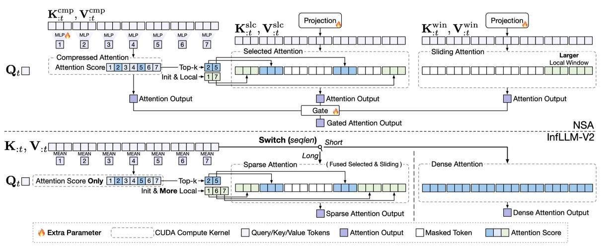

# InfLLM-V2: Dense-Sparse Switchable Attention for Seamless Short-to-Long Adaptation

> Weilin Zhao, Zihan Zhou, Zhou Su, Chaojun Xiao, Yuxuan Li, Yanghao Li, Yudi Zhang, Weilun Zhao, Zhen Li, Yuxiang Huang, Ao Sun, Xu Han, Zhiyuan Liu
>
> **机构**: Tsinghua University, OpenBMB, Harbin Institute of Technology
>
> **发表**: arXiv, 2025 年 9 月
>
> **代码**: [https://github.com/OpenBMB/infllmv2_cuda_impl](https://github.com/OpenBMB/infllmv2_cuda_impl)
>
> **关键词**: sparse_pruning, attention_sparsity

---

## 一句话总结

InfLLM-V2 提出了一种密集-稀疏可切换注意力框架，通过零额外参数实现从短序列到长序列的无缝适配，在长上下文理解和链式推理任务中以 4 倍加速达到全注意力 98.1%~99.7% 的性能，同时支持短序列高效密集计算。

---

## 摘要翻译

长序列处理是现代大语言模型的关键能力。然而，标准 Transformer 架构中的自注意力机制在处理长序列时面临严重的计算和内存瓶颈。可训练的稀疏注意力方法提供了一个有前景的解决方案，但现有方法（如 NSA）引入了过多的额外参数，破坏了传统的"短序列预训练、长序列微调"工作流，导致收敛缓慢和加速困难。为克服这些局限，我们提出了密集-稀疏可切换注意力框架，称为 InfLLM-V2。InfLLM-V2 是一种可训练的稀疏注意力，能够无缝地将模型从短序列适配到长序列。具体而言，InfLLM-V2 通过无参数的架构修改复用密集注意力参数，保持短序列和长序列处理的一致性。此外，InfLLM-V2 通过在短输入时使用密集注意力、在长序列时平滑过渡到稀疏注意力，确保所有序列长度的计算效率。为实现实际加速，我们进一步提出了 InfLLM-V2 的高效实现，显著降低了计算开销。在长上下文理解和链式推理的实验中，InfLLM-V2 比密集注意力快 4 倍，同时分别保留了 98.1% 和 99.7% 的性能。基于 InfLLM-V2 框架，我们训练并开源了 MiniCPM4.1（混合推理模型），为研究社区提供可复现的实现。

---

## 研究动机

### 长序列处理的核心需求

随着大语言模型的快速发展，长序列处理需求日益增长，涵盖：
- **长输入场景**：深度研究、长期记忆聊天机器人、软件问题解决（如 SWE-bench）
- **长输出任务**：复杂推理（如 OpenAI o1、DeepSeek-R1）、LLM 驱动的智能体

### 现有方法的局限

1. **训练无关稀疏注意力**（如 InfLLM、MInference）：利用注意力机制固有的稀疏性加速推理，但受限于"稀疏度-性能"的权衡，加速潜力有限
2. **可训练稀疏注意力（NSA）**：
   - 引入三组独立的 KV 投影参数和三个注意力模块
   - 与标准"短序列预训练→长序列微调"工作流存在架构失配
   - 短序列计算开销大，训练不稳定
   - 从密集注意力到 NSA 的切换需要中断学习过程

---

## 方法（技术细节）

### 核心框架：密集-稀疏可切换注意力

InfLLM-V2 构建于 InfLLM（训练无关的块稀疏注意力）之上，包含三个核心创新：

#### 1. 共享 KV 投影（Shared Key-Value Projection）

- **NSA 问题**：使用三组独立的 KV 投影参数（W_cmp、W_slc、W_win），增加参数量且使短-长序列适配困难
- **InfLLM-V2 方案**：使用单一共享投影参数 W_K、W_V，直接复用预训练的密集注意力参数，实现零额外参数

#### 2. 对齐计算（Aligned Computation）

- **统一稀疏注意力**：将 NSA 的"选中注意力"（Selected Attention）和"滑动注意力"（Sliding Attention）合并为单一稀疏注意力模块
- **消除压缩注意力输出**：仅保留压缩注意力的注意力分数 S_cmp 用于块选择，不计算其输出
- **单输出设计**：更接近密集注意力，有利于训练
- **动态切换**：根据输入序列长度在密集和稀疏注意力模式间无缝切换

#### 3. 三级压缩模块（3-Stage Group-Level Compression）

为解决单阶段压缩（大块大小 B）导致的粒度信息丢失问题，采用三级由粗到细的压缩过程：

- **第一阶段**（粗粒度）：对输入键序列 K 进行均值池化，生成中间表示 KC1
  - KC1_i = Mean(K_{i·sC1 : i·sC1+lC1})
- **第二阶段**（块级稀疏注意力）：在 GQA 模型中，强制同一组内的所有头共享相同的块选择模式，计算共享重要性分数 S_shared
  - S_shared = Σ_{h=1}^{G} SC1(h)
- **第三阶段**（细粒度）：应用最大池化操作，保留最显著特征
  - Scmp_i = Max(S_shared_{i·s : i·s+l})

参数设置：lC1 = B/2, sC1 = B/4, l = 5, s = 4，实现与单阶段相同压缩比。

#### 4. 高效实现（Fused Head Group Summation）

- **问题**：压缩分数 S_cmp 的计算引入显著性能瓶颈，主要是将第一阶段注意力分数 SC1 存储到 GPU HBM 的 I/O 开销
- **解决方案**：
  - 受 FlashAttention 启发，将头组求和操作融合到 SRAM 中的计算循环
  - 仅将降维后的注意力分数 S_shared 写入 HBM（大小为 hqn²/(sC1·G)）
  - **两遍法（Two-pass）**：第一遍在 SRAM 中计算 log-sum-exp（lse），第二遍利用 lse 计算最终注意力分数并执行头组求和
  - **LSE 近似**：使用更粗粒度的注意力分数 SC2 近似 lse 计算，将计算开销从 2× 降至 1.25×
    - KC2_i = Mean(K_{i·sC2 : i·sC2+lC2}), sC2 = 4·sC1, lC2 = 4·lC1

---

## 实验结果

### 实验设置

- **模型规模**：8B 参数，d = 4096, hq = 32, hkv = 2, dh = 128
- **预训练**：8T tokens，4k 长度序列（FineWeb-Edu + Stack-v2）
- **长上下文微调**：5B tokens，使用 InfLLM-V2（Sparse）模式
  - 序列长度：0-4k, 4-12k, 12-24k, 24-32k（1:1:1:1 比例）
  - 选中块数：|I| = 96（含 |I_init| = 1, |I_topk| = 63, |I_local| = 32），可见 token 总数 = 6k

### 主要结果

#### 长上下文理解（RULER, 32k）

| 方法 | 平均分 |
|------|--------|
| FullAttn | 84.26 |
| NSA | 59.92 |
| InfLLM-V2 (Sparse, w/ LSE Approx) | **82.62** |
| InfLLM-V2 (Dense) | 88.32 |

- InfLLM-V2 (Sparse) 保留了 FullAttn **98.1%** 的性能
- NSA 在短→长适配设置下仅达到 FullAttn 的 71% 性能

#### 长上下文理解（LongBench & LongPPL）

| 方法 | LongBench ↑ | LongPPL ↓ |
|------|-------------|-----------|
| FullAttn | 42.30 | 2.06 |
| NSA | 37.10 | 4.24 |
| InfLLM-V2 (Sparse) | **42.54** | 2.12 |
| InfLLM-V2 (Dense) | 42.49 | 2.00 |

#### 长推理（Long Reasoning）

| 方法 | 平均分 ↑ |
|------|----------|
| FullAttn | 42.79 |
| NSA | 37.28 |
| InfLLM-V2 (Sparse) | **42.66** |
| InfLLM-V2 (Dense) | 40.53 |

- InfLLM-V2 (Sparse) 保留了 FullAttn **99.7%** 的性能

#### 通用任务（General Tasks）

- InfLLM-V2 (Dense) 可无缝切换回密集模式，在短序列任务（MMLU, MMLU-Redux, CEval, MATH-500, HumanEval, MBPP, BBH）上保持与 FullAttn 相当的性能（平均 66.76 vs 67.41）
- NSA 在短序列任务上性能显著下降（平均 60.63）

#### 效率（Efficiency）

- **核函数加速**（A100, 128k, 16 选中块）：InfLLM-V2 最高 **7.4×**（A100）/ **9.3×**（4090）加速（vs FlashAttention）
- NSA 限制在 3.5× 加速
- **端到端推理**（W4A16 量化，|I| = 96）：
  - 预填充加速：**2.13×**
  - 解码加速：**2.32×**
- LSE 近似有效降低块选择开销（如 A100, 128k：从 75.36ms 降至 56.59ms）

### 训练稳定性

- InfLLM-V2 的训练曲线接近 FullAttn
- NSA 的训练损失出现明显扰动（disruption）

---

## 优势

1. **零额外参数**：通过共享 KV 投影和无参数架构修改，无需引入新参数
2. **无缝短→长适配**：完美适配"短序列预训练→长序列微调"范式，消除架构失配
3. **双模式切换**：支持在密集和稀疏注意力间自由切换，短序列用密集注意力，长序列用稀疏注意力
4. **高效率加速**：在长序列上实现最高 7.4×（A100）/ 9.3×（4090）加速，端到端预填充 2.13×、解码 2.32×
5. **性能优异**：保留 FullAttn 98.1%~99.7% 的性能，显著优于 NSA 和其他稀疏方法
6. **训练稳定**：训练曲线平滑，与 FullAttn 一致
7. **开源可复现**：基于 InfLLM-V2 训练并开源了 MiniCPM4.1 混合推理模型

---

## 局限

1. **仅加速注意力层**：未加速 FFN 层，未来可结合 FFN 加速技术进一步提升整体效率
2. **固定稀疏度设置**：实验中使用固定选中块数 |I| = 96，可能未充分利用自适应稀疏度的优势
3. **预训练规模有限**：使用 8T tokens 在 4k 序列上预训练，未在更大规模和更长序列上验证
4. **硬件依赖**：高效实现依赖特定的 CUDA kernel 和 SRAM 结构，可能在不同硬件上效果不一
5. **长推理任务局限**：在某些长推理任务（如 AIME 25）上性能仍有波动
6. **压缩分数计算开销**：尽管 LSE 近似已大幅降低，块选择仍占总计算时间的一定比例

---

## 与 EfficientPaper 相关的研究方向

1. **稀疏注意力的高效实现**：InfLLM-V2 的 CUDA kernel 实现为高效注意力提供了实践参考，特别是融合头组求和和 LSE 近似技术
2. **密集-稀疏切换架构**：为"短→长序列"适配提供了新范式，避免了 NSA 式的架构不匹配问题
3. **块稀疏注意力的优化**：3 级压缩模块和硬件感知的高效实现为块稀疏注意力的工程优化提供了思路
4. **可训练稀疏注意力**：与 NSA、SeerAttention、MoBA 等方法的对比，展示了零额外参数方案的优势
5. **长上下文模型训练范式**：验证了"短序列预训练→长序列微调"在稀疏注意力下的可行性，对 EfficientPaper 收集的高效 LLM 研究具有重要参考价值

---

> **注意**：本笔记由 AI Agent 自动生成，基于论文全文内容撰写，仅供参考。
