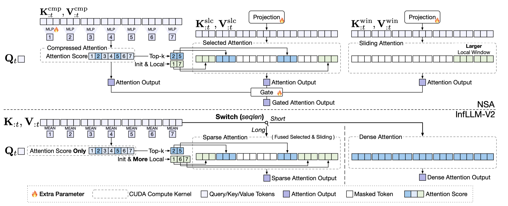

# InfLLM-V2: Dense-Sparse Switchable Attention for Seamless Short-to-Long Adaptation

> Weilin Zhao, Zihan Zhou, Zhou Su, Chaojun Xiao, Yuxuan Li, Yanghao Li, Yudi Zhang, Weilun Zhao, Zhen Li, Yuxiang Huang, Ao Sun, Xu Han, Zhiyuan Liu

## Abstract

Long-sequence processing is a critical capability for modern large language
models. However, the self-attention mechanism in the standard Transformer
architecture faces severe computational and memory bottlenecks when processing
long sequences. While trainable sparse attention methods offer a promising
solution, existing approaches such as NSA introduce excessive extra parameters
and disrupt the conventional \textit{pretrain-on-short, finetune-on-long}
workflow, resulting in slow convergence and difficulty in acceleration. To
overcome these limitations, we introduce dense-sparse switchable attention
framework, termed as InfLLM-V2. InfLLM-V2 is a trainable sparse attention that
seamlessly adapts models from short to long sequences. Specifically, InfLLM-V2
reuses dense attention parameters through parameter-free architecture
modification, maintaining consistency between short and long sequence
processing. Additionally, InfLLM-V2 ensures computational efficiency across all
sequence lengths, by using dense attention for short inputs and smoothly
transitioning to sparse attention for long sequences. To achieve practical
acceleration, we further introduce an efficient implementation of InfLLM-V2
that significantly reduces the computational overhead. Our experiments on
long-context understanding and chain-of-thought reasoning demonstrate that
InfLLM-V2 is 4$\times$ faster than dense attention while retaining 98.1% and
99.7% of the performance, respectively. Based on the InfLLM-V2 framework, we
have trained and open-sourced MiniCPM4.1
(https://huggingface.co/openbmb/MiniCPM4.1-8B), a hybrid reasoning model,
providing a reproducible implementation for the research community.
