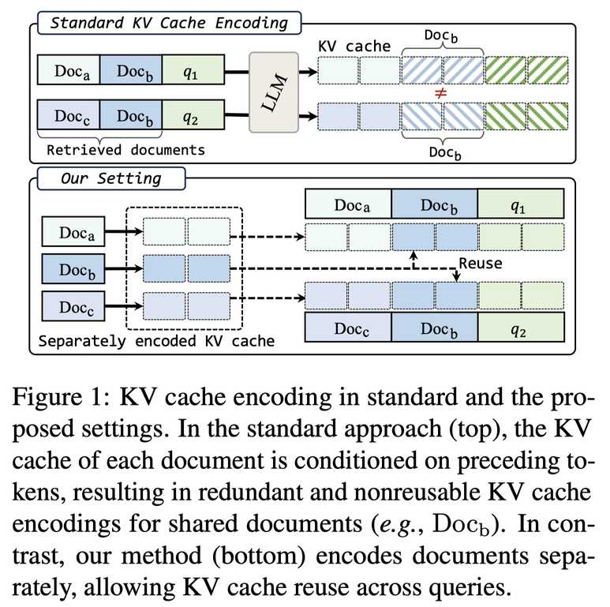

# KVLink: Accelerating Large Language Models via Efficient KV Cache Reuse

> **⚠️ 生成声明**：本 note 由 AI Agent（Hermes Agent）自动生成，基于 arXiv 论文全文阅读与分析，未经人工审校。生成时间：2026-06-04。内容仅供学术参考，建议以原始论文为准。

---

## 一句话总结

KVLink 通过预计算并独立编码每个文档的 KV Cache，并引入位置重编码、可训练链接 token 和混合数据微调三个关键组件，在 RAG 场景下将 TTFT 降低高达 90%，同时在 QA 任务上平均提升 4% 准确率，实现了高效的 KV Cache 复用。

---

## 摘要翻译

我们描述了 KVLink，一种在大语言模型（LLMs）中实现高效键值（KV）缓存复用的方法。在许多 LLM 应用中，不同输入可以共享重叠的上下文，例如同一检索到的文档出现在多个查询中。然而，LLM 仍然需要为每个查询编码整个上下文，导致冗余计算。本文提出了一种新的策略来消除这种低效：每个文档的 KV 缓存在独立条件下预计算。在推理时，检索到的文档的 KV 缓存被拼接，使模型能够复用缓存的表示而无需重新计算。为了缓解 LLM 在使用独立编码的 KV 缓存时性能下降的问题，KVLink 引入了三个关键组件：在推理时调整 KV 缓存的位置嵌入以匹配拼接后的全局位置、使用可训练的特殊 token 恢复独立编码文档间的自注意力、以及应用混合数据微调以提升性能同时保持模型原有能力。在 7 个数据集上的实验表明，KVLink 在问答准确率上平均比现有最优方法提高 4%。此外，通过利用预计算的 KV 缓存，该方法将首 token 延迟（TTFT）相比标准 LLM 推理降低高达 90%，使其成为可扩展且高效的上下文复用解决方案。

---

## 研究动机

在 RAG（检索增强生成）系统中，LLM 需要为每次查询编码多个检索到的文档。当不同查询共享相同的文档时，标准 LLM 推理流程会对这些文档进行冗余的重新编码，导致大量的计算浪费。具体来说：

1. **冗余计算问题**：标准自回归架构要求将所有检索到的文档拼接为一个连续序列进行编码。即使多个查询共享相同的文档，模型仍然需要重新编码这些文档，造成严重的计算冗余。

2. **KV Cache 无法复用**：在标准流程中，每个文档的 KV Cache 依赖于其前面文档的编码结果（因果注意力机制），因此即使文档内容相同，不同查询产生的 KV Cache 也无法直接复用。

3. **性能下降挑战**：朴素地独立编码每个文档并在推理时拼接 KV Cache，会导致显著的性能下降。先前工作（BlockAttention 等）报告了高达 35% 的相对准确率下降，原因包括位置编码不匹配和跨文档注意力缺失。

因此，如何在保留 LLM 性能的同时实现 KV Cache 的高效复用，成为本文研究的核心问题。

---

## 方法（技术细节）

KVLink 包含三个核心组件来解决独立编码文档后的 KV Cache 复用问题：

### 1. KV Cache 位置重编码（Positional Re-encoding）

**问题**：现代 LLM 通常使用旋转位置编码（RoPE），每个 token 根据其在完整序列中的位置分配不同的位置嵌入。当文档独立编码时，token 的位置索引仅限于文档内部，忽略了在拼接输入中的实际位置。例如，Docb 中的第 2 个 token 在独立编码时位置索引为 2，但当它拼接在 Doca 后面时，实际位置应为 |Doca| + 2。

**解决方案**：在存储 KV Cache 时解耦位置信息。具体做法：
- 保存 KV Cache 时，不存储应用 RoPE 后的 key 向量，而是存储原始的 $W_k x_i$（不含旋转矩阵 $R_i$）
- 推理时，将所有文档的 KV Cache 拼接后，根据每个 token 在完整序列中的全局位置重新应用旋转位置编码

关键公式：key 向量计算为 $R_i W_k x_i$，其中 $R_i$ 是位置相关的旋转矩阵。存储时仅保存 $W_k x_i$，推理时根据全局位置重新应用 $R_i$。

此操作引入的时间开销可忽略不计，确保了方法的高效性。

### 2. 跨文档链接 Token（Cross-Document Link Tokens）

**问题**：当文档独立编码时，后续文档中的 token 无法 attend 到前面文档中的 token，导致跨文档依赖关系丢失。

**解决方案**：KVLINK 在每个文档末尾引入一组可训练的链接 token（link tokens）。对于长度为 L 的文档，附加 K 个链接 token（如 K=5）：

$$c = [c_1, \ldots, c_L, c_{link1}, \ldots, c_{linkK}]$$

**注意力机制设计**：
- 文档内部的 token 仅维持局部因果注意力（只能 attend 同一文档内的先前 token）
- 链接 token 可以 attend 到（i）前面所有文档的所有 token（包括链接 token）和（ii）当前文档的所有 token
- 链接 token 充当文档间的接口，隐式恢复跨文档依赖关系

例如（K=1 时）：
- link1（token 3）：attend 到 Doca 的所有 token
- link2（token 6）：attend 到 Doca 和 Docb 的所有 token 以及 link2
- link3（token 8）：attend 到所有已复用上下文和其他链接 token

推理时，链接 token 的 KV Cache 在推理时计算（不在预计算中），引入的计算开销极小。

### 3. 混合数据微调（Mixed-Data Fine-tuning）

**目标**：使 LLM 适应独立编码文档的新范式，同时保持其原始能力。

**数据混合策略**（包含以下六类数据）：

| 任务类型 | 数据源 | 比例 | 样本数 |
|---------|--------|------|--------|
| 检索增强 QA（独立编码） | TriviaQA, 2WikiMQA | 10% | 20,000 |
| 多轮对话 | DaringAnteater | 25% | 92,700 |
| 摘要 | XSum | 5% | 17,345 |
| 检索增强 QA（整体编码） | TriviaQA, 2WikiMQA | 10% | 20,000 |
| SFT（指令跟随） | Tulu3-sft-mixture | 30% | 732,100 |
| 预训练（语言建模） | Fineweb | 20% | 10,000,000 |

- **检索增强 QA**：从 TriviaQA 和 2WikiMQA 采样问题，用 Contriever 检索 10 个 Wikipedia 段落，独立编码，用 GPT-4 生成参考答案
- **多轮对话**：随机将早期对话轮次转换为独立编码的 KV Cache
- **摘要**：将 XSum 文档随机拆分为多个 100-token 段，每段独立编码
- **保留原始能力**：包含标准版 QA 数据（文档整体编码）、Tulu3 数据集和 Fineweb 预训练数据

**训练配置**：
- 骨干模型：Llama-3.2-1B-Instruct 和 Llama-3.2-3B-Instruct
- 训练步数：6,000 步
- 全局 batch size：64
- 硬件：8 × A100 GPU
- 最大序列长度：4096 tokens

**特殊 token 设计**：
- `KV-START` 和 `KV-END`：标记复用上下文的边界
- 链接 token 按文档索引命名（如 link1_1, link1_2, ..., linkn_K），在不同 prompt 中第 n 个复用文档的链接 token 始终为 linkn-1 到 linkn-K

---

## 实验结果

### 主要结果（QA 任务性能对比）

在 7 个数据集上评估，使用 Llama-3.2-1B 和 Llama-3.2-3B 作为骨干模型：

**Llama-3.2-1B 结果：**

| 方法 | NQ | 2WikiMQA | TriviaQA | HotpotQA | MuSiQue |
|------|-----|----------|----------|----------|---------|
| Original Llama | 44.6% | 61.8% | 61.6% | 49.3% | 13.8% |
| Finetuned Upperbound | 46.9% | 71.9% | 68.7% | 56.5% | 19.9% |
| PROMPTCACHE | 18.6% | 19.5% | 34.9% | 20.5% | 1.4% |
| CACHEBLEND | 25.7% | 31.0% | 52.0% | 28.7% | 3.7% |
| BLOCKATTENTION | 39.0% | 64.3% | 64.6% | 48.3% | 14.3% |
| **KVLINK5** | **45.0%** | **66.0%** | **66.3%** | **55.6%** | **19.2%** |

**Llama-3.2-3B 结果：**

| 方法 | NQ | 2WikiMQA | TriviaQA | HotpotQA | MuSiQue |
|------|-----|----------|----------|----------|---------|
| Original Llama | 69.4% | 60.4% | 72.6% | 69.3% | 34.8% |
| Finetuned Upperbound | 69.7% | 74.1% | 76.2% | 74.3% | 41.5% |
| PROMPTCACHE | 24.7% | 27.8% | 55.7% | 24.6% | 2.2% |
| CACHEBLEND | 42.6% | 47.6% | 64.0% | 32.7% | 5.5% |
| BLOCKATTENTION | 58.8% | 70.3% | 72.9% | 64.3% | 28.3% |
| **KVLINK5** | **64.4%** | **71.2%** | **73.7%** | **69.5%** | **35.8%** |

关键发现：
- KVLink 在所有 QA 数据集上一致超越所有基线方法
- 相比最优基线 BLOCKATTENTION，在 QA 任务上最高提升 6.6%（NQ）和 7.3%（HotpotQA）
- 接近甚至超过 finetuned Upperbound（使用完整拼接上下文的上界）

### 推理效率（TTFT 降低）

- 在 10 个文档、总上下文 5,000 tokens 的条件下，KVLink 将 TTFT 降低 90%
- 在 1,000 tokens 上下文下降低约 60%
- 随着上下文长度增加，效率增益更加显著
- KVLink1 和 KVLink5 在所有上下文规模下均显著优于标准解码

### 通用能力保持

在 10 个基准测试（GSM8K、MMLU、IFEval、ARC、PiQA、SciQ、Winogrande、HellaSwag）上的评估表明：
- KVLink 与 finetuned Llama 性能高度可比
- 部分基准（ARC-C、Winogrande）有小幅下降（通常 < 3%）
- 成功保持了模型的推理和指令遵循能力

### 消融研究

- 不同数据混合方案下 KVLink 仍能保持有竞争力的性能
- 任务组合和领域覆盖会影响下游性能，平衡数据选择很重要
- 去掉摘要或多轮对话任务后，性能略有下降，说明需要多样化数据

---

## 优势

1. **显著的推理加速**：TTFT 降低高达 90%，特别是在长上下文场景下效果更明显
2. **性能提升显著**：在 7 个 QA 数据集上平均提升 4%，最高超过最优基线 7.3%
3. **轻量级设计**：链接 token 仅引入极少的计算开销，位置重编码操作时间可忽略
4. **通用能力保持**：微调后模型在推理、指令遵循等通用能力上几乎无损失
5. **可扩展性**：方法与 KV Cache 量化和驱逐策略兼容，可进一步提升效率
6. **实际应用价值**：特别适合 RAG 场景，大量文档被重复检索和查询时效果显著
7. **灵活的链接 token 数量**：K=0/1/5 三种配置可权衡性能与开销

---

## 局限

1. **微调成本**：需要对模型进行微调以适应独立编码文档的新范式，对于非常大的模型来说成本较高
2. **存储开销**：预计算的 KV Cache 需要存储在 CPU 内存或磁盘中，当文档数量增多时可能产生显著的存储和加载开销
3. **骨干模型规模有限**：实验仅在 Llama-3.2-1B 和 3B 上验证，未在更大规模模型上测试
4. **通用能力小幅下降**：部分基准（ARC-C、Winogrande）有小幅性能下降，虽在可接受范围内
5. **数据混合优化**：最优训练数据配方仍是开放问题，不同数据组合对性能有影响
6. **依赖 RAG 场景**：方法的核心优势在于重复文档的 KV Cache 复用，对于文档不重复的场景优势有限

---

## 与 EfficientPaper 相关的研究方向

### 直接相关研究

1. **KV Cache 管理与优化**：
   - KV Cache 量化（如 KIVI、AWQ、GPTQ）——减少 KV Cache 的存储和内存开销
   - KV Cache 驱逐策略（如 H2O）——通过选择性保留重要 token 来压缩 KV Cache
   - KVLink 可与这些方法无缝集成，同时解决速度和内存效率问题

2. **KV Cache 复用方法**：
   - PROMPTCACHE：允许 KV Cache 在不连续位置复用，但忽略跨 chunk 注意力
   - CACHEBLEND：通过选择性重计算减少位置不匹配，但有显著性能下降
   - BlockAttention：通过重新编码 KV Cache 去除位置嵌入，但缺乏连接策略

3. **高效推理方法**：
   - 模型剪枝（如 Sheared LLaMA）
   - 量化（如 SmoothQuant、AWQ、GPTQ）
   - 推测解码（如 Speculative Decoding）
   - 早退出（如 Layer Skip）
   - KVLink 与这些方法互补，可进一步提升推理效率

### 潜在研究方向

4. **RAG 系统优化**：在 RAG 系统中如何更高效地管理检索到的文档的 KV Cache，实现快速复用和更新
5. **长上下文推理**：在超长上下文中如何通过分段编码和缓存来降低计算成本
6. **多模态 KV Cache 复用**：将 KV Cache 复用扩展到多模态模型（如视觉-语言模型）
7. **动态文档管理**：如何高效管理知识库中文档的 KV Cache（包括存储、加载、更新和淘汰策略）
8. **在线学习与增量更新**：当知识库更新时，如何增量更新预计算的 KV Cache
