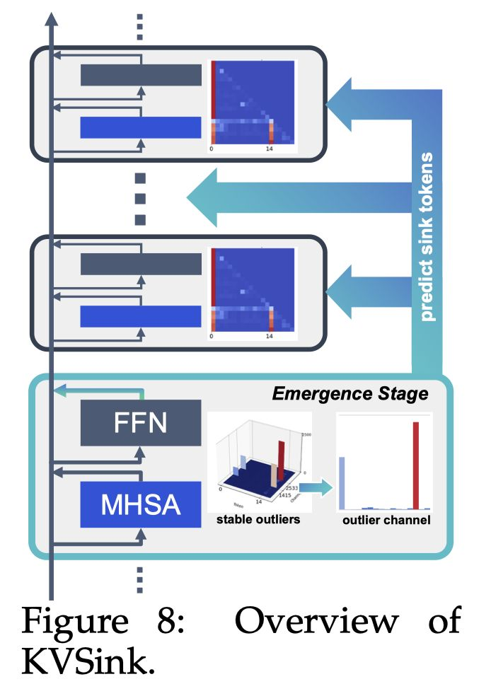
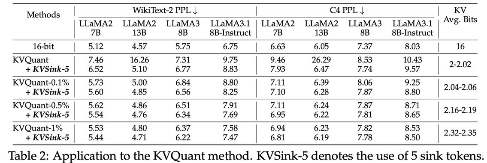

# KVSink: Understanding and Enhancing the Preservation of Attention Sinks in KV Cache Quantization for LLMs

> Zunhai Su, Kehong Yuan

## 一句话总结

KVSink 通过揭示 Attention Sink 与极端激活异常值（stable outliers）的跨层演化关系，提出一种即插即用的 Sink Token 预测方法，在 KV Cache 量化中实现更精确的 Attention Sink 保护，以极低开销超越现有 Preserve-First-N 策略。

## 摘要翻译

Key-Value (KV) 缓存量化已成为大语言模型（LLM）推理中广泛采用的优化技术，通过减少 KV 缓存内存使用和缓解内存瓶颈来实现高效推理。近期研究强调了保持前几个 token 原始精度以保护 Attention Sink 的重要性。虽然这种方法在缓解性能退化方面已被证明有效，但其底层原理仍不够充分理解。此外，它未能解决最近发现的 Attention Sink 可以出现在初始 token 位置之外的问题。

在本工作中，我们通过考察 Attention Sink 在极端激活异常值跨层演化中的作用，阐明了推理过程中 Attention Sink 的底层机制。同时，我们提供了 Attention Sink 与 KV 缓存量化之间相互作用的全面分析。基于我们的增强理解，我们引入了 **KVSink**，一种即插即用的方法，能够以可忽略的开销有效预测 Sink token，从而实现更彻底的保护。大量实验表明，KVSink 优于现有的 Preserve-First-N (PFN) 策略，在 KV 缓存量化期间提供更有效的 Attention Sink 保护。此外，当应用于成熟的 KVQuant 方法时，KVSink 进一步改善了困惑度 (PPL) 并减少了对 16 位数值异常值的依赖。

## 研究动机

1. **KV 缓存内存瓶颈**：LLM 推理中 KV 缓存随批大小和上下文长度增长，成为显著的内存瓶颈，低比特量化成为重要压缩方向。
2. **Attention Sink 问题**：LLM 推理中 Attention Sink（注意力集中在初始 token 上）现象广泛存在，其对应的 KV 需要在量化中保持更高精度，否则导致性能退化。
3. **现有方法的局限**：
   - 现有方案（如 PFN，Preserve-First-N）仅静态保留前几个 token 的 KV，无法处理 Attention Sink 出现在其他位置的情况。
   - 缺乏对 Attention Sink 与 KV 量化之间相互影响的系统性分析。
   - 缺乏对 Attention Sink 在推理中底层机制的深入理解。
4. **核心问题**：如何高效且准确地识别所有 Attention Sink 位置（包括非初始位置），从而在量化中更有效地保护它们。

## 方法

### 3.1 极端激活异常值的跨层演化

作者首先定义了四种不同类型的极端激活异常值：
- $X_d^{in}$：FFN 下投影层的输入
- $X_d^{out}$：下投影层的输出
- $H'$：MHSA 后的残差求和
- $H$：FFN 后的残差求和（stable outliers 出现的位置）

通过可视化分析发现，这些异常值虽然都出现在 Sink token 上且幅度显著更大，但具有不同的跨层分布模式。它们的演化呈现**五阶段结构**：
1. **初始阶段**（Initial）：无显著异常值
2. **出现阶段**（Emergence）：极端异常值首先出现在 $X_d^{in}$，传播到 $X_d^{out}$，通过残差连接在 $H$ 中出现 stable outliers
3. **稳定阶段**（Stabilization）：跨越大部分中间层，异常值在 $H'$ 和 $H$ 中持续存在，$X_d^{in}$ 和 $X_d^{out}$ 不再有极端异常值
4. **消散阶段**（Dissipation）：极端异常值重新出现在 $X_d^{in}$，产生与出现阶段符号相反的异常值，导致 stable outliers 显著减少或消失
5. **最终阶段**（Final）：无显著极端异常值

### 3.2 Attention Sink 与 stable outliers 的稳定化机制

Attention Sink 通过两个关键机制维持 stable outliers 的稳定性：

**QKV 抑制机制**：Sink token 的 Query、Key、Value 的范数显著小于非 Sink token（图 2、图 5）。

**QK 高余弦相似度**：尽管 Sink token 的 Query 和 Key 范数小，但非 Sink token 的 Query 与 Sink token 的 Key 之间保持高余弦相似度（图 5a），导致大的注意力分数。

这两个机制共同作用：少数 Sink token 具有极高的注意力分数但小的 Value，其余 token 获得较低注意力分数，导致注意力输出值较小。QKV 抑制机制给 Sink token 的 Query、Key、Value 施加了独特的数值特征，这是它们对量化敏感的根本原因。

### 4. KV 缓存量化与 Attention Sink 的相互影响

#### Attention Sink 对 KV 量化的影响（表 1）

- **Per-token 量化**：在静态量化中，排除 Sink token 可将 Key 量化误差降低高达 81.1%，Value 降低 68.2%。
- **Per-channel Key 量化**：包含 Sink token 的量化组误差增加 16.3%~29.2%；静态量化中排除 Sink token 可降低误差高达 42.7%。

#### KV 量化对 Attention Sink 的影响（图 7）

量化显著影响 Attention Sink 及其引入的隐式注意力偏差（attention biases），随着比特宽度降低，影响更加显著。由于 Attention Sink 引入的偏差持续存在于所有后续 token 上并可能包含全局关键信息，其对注意力计算的影响是持续且显著的。

### 4.3 KVSink 方法

KVSink 利用 stable outliers 和 Attention Sink 在同一 token 上出现的内在关系来预测 Sink token 位置。具体做法：

1. **在出现阶段（Emergence stage）检测异常值**：异常值幅度极大且稀疏，通过 top-k 排序高效检测。
2. **仅需执行一次**：出现阶段层可以预识别（输入无关）。
3. **限制检测通道**：异常值在特定固定通道出现，只需检测单个预识别通道。
4. **仅在 prefill 阶段执行**：初始输入序列通常足够长以捕获所有 Attention Sink。

算法概要（Algorithm 1）：
- 在预填充阶段，遍历每一层
- 在出现阶段层（$l_E$），对特定通道 $c$ 执行 top-k 排序，识别异常值位置
- 将识别到的 Sink token 位置集合 $S_{sink}$ 用于量化时的排除

KVSink 开销极低：
- 预填充时间增加仅 ~0.04ms
- KV 缓存内存增加极少（如 5 token 保留增加 ~2.5MB）

## 实验结果

### 对比 PFN 策略（图 9）

KVSink 在几乎所有情况下优于 PFN。关键发现：
- LLaMA2-70B per-token static 4-bit 量化：KVSink 仅保留 5 个 Sink token 即可将 PPL 降低 163.2，仅比 FP16 基线增加 2.5；而 PFN 的 PPL 为 59.5。
- 在 LLaMA2-7B/13B/70B、Mistral-7B、LLaMA3-8B、LLaMA3.1-8B-instruct 上，KVSink 在 2-bit 和 4-bit 下均表现优异。
- **保留 5 个 Sink token 在大多数情况下已足够**。

### 应用于 KVQuant 方法（表 2）

将 KVSink 应用于 2-bit KVQuant 方法（不同数值异常值设置：0.1%、0.5%、1%、无隔离）：
- KVSink 在所有设置下一致改善 PPL，效果在保留更少数值异常值时更显著。
- KVSink 减少了对 FP16 数值异常值的依赖：0.1% 设置下 KVSink 的性能维持甚至超过 0.5% 设置。
- 减少 FP16 异常值保留意味着更高效的压缩。

### 效率分析（表 4）

- 时间效率：KVSink 额外开销极小（~0.04ms 预填充时间增加）
- 内存效率：额外 KV 缓存内存增加极小（5 token 保留约增加 0.55~3.91MB）
- 随着上下文长度增长，内存影响可进一步降低（保留 token 数量固定）

## 优势

1. **即插即用**：KVSink 可直接应用于现有 KV 缓存量化方法，无需修改模型架构。
2. **极低开销**：开销可忽略不计（~0.04ms 预填充时间，极小内存增加）。
3. **全面的理论基础**：不仅提出了方法，还深入分析了 Attention Sink 与极端激活异常值的跨层演化关系、QKV 抑制机制、以及量化对 Attention Sink 的影响。
4. **超越 PFN**：在几乎所有测试场景中优于现有 PFN 策略。
5. **减少对 16-bit 异常值依赖**：与 KVQuant 结合后可降低对 FP16 数值异常值的保留需求，实现更高效压缩。
6. **广泛验证**：在 7 个模型（LLaMA2-7B/13B/70B、LLaMA2-7B-chat、Mistral-7B、LLaMA3-8B、LLaMA3.1-8B-instruct）上验证，跨多种量化方案。
7. **输入无关的静态特征**：出现阶段层和异常值通道是输入无关的，可预识别为静态特征。

## 局限

1. **仅在 prefill 阶段执行**：如果 prefill 阶段的输入序列不够长，可能无法捕获所有 Attention Sink。
2. **特定于 LLaMA 架构**：实验主要在 LLaMA 系列模型上进行，对其他架构（如非 GQA 模型）的通用性需要进一步验证。
3. **静态识别**：KVSink 在 prefill 阶段识别 Sink token 后不再更新，可能无法处理动态出现的 Sink。
4. **与 FlashAttention 的兼容性**：由于 FlashAttention 不暴露中间结果，无法基于注意力分数动态识别 Sink token，KVSink 通过 stable outliers 间接解决此问题。
5. **异常值通道需要预识别**：每个模型的异常值通道不同（表 3），需要额外的预分析步骤。
6. **未探索 sink token 间的差异**：论文注意到最后一层 sink token 的 Query 和 Value 出现异常大的范数，但未深入探索，可能暗示不同 sink token 之间的固有差异。

## 与 EfficientPaper 相关的研究方向

1. **KV Cache 压缩**：KVSink 作为 KV Cache 量化中 Attention Sink 保护的增强方法，属于 KV Cache 压缩的核心研究方向（如 KVQuant、KIVI、SKVQ、RotateKV 等）。
2. **激活异常值与量化**：本文深入分析了极端激活异常值的跨层演化，对激活量化和模型压缩有重要启示。
3. **Attention Sink 机制**：与 StreamLLM、massive activations 研究相关，为理解 LLM 推理中的特殊注意力模式提供了新视角。
4. **混合精度量化**：KVSink 通过识别关键 token 实现混合精度保护，与 ZipCache、MiKV 等方法互补。
5. **低比特 KV Cache 量化**：在 2-bit 和 4-bit 量化中效果显著，对超低比特压缩研究有直接价值。
6. **模型可解释性**：本文揭示了 Attention Sink 与激活异常值的内在联系，为 LLM 可解释性研究提供了新方向。

---

> ⚠️ **生成声明**：本 note 由 AI Agent（Hermes Agent）自动生成，基于论文全文阅读和分析。所有内容仅供参考，如有不准确之处，请以原文为准。

