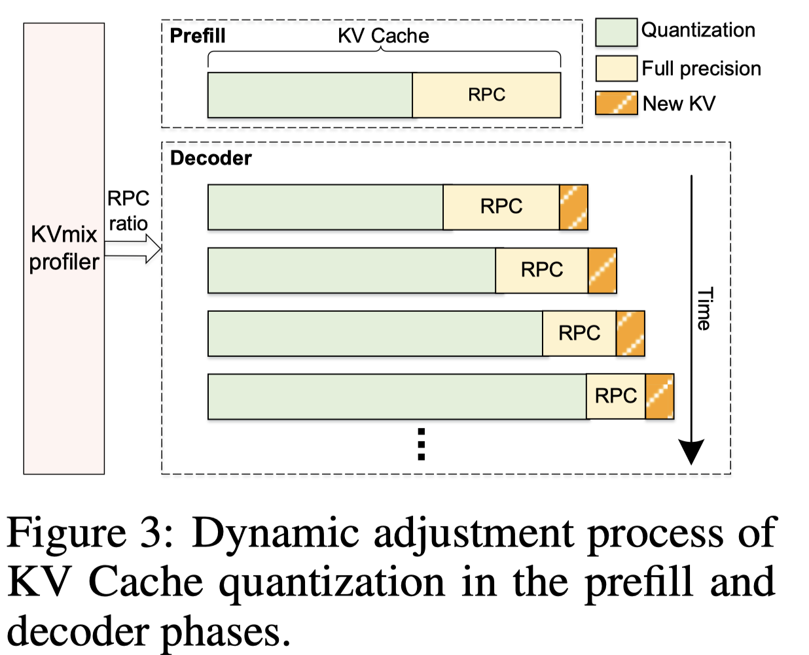

# KVmix: Gradient-Based Layer Importance-Aware Mixed-Precision Quantization for KV Cache

> Fei Li, Song Liu, Weiguo Wu, Shiqiang Nie, Jinyu Wang

## Abstract

The high memory demands of the Key-Value (KV) Cache during the inference of
Large Language Models (LLMs) severely restrict their deployment in
resource-constrained platforms. Quantization can effectively alleviate the
memory pressure caused by KV Cache. However, existing methods either rely on
static one-size-fits-all precision allocation or fail to dynamically prioritize
critical KV in long-context tasks, forcing memory-accuracy-throughput
tradeoffs. In this work, we propose a novel mixed-precision quantization method
for KV Cache named KVmix. KVmix leverages gradient-based importance analysis to
evaluate how individual Key and Value projection matrices affect the model
loss, enabling layer-specific bit-width allocation for mix-precision
quantization. It dynamically prioritizes higher precision for important layers
while aggressively quantizing less influential ones, achieving a tunable
balance between accuracy and efficiency. KVmix also introduces a dynamic
long-context optimization strategy that adaptively keeps full-precision KV
pairs for recent pivotal tokens and compresses older ones, achieving
high-quality sequence generation with low memory usage. Additionally, KVmix
provides efficient low-bit quantization and CUDA kernels to optimize
computational overhead. On LLMs such as Llama and Mistral, KVmix achieves
near-lossless inference performance with extremely low quantization
configuration (Key 2.19bit Value 2.38bit), while delivering a remarkable 4.9x
memory compression and a 5.3x speedup in inference throughput.

以KIVI和KVQuant作为baseline