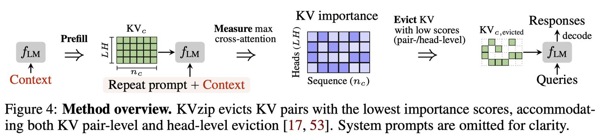

# KVzip: Query-Agnostic KV Cache Compression with Context Reconstruction

> Jang-Hyun Kim, Jinuk Kim, Sangwoo Kwon, Jae W. Lee, Sangdoo Yun, Hyun Oh Song

## 一句话总结

KVzip 提出了一种查询无关（query-agnostic）的 KV 缓存驱逐方法，通过让 LLM 从压缩的 KV 缓存中重构原始上下文来评估每个 KV 对的重要性，从而在一次预填充后即可跨多种查询高效复用压缩缓存，实现 3-4× 的 KV 缓存压缩和约 2× 的解码延迟降低。

## 摘要翻译

基于 Transformer 的大语言模型（LLM）在推理过程中将上下文缓存为键值（KV）对。随着上下文长度增长，KV 缓存大小随之膨胀，导致显著的内存开销和注意力延迟增加。本文提出 KVzip，一种查询无关的 KV 缓存驱逐方法，能够有效地在不同查询间复用压缩后的 KV 缓存。KVzip 利用底层 LLM 从缓存的 KV 对中重构原始上下文来量化每个 KV 对的重要性，随后驱逐重要性较低的 KV 对。大量实验评估表明，KVzip 将 KV 缓存大小减少 3-4 倍，FlashAttention 解码延迟降低约 2 倍，在问答、检索、推理和代码理解任务中性能损失可忽略不计。评估涵盖 LLaMA3.1、Qwen2.5 和 Gemma3 等多种模型，上下文长度可达 170K tokens。KVzip 显著优于现有的查询感知 KV 驱逐方法，后者即使在 90% 缓存预算比例下也会出现性能退化。

## 研究动机

Transformer 架构的 LLM 在推理时需要缓存所有 token 的 KV 对，随着上下文长度的增加，KV 缓存的内存消耗迅速增长。例如，在 Qwen2.5-14B 中缓存 120K tokens（FP16 精度）需要约 33 GB 内存，超过了模型参数存储的 28 GB。

现有的 KV 缓存压缩方法主要分为以下几类：
- **注意力头合并**（如 GQA）
- **KV 对压缩**为更短序列
- **滑动窗口**技术限制上下文窗口
- **动态 KV 驱逐**（如 H2O、SnapKV、PyramidKV）

然而，现有的驱逐方法主要是**查询感知（query-aware）**的，即根据当前查询计算 KV 对的重要性分数进行驱逐。这种方法在**单查询**场景下表现良好，但在**多查询**场景下存在严重问题：
1. 每个新查询都需要重新进行预填充和驱逐，造成重复计算开销
2. 如果复用基于第一个查询压缩的缓存，后续查询的性能会显著下降（因为保留的 KV 对过度拟合于初始查询）

因此，本文提出一种查询无关的 KV 缓存驱逐方法，使得压缩后的缓存可以跨多种查询有效复用。

## 方法（技术细节）

### 核心思想

KVzip 的核心思想是将 Transformer LLM 视为一个**编码器-解码器**架构，其中上下文被编码为 KV 对（类似传统压缩方法 Zip）。通过让 LLM 从压缩后的 KV 缓存中重构原始上下文，可以验证压缩缓存是否保留了完整的上下文信息。如果压缩后的缓存能够让模型准确重构原始上下文，那么它也应该能在各种下游任务中有效工作。

### KV 重要性评分（KV Importance Scoring）

1. **构建输入序列**：给定上下文长度 $n_c$，构造输入序列 $n_{in} = n_{prompt} + n_c$，其中 $n_{prompt}$ 是重复提示词（repeat prompt，如 "Repeat the previous context:"）的长度。
2. **前向传播**：将该输入序列通过 LLM $f_{LM}$ 前向传播，同时使用已有的 KV 缓存 $KV_c$，生成查询特征 $Q_{l,h} \in \mathbb{R}^{G \times n_{in} \times d}$ 和键特征 $K_{l,h} \in \mathbb{R}^{(n_c + n_{in}) \times d}$。
3. **计算注意力矩阵**：计算分组注意力 $A_{l,h} = \text{Softmax}(Q_{l,h} K_{l,h}^\top)$。
4. **提取注意力分数**：提取对应于 $KV_c$ 中键的切片注意力矩阵 $\bar{A}_{l,h}$。
5. **计算重要性分数**：对每个 KV 对，取跨分组查询的最大注意力分数作为重要性分数：
   $$S_{l,h} = \max_{g=1,...,G; i=1,...,n_{in}} \bar{A}_{l,h}[g, i]$$

### 分块评分（Chunked Scoring）

由于注意力矩阵的大小随上下文长度 $n_c$ 二次方增长，直接计算对长上下文不可行。KVzip 提出分块评分策略：

1. 将上下文 token 分成固定大小的块（chunk），每块大小为 $m = 2K$。
2. 对每个块，将重复提示词与该块拼接，通过 LLM 前向传播。
3. 对每个 Transformer 层，对 $KV_c$ 中对应于该块的键进行子采样，获得较小的注意力矩阵。
4. 重复上述过程对所有块进行评分，然后聚合得到完整的 $KV_c$ 重要性分数。

**复杂度分析**：
- 每个块的计算复杂度为 $O(m^2)$，总复杂度为 $O(m \cdot n_c)$，与上下文长度线性相关。
- 峰值内存开销为 $O(m^2)$，与 $n_c$ 无关。

### 关键观察

1. **重构中的注意力稀疏性**：交叉注意力模式比初始预填充时的自注意力模式更加稀疏，这有效识别并移除冗余 KV 对。
2. **跨任务注意力重叠**：重构时的注意力模式与下游任务（QA、摘要、推理）的注意力模式有显著重叠，表明重构关键的 KV 对对下游任务同样重要。

### 支持的驱逐策略

- **上下文相关驱逐**（Context-dependent）：对每个上下文进行重要性评分，压缩率更高但有额外开销。
- **上下文无关驱逐**（Context-independent）：对每个模型进行一次重要性评分（静态头部级重要性分数），部署后无压缩开销，但压缩率适中。
- **头部级驱逐**（Head-level）：计算头部级分数（取序列维度最大值），支持非均匀和均匀头部预算分配。

## 实验结果

### 实验设置

- **评估框架**：查询无关框架（先压缩上下文 KV 缓存，再进行多查询评估）
- **模型**：Qwen2.5-7B-1M、Qwen2.5-14B-1M、LLaMA3.1-3B/8B、Gemma3-12B、LLaMA3-8B-W8A8KV4（量化）
- **数据集**：SQuAD、GSM8K、NIAH、SCBench（9个任务），上下文长度 100-170K tokens
- **基线方法**：H2O、SnapKV、PyramidKV、DuoAttention
- **硬件**：NVIDIA A100 80GB GPU，Bfloat16 精度

### 主要结果

1. **多查询任务泛化（Qwen2.5-7B-1M，12个数据集）**：
   - **检索密集型任务**（Retr.KV、Retr.Prefix-Suffix、Code.RepoQA）：在 30% 缓存比例下仍保持性能，而基线方法在 90% 缓存比例下即开始退化。
   - **上下文理解任务**（SQuAD、GSM8K、En.QA 等）：在 20%-30% 缓存比例下实现近乎无损压缩。
   - **高冗余上下文任务**（En.Summary、En.MultiChoice、ICL.ManyShot）：可激进压缩至 10% 而不退化，甚至偶有性能提升。

2. **模型规模和架构泛化**：
   - 在 Qwen2.5-14B-1M、LLaMA3.1-8B、Gemma3-12B 上均表现优异。
   - Gemma3 使用混合注意力机制（全局+滑动窗口），KVzip 仅对全局注意力层进行驱逐。

3. **KV 量化集成**：
   - 与 QServe 量化框架（4-bit KV cache）结合，70% 驱逐比例 + 4-bit 量化可将 16.3GB 缓存缩减至 1.2GB，性能损失可忽略。

4. **上下文无关驱逐**：
   - 与 DuoAttention 对比（LLaMA3-8B），KVzip 仅需几分钟的前向传播（DuoAttention 需数小时 GPU 优化），且性能更优。
   - DuoAttention 优化的是合成 passkey 检索，KVzip 基于自然语言文本的上下文重构，更通用。

5. **RULER Benchmark（Qwen3-8B）**：
   - 在 25% 压缩率下仍保持性能，而其他方法已显著退化。

6. **重复提示词敏感性分析**：
   - 不同重复提示词（原始、改写、无）对性能影响极小（<1%），验证了方法的鲁棒性。
   - 98.1% 的 KV 对的最大注意力来自重复上下文（而非重复提示词）。

### 计算开销

- **压缩开销**：约为初始预填充成本的 2 倍（使用 FlashAttention），峰值内存增加不到 2%。
- **推理效率**：FlashAttention 解码延迟降低约 2 倍，KV 缓存大小减少 3-4 倍。
- **chunk 大小影响**：默认 2K，不同 chunk 大小（1K-8K）的性能差异 <2%。

## 优势

1. **查询无关设计**：压缩后的 KV 缓存可跨多种查询有效复用，避免重复预填充和驱逐开销。
2. **显著的压缩效果**：3-4× KV 缓存压缩，约 2× 解码延迟降低，性能损失可忽略。
3. **多查询鲁棒性**：在多查询场景下显著优于现有方法（SnapKV、H2O 等在 90% 缓存比例下即退化）。
4. **广泛的模型和任务支持**：在 LLaMA3.1、Qwen2.5、Gemma3 等模型上验证，覆盖 QA、检索、推理、代码等 12 个数据集，上下文长度达 170K tokens。
5. **可与量化方法结合**：与 KV cache 量化（如 QServe 4-bit）互补，进一步减少内存占用。
6. **支持上下文无关驱逐**：无需运行时压缩开销，适合部署场景。
7. **计算效率**：分块评分策略使复杂度从 $O(n_c^2)$ 降至 $O(m \cdot n_c)$。
8. **与 DuoAttention 相比更高效**：仅需几分钟前向传播（vs DuoAttention 数小时 GPU 优化），且性能更优。
9. **理论直觉清晰**：基于"重构-压缩"范式，类比自监督学习（如 BERT、MAE），具有良好的泛化性。

## 局限

1. **缺乏理论保证**：主要采用实证方法，没有对压缩导致的信息损失提供理论保证。
2. **隐私泄漏风险**：KV 驱逐可能导致模型行为变化（如 Table 1 中，压缩后模型可能泄露隐私信息）。虽然实际影响有限（缓存上下文通常隐含用户许可），但这一观察与浅层对齐问题相关。
3. **压缩开销**：上下文相关驱逐需要额外的预填充/评分开销（约为初始预填充的 2 倍），虽然可被多查询摊销，但对单次查询场景可能不划算。
4. **上下文无关驱逐的压缩效率有限**：虽然无运行时开销，但压缩效果低于上下文相关驱逐（如 Figure 11 所示）。
5. **Softmax-free 变体的性能权衡**：实现无 Softmax 的注意力评分可减少约 10% 的计算开销，但压缩率下降约 10%。
6. **实验主要基于 Greedy Decoding**：未验证在其他解码策略（如 beam search、采样）下的表现。

## 与 EfficientPaper 相关的研究方向

### 基础方法
- **SnapKV**（2024）：查询感知的 KV 缓存驱逐方法，KVzip 的基线方法之一。
- **H2O**（2023）：基于注意力分数的动态 KV 驱逐方法。
- **PyramidKV**（2024）：基于金字塔信息漏斗的 KV 缓存压缩。
- **DuoAttention**（2025）：基于头部级注意力模式的 KV 缓存压缩。
- **GQA**（2023）：分组查询注意力，减少 KV 头数量。

### 相关研究方向
- **KV 缓存量化**（如 KIVI、QServe）：与 KVzip 互补的压缩技术。
- **稀疏注意力**（如 MInference、Quest）：减少注意力计算的技术路线。
- **长上下文处理**（如 LongBench、SCBench、RULER）：长上下文评估基准。
- **高效 LLM 推理**：包括 PagedAttention、FlashAttention 等系统优化。
- **自监督学习与重构**：BERT、MAE 等基于重构的预训练方法，与 KVzip 的重构思路相通。
- **浅层对齐问题**：KV 驱逐可能导致的安全性变化（如 Table 1 所示）。

---

> 本笔记由 AI Agent 自动生成。生成时间：2026-06-04。内容基于论文原文提取和分析，仅供参考。
