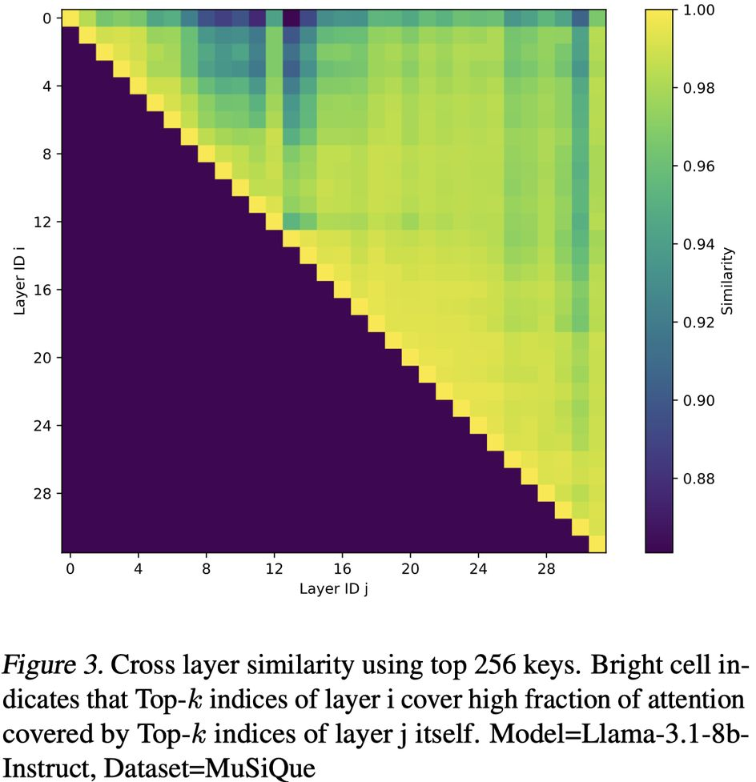

# Kascade: A Practical Sparse Attention Method for Long-Context LLM Inference

> Dhruv Deshmukh, Saurabh Goyal, Nipun Kwatra, Ramachandran Ramjee



## 一句话总结

Kascade 是一种**免训练的动态稀疏注意力方法**，通过在少数锚点层（anchor layers）计算精确 Top-k 索引并在中间复用层（reuse layers）复用这些索引，结合自动锚点层选择、头重映射和高效内核实现，在 H100 GPU 上实现最高 4.1× 解码加速和 2.2× 预填充加速，同时保持与密集注意力接近的任务精度。

---

## 摘要

Attention is the dominant source of latency during long-context LLM inference, an increasingly popular workload with reasoning models and RAG. We propose Kascade, a training-free sparse attention method that leverages known observations such as 1) post-softmax attention is intrinsically sparse, and 2) the identity of high-weight keys is stable across nearby layers. Kascade computes exact Top-k indices in a small set of anchor layers, then reuses those indices in intermediate reuse layers. The anchor layers are selected algorithmically, via a dynamic-programming objective that maximizes cross-layer similarity over a development set, allowing easy deployment across models. The method incorporates efficient implementation constraints (e.g. tile-level operations), across both prefill and decode attention. The Top-k selection and reuse in Kascade is head-aware and we show in our experiments that this is critical for high accuracy. Kascade achieves up to 4.1× speedup in decode attention and 2.2× speedup in prefill attention over FlashAttention-3 baseline on H100 GPUs while closely matching dense attention accuracy on long-context benchmarks such as LongBench and AIME-24.

**摘要翻译：**

注意力机制是长上下文 LLM 推理中的主要延迟来源，这一工作负载因推理模型和 RAG（检索增强生成）而日益流行。我们提出了 Kascade，一种免训练的稀疏注意力方法，利用了以下已知观察：1）softmax 后的注意力分布本质上是稀疏的；2）高权重 key 的身份在相邻层之间是稳定的。Kascade 在一小部分锚点层中计算精确的 Top-k 索引，然后在中间复用层中复用这些索引。锚点层通过动态规划算法选择，该算法最大化开发集上的跨层相似度，便于在不同模型上部署。该方法结合了高效的实现约束（如 tile 级操作），适用于预填充和解码阶段的注意力计算。Kascade 的 Top-k 选择和复用是感知注意力头（head-aware）的，实验表明这对高精度至关重要。在 H100 GPU 上，Kascade 相比 FlashAttention-3 基线实现了最高 4.1× 的解码加速和 2.2× 的预填充加速，同时在 LongBench 和 AIME-24 等长上下文基准上保持了与密集注意力接近的精度。

---

## 研究动机

1. **长上下文推理的计算瓶颈**：随着推理模型和 RAG 的普及，长上下文推理成为主流工作负载。注意力操作在预填充阶段（O(n²)）和解码阶段（O(n)）都是计算瓶颈，且解码注意力是内存带宽受限的，难以通过批处理优化。

2. **现有稀疏注意力方法的局限**：
   - **固定模式稀疏**（如 LongFormer、StreamingLLM）：需要预训练或后训练，且可能牺牲泛化性
   - **工作负载感知稀疏**（如 PromptCache、TurboRAG）：主要针对 RAG 场景，仅优化预填充阶段
   - **动态稀疏**（如 Quest、H2O）：高效选择 Top-k 是开放问题，且现有方法缺乏自动化部署方案

3. **核心洞察**：
   - post-softmax 注意力分布本身是稀疏的（仅约 10% 的 token 贡献了 95% 的注意力权重）
   - 相邻层之间的 Top-k 索引高度稳定（层 16 的 Top-k 可以覆盖层 17 和 18 中 99% 的注意力）

---

## 方法（技术细节）

### 1. Oracle Top-k 选择（可行性验证）

Kascade 首先验证了稀疏注意力的可行性：定义 Oracle Top-k，即仅对注意力权重最高的 k 个 token 计算注意力。实验表明，仅 2.5% 的 token 就能恢复密集注意力的完整精度（在 2WikiMultihopQA 上，Llama-3.1-8b-Instruct 模型）。Kascade 总是在第 0 层执行完整密集注意力，从第 1 层开始应用稀疏化。

### 2. 跨层相似性（Cross-Layer Similarity）

定义相似度度量：对于查询 token q，层 a 的 Top-k 索引集合 Iᵃ_q 在层 b 中能恢复多少注意力质量：

```
sim(a, b) = Σᵢ Pᵇ_q[Iᵃ_q[i]] / Σᵢ Pᵇ_q[Iᵇ_q[i]]
```

实验发现（Llama-3.1-8b-Instruct，MuSiQue 数据集，k=256）：
- 大多数相邻层对的相似度 > 0.98
- 相似度随层间距离衰减，但在短距离内保持高位

### 3. 锚点层选择（Anchor Layer Selection）

使用**动态规划算法**选择最优锚点层集合：
- 输入：跨层相似度矩阵 S（在开发集上计算，使用 k=64）
- 目标：给定预算 M（锚点层数量），最大化锚点层与复用层之间的相似度
- 关键设计：
  - 使用**最小值**（而非均值）作为 token 级相似度，确保保守估计
  - 引入**层重要性权重** wₗ = 1 - CosineSim(xₗ, yₗ)（深层注意力的重要性更低）
  - 相似度矩阵加权：sim[i][j] = wⱼ · sim[i][j]

实际选择结果：
- Llama-3.1-8b-Instruct（32层）：5个锚点层 [0, 2, 8, 13, 14]
- Qwen3-8b（36层）：5个锚点层 [0, 2, 7, 14, 23]

### 4. Query Pooling（查询池化）

为保持 tile 级操作效率（GQA 中多个 query head 共享 KV head），需要让同一 tile 内的所有 query token 共享相同的 Top-k 索引：

- **Pre-Softmax 池化**：平均 query 向量，计算一次注意力
- **Post-Softmax 池化**：独立计算每个 query 的注意力分布，然后池化

实验表明 Post-Softmax 池化在大 tile 尺寸下更鲁棒（在不同 tile 尺寸下保持一致精度），因此 Kascade 采用 Post-Softmax 池化。

实现细节：
- **解码阶段**：在共享同一 key head 的 query head 之间池化（GQA 池化）
- **预填充阶段**：在 128 个 query 的 tile 上池化（与 FlashAttention 标准 tile 尺寸一致）

### 5. 头重映射与复用（Head Remapping and Reuse）

Kascade 在每个锚点层为每个 key head 计算独立的 Top-k 索引集合。问题：锚点层的 head i 的 Top-k 索引应该映射到复用层的哪个 head？

比较三种策略：
- **1:1 映射**（无重映射）：性能最差
- **共享 Top-k**（所有 head 共享一组索引）：无法捕捉 head 间差异
- **头重映射**（通过相似度计算最优映射，允许多对一映射）：最鲁棒，尤其在低 Top-k 比例下

实验结果（Llama-3.1-8b-Instruct，MuSiQue）：
- 头重映射在所有 Top-k 比例下提供一致的分数
- 共享 Top-k 在高 Top-k 比例下表现较好，但低 Top-k 时性能下降

### 6. 高效内核实现

Kascade 基于 FlashAttention 内核（使用 TileLang 编程语言）实现，同时支持预填充和解码。

**复用层**：传递 Top-k 索引和头映射，在注意力计算时按索引加载 key（key 非连续，但每个 key 约 256 字节，无额外开销）

**锚点层**（多 pass 方法，使用 Post-Softmax 池化）：
- **第一 pass**：计算 QKT 权重矩阵和行和向量（解码时输出到 HBM，预填充时仅输出行和）
- **第二 pass**：计算池化的 post-softmax 注意力权重（预填充需重新计算）
- **第三 pass**：在池化权重上计算 Top-k 索引
- **第四 pass**：计算 Top-k 注意力（类似复用层）

**第 0 层**（完全密集注意力）：在第一 pass 计算密集注意力，省略最后一 pass

性能瓶颈：预填充中第二 pass 的重新计算是显著开销。

---

## 实验结果

### 准确度评估

**LongBench**（6 类 21 个长上下文任务，预填充密集型）：
- Kascade 在所有方法中表现优异，与密集注意力接近
- StreamingLLM 是唯一表现较差的方法
- Kascade 在 Code 子任务上甚至超过了密集注意力基线

| 方法 | Llama-3.1-8B 平均 | Qwen3-8B 平均 |
|------|-------------------|---------------|
| Dense Baseline | 45.92 | 46.35 |
| StreamingLLM | 33.42 | 34.57 |
| LessIsMore | 45.52 | 43.77 |
| OmniKV | 45.75 | - |
| Quest | 44.39 | 43.95 |
| **Kascade** | **45.02** | **44.57** |

**AIME-24**（30 个数学问题，解码密集型）：
- Kascade 在所有方法中准确度最高
- StreamingLLM 完全失败（0.00）
- Kascade (All Heads Pooled) 变体表现略差于默认头重映射版本

| 方法 | DeepSeek-R1-Distill-Llama-8B | Qwen3-8B |
|------|-----------------------------|----------|
| Dense Baseline | 50.42 | 73.75 |
| StreamingLLM | 0.00 | 0.00 |
| LessIsMore | 36.25 | 60.83 |
| Quest | 7.50 | 25.33 |
| **Kascade** | **47.92** | **70.42** |

Top-k 20% 时 Kascade 接近基线精度（仅差约 1.2%），且解码长度显著减少（仅比基线高约 13%）。

### 效率评估

在 H100 GPU 上（Llama-3.1-8b-Instruct 配置）：
- **解码加速**：最高 4.1×（Top-k 10%，128k-524k 上下文长度）
- **预填充加速**：最高 2.2×（Top-k 10%）
- 复用层耗时约为完整注意力的 10%
- 锚点层耗时接近完整注意力
- 预填充加速因锚点层第二 pass 的重新计算而受限

---

## 优势

1. **免训练**：不需要模型重训练或后训练，直接部署
2. **自动化部署**：通过动态规划自动选择锚点层，便于跨模型部署
3. **头感知（Head-Aware）**：每个 head 独立计算 Top-k，通过头重映射提升精度
4. **高效的内核实现**：基于 TileLang 实现，同时优化预填充和解码
5. **高精度**：在 AIME-24 上达到最高准确度（Top-k 10% 下比 Quest 高 8-10%）
6. **显著加速**：解码 4.1×、预填充 2.2× 加速（vs FlashAttention-3）
7. **Tile 级操作兼容**：Post-Softmax 池化保持 GPU 效率

---

## 局限

1. **需要开发集**：锚点层选择依赖开发集数据，可能存在对特定数据的偏差（但实验显示选择对不同数据集稳健）
2. **不减少内存容量**：Kascade 仅减少注意力延迟，不减少 KV 缓存的内存占用（长序列的 KV 缓存仍可能限制批处理大小）
3. **对稀疏训练架构效果有限**：已在预训练中加入稀疏性的架构（如 Gemma）从 Kascade 获益较少
4. **预填充加速受限**：锚点层的多 pass 方法（尤其是第二 pass 的重新计算）限制了预填充阶段的加速
5. **与 FlashAttention-3 相比预填充加速有限**：TileLang 基线比 FA3 慢约 20%，但 Kascade 的加速仍然有限

---

## 与 EfficientPaper 相关的研究方向

- **KV Cache 稀疏化**（kw: kv_cache_sparse）：Kascade 是 KV Cache 稀疏化的重要方法，通过跨层复用 Top-k 索引减少 KV 缓存访问
- **相关方法对比**：
  - **Quest**（2024）：Kascade 在 AIME-24 上比 Quest 高 40%+ 的绝对准确度
  - **LessIsMore**（2025）：基于 TidalDecode，手动选择锚点层，缺乏自动化部署
  - **OmniKV**（2025）：将 KV 缓存卸载到 CPU，Kascade 在性能上更优
  - **StreamingLLM**（2023）：固定窗口注意力，Kascade 在所有任务上都远优于 StreamingLLM
- **长上下文推理**：Kascade 对推理模型（如 DeepSeek-R1-Distill）的解码阶段优化尤为显著
- **高效内核**：基于 TileLang 的高效实现，与 FlashAttention-3 生态兼容

---

## 参考信息

- **arXiv**: [2512.16391v1](http://arxiv.org/abs/2512.16391v1)
- **代码**: [https://github.com/microsoft/kascade](https://github.com/microsoft/kascade)
- **机构**: Microsoft Research India
- **关键词**: kv_cache_sparse
- **基准方法**: 2024/Quest

---

> ⚠️ **生成声明**：本 note 由 AI Agent（Hermes Agent）自动生成，基于论文原文内容整理，不构成学术引用。所有内容仅供学习和参考，如有错误请以原始论文为准。生成时间：2026年6月。
