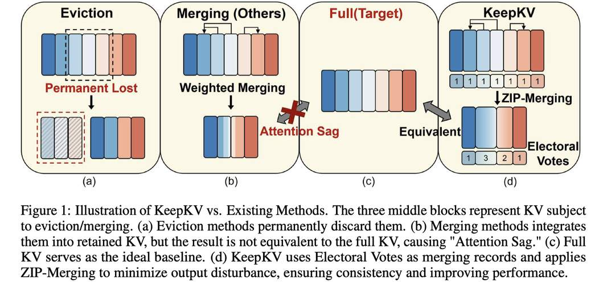

# KeepKV: Eliminating Output Perturbation in KV Cache Compression for Efficient LLMs Inference

> **本文由 AI Agent 自动生成，生成时间：2026-06-04。**

---

## 一句话总结

KeepKV 通过引入选举票数（Electoral Votes）机制和零推理扰动合并（ZIP-Merging）方法，从理论上保证 KV Cache 压缩过程中注意力分布的零扰动，从而在仅保留 5%~10% KV Cache 预算时仍能保持接近全缓存的生成质量。

---

## 摘要翻译

大语言模型（LLM）的高效推理受到不断增长的 KV Cache 的阻碍，使得 KV Cache 压缩成为一个关键研究方向。传统方法基于注意力分数或位置启发式选择性驱逐不重要的 KV Cache 条目，导致信息丢失和幻觉。最近，合并策略通过合并将被丢弃的 KV 对来保留更多信息；然而，现有方法不可避免地引入合并前后注意力分布的不一致，导致输出扰动和生成质量下降。为克服这一挑战，作者提出 KeepKV，一种自适应 KV Cache 合并方法，旨在消除输出扰动，同时在严格内存约束下保持性能。KeepKV 引入了选举票数（Electoral Votes）机制来记录合并历史并自适应调整注意力分数，并进一步利用零推理扰动合并（ZIP-Merging）方法保持注意力一致性并补偿缓存合并导致的注意力损失。KeepKV 成功地在显著压缩的缓存中保留了关键上下文信息。在各种基准和 LLM 架构上的大量实验表明，KeepKV 大幅减少了内存使用，将推理吞吐量提高了 2 倍以上，即使在 10% KV Cache 预算下也能保持优异的生成质量。

---

## 研究动机

1. **KV Cache 内存瓶颈**：随着 LLM 支持的上下文长度越来越长，KV Cache 大小快速增长，成为推理的主要瓶颈。例如，LLaMA-3-70B 在 batch size=128、8K 上下文下需要高达 320GB 的 KV Cache 内存。
2. **驱逐方法的不可逆信息丢失**：传统驱逐方法（如 H2O、StreamingLLM、SnapKV）根据注意力分数或位置丢弃 KV 条目，一旦丢弃信息永久丢失，导致幻觉和上下文不一致。
3. **现有合并方法的"注意力塌陷"（Attention Sag）问题**：现有合并方法（如 D2O、KVMerger）通过凸组合（加权平均）合并 KV 对，但作者证明这种凸组合必然导致合并后 KV 的注意力分数低于合并前各 KV 分数之和（即 Attention Sag），引入不可避免的输出扰动。
4. **缺乏理论保证**：现有合并方法的候选选择和权重计算缺乏坚实的理论基础，依赖于经验设计（如余弦相似度、高斯核权重），无法保证注意力一致性。

---

## 方法

### 核心思想

KeepKV 从"消除输出扰动"的角度重新审视 KV Cache 压缩问题，通过两个核心机制实现注意力一致性：

### 1. 选举票数机制（Electoral Votes）

- 为每个 KV 对维护一个"票数" $p_i$（初始化为 1），记录该 KV 对被合并的次数。
- 类比美国选举人团制度：每个选举人持有的票数与其代表的州人口成比例，而非均等份额。
- 注意力计算中，每个 KV 的注意力分数按其票数缩放：$p_i \cdot s_i$。
- 合并后的新 KV 票数为原始票数之和：$p_r = p_e + p_c$。
- 作用：使压缩后的缓存在注意力计算中等价于原始多个 KV 的组合，保留合并历史信息。

### 2. 零推理扰动合并（ZIP-Merging）

在 Electoral Votes 基础上，推导出新的合并公式，使合并前后输出完全一致：

$$k_r = \frac{(w_e k_e + w_c k_c) \cdot \ln \frac{p_e + p_c}{p_e + p_c}}{w_e \ln s_e + w_c \ln s_c}, \quad v_r = \frac{w_e v_e + w_c v_c}{w_e + w_c}$$

其中 $w_e = p_e \cdot s_e$，$w_c = p_c \cdot s_c$（基于注意力分数的加权）。

**定理 3.3 保证**：合并后输出与原始输出的差异为零，即 $\|o'_t - o_t\| = 0$。

**直观理解**：ZIP-Merging 不是简单的凸组合，而是通过适当的缩放和对数变换补偿合并带来的注意力损失，使注意力分布保持一致。

### 3. 多步生成扩展（EMA 注意力分数）

- 注意力分数具有强局部性（相邻步骤间变化平滑）。
- 使用指数移动平均（EMA）带偏差修正来预测未来注意力分数，使用最近窗口长度 $w$。
- 将所有注意力分数替换为 EMA 估计值后，推导出多步生成的输出扰动上界。

**定理 3.5**：对于第 $t'$ 步，设预测误差 $|\hat{s}_i / s_i - 1| \leq \epsilon$，输出扰动满足 $\Theta_{t'} < \frac{2\epsilon(1+\epsilon)\gamma}{(1-\epsilon)^2}$。

**引理 3.6**：当预测误差 $\epsilon = 0$ 或合并候选完全相同时，扰动降为零。这为"优先合并高相似度 KV 对"提供了理论依据。

### 4. 相似度驱动合并

- 每个被驱逐的 KV 与保留 KV 中余弦相似度最高的进行合并。
- 使用预定义阈值 $T$ 判断是否合并，避免动态调整的开销。
- 兼容各种 token 选择和缓存分配策略（如 PyramidInfer），具有强适应性。

### 实现细节

- 合并阈值 $T = 0.8$，指数预测系数 $\beta = 1.2$
- 缓存分配策略：PyramidInfer 的固定缓存预算策略
- 框架：Hugging Face Transformers
- 硬件：NVIDIA A100 80GB GPU

---

## 实验结果

### 实验设置

- **任务**：问答（COPA、MathQA、OpenBookQA）、摘要（XSUM、CNN/DailyMail）、长上下文（LongBench，含单文档QA、多文档QA、摘要、合成任务）
- **模型**：OPT、Llama-2、Llama-3、Mistral
- **基线**：StreamingLLM、H2O、PyramidInfer（驱逐方法）；CaM、D2O（合并方法）
- **评估框架**：lm-eval-harness、HELM

### 主要结果

1. **KV Cache 压缩比率准确度**：KeepKV 在各种压缩比率下一致优于所有压缩方法，尤其在极低压缩率（如 5%~10%）下表现显著优于其他方法。
2. **长上下文任务**（LongBench，10% KV Cache 预算）：KeepKV 在大多数任务上接近全缓存基线，显著优于驱逐方法和现有合并方法。
3. **推理吞吐量**：超过 2 倍提升。
4. **摘要任务性能**（图 2）：在 5% 压缩率下，KeepKV 是最接近全 KV（100%）的方法，而 CaM、Pyramid、H2O、Streaming、Local 等方法性能大幅下降。

---

## 优势

1. **理论保证**：首次从消除输出扰动的角度分析 KV Cache 压缩，提供扰动上界保证，理论基础扎实。
2. **零扰动合并**：ZIP-Merging 在当前步理论上保证零输出扰动（$\|o'_t - o_t\| = 0$），这是现有方法无法做到的。
3. **强适应性**：不依赖特定的 token 选择或缓存分配策略，可与多种主流方法（如 PyramidInfer）组合使用。
4. **多步生成保证**：通过 EMA 注意力分数和理论推导，对多步生成的扰动有可控上界。
5. **高性能**：即使在 5%~10% 的极端压缩率下仍保持优异性能，显著优于现有驱逐和合并方法。
6. **可与量化方法结合**：与 KV Cache 量化方法（如 KVQuant、GEAR）正交，可进一步组合使用。

---

## 局限

1. **预测误差累积**：预测越远的注意力分布越困难，扰动上界会显著增大，多步生成中可能存在误差累积。
2. **固有输入差异不可消除**：$\gamma$（KV 向量之间的固有差异）无法通过算法设计消除，这是 KV Cache 压缩的根本限制。
3. **计算开销**：ZIP-Merging 涉及对数运算和额外的票数维护，可能增加一定的计算开销。
4. **合并阈值选择**：相似度阈值 $T$ 需要预定义，不同任务和模型可能需要不同的设置。
5. **无公开代码**：论文未提供开源代码（prototxt 中 code URL 为空），难以复现和验证。
6. **实验模型规模有限**：主要评估 OPT、Llama-2/3、Mistral 等较小规模模型，对更大规模模型（如 70B+）的效果有待验证。
7. **合成实验环境**：所有实验基于 NVIDIA A100 80GB GPU，可能需要进一步在更多硬件环境下验证。

---

## 与 EfficientPaper 相关的研究方向

- **KV Cache 压缩**：KeepKV 属于 KV Cache 合并方法，是 KV Cache 压缩的重要研究方向，与驱逐方法（H2O、PyramidInfer）、量化方法（KVQuant、GEAR）形成互补。
- **注意力机制优化**：Electoral Votes 机制提供了新的注意力分数调整思路，可扩展到其他注意力优化场景。
- **LLM 推理效率**：在保持生成质量的同时大幅减少内存使用和提高吞吐量，是 LLM 高效推理的关键研究方向。
- **长上下文处理**：KeepKV 在长上下文任务（LongBench）上表现出色，与长上下文 LLM 的研究密切相关。
- **KV Cache 合并与驱逐的结合**：KeepKV 的理论框架可扩展到更复杂的缓存压缩策略，如混合驱逐与合并。
- **理论分析方法**：从输出扰动角度分析 KV Cache 压缩的理论方法，为后续研究提供了新的分析范式。

---

## 论文信息

- **标题**：KeepKV: Eliminating Output Perturbation in KV Cache Compression for Efficient LLMs Inference
- **作者**：Yuxuan Tian, Zihan Wang, Yebo Peng, Aomufei Yuan, Zhiming Wang, Bairen Yi, Xin Liu, Yong Cui, Tong Yang
- **机构**：Peking University, ByteDance, Tsinghua University
- **年份**：2025
- **来源**：arXiv (2504.09936v1)
- **代码**：未公开
- **关键词**：kv_cache_sparse
