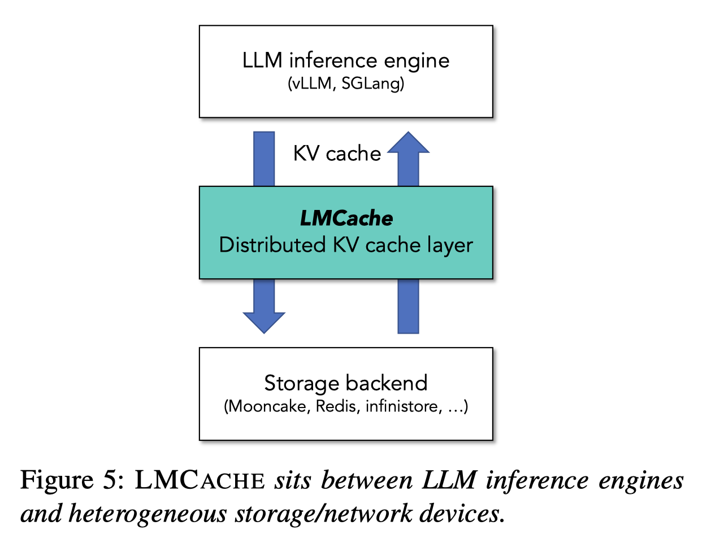

# LMCache: An Efficient KV Cache Layer for Enterprise-Scale LLM Inference

> Yuhan Liu, Yihua Cheng, Jiayi Yao, Yuwei An, Xiaokun Chen, Shaoting Feng, Yuyang Huang, Samuel Shen, Rui Zhang, Kuntai Du, Junchen Jiang

## Abstract

KV cache has traditionally been stored in GPU memory to accelerate the decoding phase of large language model (LLM) inference. However, it is increasingly necessary to move KV caches outside GPU devices, to enable cache reuse across different queries and inference engines. Our real-world usage statistics confirm this trend: over time, the total KV cache stored by users has grown rapidly, far exceeding the capacity of GPU memory. Despite this need, there lacks an efficient solution for offloading and transferring KV caches. We present LMCACHE, the first and so far the most efficient open-source KV caching solution, which extracts and stores KV caches generated by modern LLM engines (vLLM and SGLang) out of the GPU memory and shares them across engines and queries. LMCACHE supports both cache offloading (prefix reuse across queries) and prefill-decode (PD) disaggregation (cross-engine/GPU cache transfer). LMCACHE's high performance and wide adoption stem from the following contributions: (1) highly optimized KV cache data movement powered by batched data movement operations, compute and I/O pipelining; (2) a modular KV cache connector component, decoupling LMCACHE from the rapid evolution of inference engines; (3) a first-class control API for flexible cache orchestration across GPU, CPU, storage, and network layers. Our evaluation shows that combining LMCACHE with vLLM achieves up to 15x improvement in throughput across workloads such as multi-round question answering and document analysis. Large-scale adoption of LMCACHE in enterprise settings provides us valuable insights, for example, fetching KV cache from remote storage has unsurprisingly benefits to prefill delay, and that context truncation, which is a widely applied technique in industry, can greatly reduce prefix cache hit ratio by half. The source code of LMCACHE is at: https://github.com/LMCache/LMCache.
