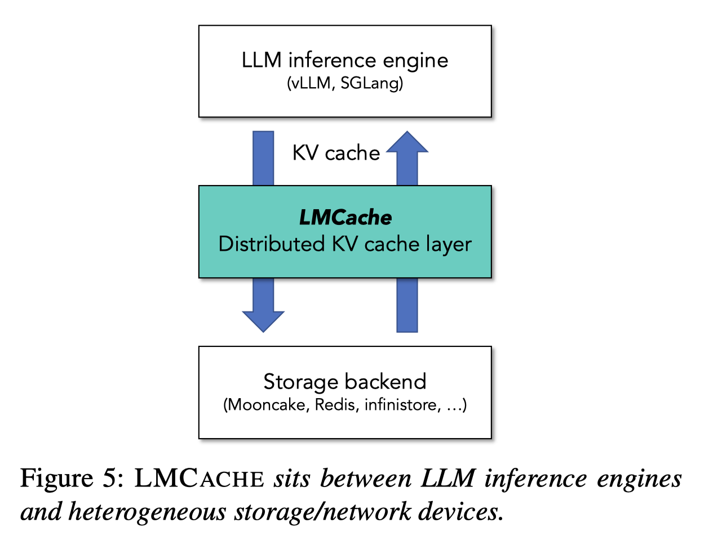

# LMCache: An Efficient KV Cache Layer for Enterprise-Scale LLM Inference

> Yuhan Liu, Yihua Cheng, Jiayi Yao, Yuwei An, Xiaokun Chen, Shaoting Feng, Yuyang Huang, Samuel Shen, Rui Zhang, Kuntai Du, Junchen Jiang
> 
> Tensormesh / University of Chicago
>
> arXiv: 2510.09665v2 | GitHub: https://github.com/LMCache/LMCache | 2025

---

## 一句话总结

LMCache 是首个面向企业级 LLM 推理的开源 KV Cache 缓存层，通过高性能数据移动、模块化连接器和灵活的缓存编排 API，支持跨查询前缀复用和跨引擎 Prefill-Decode 分离，实现最高 **15 倍吞吐提升**和 **2 倍以上延迟降低**。

---

## 摘要翻译

KV cache 传统上存储在 GPU 内存中，以加速 LLM 推理的解码阶段。然而，将 KV cache 移出 GPU 设备以支持跨查询和推理引擎的缓存复用越来越有必要。作者的实际使用统计数据证实了这一趋势：用户存储的 KV cache 总量迅速增长，远超 GPU 内存容量。尽管存在这一需求，目前缺乏高效的 KV cache 卸载和传输解决方案。

本文提出了 **LMCache**，这是目前最高效的开源 KV 缓存解决方案，能够从现代 LLM 引擎（vLLM 和 SGLang）中提取和存储 KV cache（超出 GPU 内存），并在引擎和查询之间共享。LMCache 同时支持缓存卸载（跨查询的前缀复用）和 Prefill-Decode（PD）分离（跨引擎/GPU 的缓存传输）。

LMCache 的高性能和广泛采用源于以下贡献：
1. **高性能数据移动**：基于批量数据移动操作、计算与 I/O 流水线化；
2. **模块化 KV cache 连接器**：将 LMCache 与推理引擎的快速演进解耦；
3. **一等公民控制 API**：支持在 GPU、CPU、存储和网络层之间灵活的缓存编排，包括 pinning、lookup、cleanup、movement 和 compression。

评估表明，将 LMCache 与 vLLM 结合，在多轮问答和文档分析等工作负载下，吞吐量提升最高达 **15 倍**。大规模企业采用提供了有价值的经验，例如从远程存储获取 KV cache 对预填充延迟有意外的正面效果，以及上下文截断（业界广泛使用的技术）会将前缀缓存命中率降低一半。

---

## 研究动机

### 背景与趋势

LLM 推理已超越训练成为增长最快的领域。KV cache 作为 LLM 推理的中间状态，已成为加速推理的**事实标准**。传统上，KV cache 仅在单个查询的生命周期内使用，存储在 GPU 内存中。

然而，两个新兴趋势要求将 KV cache 移出 GPU：

1. **跨查询缓存（Context Caching）**：将 KV cache 持久化到低层存储设备，超出单个查询的生命周期，以便后续共享相同前缀的查询复用。典型场景包括文档分析（同一文档跨多次查询保持不变）和多轮对话（固定系统提示或长前言）。

2. **Prefill-Decode（PD）分离**：将推理的预填充阶段和解码阶段分散到不同的 GPU/节点上，确保延迟敏感的解码阶段不受吞吐导向的预填充阶段影响。PD 分离需要将预填充 GPU 产生的 KV cache 传输到解码 GPU。

### 真实使用数据驱动

论文基于 LMCACHE 用户的自愿使用统计数据，发现了三个关键趋势：

- **KV cache 总量远超 GPU 内存容量**：用户的 KV cache 存储量随时间持续增长，超出 GPU 内存的部分占比显著增加。
- **每 token 复用率大幅提升**：存储在 GPU 内存之外的 token 被更频繁地复用，超过 19% 的用户复用存储的 token 超过 1.5 次。
- **用户数量和 KV cache 规模持续增长**。

### 核心挑战

1. **分页内存下的 I/O 低效**：vLLM 和 SGLang 使用分页注意力内存（通常 16-64KB 页），KV cache 页面不连续导致大量小 I/O 操作，带宽利用率极低。需要传输至少 16MB 才能饱和网络带宽，1-2MB 才能达到 PCIe 5.0 理论带宽的 75-80%。

2. **与快速演进的推理引擎兼容**：2025 年平均每周发布 15-20 个新模型，推理引擎不断变更 KV cache 布局和接口，适配成本极高。

3. **缺乏管理 API**：没有统一的管理接口来定位、驱逐、pin 或压缩缓存，导致上层组件无法做出 KV-cache-aware 决策，造成缓存利用率低和重复存储。

---

## 方法（技术细节）

### 4. 系统架构

LMCACHE 位于 LLM 推理引擎和异构存储/网络设备之间，提供标准化、高性能的 KV cache 移动和管理基底。

#### 核心组件

- **KV Connector**：准备元数据（token 化的输入提示和 GPU 内存地址）。
- **Token Processor**：判断新 token 数量或已匹配的前缀 token 数量。
- **Storage Manager**：通过传输通道将 KV cache 保存/加载到后端存储。
- **Event Manager**：管理查询 ID，跟踪缓存地址，启动异步逐层加载事件。
- **Cache Controller**：维护 token pool，记录所有当前存储在 KV cache 后端的 token。

#### 工作流

**存储流程**：新查询到达 → KV Connector 准备元数据 → Token Processor 确定新 token 数量 → Storage Manager 将 KV cache 保存到后端。

**检索流程**：查询需要加载 KV cache → KV Connector 准备元数据 → Token Processor 识别匹配的前缀 token → Event Manager 检查查询 ID 是否已见过 → 如果是，直接返回缓存地址到 GPU Connector 加载到 GPU 内存；如果不是，转发到 Storage Manager 查找 CPU 内存地址。

**查询流程**：高层组件（如路由器）查询 Cache Controller → 返回 (instance_id, device, hit_tokens)。

### 5. 性能优化

#### 5.1 批量操作（Batched Operations）

**可配置的 Chunk 大小**：不按页级别传输，而是将多层的多个页组合成更大的 chunk（默认 256 个 token），通过中间流式 GPU 缓冲区实现。存储时，先用定制 CUDA kernel 将分散的分页 GPU 内存复制到连续的流式缓冲区，然后以 chunk 粒度（而非单页）通过 DMA 引擎批量卸载到低层存储。

**并行存储/加载操作**：支持跨多个存储层级（本地 CPU DRAM/磁盘、远程 CPU DRAM/磁盘、对象存储如 S3）的并发存储和检索。store 和 load API 接受多个源和目标设备，在全双工通信（如 PCIe）下并行执行。

**延迟解码 KV Cache 存储**：不立即卸载每个 token 的 KV cache，而是缓冲后在生成一定数量的 token（即一个 chunk）后批量存储，减少写入频率和 I/O 开销。

#### 5.2 计算-I/O 重叠（Compute-I/O Overlapping）

**逐层流水线化**：为每个层内的推理计算和数据移动分配不同的 CUDA 流。例如，在第一层推理执行时，异步预取第二层的 KV cache 到 GPU 缓冲区并转换为分页内存。确保只需固定大小的 GPU 缓冲区（一个层的 KV cache 大小）即可实现重叠。

**异步计算与预取**：利用查询调度器接纳查询和实际需要 KV cache 之间的空闲时间，从慢层存储预取到快层存储。当实际推理计算开始时，所需的 KV cache 可以直接从快速存储层加载，显著减少加载延迟。用户可以根据延迟 SLO 和资源约束配置预取目标层。

#### 5.3 最小数据拷贝（Minimum Data Copy）

**零拷贝操作**：通过引用计数器实现，当 KV cache 同时写入多个目标时，递增共享数据的引用计数（而非创建新副本），每个读写完成后递减，计数为零时释放数据。类似操作系统中的 PCB 计数器。

**动态卸载（Dynamic Offloading）**：不复制所有空闲页到 CPU 内存，而只复制子集。使用三个指针（start、current、end）管理 GPU 内存中的空闲页区域和已卸载状态。四个状态：初始化、进行中、新查询到达（end 指针前移）、稳态。

关键权衡：复制窗口大小（end - start）越小，复制率越低，但分配停顿概率越高。

### 6. 标准化接口

**KV Cache Connector 接口**：模块化设计，将 KV cache 管理与推理引擎后端解耦。

设计目标：
- 最大灵活性
- 与 vLLM 原生设计一致（严格的 scheduler-worker 分离、前缀缓存作为一等公民、分段 CUDA 图）
- 对 out-of-tree connector 友好
- 最小 API 级别开销

接口包含两组：
1. **Scheduler 层**：`get_num_new_matched_tokens`、`update_state_after_alloc`、`build_connector_meta`
2. **Model Runner 层**：`start_load_kv`、`wait_load_kv`、`start_store_kv`、`wait_store_kv`

该 API 已在 vLLM 中发布超过 6 个月，被 NVIDIA Dynamo、RedHat llm-d、ByteDance AIBrix、vLLM Production Stack 等多个项目采用。

### 7. 控制器接口

**KV Cache Controller** 采用集中式协调器 + 每实例 worker 架构，提供两类 API：

**外部 API**（供用户/系统操作员）：
- `lookup(tokens)`：查询全局 KV cache 存在性
- `move(src, dst, tokens)`：在实例间迁移 KV cache
- `clear(tokens, inst_id, device)`：清除指定位置的 KV cache
- `pin/unpin(tokens, inst_id, device)`：固定/取消固定 KV cache
- `compress/decompress(tokens, inst_id, device, method)`：压缩/解压缩 KV cache

**内部 API**（供实例间通信）：
- `batched_admit/batched_evict`：向控制器报告缓存准入/驱逐决策
- `batched_p2p_lookup`：点对点 KV cache 查询

典型应用场景：
- **KV cache 路由**：路由器查询控制器找到缓存命中率最高的实例
- **KV cache 迁移**：实例缩容或负载均衡时迁移缓存
- **P2P 共享**：缓存未命中时从对等实例获取
- **缓存清除**：切换模型或回收内存时清除缓存

---

## 实验结果

### 评估设置

- **模型**：Llama-3.1-8B-Instruct、Sao10K-L3-8B、Llama-3.1-70B-Instruct、Qwen2.5-Coder-32B-Instruct、Qwen3-Coder-480B-A35B-Instruct-FP8、Qwen2.5-72B-Instruct
- **硬件**：8×H100 服务器（GMI Cloud 提供），多节点使用相同数量的 GPU + 集中式远程存储后端
- **数据集**：模拟多轮问答、LongBench 中的长上下文问答、vLLM 官方基准脚本的随机数据集
- **指标**：TTFT（首 token 时间）和 ITL（token 间延迟）
- **基线**：Basic vLLM（v0.10.2，仅 GPU 内存）、Basic vLLM CPU Offloading（v0.11.0）、两个商业服务

### 单节点 CPU 卸载（§8.2）

多轮问答场景（每个查询 10K token 文档 + 短问题，最长 20K token）：

- **TTFT**：LMCache 比最强基线低 **1.9–8.1 倍**
- **吞吐量**：LMCache 比最强基线高 **2.3–14 倍**（在相同 TTFT 下）
- **ITL**：比最强基线低 **7%–92%**（QPS=1）

关键原因：
- 比 Basic vLLM（仅 GPU 缓存）：利用 CPU 卸载，缓存命中率更高
- 比 Basic vLLM CPU Offloading（逐层逐 16-token 传输）：以 chunk 粒度传输，带宽利用率更高
- 比商业方案：更高效的卸载机制

### 真实 trace 驱动评估（§8.3）

基于 Company F 和 Company G 的真实输入/输出分布：

- **TTFT**：至少 **3.7–6.8 倍**降低
- **ITL**：至少 **19–58%** 降低

### 集中式存储服务器（§8.4）

- 使用 15 Gbps 带宽连接的远程服务器，使用 LongBench TriviaQA 数据集
- LMCache 比基线推理吞吐提升 **1.3–3 倍**
- 注意：远程后端加载延迟高于 CPU 内存，但可存储更多缓存

### PD 分离（§8.5）

- 使用 8K token 输入、200 token 输出、随机负载
- **95th 百分位 TTFT**：显著低于 vLLM 原生 PD 分离
- **平均 TTFT**：降低 **1.53–1.84 倍**
- **平均 ITL**：降低 **1.12–1.66 倍**

关键差异：vLLM 原生 PD 分离使用 NIXL 逐页传输，导致带宽利用率低；LMCache 使用 chunk 级别传输，效率更高。

### 组件分析（§8.6）

**CPU 卸载带宽**：LMCache 实现 400 Gbps 带宽，vLLM 原生仅 88 Gbps（因传输粒度不同）。

**异步计算**：通过请求异步化，实现 KV cache 加载与推理计算的重叠，端到端延迟降低 **1.46 倍**。

### 敏感性分析（§8.7）

- **上下文长度**：在 32 Gbps 带宽下，仅当输入上下文长度超过 256K token 时，LMCache 的 KV cache 加载才优于预填充；在 64/128 Gbps 带宽下，所有上下文长度都更优。
- **启示**：KV cache 加载应自适应，在低带宽下仅当上下文长度超过交叉点时才启用。

### SGLang 结果（§8.8）

- 在 Qwen3-32B 上，LMCache 的 CPU 卸载与 SGLang 原生 CPU 卸载性能相当
- 但 SGLang 原生缺少分布式存储后端支持

---

## 优势

1. **高性能**：批量操作、计算-I/O 流水线化、零拷贝等优化，实现最高 15 倍吞吐提升和 2 倍以上延迟降低。
2. **通用兼容性**：支持 vLLM 和 SGLang 两大主流推理引擎，通过模块化连接器接口适应快速演进的引擎。
3. **层次化存储**：支持 GPU → CPU 内存 → 本地磁盘 → 远程磁盘/Redis → S3 等多层存储，灵活性强。
4. **灵活的管理 API**：一等公民的控制 API（lookup、move、pin、compress 等），支持查询路由、缓存迁移、P2P 共享等高级功能。
5. **企业级实用性**：经过大规模生产部署验证，支持 Docker 容器化部署，适合 Kubernetes 集群环境。
6. **社区驱动**：已成为社区项目，有大量企业贡献者参与，支持 8 种以上存储后端、4 种处理器类型（NVIDIA、AMD、Ascend、TPU）。
7. **真实部署经验**：提供了丰富的工程洞察，如远程存储加载可能比预填充更快、上下文截断会降低缓存命中率等。

---

## 局限

1. **低带宽下的延迟问题**：当网络带宽较低（如 32 Gbps）且输入上下文较短（< 256K token）时，KV cache 加载延迟可能超过重新预填充的延迟，需要自适应决策。
2. **学术研究灵活性不足**：设计重心偏向工业场景的性能、稳定性和兼容性，未提供灵活的 API 用于集成特殊注意力机制（如选择性 token 丢弃），对学术用户吸引力较低。
3. **Python 语言限制**：虽使用 Python 实现并通过精心设计的优化保持性能，但与 Rust/C++ 等高性能语言相比，可能存在运行时开销。不过作者认为 Python 使社区贡献更容易，且演进更快。
4. **与推理引擎的耦合风险**：尽管通过模块化连接器接口降低了耦合，但 vLLM 和 SGLang 的快速演进仍可能带来适配挑战。
5. **特定场景下的收益不确定**：在远程存储后端，当输入上下文较短或模型较小时，加载延迟可能超过预填充延迟，需要根据具体场景做出自适应决策。
6. **缺乏对某些新型优化的原生支持**：如 KV cache 压缩（虽有 API 但不深入）、选择性 token 丢弃等。

---

## 与 EfficientPaper 相关的研究方向

LMCache 涉及以下与 EfficientPaper 高度相关的研究方向：

1. **KV Cache 管理**（核心关键词）：LMCache 直接聚焦于 KV cache 的存储、传输和管理，是 LLM 推理效率优化的核心基础设施。
2. **Prefix Caching**：跨查询的前缀缓存复用，减少冗余计算，降低 TTFT。
3. **Prefill-Decode 分离**：将预填充和解码阶段分散到不同 GPU/节点，提高资源利用率和降低尾延迟。
4. **GPU-CPU 数据卸载**：高效的 GPU 到 CPU 内存数据移动，支持分层存储。
5. **分布式推理系统**：跨节点的 KV cache 共享和迁移，支持弹性扩缩容。
6. **LLM 推理引擎优化**：与 vLLM、SGLang 等主流推理引擎的集成和优化。
7. **KV Cache 压缩**：虽然论文未深入，但控制器接口支持压缩/解压缩操作。
8. **存储后端优化**：多种存储后端（Redis、S3、NFS、WEKA 等）的高效集成。
9. **上下文窗口管理**：论文洞察了上下文截断对缓存命中率的影响，涉及长上下文处理。
10. **企业级 LLM 推理部署**：大规模生产环境下的 LLM 推理系统设计和优化。

---

> **生成声明**：本 note 由 AI Agent（Hermes Agent）自动生成，基于 arXiv 论文 2510.09665v2 的全文内容。所有内容用中文撰写，仅供学术参考。生成时间：2025年6月。
