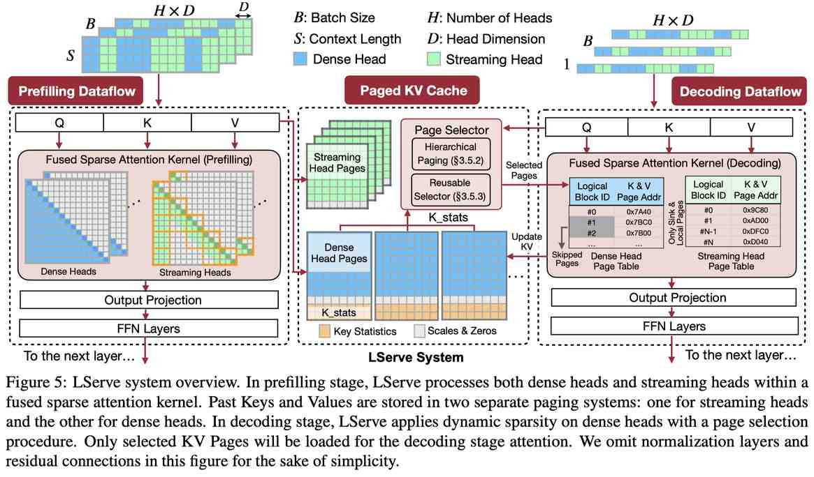

# LServe: Efficient Long-sequence LLM Serving with Unified Sparse Attention

> **一句话总结**：LServe 通过统一的块稀疏注意力机制，将静态稀疏（streaming heads）与动态稀疏（query-aware KV page pruning）以及 KV cache 量化融合到一个 GPU kernel 中，实现了长序列 LLM 推理中 prefilling 加速 2.9×、decoding 加速 1.3-2.1×，同时保持长上下文精度。

---

## 摘要翻译

大语言模型（LLM）在处理长序列方面展现出显著潜力，但由于 prefilling 阶段注意力的二次计算复杂度和 decoding 阶段 KV cache 的巨大内存占用，高效服务这些长上下文模型仍然具有挑战性。为解决这些问题，我们提出了 LServe，一个通过混合稀疏注意力加速长序列 LLM 服务的高效系统。该方法将不同的硬件友好结构化稀疏模式统一到一个框架中，在 prefilling 和 decoding 阶段都跳过不太重要 token 的块级计算。LServe 证明了静态稀疏和动态稀疏在长上下文 LLM 注意力中的兼容性，这种设计通过组合优化实现了乘法级加速。具体而言，我们在 prefilling 和 decoding 阶段将一半的注意力头转换为几乎免费的 streaming heads。此外，我们发现仅需恒定数量的 KV 页面即可保持长上下文能力，与上下文长度无关。我们设计了一个层次化 KV 页面选择策略，基于 query-centric 相似性动态剪枝 KV 页面。在平均情况下，LServe 在保持长上下文精度的同时，将 LLM prefilling 加速最高 2.9×，decoding 加速 1.3-2.1×（相比 vLLM）。

---

## 研究动机

### 1. 长序列 LLM 服务的核心瓶颈
随着 LLM 上下文窗口扩展到数十万 token（如 OpenAI o1 的 20K token 推理链），长序列推理面临两个关键挑战：
- **Prefilling 阶段**：注意力计算具有二次复杂度 O(N²)，随着序列长度增长急剧增加
- **Decoding 阶段**：KV cache 的内存占用和 I/O 开销成为瓶颈，且实际推理中 decoding 时间可能远超 prefilling（如 Llama-3-8B 在 256K 输入+20K 输出下，decoding 耗时 540 秒，是 prefilling 116 秒的近 5 倍）

### 2. 现有方法的不足
- **KV cache 量化**（QServe、KIVI、KVQuant）：降低内存但不减少注意力计算量，序列长度增加时加速有限
- **静态稀疏**（StreamingLLM、H2O、TOVA）：牺牲长上下文精度，且缺乏统一框架
- **动态稀疏**（MInference、Quest）：仅优化 prefilling 或 decoding 单一阶段，不减少 KV cache 内存
- **DuoAttention**：虽引入检索头概念，但缺乏系统级优化

### 3. 关键洞察
在 GPU 上，注意力 kernel 沿 KV token 维度是顺序执行的。跳过 KV block 的计算（而非 block 内部）是最有效的加速方式，这构成了统一块稀疏注意力的基础。

---

## 方法（技术细节）

### 1. 统一块稀疏注意力（Unified Block Sparse Attention）

LServe 将多种稀疏模式统一到块稀疏注意力框架中：
- **块级处理**：每个线程块计算 $T_Q \times T_K$ 的 tile（prefilling 时 $T_Q > 1$，decoding 时 $T_Q = 1$）
- **二元决策**：每个 tile 要么完全跳过（空块），要么完整计算（稠密块）
- **理论加速**：若块稀疏率为 $r$，则理论加速比为 $1/(1-r)$

### 2. 静态稀疏：Streaming Heads

借鉴 DuoAttention 的方法，将 50% 的注意力头转换为 streaming heads：
- **Λ 形 mask**：每个 token 只关注相邻 token 和初始 token（attention sinks）
- **几乎免费**：在极长上下文中，每个 token 的计算量恒定（仅 2 个 local block + 1 个 sink block）
- **离线确定**：通过优化方法（gating value α）分类 heads，α 接近 1 为 retrieval head，接近 0 为 streaming head
- **GPU kernel 融合**：将 streaming heads 和 standard heads 的计算融合到统一的 GPU kernel 中，实测加速最高 1.7×

### 3. 动态稀疏：Query-aware KV Page Pruning

**核心发现**：仅需恒定数量的 KV token（如 4096）即可保持长上下文能力，与上下文长度无关。

#### 3.1 页面大小困境（Page Size Dilemma）
- KV cache 量化需要更大的页面大小以保持 GPU 带宽利用率
- 但更大的页面使 query-aware 选择算法（如 Quest）失效
- 解决方案：层次化分页系统

#### 3.2 层次化分页（Hierarchical Paging）
- **虚拟逻辑页面**：将 $N_L$ 个 token 分为一个逻辑页面，$N_P$ 个 token 分为一个物理页面（$N_P = g \cdot N_L$）
- **重要性估计**：使用 channel-wise min/max 值作为代表性向量，计算 query 与逻辑页面的重要性分数
- **物理页面选择**：取逻辑页面重要性的 max-reduction，选择 top-K 物理页面
- **效果**：在不增加 token budget 的情况下，保持与小页面大小相同的精度

#### 3.3 可复用页面选择器（Reusable Page Selector）
- **问题**：页面选择器的复杂度随序列长度线性增长，在 128K 序列长度下成为瓶颈
- **解决方案**：利用注意力的时间局部性，相邻 query token 倾向于关注相同的 KV 页面
- **实现**：在预定义 chunk 的开头激活选择器，后续 token 复用选择结果
- **效果**：选择器开销降低 4 倍（复用间隔为 4），精度几乎无损

### 4. 系统架构

基于 QServe 构建，LServe 在以下方面进行扩展：
- **双 KV cache**：分别存储 dense heads 和 streaming heads 的 KV cache
- **Prefilling 数据流**：使用统一的块稀疏注意力 kernel 处理两种 heads，写回量化 KV 特征
- **Decoding 数据流**：动态页面选择 + 短页面表的稠密注意力 kernel
- **量化支持**：支持权重、激活和 KV 量化，进一步提升吞吐

---

## 实验结果

### 评估设置
- **硬件**：NVIDIA A100 80GB GPU（主要），L40S 48GB GPU（额外）
- **模型**：Llama-3-8B（GQA）、Llama-2-7B（MHA）、Minitron-4B
- **基线**：vLLM、QServe、MInference、DuoAttention、Quest
- **指标**：prefilling TTFT、decoding per-token latency

### 精度评估
| 基准 | Dense | LServe | 差异 |
|------|-------|--------|------|
| **LongBench（Llama-3-8B）** | 38.9 | 38.6 | -0.3 |
| **LongBench（Llama-2-7B）** | 39.5 | 39.4 | -0.1 |
| **RULER（64K, LServe-4096）** | 86.8 | 85.6 | -1.2 |
| **NIAH（Needle-in-a-Haystack）** | ≈1.0 | ≈1.0 | 无显著差异 |

LServe 在所有精度评估中与稠密基线保持接近，证明混合稀疏注意力几乎不损失精度。

### 性能评估

#### Prefilling 加速
- **Llama-3-8B（A100）**：相比 vLLM 加速最高 2.9×（序列长度 256K-512K 时）
- **Llama-2-7B（A100）**：平均 1.8× 加速（相比 vLLM）
- **MInference kernel 对比**：相同稀疏级别下，LServe kernel 加速 1.3×

#### Decoding 加速
- **Llama-3-8B**：相比 vLLM 平均 1.5× 加速
- **Llama-2-7B**：平均 2.0× 加速
- **L40S GPU**：最高 1.7× 加速
- **vs Quest**：prefilling 1.6-2.1×，decoding 1.3-1.5×

#### 端到端效果
- 静态稀疏（50% streaming heads）：最高 1.7× 加速（短序列更有效）
- 动态稀疏（4K token budget）：256K 序列长度下 7.7× 加速
- 组合效果：LServe 通过离线配置稀疏模式，避免短序列时动态稀疏的开销

#### RULER 精度（Llama-3-8B）
| 序列长度 | Dense | LServe-4096 | LServe-8192 |
|---------|-------|------------|------------|
| 32K | 90.5 | 91.0 | 91.8 |
| 64K | 86.8 | 85.6 | 86.1 |
| 128K | 83.8 | 81.0 | 81.7 |
| 256K | 79.4 | 75.7 | 79.1 |

增加 token budget 到 8192 可在长序列下保持更好精度，且端到端延迟仅慢约 6%。

---

## 优势

1. **统一框架**：将静态稀疏（streaming heads）和动态稀疏（query-aware page pruning）统一到一个块稀疏注意力框架中，实现乘法级加速
2. **系统-算法协同设计**：将稀疏模式与 KV cache 量化、层次化分页等系统优化紧密结合，充分利用硬件特性
3. **精度保持**：在 LongBench、NIAH、RULER 等基准上几乎不损失精度，仅需恒定数量的 KV token（4096-8192）即可保持长上下文能力
4. **硬件友好**：块级稀疏避免了 warp 内的条件分支，通过迭代器抽象实现高效跳过
5. **可扩展性**：支持多种 GPU 架构（A100、L40S）和模型架构（MHA、GQA）
6. **实用性**：基于 QServe 和 TensorRT-LLM 构建，与现有系统兼容，支持量化

---

## 局限

1. **依赖离线 profiling**：静态稀疏模式（streaming heads 的选择）需要离线确定，可能无法适应所有输入分布
2. **页面选择器开销**：尽管通过可复用页面选择器降低了开销，但在极长序列下仍可能成为瓶颈
3. **精度损失**：在超长序列（如 256K）的 RULER 基准上，LServe-4096 精度下降约 3.7%（相比 Dense），虽然 LServe-8192 可缓解
4. **硬件依赖**：实现基于 CUDA 和 PTX 汇编，对特定硬件（NVIDIA GPU）有较强依赖
5. **仅支持单 GPU 推理**：论文主要在单 GPU 上评估，未讨论多 GPU 分布式场景下的性能
6. **页面大小与稀疏度的权衡**：更大的页面大小有利于硬件效率但降低稀疏精度，需要仔细调优

---

## 与 EfficientPaper 相关的研究方向

### 关键词关联
- **sparse_pruning**：LServe 的核心思想是通过稀疏注意力减少计算量
- **attention_sparsity**：统一的块稀疏注意力机制
- **kv_cache_sparse**：动态 KV cache 剪枝策略

### 相关研究方向

1. **KV Cache 压缩与量化**：
   - QServe（W4A8KV4 量化）、KIVI（2bit 量化）、KVQuant
   - 与 LServe 的量化优化互补，可进一步降低内存

2. **稀疏注意力模式**：
   - DuoAttention（静态稀疏，检索头 vs streaming 头）
   - MInference（prefilling 动态稀疏）
   - Quest（decoding 动态稀疏）
   - BigBird、StreamingLLM、H2O、TOVA 等
   - LServe 将这些模式统一到一个框架中

3. **LLM 推理系统**：
   - vLLM（PagedAttention）、TensorRT-LLM、SGLang
   - LightLLM、LMDeploy、Nanoflow
   - LServe 建立在 QServe 之上，是系统-算法协同设计的典型范例

4. **长上下文能力**：
   - RULER、LongBench、NIAH 等评测基准
   - 长上下文模型（Gemini 1.5、o1）的推理需求
   - 从模型架构层面（如 RoPE 扩展）和推理系统层面（如 LServe）优化长上下文效率

5. **硬件高效注意力**：
   - FlashAttention（CUDA kernel 优化）
   - 稀疏注意力的 GPU kernel 优化（如 LServe 的迭代器抽象）
   - 量化与稀疏的协同优化

6. **推理时效率优化**：
   - PowerInfer（边缘设备 LLM 推理）
   - Contextual Sparsity（Deja Vu）
   - 与 LServe 的动态稀疏思想相关

---

## 生成声明

本 note 由 AI Agent（Hermes Agent）自动生成，基于对论文全文的阅读和分析。生成时间：2025 年 6 月。所有内容为中文翻译和总结，可能存在翻译偏差或理解不准确之处，请以原文为准。

---

## 参考信息

- **论文标题**：LServe: Efficient Long-sequence LLM Serving with Unified Sparse Attention
- **作者**：Shang Yang, Junxian Guo, Haotian Tang, Qinghao Hu, Guangxuan Xiao, Jiaming Tang, Yujun Lin, Zhijian Liu, Yao Lu, Song Han
- **机构**：NVIDIA, MIT, 上海交通大学
- **发表**：MLSys 2025
- **代码**：https://github.com/mit-han-lab/omniserve
- **arXiv**：http://arxiv.org/abs/2502.14866v1
- **关键词**：sparse_pruning, attention_sparsity, kv_cache_sparse
