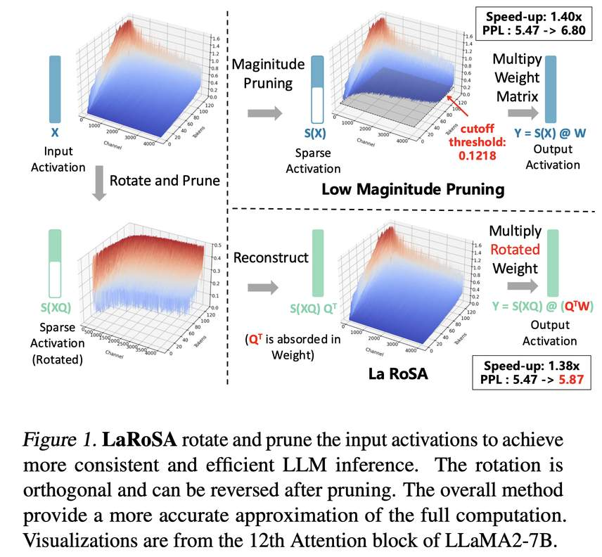

# La RoSA: Enhancing LLM Efficiency via Layerwise Rotated Sparse Activation

> Kai Liu, Bowen Xu, Shaoyu Wu, Xin Chen, Hao Zhou, Yongliang Tao, Lulu Hu
> 
> Alibaba Group
> 
> arXiv: 2507.01299v1 | 2025 | ICML 2025

---

## 一句话总结

LaRoSA 是一种免训练的激活稀疏化方法，通过逐层正交旋转变换 + Top-K 剪枝，在非 ReLU 的 LLM 上实现**一致的模型级稀疏性和可靠的推理加速**，在 LLaMA2-7B 上以 40% 稀疏度仅产生 0.17 PPL 损失，同时获得 1.30× 墙钟加速，显著超越 TEAL 和 CATS 等基线方法。

---

## 摘要翻译

激活稀疏性可以减少大语言模型（LLM）前向推理过程中的计算开销和内存传输。现有方法存在局限：要么需要耗时的恢复训练以阻碍实际采用，要么依赖经验性幅度剪枝，导致稀疏度波动和推理加速不稳定。本文提出 **LaRoSA（Layerwise Rotated Sparse Activation）**，一种新颖的激活稀疏化方法，无需额外训练或幅度剪枝即可提升 LLM 效率。

我们利用逐层正交旋转将输入激活转换为更利于稀疏化的形式。通过在旋转后的激活中采用 Top-K 选择方法，实现了**一致的模型级稀疏性**和**可靠的墙钟时间加速**。LaRoSA 在不同大小和类型的 LLM 上均有效，表现出最小的性能退化和稳健的推理加速。具体而言，对于 LLaMA2-7B 在 40% 稀疏度下，LaRoSA 仅产生 0.17 的 PPL 差距，一致实现 1.30× 墙钟加速，零样本任务与密集模型的准确率差距仅为 0.54%，同时超越 TEAL 1.77% 和 CATS 17.14%。

---

## 研究动机

### 背景与趋势

LLM 推理面临严重的效率挑战，数十亿参数带来巨大的内存占用和计算开销。除了量化和权重剪枝外，**激活稀疏性**是提升 LLM 推理效率的另一重要途径：当激活值为零时，对应权重矩阵的通道无需传输和计算，从而加速推理。

### 现有方法的局限

1. **ReLU 诱导稀疏方法**（如 DejaVu、ReLU Strikes Back）：需要额外的恢复训练，且仅适用于 ReLU 激活函数的模型。现代 LLM（如 LLaMA、Qwen）使用 SwiGLU 等激活函数，本身不产生稀疏性。
2. **幅度剪枝方法**（如 CATS、TEAL）：使用离线校准的阈值裁剪低幅度激活，存在以下问题：
   - **阈值不准确**：离线校准阈值与实际所需阈值之间存在严重不匹配，尤其是序列起始位置的 token。
   - **稀疏度不一致**：不同输入序列的实际稀疏度偏离目标值，导致推理加速不稳定。
   - **通道重要性误解**：低幅度激活如果对应权重矩阵中大范数的通道，仍可能显著影响输出。
3. **旋转压缩方法**（如 SliceGPT、QuaRot、SpinQuant）：主要用于权重剪枝或量化，未直接用于激活稀疏化。

### 核心问题

论文提出核心问题：**是否可以无需额外训练或经验性阈值，快速、有效且一致地利用激活稀疏性来提升 LLM 效率？**

---

## 方法（技术细节）

### 4.1 核心思想：正交旋转变换 + Top-K 剪枝

LaRoSA 的核心思想分为两步：

1. **正交旋转**：对每层的输入激活应用正交旋转矩阵 Q，使激活分布更均匀，从而更容易区分重要和不重要的通道。
2. **Top-K 剪枝**：在旋转后的激活上直接执行 Top-K 选择，保留绝对值最大的 k 个元素，将其余归零，实现精确的稀疏控制。

### 4.2 逐层正交旋转矩阵的构建

**旋转矩阵 Q 的构建**（基于 PCA）：

- 选择校准数据集（如 WikiText2），随机选择 16 条长度为 2048 token 的序列。
- 将序列输入模型，获取每层 l 的输入激活 $X_i^l$（i 为序列索引）。
- 计算协方差矩阵的平均值：$\text{Cov}(X^l, X^{lT}) = \frac{1}{M} \sum_{i=0}^{M} X_i^l (X_i^l)^T$。
- 对协方差矩阵进行特征值分解，按特征值降序排列特征向量，构成正交旋转矩阵 $Q^l$。

**关键设计选择**：

- **仅旋转 h1 和 h3**（Attention block 和 MLP block 的输入激活）：因为 h2 和 h4 的旋转矩阵无法融入 Wv、Wup、Wgate（受 GQA 和逐元素乘法约束）。
- **逐层旋转 vs 全局旋转**：实验表明每层最优旋转矩阵差异很大，全局旋转效果差。LaRoSA 为每层分配独立的 $Q^l$。
- **残差适配器**：由于残差连接的存在，层间激活需保持一致。引入残差适配器 $Q^{lT} Q^{l+1}$ 到每层输出，确保每层输入激活具有独立的正交旋转，且额外计算开销很小。

**计算不变性定理**：正交变换 Q 不改变模型输出，因为 RMSNorm 的计算与正交变换可交换：$\text{RMSNorm}(X) = \text{RMSNorm}(XQ) Q^T$。

### 4.3 正交旋转的权重吸收

旋转矩阵 Q 可以被吸收进权重矩阵，消除额外计算：

$$Y^l = S_k(X^l Q^l) \cdot (Q^l)^T W^l = S_k(X^l Q^l) \cdot (W^l Q^l)^T$$

其中 $Q^l W^l$ 可以预计算并合并到权重中，仅对 h1 和 h3 位置的激活应用旋转，h2 和 h4 位置 Q 为单位矩阵 I。

### 4.4 Top-K 稀疏化函数

- 给定旋转激活 $\tilde{x} = xQ$ 和目标稀疏度 p，计算保留元素数 $k = \alpha \cdot (1-p) \cdot D_{in}$。
- 使用 Top-K 函数保留绝对值最大的 k 个元素：
$$S_k(\tilde{x}_i) = \begin{cases} \tilde{x}_i & \text{if } |\tilde{x}_i| \in \text{Topk}(|\tilde{x}|) \\ 0 & \text{otherwise} \end{cases}$$
- **超参数 α**：控制同一 block 中 h1/h2（或 h3/h4）之间的稀疏度系数，通过网格搜索优化。
- Top-K 保证了**精确的模型级稀疏度**，不像幅度剪枝那样产生波动。

### 4.5 硬件高效自定义 GPU 内核

仅引入激活稀疏性不足以实现端到端的推理加速，还需要高效的 GPU 内核。基于 DejaVu 和 TEAL 的 Triton 内核，LaRoSA 实现了 GEMV 内核：

1. **列主序存储权重矩阵**：便于选择性加载对应非零激活的权重列，提高内存合并效率。
2. **融合 Top-K 与矩阵向量乘法**：在前向传播中识别需要保留的权重列索引。
3. **选择性加载和计算**：选择性加载稀疏激活和对应权重列，传输到计算单元执行乘法并存储结果。

### 4.6 理论分析

论文提供了旋转激活剪枝的理论分析（附录 A）：

- **正交旋转后的激活近似高斯分布**：$\tilde{x} = xQ$ 的元素是 x 元素的加权平均，根据中心极限定理近似零均值高斯分布。
- **Top-K 剪枝的理论误差**：在假设 $\tilde{x}$ 和 $\tilde{W} = WQ$ 独立且同分布高斯时，理论误差仅由 k 决定（公式 11）。
- **实证误差对比**：LaRoSA 的实证误差更接近理论误差，而 TEAL 的实证误差远大于理论误差，因为 TEAL 的幅度剪枝基于不正确的高斯分布假设。

---

## 实验结果

### 评估设置

- **模型**：LLaMA2-7B、LLaMA2-70B、LLaMA3-8B、LLaMA3-70B、Qwen2.5-7B、Qwen2.5-72B、Mistral-7B
- **基线**：CATS（幅度剪枝）、TEAL（幅度剪枝）
- **校准数据**：WikiText2 训练集，16 条 2048 token 序列
- **评估指标**：PPL（WikiText2）、零样本准确率（7 项任务）、5-shot MMLU
- **硬件**：NVIDIA A100（80G）、H20
- **稀疏度设置**：25%、40%、50%、60%、75%

### 语言生成任务（PPL）

LaRoSA 在所有模型和稀疏度设置上均显著优于 CATS 和 TEAL：

- **低稀疏度（25%）**：LaRoSA 在 LLaMA3-70B 上仅产生 0.1 PPL 损失，远优于 CATS（0.71 PPL）和 TEAL（1.1 PPL）。
- **中等稀疏度（40%）**：LaRoSA 在 LLaMA2-7B 上 PPL 为 5.64，TEAL 为 6.40，CATS 为 45.46（严重退化）。
- **高稀疏度（50%-60%）**：LaRoSA 优势更明显。在 Qwen2.5-72B 上 60% 稀疏度时 PPL 仅 4.90，TEAL 为 7.45。
- **关键发现**：LaRoSA 在 50% 稀疏度下的 PPL 甚至优于 CATS 和 TEAL 在 25% 稀疏度下的表现。

### 零样本和少样本任务

- **40% 稀疏度下**：LaRoSA 在 LLaMA2-7B 上比 CATS 平均高 16.60%，比 TEAL 高 1.23%。
- **25% 稀疏度下**：LaRoSA 在 Qwen2.5-7B 上仅 0.22% 的准确率下降，几乎与密集模型一致。
- **LaRoSA 40% 超越 CATS/TEAL 25%**：在 LLaMA2-7B 上，LaRoSA 在 40% 稀疏度下比 CATS 和 TEAL 在 25% 稀疏度下表现更好。

### 推理加速

- **一致性加速**：LaRoSA 实现了比 TEAL 更一致的墙钟时间加速（图 4），因为 Top-K 策略精确地在特定稀疏度下零化激活。
- **具体加速数据（LLaMA3-8B）**：25% 稀疏度 1.10×，50% 稀疏度 1.30×，75% 稀疏度 1.72×。
- **大模型加速（LLaMA3-70B）**：50% 稀疏度 1.35×，75% 稀疏度 1.75×。
- **H20 GPU 加速**：75% 稀疏度下可达 1.89-1.92×。
- **0% 稀疏度时略低于密集模型**：由于残差适配器和稀疏化函数的额外开销（约 0.88-0.92×）。

### 复杂推理任务

- 在 DeepSeek-R1-Distill-Llama3-8B 和 DeepSeek-R1-Distill-Qwen2.5-7B 上测试。
- **25% 稀疏度**：MATH-500、GPQA-Diamond、AIME'24 仅略有性能退化。
- 关键发现：使用非复杂推理相关数据（Alpaca）生成旋转矩阵，LaRoSA 仍保持有效。

### 消融实验

#### 稀疏化函数对比（LLaMA2-7B，50% 稀疏度）

| 方法 | h1 稀疏度 | h2 稀疏度 | h3 稀疏度 | h4 稀疏度 | 模型稀疏度 | PPL |
|------|-----------|-----------|-----------|-----------|------------|-----|
| TEAL | 47.9(±1.2) | 52.0(±4.7) | 48.4(±1.4) | 4.9(±1.5) | 48.8 | 6.80 |
| TopK | 50.0(±0.0) | 50.0(±0.0) | 50.0(±0.0) | 50.0(±0.0) | 50.0 | 6.25 |
| TopK+GS | 45.0(±0.0) | 65.0(±0.0) | 40.0(±0.0) | 57.5(±0.0) | 50.0 | 6.02 |
| LaRoSA | 45.0(±0.0) | 65.0(±0.0) | 40.0(±0.0) | 57.5(±0.0) | 50.0 | 5.87 |

关键结论：
- **TEAL 实际稀疏度波动大**：h4 仅 4.9%，无法实现 50% 模型级稀疏度。
- **TopK 保证精确稀疏度**：每个激活均为 50.0(±0.0)。
- **正交旋转进一步提升 PPL**：从 6.02 降至 5.87。

#### 旋转类型对比

- **模型级旋转（QM）**：无额外开销但性能反而更差。
- **Block 级旋转（QB）**：开销大（1.13× TFLOPs），提升有限。
- **Layer 级旋转（QL）**：最佳选择，开销适中（1.06× TFLOPs），PPL 提升显著。

#### 校准数据集影响

- 使用 WikiText2 和 Alpaca 作为校准数据集，性能差异极小（PPL 差异 < 0.1）。
- 不同校准数据的协方差矩阵余弦相似度 > 0.997。
- 原因：校准数据仅用于计算协方差矩阵，而非经验分布（如 CATS/TEAL）。

#### 与量化兼容性

- 与 4-bit 权重量化（W4A16）兼容，包括 RTN、GPTQ、AWQ、OmniQuant。
- LLaMA2-7B 25% 稀疏度 + GPTQ 量化：PPL 5.74，准确率 64.64%，接近纯 GPTQ 量化（PPL 5.69，准确率 64.89%）。
- 说明稀疏化和量化的误差**近似正交**。

---

## 优势

1. **免训练**：无需任何额外训练或恢复训练，可直接应用于现有模型，降低实际部署成本。
2. **一致的稀疏度**：Top-K 策略保证精确的模型级稀疏度，不出现幅度剪枝的稀疏度波动。
3. **稳定的推理加速**：由于稀疏度一致，推理加速也更稳定（不像 TEAL 随序列长度和输入变化）。
4. **性能优秀**：在 PPL 和零样本准确率上全面超越 CATS 和 TEAL，40% 稀疏度下比 TEAL 好 1.23-1.77%。
5. **鲁棒性强**：适用于不同大小（7B-70B）和类型（LLaMA、Qwen、Mistral）的模型，以及不同稀疏度（25%-75%）。
6. **校准数据不敏感**：旋转矩阵的构建对校准数据集选择不敏感（WikiText2、Alpaca、C4 效果相当）。
7. **与量化兼容**：可与 4-bit 权重量化结合使用，两者误差近似正交。
8. **无需特殊处理初始 token**：与 TEAL 不同，LaRoSA 可以对所有 token（包括初始 token）统一应用稀疏化。
9. **支持推理模型**：在 DeepSeek-R1-Distill 模型上同样有效。
10. **理论支撑**：提供旋转激活剪枝的理论分析，证明旋转后激活近似高斯分布，Top-K 剪枝的理论误差有明确公式。

---

## 局限

1. **0% 稀疏度时性能损失**：由于残差适配器和稀疏化函数的额外计算开销，0% 稀疏度时推理速度低于密集模型（约 0.88-0.92×）。
2. **额外计算开销**：旋转矩阵的引入会增加一定的计算量（1.06-1.13× TFLOPs），虽然可通过权重吸收减轻，但残差适配器仍需额外操作。
3. **仅对 h1 和 h3 旋转**：由于 GQA 和逐元素乘法的约束，h2 和 h4 不能应用旋转，限制了稀疏化效果的进一步提升。
4. **校准数据依赖**：虽然校准数据选择不敏感，但仍需少量校准数据（16 条序列，每条 2048 token）来计算协方差矩阵。
5. **仅适用于解码阶段（自回归生成）**：论文重点评估了自回归生成的加速，对于预填充阶段的加速效果讨论较少。
6. **GPU 内核实现限制**：自定义 GEMV 内核基于 Triton，可能在不同硬件平台（如 AMD GPU、TPU）上的移植性有待验证。
7. **高稀疏度下的性能退化**：在 60% 稀疏度下，部分模型的 PPL 和准确率出现明显退化（如 LLaMA3-8B 60% PPL 8.57）。
8. **与权重剪枝的协同效应未探索**：论文未探讨 LaRoSA 与权重剪枝方法（如 SparseGPT、LLM-Pruner）的结合效果。
9. **代码开源状态不明**：prototxt 中代码 URL 为空，可能限制社区复现和使用。

---

## 与 EfficientPaper 相关的研究方向

LaRoSA 涉及以下与 EfficientPaper 高度相关的研究方向：

1. **激活稀疏性（Activation Sparsity）**：核心关键词，直接利用激活值的稀疏性来加速 LLM 推理，减少计算和内存传输。
2. **稀疏剪枝（Sparse Pruning）**：LaRoSA 是一种激活剪枝方法，与权重剪枝、结构化剪枝等方法互补。
3. **训练无关加速（Training-Free Acceleration）**：免训练的激活稀疏化方法，降低部署门槛，可与 TEAL、CATS 等方法进行比较。
4. **正交旋转压缩（Rotation-based Compression）**：与 SliceGPT、QuaRot、SpinQuant 等方法相关，利用正交变换改善量化或剪枝效果。
5. **LLM 推理加速（LLM Inference Acceleration）**：直接目标是提升 LLM 推理效率，包括墙钟时间加速和吞吐量提升。
6. **模型量化兼容性（Quantization Compatibility）**：LaRoSA 可与 4-bit 量化结合使用，涉及量化与稀疏化的协同优化。
7. **推理模型优化（Reasoning Model Optimization）**：在 DeepSeek-R1-Distill 模型上的验证，涉及复杂推理任务的效率优化。
8. **硬件高效内核（Hardware-Efficient Kernels）**：基于 Triton 的 GEMV 内核，涉及 GPU 内存管理和计算优化。
9. **稀疏度一致性（Sparsity Consistency）**：确保不同输入序列的稀疏度一致，是 LLM 推理稳定性的关键。
10. **模型压缩与效率（Model Compression & Efficiency）**：LaRoSA 属于模型压缩和推理效率优化的大范畴，与量化、蒸馏、剪枝等方法共同构成 LLM 效率优化的技术栈。

---

> **生成声明**：本 note 由 AI Agent（Hermes Agent）自动生成，基于 arXiv 论文 2507.01299v1 的全文内容。所有内容用中文撰写，仅供学术参考。生成时间：2025年6月。
