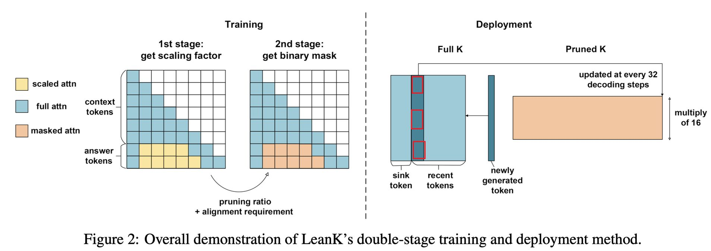

# LeanK: Learnable K Cache Channel Pruning for Efficient Decoding

> Yike Zhang, Zhiyuan He, Huiqiang Jiang, Chengruidong Zhang, Yuqing Yang, Jianyong Wang, Lili Qiu

## 一句话总结

LeanK 是一种基于学习的 K 缓存通道剪枝方法，通过两阶段训练学习静态通道稀疏掩码，在 70% 剪枝率下实现 K 缓存约 70% 内存缩减和 1.3×–1.6× 注意力计算加速，同时几乎无精度损失。

## 摘要翻译

大语言模型（LLM）支持长上下文任务，但面临由不断增长的 KV 缓存带来的效率挑战。本文提出 LeanK，一种基于学习的方法，通过利用静态通道稀疏性剪枝不重要的 key（K）缓存通道。通过新颖的两阶段训练过程，LeanK 学习通道级别的静态掩码，该掩码可满足特定的稀疏比率和硬件对齐要求。LeanK 在不牺牲精度的前提下减少 GPU 显存并加速解码。实验表明，LeanK 最多可实现 70% K 缓存和 16%–18% V 缓存的内存缩减。自定义解码内核可实现 1.3× 的注意力计算加速。此外，通过分析学习到的重要性分布，本文提供了对长上下文推理中模型通道和注意力头的深入洞察。代码已在 https://aka.ms/LeanK 开源。

## 研究动机

长上下文 LLM 推理中，KV 缓存的显存占用和内存带宽瓶颈是核心问题。现有方法主要从三个维度优化：（1）**驱逐（Eviction）**，丢弃不重要 token 的缓存（如 H2O、SnapKV）或不重要注意力头的缓存（如 DuoAttention）；（2）**选择（Selection）**，保留完整 KV 缓存但选择性读取相关条目（如 Quest、SparQ）；（3）**量化（Quantization）**，压缩 KV 缓存精度（如 KIVI）。然而，这些方法普遍假设 K 缓存的所有通道在最终注意力分数计算时同等重要，这限制了优化空间。

本文识别了一个尚未充分探索的优化机会——**K 缓存的通道维度稀疏性**，基于三个关键观察：

1. **RoPE 引入的通道低效性**：RoPE 将特定频率分配给 K 矩阵中的每对维度。高频率维度往往不稳定，对长上下文推理贡献有限，存在剪枝机会。
2. **K 通道重要性具有静态性**：通过 Pearson 相关系数验证，K 缓存通道的重要性分布在不同任务和序列长度间高度相关，表明其固有的静态特性。
3. **某些通道具有大范数但影响有限**：存在一些通道范数较大但对模型性能影响很小，单纯依赖范数大小判断通道重要性会忽略不同解码层和注意力头之间的异质性。

## 方法（技术细节）

LeanK 通过两阶段训练学习二值掩码，用于在预定义剪枝率下剪枝 K 缓存通道。

### 第一阶段：学习连续缩放因子

引入缩放因子 α ∈ R^{L×n×d}（L 层 × n 头 × d 通道），初始化为 1。训练过程：

- 对输入序列 X = [Xctx; Xans]（上下文+答案），首先计算全注意力的隐藏状态 Hfull。
- 对答案部分，应用基于 α 的缩放注意力：
  - 上下文部分：保持完整注意力（Actx = softmax(Qctx K^T ⊙ Mcausal)V）
  - 答案部分：中间区域的注意力 logit 被 α 缩放
  - 保留 attention sink 和滑动窗口（不受 α 影响），只对中间区域进行剪枝
- 训练损失：L1st = ||Hfull - Hscaled||²_2 + λ||α||₁
  - 第一项为 L2 蒸馏损失，对齐缩放后的隐藏状态与全注意力状态
  - 第二项为 L1 正则化，促进稀疏性
  - λ 控制性能保持与稀疏性之间的权衡

训练任务：使用两个 passkey retrieval 任务——（1）Dense retrieval（键值对检索）；（2）Multi-value retrieval（多值检索）。

### 第二阶段：二值掩码学习

将第一阶段的连续缩放因子 α 转换为二值掩码 β ∈ {0,1}^{L×n×d}，满足两个要求：
- **R1**：满足预定义的剪枝率 s%
- **R2**：对 GPU 友好，每个头保留的通道数为 r 的倍数（r=16 或 32）

掩码生成公式：β = Tops%,r(α)
1. 先按重要性选择前 s% 的通道
2. 对每个层 i、头 j，将保留通道数 ni,j 四舍五入到 r 的倍数
3. 在每个头内保留 top n'i,j 个条目

第二阶段仅使用蒸馏损失：L2nd = ||Hfull - Hscaled||²_2

两阶段缺一不可：直接对 α 做 Top-K 会因 scaling 和 masking 不对齐导致性能下降，且无法满足硬件对齐要求；跳过第一阶段直接优化二值掩码则难以收敛。

### 部署

推理时，K 缓存被分为两部分：K = [Ks+l; Kprun]
- Ks+l：保留 attention sink 和局部窗口的完整 K 缓存
- Kprun：基于二值掩码 β 剪枝后的 K 缓存

每 32 个 token 更新一次 recent tokens，mask 位置保持固定。注意力计算：A = softmax(qK^T_{s+l} + qprun K^T_{prun})V

当某头的所有通道都被剪枝时，该头的注意力简化为只计算 sink + local window 部分，V 缓存也可相应移除，进一步节省显存。

### 自定义解码内核

基于 TileLang 实现自定义解码内核：
- 加载模型权重后，根据保留通道数对每层的注意力头分组
- 重排 Q、K、V、O 投影权重
- 为每组存储独立的剪枝 K 缓存和完整的 sink/local K 缓存
- 每个解码步骤启动融合内核，直接读取分组 K 缓存执行 FlashAttention

## 实验结果

### 实验设置
- **模型**：Llama-3.1-8B-Instruct、Qwen2.5-7B-Instruct（均支持 128K 上下文）
- **基线**：ThinK（动态、查询驱动的 K 通道剪枝）
- **评测基准**：LongBench、RULER（4K–128K）、GSM-Infinite（8K–32K）
- **训练细节**：Llama 学习率 0.02/0.01，Qwen 0.04/0.02，λ=0.06，局部窗口 1024，attention sink 128

### 核心结果

**RULER 评测（Llama-3.1-8B-Instruct）**：
| 方法 | 剪枝率 | 平均精度 |
|------|--------|----------|
| 原始 | - | 87.1 |
| ThinK | 60% | 80.5 |
| ThinK | 70% | 41.1 |
| **LeanK** | **70%** | **86.8** |

**RULER 评测（Qwen2.5-7B-Instruct）**：
| 方法 | 剪枝率 | 平均精度 |
|------|--------|----------|
| 原始 | - | 85.0 |
| ThinK | 70% | 62.8 |
| **LeanK** | **70%** | **84.2** |

**LongBench 评测**：LeanK 在 70% 压缩率下，Llama 仅下降 0.4%，Qwen 下降 3.1%，而 ThinK 分别下降 5.7% 和 4.8%。

**GSM-Infinite 数学推理**：LeanK 在 70% 压缩率下，Llama 上的 AUC 甚至优于原始模型（0.65 vs 0.56），表现极强泛化能力。

### 效率

- **内存缩减**：70% 剪枝率下 K 缓存约 70% 显存减少，V 缓存 16%–18% 减少
- **加速**：自定义内核在 Llama 上实现 1.3× 注意力计算加速，Qwen 上 1.6×
- **端到端吞吐**：Llama 上从 141 tokens/s 提升到 172 tokens/s（1.2×）
- **显存节省**：在 80GB A100 上，batch size 可增加 20%，batch size=64 时节省约 10GB

### 与其他方法的正交性

LeanK 可与现有方法组合：
- **DuoAttention + LeanK**：KV 缓存压缩从 50% 提升到 65%，无性能下降
- **Quest + LeanK**：内存读取减少 70%，精度提升（72.4→75.1）
- **KIVI + LeanK**：压缩比从 5.3× 提升到 9.7×（2-bit 量化）

## 优势

1. **近无损压缩**：70% 剪枝率下几乎无精度损失，远优于 ThinK 等动态方法
2. **静态掩码，零推理开销**：掩码通过离线训练获得并固定，推理时无需额外计算
3. **正交性好**：可与驱逐、选择、量化等方法组合使用
4. **自定义内核高效**：基于 TileLang 的融合解码内核实现显著加速
5. **强泛化能力**：对数学推理等敏感任务也能保持性能
6. **对极端稀疏鲁棒**：即使在 75%–80% 剪枝率下仍优于基线
7. **揭示了模型频率-通道重要性关系**：低频率通道更重要，高频率通道可安全剪枝

## 局限

1. **通道维度冗余问题的根本解决**：当前方法是后处理，论文指出改进位置编码和预训练阶段对通道维度的处理可能是更根本的解决方案
2. **训练成本**：需要两阶段训练（2000+200 步），虽然相对轻量但需要额外的训练数据
3. **通道分析不完整**：某些高频通道（如 Llama 的 channel pair 22、Qwen 的 channel pair 31）出乎意料地重要，原因待进一步研究
4. **仅针对 K 缓存通道**：V 缓存的通道剪枝尚未探索
5. **对短序列场景优势有限**：方法主要针对长上下文场景，在短序列上优势不明显

## 与 EfficientPaper 相关的研究方向

1. **KV 缓存优化的多维度组合**：LeanK 的通道维度剪枝与 token 驱逐（H2O/SnapKV）、head 级驱逐（DuoAttention）、token 选择（Quest）、量化（KIVI）形成互补，可进一步探索多维度联合优化
2. **静态 vs 动态稀疏性**：LeanK 证明了静态通道掩码优于动态方法（ThinK），这与高效推理中减少运行时开销的趋势一致
3. **RoPE 频率分析**：论文揭示了 RoPE 编码中频率与通道重要性的关系，对理解位置编码的机制有重要启示
4. **硬件感知的通道对齐**：第二阶段训练中对 GPU 内存加载对齐的考虑（通道数为 r 的倍数），是实际部署中的关键设计
5. **无训练的 head 剪枝**：论文提出的基于高频比率（whf）的头分类方法（无需额外训练即可区分 streaming/retrieval heads），可作为 DuoAttention 的替代方案
6. **内存效率推理**：1.2× 端到端吞吐提升和 20% batch size 增加，对实际部署具有重要价值
7. **结构化剪枝的互补性**：与权重剪枝（SparseGPT）和层剪枝不同，KV 缓存通道剪枝是一种新的维度，可与现有方法叠加

---

> **生成声明**：本笔记由 AI Agent (Hermes Agent) 自动生成，基于论文原文 PDF 提取的全文内容。生成时间：2026年6月。
