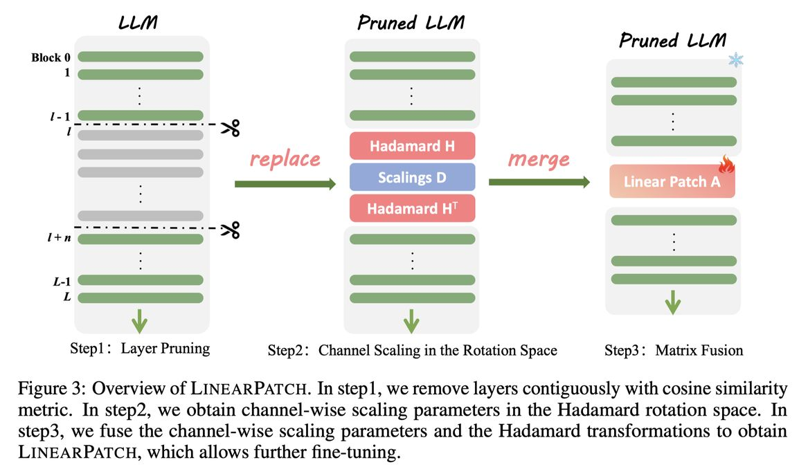

# A Simple Linear Patch Revives Layer-Pruned Large Language Models

> ⚠️ **本 note 由 AI Agent 自动生成**，生成时间：2025年6月，基于论文全文阅读。所有内容仅供参考，如有错误请以原文为准。

---

## 一句话总结

LinearPatch 提出了一种简单的即插即用方法，通过 Hadamard 变换和通道缩放将层剪枝后的激活量级对齐，融合为一个对称矩阵插入剪枝接口，以几乎为零的推理开销显著恢复被剪枝 LLM 的性能。

---

## 摘要翻译

层剪枝因其实现简单已成为压缩大语言模型（LLM）的流行技术。然而，现有的层剪枝方法往往伴随着显著的性能下降。我们发现这种性能退化源于剪枝接口处跨层和跨 token 的激活量级不匹配。为解决此问题，我们提出了 LinearPatch，一种简单的即插即用技术，用于恢复层剪枝后的 LLM。该方法采用 Hadamard 变换来抑制特定 token（如 [BOS] 或分隔符 token）中的大量异常值，并通过通道缩放（channel-wise scaling）来对齐激活量级。这些操作可以融合到一个矩阵中，作为"补丁"来桥接剪枝接口，推理开销可忽略不计。LinearPatch 在对 LLaMA-3-8B 剪枝 5 层时，在问答基准测试上保留了原始模型 94.15% 的性能，超越现有最先进方法 4%。此外，补丁矩阵可以通过内存高效的离线知识蒸馏进一步优化。仅使用 5K 样本，LinearPatch 的保留性能可在单张计算卡上 30 分钟内提升至 95.16%。

---

## 研究动机

1. **LLM 压缩需求**：大型语言模型（LLM）的部署面临显著的计算和内存开销，模型压缩技术（如量化和剪枝）至关重要。
2. **层剪枝的优势与挑战**：层剪枝是一种受欢迎的压缩方法，因为它可以直接移除整个 Transformer 层，无需硬件或底层依赖（不同于非结构化剪枝或 N:M 稀疏性）。但层剪枝通常导致显著的性能下降。
3. **关键发现**：本文发现性能退化的核心原因是**剪枝接口处激活量级的不匹配**——剪枝后剩余层的激活尺度存在差异，尤其是特殊 token（如 [BOS]）中存在大量异常值，加剧了这种不匹配。
4. **现有方法的不足**：现有的层剪枝方法（如 ShortGPT、SLEB、LLM-Streamline 等）都忽略了剪枝后激活量级不匹配的问题，而 LinearPatch 正是针对这一问题提出的解决方案。

---

## 方法（技术细节）

LinearPatch 的核心思想是通过一个简单的线性变换矩阵来弥合层剪枝造成的激活量级差距，包含三个关键步骤：

### 步骤 1：层剪枝（Layer Pruning）

- 使用余弦相似度作为剪枝指标（也可与其他指标正交结合），移除连续的 n 个层。
- 剪枝后，第 (ℓ*+n) 层的输入变为第 ℓ* 层的输入：X^(ℓ*+n) = X^(ℓ*) + f(X^(ℓ*), θ^(ℓ*+n))。

### 步骤 2：通道量级对齐（Channel Magnitude Alignment）

- **通道间量级不匹配问题**：不同层和通道的隐藏状态激活量级差异显著。移除层后，剪枝接口处的通道量级不匹配严重影响模型性能。
- **通道缩放参数计算**：对每个通道 k，计算剪枝后层输入与剪枝前层输入的平均激活量级比值：
  - d_k(ℓ*, ℓ*+n) = ‖X^(ℓ*+n)_{:,k}‖₁ / ‖X^(ℓ*)_{:,k}‖₁
- **量化评估**：通过扰动系数 α 的实验发现，使用缩放参数 d 匹配量级后，困惑度从 35.68 降至 20.68。

### 步骤 3：Token 量级平滑（Token Magnitude Smoothing）

- **Token 间量级不匹配问题**：由于特殊 token（如 [BOS]）存在大量异常值（量级超过 1e³），通道缩放参数无法适用于所有 token。标准差 σ_d 可高达 2137.75。
- **Hadamard 变换**：受相关研究启发，对激活应用 Walsh-Hadamard 矩阵进行旋转，可以有效抑制异常值。Hadamard 矩阵的正交性使得变换可逆：X^(ℓ*) = (X^(ℓ*)H)H^T。
- **效果**：旋转后，通道缩放参数的共享性更好，标准差 σ_d 从 2137.75 降至 230.32。

### 步骤 4：矩阵融合（Matrix Fusion）

- 将通道缩放参数 D = diag(d) 和 Hadamard 变换 H 融合为一个对称矩阵 P：
  - X_new^(ℓ*) = X^(ℓ*)HDH^T = X^(ℓ*)P
- 基于谱定理（Spectral Theorem），任何实对称矩阵可以分解为正交特征向量矩阵和对角特征值矩阵。
- **优势**：将三个操作（Hadamard 变换、通道缩放、Hadamard 逆变换）融合为单次矩阵乘法，推理开销极小。

### 步骤 5：内存高效的离线知识蒸馏

- **传统知识蒸馏的挑战**：需要同时加载教师模型和学生模型到 GPU 内存中，对 LLM 而言内存开销巨大。
- **LinearPatch 的改进**：
  - 仅需保存输入和输出，无需加载教师模型。
  - 使用 Top-K logits（K=100）的 KL 散度进行蒸馏，节省约 320 倍内存（词表大小 32K 时）。
  - 仅微调补丁矩阵 P，冻结所有其他参数。
  - 仅需 5K 样本，30 分钟可在单张 V100 GPU 上完成（LLaMA-2-7B）。
- 损失函数：最小化 KL 散度 KL(o_t, o_s)，而非 MSE（MSE 容易导致过拟合）。

---

## 实验结果

### 实验设置

- **模型**：LLaMA-2-7B/13B、LLaMA-3-8B、Baichuan-2-7B、DeepSeek-R1-Distill LLMs
- **基准方法**：LLM-Pruner、SLEB、ShortGPT、LLM-Streamline、Shortened LLaMA
- **评估指标**：
  - PPL（困惑度）：WikiText2、C4、PTB
  - MMLU（5-shot）
  - QA（9 个常识问答任务，报告平均值和保留性能 RP）
- **校准**：128 句，序列长度 2048，来自 WikiText-2 数据集
- **微调**：AdamW 优化器，学习率 1e-4，5000 句，序列长度 2048，1 个 epoch
- **硬件**：24GB NVIDIA V100 GPU

### 主要结果

#### 无训练（Training-free）QA 基准测试

| 模型 | 剪枝层数/总层数 | 方法 | 保留性能 (RP) |
|------|----------------|------|---------------|
| LLaMA-2-7B | 7/32 | LLM-Streamline (None) | 86.06% |
| LLaMA-2-7B | 7/32 | **LinearPatch [S/L]** | **88.88%** |
| LLaMA-2-7B | 9/32 | LLM-Streamline (None) | 80.29% |
| LLaMA-2-7B | 9/32 | **LinearPatch [S/L]** | **84.08%** |
| LLaMA-2-13B | 8/40 | LLM-Streamline (None) | 90.27% |
| LLaMA-2-13B | 8/40 | **LinearPatch [S/L]** | **93.45%** |
| LLaMA-3-8B | 5/32 | LLM-Streamline (None) | 90.84% |
| LLaMA-3-8B | 5/32 | **LinearPatch [L]** | **94.15%** |

#### 后训练（Post-training）QA 基准测试

| 模型 | 剪枝层数/总层数 | 方法 | 保留性能 (RP) |
|------|----------------|------|---------------|
| LLaMA-2-7B | 7/32 | LLM-Streamline (FFN) + FT | 90.00% |
| LLaMA-2-7B | 7/32 | **LinearPatch [L] + FT** | **92.83%** |
| LLaMA-3-8B | 5/32 | LLM-Streamline (FFN) + FT | 74.34% |
| LLaMA-3-8B | 5/32 | **LinearPatch [L] + FT** | **95.16%** |

#### PPL 基准测试

| 模型 | 剪枝层数/总层数 | 方法 | 平均 PPL |
|------|----------------|------|----------|
| LLaMA-2-7B | 7/32 | LLM-Streamline (FFN) + FT | 24.58 |
| LLaMA-2-7B | 7/32 | **LinearPatch [L] + FT** | **17.27** |
| LLaMA-3-8B | 5/32 | LLM-Streamline (FFN) + FT | 228.70 |
| LLaMA-3-8B | 5/32 | **LinearPatch [L] + FT** | **12.23** |

### 消融实验

#### 组件消融（LLaMA-2-7B，剪枝 9/32 层）

| 配置 | 平均 PPL | QA 平均 | QA RP |
|------|----------|---------|-------|
| Vanilla（无任何修复） | 56.10 | 56.52% | 80.29% |
| +d（通道缩放） | 33.70 | 58.62% | 83.56% |
| +P（LinearPatch 矩阵） | 30.29 | 59.14% | 84.08% |
| +FT（知识蒸馏微调） | **19.58** | **61.71%** | **88.15%** |

#### 损失函数对比

| 蒸馏类型 | 损失函数 | 平均 PPL | QA RP |
|----------|----------|----------|-------|
| 特征蒸馏（LLM-Streamline） | MSE | 36.40 | 84.74% |
| logits 蒸馏（LinearPatch） | **KL** | **29.26** | **88.15%** |

#### 计算资源消耗

- **初始化**：LLaMA-2-7B，约 30 秒
- **微调**：约 30 分钟（单张 NVIDIA V100 GPU）
- **推理开销**：与 LLM-Streamline (FFN) 相比，LinearPatch 矩阵约小 8 倍，速度快约 190 倍
- **离线存储**：与 LLM-Streamline 相比，减少约 40 倍（隐藏维度 4096 时）

---

## 优势

1. **简单高效**：方法仅需一个线性矩阵，将 Hadamard 变换和通道缩放融合为单次矩阵乘法，推理开销可忽略不计。
2. **即插即用**：可与各种剪枝指标（余弦相似度、梯度、困惑度等）正交结合，灵活性强。
3. **显著性能提升**：在无训练和后训练设置下均显著超越现有最先进方法，如 LLM-Streamline（提升约 4%）。
4. **内存高效的训练**：仅微调补丁矩阵，无需加载教师模型，使用 Top-K logits 蒸馏大幅减少内存消耗。
5. **低成本训练**：仅需 5K 样本，30 分钟单卡即可完成微调。
6. **理论基础扎实**：基于谱定理（Spectral Theorem）将 Hadamard 变换和通道缩放融合为对称矩阵，有明确的数学解释。
7. **广泛适用性**：在多种 LLM（LLaMA-2、LLaMA-3、Baichuan-2、DeepSeek-R1）和多种基准测试上验证了有效性。

---

## 局限

1. **任务间性能不均匀**：层剪枝可能在不同任务间不均匀地降低性能。虽然某些问答任务可能保持稳健，但复杂推理或依赖上下文的任务可能受损。
2. **评估框架不完善**：需要更全面的评估框架来彻底评估层剪枝在不同任务和上下文中的效率增益与性能退化之间的权衡。
3. **剪枝比例限制**：论文中剪枝比例控制在 30% 以下，未充分探索更高剪枝比例的表现。
4. **与非结构化剪枝的比较缺失**：论文主要与层剪枝方法比较，未与非结构化剪枝或 N:M 稀疏性等方法进行直接对比。
5. **开源代码缺失**：论文未提供开源代码，复现可能存在困难。
6. **仅适用于连续层剪枝**：虽然可以扩展到非连续层剪枝，但主实验主要基于连续层剪枝。

---

## 与 EfficientPaper 相关的研究方向

1. **结构化剪枝（Structured Pruning）**：LinearPatch 是层剪枝的改进方法，属于结构化剪枝的范畴。相关研究方向包括：
   - 宽度剪枝（如 SliceGPT、Sheared LLaMA）
   - 注意力头剪枝
   - 中间层维度剪枝
2. **模型压缩（Model Compression）**：LinearPatch 与其他压缩技术（量化、蒸馏）可以正交结合，形成多层次压缩方案。
3. **激活量级对齐（Activation Magnitude Alignment）**：本文发现的激活量级不匹配问题在其他剪枝场景中也可能存在，相关研究包括：
   - SmoothQuant（量化中的量级平滑）
   - QuaRot（旋转量化）
   - FlatQuant（平坦化量化）
4. **知识蒸馏（Knowledge Distillation）**：LinearPatch 提出的内存高效离线蒸馏方法为大模型蒸馏提供了新思路，相关研究包括：
   - 传统知识蒸馏
   - 对齐蒸馏
   - 多教师蒸馏
5. **Hadamard 变换在 LLM 中的应用**：本文的 Hadamard 变换用于抑制激活异常值，与 QuaRot、SpinQuant 等工作相关，是量化与剪枝交叉的前沿方向。
6. **高效推理（Efficient Inference）**：LinearPatch 的低推理开销特性使其适合部署场景，与高效推理、边缘部署等方向紧密相关。
7. **LLM 稀疏性（Sparse Pruning）**：作为结构化稀疏性的代表，LinearPatch 为 LLM 的稀疏化提供了新方法。

---

## 附录

- **论文链接**：http://arxiv.org/abs/2505.24680v1
- **关键词**：sparse_pruning, structured_sparsity
- **代码框架**：PyTorch
- **代码仓库**：未提供
- **发表时间**：2025 年 5 月 30 日
- **作者机构**：清华大学深圳国际研究生院、华为诺亚方舟实验室
