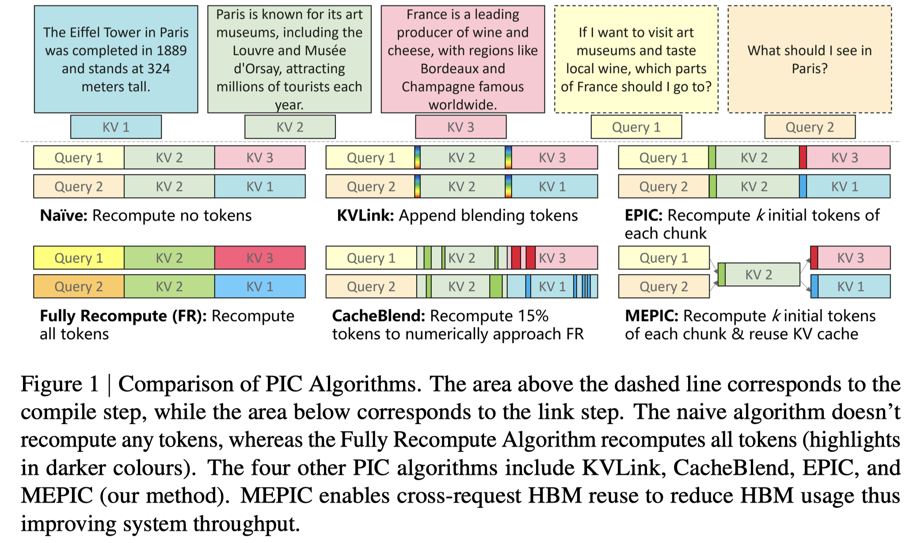

# MEPIC: Memory Efficient Position Independent Caching for LLM Serving

> Qian Wang, Zahra Yousefijamarani, Morgan Lindsay Heisler, Rongzhi Gu, Bai Xiaolong, Shan Yizhou, Wei Zhang, Wang Lan, Ying Xiong, Yong Zhang, Zhenan Fan

## Abstract

Modern LLM applications such as deep-research assistants, coding agents, and Retrieval-Augmented Generation (RAG) systems, repeatedly process long prompt histories containing shared document or code chunks, creating significant pressure on the Key Value (KV) cache, which must operate within limited memory while sustaining high throughput and low latency. Prefix caching partially alleviates some of these costs by reusing KV cache for previously processed tokens, but limited by strict prefix matching. Position-independent caching (PIC) enables chunk-level reuse at arbitrary positions, but requires selective recomputation and positional-encoding (PE) adjustments. However, because these operations vary across queries, KV for the same chunk diverges across requests. Moreover, without page alignment, chunk KV layouts diverge in memory, preventing page sharing. These issues result in only modest HBM savings even when many requests reuse the same content.
  We present MEPIC, a memory-efficient PIC system that enables chunk KV reuse across positions, requests, and batches. MEPIC aligns chunk KV to paged storage, shifts recomputation from token- to block-level so only the first block is request-specific, removes positional encodings via Rotary Position Embedding (RoPE) fusion in the attention kernel, and makes remaining blocks fully shareable. These techniques eliminate most duplicate chunk KV in HBM, reducing usage by up to 2x over state-of-the-art PIC at comparable latency and accuracy, and up to 5x for long prompts, without any model changes.
