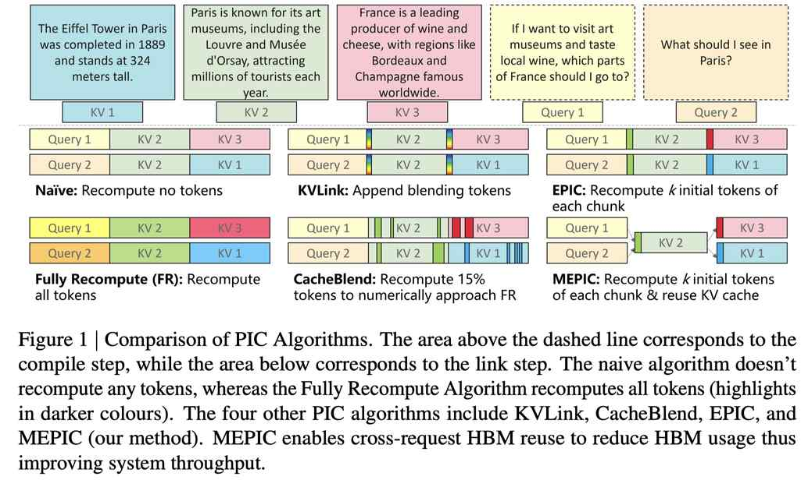

# MEPIC: Memory Efficient Position Independent Caching for LLM Serving

> Qian Wang, Zahra Yousefijamarani, Morgan Lindsay Heisler, Rongzhi Gu, Bai Xiaolong, Shan Yizhou, Wei Zhang, Wang Lan, Ying Xiong, Yong Zhang, Zhenan Fan

> ⚠️ **声明：本 note 由 AI Agent（Hermes Agent）自动生成，基于 arXiv 论文全文提取与分析。生成时间：2025-06-04。**

---

## 一句话总结

MEPIC 是一种面向 LLM 服务的内存高效位置无关缓存系统，通过对 chunk KV 进行页对齐、块级选择性重计算和融合 RoPE 注意力机制，在不改变模型的情况下实现跨位置、跨请求、跨批次的 KV 缓存复用，将 HBM 使用量降低至 2×~5×。

---

## 摘要翻译

现代 LLM 应用（如深度研究助手、代码代理和 RAG 系统）反复处理包含共享文档或代码块的长提示历史，对 Key-Value（KV）缓存产生巨大压力，KV 缓存必须在有限内存中运行，同时保持高吞吐和低延迟。前缀缓存（Prefix Caching）通过复用已处理 token 的 KV 缓存部分缓解了这些成本，但受限于严格的前缀匹配。位置无关缓存（Position-Independent Caching, PIC）允许在任意位置进行 chunk 级复用，但需要选择性重计算和位置编码（PE）调整。然而，由于这些操作在不同查询间存在差异，相同 chunk 的 KV 在不同请求中产生分歧。此外，缺乏页对齐导致 chunk KV 布局在内存中不一致，无法共享页面。这些问题导致即使许多请求复用相同内容，HBM 节省也十分有限。

我们提出 MEPIC，一种内存高效的 PIC 系统，支持跨位置、跨请求、跨批次的 chunk KV 复用。MEPIC 将 chunk KV 对齐到页存储，将重计算从 token 级转移到块级（仅第一个块是请求特定的），通过注意力核中的 RoPE 融合去除位置编码，使剩余块完全可共享。这些技术消除了 HBM 中大部分重复 chunk KV，在相似延迟和精度下，HBM 使用量比最先进的 PIC 减少最高 2 倍，长提示减少最高 5 倍，且无需模型修改。

---

## 研究动机

### 问题背景

在 RAG、代码代理和深度研究系统中，存在显著的 **Zipfian 检索行为**：大量请求反复访问少量文档/代码块。生产环境测量显示：

- KV 复用高度偏斜，少量前缀和 chunk 占据大部分缓存命中
- 独立单轮请求间的复用与多轮对话会话内的复用同等重要
- 达到近理想命中率所需的缓存大小适中，存在"热"前缀和 chunk 集合

### 现有方案的局限

**前缀缓存（Prefix Caching）**：仅支持严格前缀匹配，无法处理 chunk 出现在不同位置或重排的场景。

**现有 PIC 方法**（如 CacheBlend、EPIC、KVShare 等）：
- 虽然允许 chunk 在任意位置复用，但每个请求的重计算和位置编码调整独立执行，导致相同 chunk 的 KV 在不同请求中不一致
- 缺乏页对齐机制，chunk KV 布局在内存中不一致，无法共享页面
- 未解决 HBM 中的跨请求 KV 重复问题

### 三大系统级挑战

1. **缺乏 HBM 内 chunk 管理原生支持**：现有 PIC 系统在推理引擎外运行，chunk 存储在 CPU/磁盘层，vLLM 的注意力核不接受外部内存区域指针
2. **缺乏规范的、页对齐的 chunk 块放置**：chunk 起始偏移量因请求而异，导致映射到不同物理块；动态重计算使每个块都可能变"脏"
3. **位置编码破坏规范 chunk 复用**：RoPE 编码的 KV 与绝对位置绑定，相同 chunk 在不同偏移处产生不同 KV 张量

---

## 方法（技术细节）

### 系统架构

MEPIC 集成到 vLLM + LMCache 服务栈中，包含两条执行路径：

- **调度路径**：基于元数据的 chunk 感知 KV 放置和驻留管理
- **计算路径**：KV 材质化和注意力执行

### 调度路径：Chunk 感知 KV 管理

#### 1. 分段与规范化（Segmentation and Canonicalization）

- 将每个请求划分为 **chunk 段**（不可变、可复用内容）和 **prompt 段**（请求特定内容）
- **非对称填充方案**：chunk 段在前部填充，prompt 段在后部填充，确保每个可复用 chunk 从块边界开始
- 填充模式隐式编码段类型，计算路径可区分 chunk 和 prompt

#### 2. Chunk 感知 KV 驻留管理

- **Chunk Matcher** 解析每个段的 HBM 驻留状态
- **Hybrid KV Manager** 协调 Prefix Cache Coordinator 和 Chunk Cache Coordinator
- 将段分类为 HBM 驻留或非驻留，记录远程副本可用性

#### 3. 淘汰与分配策略

- **KV 块分配**：在共享 paged-KV 块池中管理 prefix 和 chunk KV
- 通过 chunk 哈希确定身份（与 vLLM 的 prefix cache 逐块哈希不同）
- **淘汰策略**：Chunk LRU Manager 跟踪 HBM 驻留 chunk KV 对象使用情况
- 零引用计数的 chunk 可被淘汰，prefix KV 块永不淘汰以保持正确性
- 引入 **lazy LRU 淘汰**，集成 LMCache 用于非驻留 chunk 的远程持久化

### 计算路径

#### 1. 选择性 KV 重计算

- **Prompt 段**：完全重计算（请求特定，不可共享）
- **已缓存 chunk**：仅重计算第一个 KV 块，其余块作为规范 KV 复用
- **新遇到的 chunk**：完全重计算
- 重计算仅捕获 chunk 边界的上下文依赖注意力，最小化计算开销

#### 2. 提交到分页 KV

- 重计算的 KV 向量写入分配的分页 KV 块
- 基于调度路径的确定性映射，直接写入分配页面，无需额外元数据转换

#### 3. 融合 RoPE 注意力（Fused RoPE Attention）

- **位置编码自由（NoPE）KV 格式**：存储 KV 时不应用 RoPE
- 位置信息在注意力计算时通过 **融合 RoPE-注意力算子** 在设备上即时注入
- 相同的规范 KV 块可在不同提示偏移处复用，无需重计算
- RoPE 融合到注意力算子中，避免额外内存流量，开销可忽略

---

## 实验结果

### 实验设置

- **模型**：Mistral-7B-Instruct-v0.3
- **硬件**：Ascend 910B NPU，每卡 64GB HBM
- **数据集**：SQuAD、NewsQA、NarrativeQA、emrQA（每个数据集 300 请求）
- **基线**：CacheBlend（15% 重计算比）、EPIC（重计算 16 token）

### 核心结果

#### 基线对比（Table 2）

| 数据集 | MEPIC 延迟 | CacheBlend 延迟 | EPIC 延迟 | MEPIC HBM | CacheBlend HBM | EPIC HBM |
|--------|-----------|----------------|----------|-----------|----------------|----------|
| SQuAD | 116.03s | 119.41s | 114.73s | 27.67% | 54.47% | 54.13% |
| NewsQA | 112.36s | 117.00s | 115.39s | 36.43% | 45.97% | 45.43% |
| NarrativeQA | 97.71s | 104.72s | 100.06s | 29.67% | 50.40% | 50.40% |
| emrQA | 105.67s | 110.97s | 109.85s | 23.20% | 37.37% | 37.40% |

- **精度**：与基线相当或略有提升，说明仅重计算第一个块足以保持模型保真度
- **延迟**：MEPIC 在大多数数据集上延迟更低
- **HBM 使用**：峰值 HBM 使用量比 CacheBlend 和 EPIC 降低最高 2 倍

#### 变化 QPS 下的性能（Figure 7）

- QPS 2~25 范围内，MEPIC 显著降低峰值 HBM 使用
- HBM 使用量比 CacheBlend 降低 5.74 倍，比 EPIC 降低 5.25 倍
- 延迟比 EPIC 低 9.1%，比 CacheBlend 低 11.48%

#### 变化上下文长度（Figure 8）

- chunk 数量从 2 到 16，MEPIC 始终保持更低的 HBM 消耗
- MEPIC 使用 2.97×~5.21× 更少的 HBM
- 当 EPIC 和 CacheBlend 快速饱和 HBM 时，MEPIC 保持在 40% 以下

---

## 优势

1. **显著降低 HBM 使用**：跨请求、跨批次的 chunk KV 共享，HBM 使用降低 2×~5×
2. **无模型修改**：纯系统级优化，兼容现有 Transformer 模型
3. **延迟改进**：减少预填充重计算，端到端延迟降低 9%~11%
4. **页对齐设计**：确保相同逻辑 chunk 映射到相同 HBM 页面，实现块级共享
5. **位置无关缓存**：通过融合 RoPE 注意力实现位置无关的 chunk 复用
6. **与 vLLM+LMCache 深度集成**：可直接部署到生产系统，最小化引擎改动
7. **可扩展性**：在长提示和高并发场景下表现优异，HBM 使用保持在 40% 以下
8. **与其他技术正交**：可与 KV 压缩、量化、操作符加速等技术结合使用

---

## 局限

1. **实验规模有限**：仅在 Mistral-7B-Instruct-v0.3 单一模型上验证，未覆盖更大模型和更多架构
2. **硬件特定性**：在 Ascend 910B NPU 上验证，GPU（如 A100/H100）上的性能差异未充分探索
3. **重计算粒度固定**：仅重计算每个 chunk 的第一个 KV 块，可能在边界依赖复杂的场景下影响精度
4. **Padding 开销**：非对称填充方案引入额外 token，可能影响某些工作负载的效率
5. **缺乏动态 chunk 策略**：未探索动态 chunk 优先级和热感知淘汰策略
6. **未验证多模态场景**：当前仅适用于文本 LLM，多模态模型和交叉注意力场景未探索
7. **与 CacheBlend/EPIC 的延迟对比**：在 SQuAD 数据集上 EPIC 延迟略优于 MEPIC
8. **开源实现**：代码未公开（Pytorch 类型，URL 为空）

---

## 与 EfficientPaper 相关的研究方向

MEPIC 属于 **KV Cache Management（KV 缓存管理）** 领域，与 EfficientPaper 中以下研究方向密切相关：

### 1. KV Cache 优化
- **与 EPIC 的关系**：MEPIC 在 EPIC 基础上解决系统级 KV 复用问题，EPIC 仅提供概念验证
- **与 CacheBlend 的关系**：MEPIC 通过页对齐和融合 RoPE 避免 CacheBlend 的 KV 分歧问题

### 2. LLM 推理加速
- **与 vLLM 的关系**：MEPIC 直接扩展 vLLM 的 paged attention 架构
- **与 LMCache 的关系**：集成 LMCache 的持久化层实现远程 chunk 存储

### 3. 多租户服务
- **与 KVShare 的关系**：MEPIC 解决跨请求的 HBM 复用，而 KVShare 通过共享 KV 缓存实现多租户服务

### 4. RAG 系统优化
- **与 RAGCache 的关系**：MEPIC 针对 RAG 场景的 chunk 复用，RAGCache 专注知识缓存

### 5. 注意力核优化
- **与 FlashForge/MoSKA 的关系**：MEPIC 在 KV 层提供页对齐复用，FlashForge/MoSKA 在注意力核层加速计算，两者互补

### 6. KV 压缩与量化
- **与 KV 压缩方法的关系**：MEPIC 与 KV 压缩技术正交，可结合使用进一步降低内存

---

## 关键技术总结

| 技术 | 描述 | 效果 |
|------|------|------|
| 页对齐 Chunk KV | 通过非对称填充确保 chunk 从块边界开始 | 实现块级共享 |
| 块级选择性重计算 | 仅重计算每个 chunk 的第一个 KV 块 | 最小化重计算开销 |
| 融合 RoPE 注意力 | 在注意力核中即时应用位置编码 | 支持位置无关复用 |
| Chunk 缓存协调器 | 管理 HBM 中的规范 chunk 页面 | 跨请求共享 KV |
| Lazy LRU 淘汰 | 引用计数+LRU 淘汰策略 | 高效内存管理 |
| 与 vLLM+LMCache 集成 | 扩展现有服务栈 | 无缝部署 |

---

## 参考文献

- vLLM: Kwon et al. (2023)
- LMCache: Cheng et al. (2025b)
- EPIC: Hu et al. (2024)
- CacheBlend: Yao et al. (2025)
- KVShare: Yang et al. (2025c)
- KVLink: Yang et al. (2025a)
- CacheClip: Yang et al. (2025b)
- A3: Zhou et al. (2025)
- FlashForge: Wang et al. (2025b)
- MoSKA: Rhee et al. (2025)
